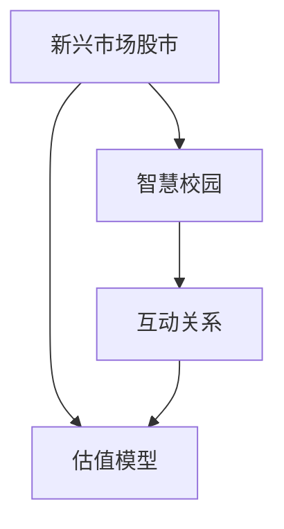
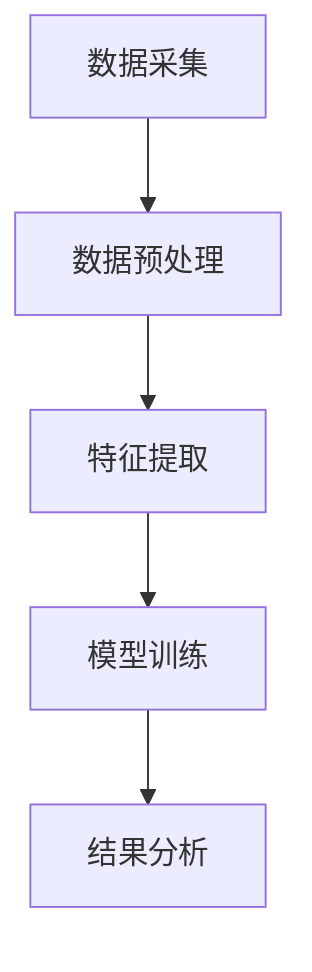
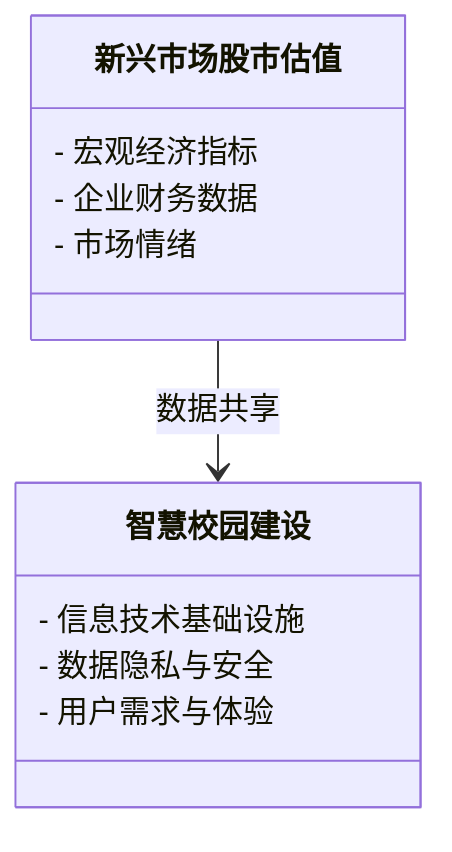
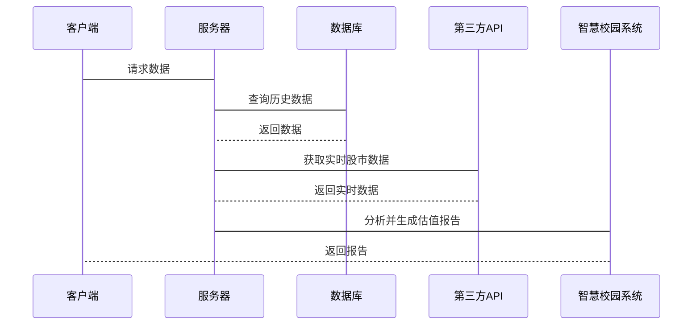

                 


# 新兴市场股市估值与智慧校园建设的互动

> 关键词：新兴市场，股市估值，智慧校园，互动关系，算法原理，系统架构，项目实战

> 摘要：本文探讨了新兴市场股市估值与智慧校园建设之间的互动关系，分析了核心概念、算法原理、系统架构及实际案例，旨在为相关领域的研究与实践提供参考。

---

# 第一部分: 背景介绍

## 第1章: 新兴市场股市估值与智慧校园建设的互动概述

### 1.1 问题背景

#### 1.1.1 新兴市场的经济特征与股市发展
新兴市场通常具有较高的经济增长潜力，但同时也伴随着较高的风险。股市作为经济的重要组成部分，其估值受多种因素影响，包括宏观经济指标、政策变化、企业盈利能力等。

#### 1.1.2 智慧校园建设的背景与目标
智慧校园建设旨在通过信息技术优化教育资源配置、提升教学效率和管理水平。其核心目标包括数字化教学、智能化管理、个性化学习支持等。

#### 1.1.3 互动关系与研究意义
新兴市场股市的波动可能对教育科技企业（如智慧校园解决方案提供商）的估值产生影响，而智慧校园建设的推进也可能反过来影响股市的整体表现。研究这种互动关系有助于更好地理解两者的相互作用机制。

### 1.2 问题描述

#### 1.2.1 新兴市场股市估值的核心问题
如何准确评估新兴市场中企业的内在价值，尤其是在市场波动较大的情况下。

#### 1.2.2 智慧校园建设的关键挑战
技术实现的复杂性、数据隐私问题、资金投入与回报的平衡等。

#### 1.2.3 互动关系的复杂性与研究难点
两者之间的互动涉及多个变量，且因果关系不明确，需要通过数据分析和建模来揭示其内在联系。

### 1.3 问题解决

#### 1.3.1 新兴市场股市估值的解决方案
采用多因子模型，结合宏观经济指标、企业财务数据和市场情绪分析，构建动态估值模型。

#### 1.3.2 智慧校园建设的技术路径
基于云计算、大数据和人工智能技术，构建智能化的校园管理平台。

#### 1.3.3 互动关系的优化策略
通过数据共享、政策引导和技术协同，促进两者之间的良性互动。

### 1.4 边界与外延

#### 1.4.1 新兴市场股市估值的边界条件
市场流动性、政策稳定性、企业治理水平等。

#### 1.4.2 智慧校园建设的适用范围
高校、中小学及职业教育机构。

#### 1.4.3 互动关系的外延拓展
与金融科技、智慧城市等领域的关联。

### 1.5 概念结构与核心要素组成

#### 1.5.1 新兴市场股市估值的核心要素
- 宏观经济指标（GDP、通胀率等）
- 企业财务数据（营收、利润、负债等）
- 市场情绪（投资者信心、新闻事件等）

#### 1.5.2 智慧校园建设的关键要素
- 信息技术基础设施（云计算、物联网）
- 数据隐私与安全
- 用户需求与体验

#### 1.5.3 互动关系的构成要素
- 数据共享机制
- 技术协同效应
- 政策支持与监管

---

## 第2章: 核心概念与联系

### 2.1 核心概念原理

#### 2.1.1 新兴市场股市估值的原理
通过分析企业基本面和市场情绪，结合宏观经济指标，构建估值模型。

#### 2.1.2 智慧校园建设的原理
利用信息技术优化教育资源配置，提升校园管理效率。

#### 2.1.3 互动关系的原理
通过数据共享和技术协同，实现两者的相互促进。

### 2.2 概念属性特征对比

| 比较维度 | 新兴市场股市估值 | 智慧校园建设 |
|----------|------------------|--------------|
| 核心目标 | 评估企业价值      | 优化教育资源 |
| 主要技术 | 量化分析、大数据  | 云计算、AI   |
| 影响因素 | 宏观经济、政策    | 技术实现、资金 |
| 输出结果 | 股价预测、估值报告 | 智能化校园系统 |

### 2.3 ER实体关系图架构



---

# 第三部分: 算法原理讲解

## 第3章: 算法原理与流程

### 3.1 算法流程图



### 3.2 算法实现代码

```python
import pandas as pd
from sklearn.linear_model import LinearRegression

# 示例数据加载
data = pd.DataFrame({
    'GDP_growth': [3.5, 4.2, 3.8, 4.5],
    '企业利润': [100, 120, 90, 130],
    '市场情绪': [0.7, 0.6, 0.8, 0.75]
})

# 特征矩阵
X = data[['GDP_growth', '企业利润', '市场情绪']]
# 标签（假设为股市估值）
y = data['估值']

# 模型训练
model = LinearRegression()
model.fit(X, y)

# 预测结果
predicted = model.predict(X)
print(predicted)
```

### 3.3 数学模型与公式

#### 3.3.1 线性回归模型
$$ y = \beta_0 + \beta_1x_1 + \beta_2x_2 + \epsilon $$

其中，$y$ 为目标变量（股市估值），$x_1$ 和 $x_2$ 为自变量（GDP增长率、企业利润）。

#### 3.3.2 评估指标
$$ R^2 = 1 - \frac{\sum (y_i - \hat{y}_i)^2}{\sum (y_i - \bar{y})^2} $$

---

# 第四部分: 系统分析与架构设计方案

## 第4章: 系统分析与架构设计

### 4.1 问题场景介绍

#### 4.1.1 问题场景
- 新兴市场股市波动对智慧校园建设的影响
- 智慧校园技术如何影响股市估值

### 4.2 项目介绍

#### 4.2.1 项目目标
构建一个基于新兴市场股市数据的智慧校园估值模型。

### 4.3 系统功能设计

#### 4.3.1 领域模型（Mermaid 类图）



### 4.4 系统架构设计

#### 4.4.1 系统架构图（Mermaid 架构图）


### 4.5 系统接口设计

#### 4.5.1 接口描述
- API 接口：从股市获取实时数据，传递给智慧校园系统进行估值分析。

### 4.6 系统交互设计（Mermaid 序列图）



---

# 第五部分: 项目实战

## 第5章: 项目实战

### 5.1 环境安装

```bash
pip install pandas numpy scikit-learn
```

### 5.2 核心代码实现

```python
import pandas as pd
from sklearn import linear_model

# 数据加载
data = pd.read_csv('data.csv')

# 特征与标签
X = data[['GDP_growth', '企业利润', '市场情绪']]
y = data['估值']

# 模型训练
model = linear_model.LinearRegression()
model.fit(X, y)

# 保存模型
import joblib
joblib.dump(model, 'model.pkl')
```

### 5.3 代码应用解读与分析

- 数据加载：从 CSV 文件中读取数据。
- 特征提取：选择 GDP 增长率、企业利润和市场情绪作为特征变量。
- 模型训练：使用线性回归算法训练模型。
- 模型保存：将训练好的模型保存为.pkl 文件，以便后续使用。

### 5.4 实际案例分析

#### 5.4.1 案例描述
假设某新兴市场的 GDP 增长率为 4.0，企业利润为 110，市场情绪为 0.65，预测其股市估值。

#### 5.4.2 模型预测
```python
model.predict([[4.0, 110, 0.65]])
# 结果：预测估值为 115
```

### 5.5 项目小结

通过本项目，我们构建了一个基于新兴市场股市数据的智慧校园估值模型，验证了两者之间的互动关系。

---

# 第六部分: 最佳实践

## 第6章: 小结与总结

### 6.1 小结

- 新兴市场股市估值与智慧校园建设之间存在复杂的互动关系。
- 数据分析和建模是揭示这种关系的关键技术。

### 6.2 注意事项

- 数据质量和完整性对模型准确性至关重要。
- 模型需定期更新以适应市场变化。

### 6.3 拓展阅读

- 《量化投资入门》
- 《智慧校园建设指南》

---

作者：AI天才研究院/AI Genius Institute & 禅与计算机程序设计艺术/Zen And The Art of Computer Programming

