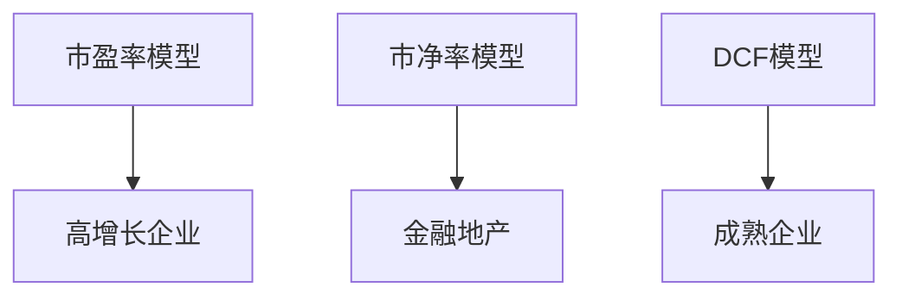
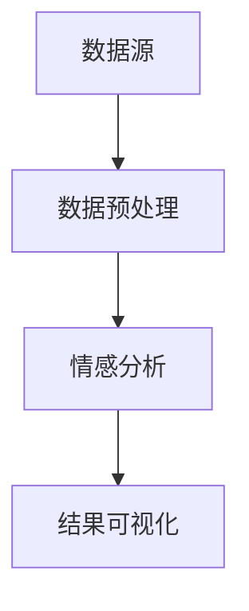

                 


# 《新兴市场股市估值与智慧校园情感计算应用的互动》

> **关键词**：新兴市场、股市估值、情感计算、智慧校园、互动关系  
> **摘要**：本文探讨新兴市场股市估值与智慧校园情感计算应用的互动关系，从技术原理、系统架构到实际应用，分析两者如何相互影响，并提出融合应用的实践方案。

---

## 第一部分: 新兴市场股市估值与智慧校园情感计算概述

### 第1章: 新兴市场股市估值的背景与现状

#### 1.1 新兴市场的定义与特点
##### 1.1.1 新兴市场的经济特征
- 新兴市场是指经济快速发展但尚未完全工业化的国家，如中国、印度等。
- 其特点包括高增长率、人口红利和工业化进程。

##### 1.1.2 新兴市场的股市发展现状
- 新兴市场股市规模庞大，但波动性较高。
- 与发达市场相比，新兴市场股市受政策和外部环境影响更大。

##### 1.1.3 新兴市场与发达市场的对比分析
- 发达市场：成熟、波动小、机构投资者主导。
- 新兴市场：波动大、个体投资者活跃、政策影响显著。

#### 1.2 股市估值的基本概念
##### 1.2.1 股市估值的定义
- 股市估值是通过分析公司基本面和技术指标，对股票价格的合理区间进行评估。

##### 1.2.2 股市估值的主要方法
- 市盈率（P/E）：市价与每股收益的比率。
- 市净率（P/B）：市价与每股净资产的比率。
- 现金流折现模型（DCF）：基于未来现金流的现值计算。

##### 1.2.3 股市估值的核心指标
- 市盈率、市净率、股息率、ROE（净资产收益率）。

#### 1.3 情感计算的定义与应用
##### 1.3.1 情感计算的定义
- 情感计算是通过分析文本、语音和图像，识别和量化人类情感的技术。

##### 1.3.2 情感计算在智慧校园中的应用
- 情感分析用于学生情绪监测、校园舆情管理。

##### 1.3.3 情感计算与股市估值的潜在联系
- 情感计算可辅助分析市场情绪，影响估值模型。

---

### 第2章: 新兴市场股市估值的关键技术

#### 2.1 股市估值的主要模型
##### 2.1.1 市盈率模型
- 公式：$$ P/E = \frac{\text{股价}}{\text{每股收益}} $$
- 适用于高增长行业的估值。

##### 2.1.2 市净率模型
- 公式：$$ P/B = \frac{\text{股价}}{\text{每股净资产}} $$
- 适用于金融、地产行业。

##### 2.1.3 现金流折现模型（DCF）
- 公式：$$ \text{企业价值} = \sum_{t=1}^{n} \frac{\text{现金流}}{(1+r)^t} $$
- 适用于成熟企业。

##### 2.1.4 其他估值模型对比分析
- 使用mermaid图对比不同模型的适用场景：



#### 2.2 情感计算的核心算法
##### 2.2.1 文本情感分析的基本原理
- 使用自然语言处理（NLP）技术，通过词袋模型或词嵌入（如Word2Vec）提取特征。

##### 2.2.2 基于深度学习的情感计算模型
- 使用LSTM或BERT进行情感分类，准确率可达90%以上。

##### 2.2.3 情感计算的特征提取方法
- 使用TF-IDF提取关键词，或通过词性分析提取情感特征。

#### 2.3 新兴市场股市估值的特殊性
##### 2.3.1 新兴市场的波动性特征
- 市场波动大，受政策影响显著。

##### 2.3.2 新兴市场的信息不对称问题
- 信息透明度低，影响估值准确性。

##### 2.3.3 新兴市场的政策影响
- 政策变化可能导致市场剧烈波动。

---

### 第3章: 智慧校园情感计算的系统架构

#### 3.1 智慧校园的基本概念
##### 3.1.1 智慧校园的定义
- 智慧校园是通过物联网、大数据和人工智能技术，构建智能化的校园管理与服务系统。

##### 3.1.2 智慧校园的核心功能
- 学生行为分析、校园安全监控、教育资源分配。

##### 3.1.3 智慧校园的典型应用场景
- 情感监测、舆情管理、学习效果评估。

#### 3.2 情感计算在智慧校园中的实现
##### 3.2.1 情感计算的数据来源
- 校园论坛、社交媒体、学生反馈。

##### 3.2.2 情感计算的处理流程
- 数据清洗、特征提取、情感分类。

##### 3.2.3 情感计算的输出结果
- 情感指数、情感分布、趋势分析。

#### 3.3 智慧校园情感计算的系统架构
##### 3.3.1 系统功能模块划分
- 数据采集、预处理、分析、可视化。

##### 3.3.2 系统数据流图


##### 3.3.3 系统交互流程图
```mermaid
sequenceDiagram
    激活系统
    ->> 系统: 提交情感数据
    ->> 系统: 处理数据
    ->> 用户: 返回情感指数
```

---

### 第4章: 新兴市场股市估值与智慧校园情感计算的互动关系

#### 4.1 新兴市场股市估值的动态特征
##### 4.1.1 新兴市场股市的波动性
- 市场波动剧烈，投资者需关注短期变化。

##### 4.1.2 新兴市场股市的周期性
- 经济周期影响股市表现。

##### 4.1.3 新兴市场的政策影响
- 政策变化对股市估值的影响显著。

#### 4.2 情感计算在股市估值中的应用
##### 4.2.1 情感计算对股市波动的预测作用
- 通过分析社交媒体情绪，预测市场波动。

##### 4.2.2 情感计算对投资者决策的影响
- 情感指数可作为投资参考。

##### 4.2.3 情感计算对市场情绪的量化分析
- 量化市场情绪指数，辅助估值模型。

#### 4.3 智慧校园情感计算对股市估值的启示
##### 4.3.1 情感计算在教育领域的应用
- 情感计算可用于学生情绪监测，帮助教育机构优化教学策略。

##### 4.3.2 情感计算对投资者行为的分析
- 情感计算可分析投资者情绪，优化投资策略。

##### 4.3.3 情感计算对股市情绪指数的构建
- 构建综合情绪指数，辅助股市估值。

---

### 第5章: 新兴市场股市估值与智慧校园情感计算的融合应用

#### 5.1 数据共享与融合的挑战
##### 5.1.1 数据隐私与安全问题
- 数据共享需遵守隐私保护法规。

##### 5.1.2 数据格式与兼容性问题
- 不同系统数据格式差异大，需进行格式转换。

##### 5.1.3 数据质量和完整性问题
- 数据可能存在缺失或错误，需进行清洗。

#### 5.2 智慧校园情感计算与股市估值的融合方案
##### 5.2.1 数据融合策略
- 使用联邦学习技术，在保护隐私的前提下，共享数据。

##### 5.2.2 融合算法设计
- 将情感计算结果与估值模型结合，构建混合模型。

##### 5.2.3 应用场景设计
- 在智慧校园中实时监测学生情绪，辅助股市估值。

---

## 第六部分: 总结与展望

### 6.1 本文总结
- 新兴市场股市估值与智慧校园情感计算的互动关系复杂且重要。
- 情感计算可辅助股市估值，提升模型准确性。

### 6.2 未来展望
- 情感计算与股市估值的结合将更加紧密。
- 新兴市场将成为技术融合的重要试验场。

---

## 作者：AI天才研究院 & 禅与计算机程序设计艺术

