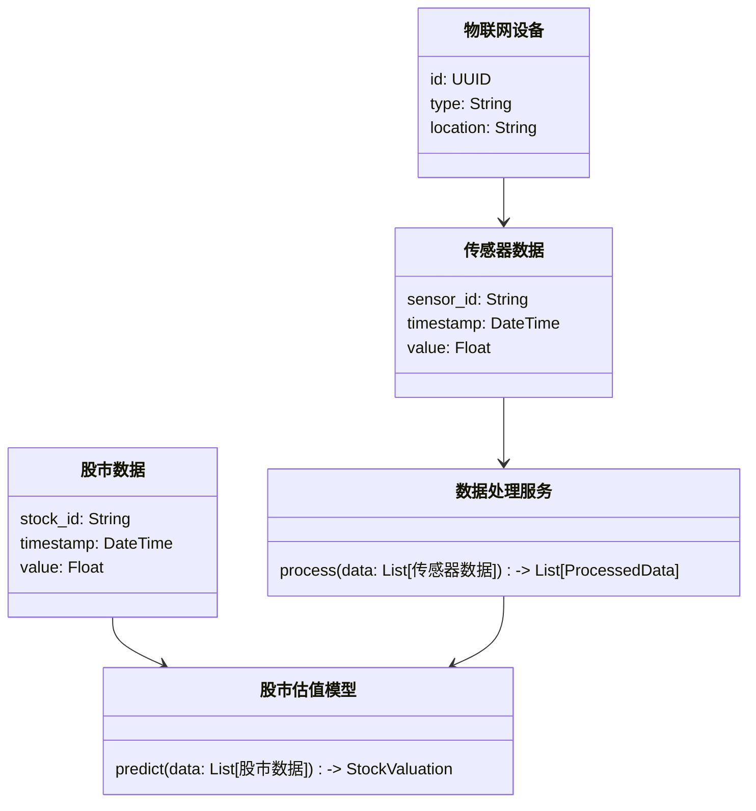
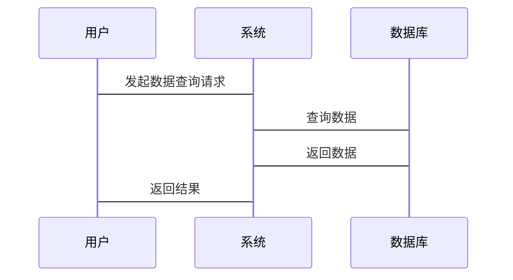
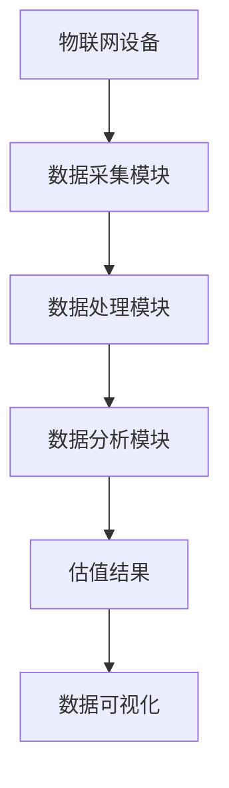

                 

# 第五章：系统架构与设计

## 5.1 系统总体架构

本章将详细阐述新兴市场股市估值与智慧校园物联网应用互动系统的总体架构设计，包括模块划分、功能设计、技术选型等方面。

### 5.1.1 模块划分

系统整体架构划分为以下几个核心模块：

1. **数据采集模块**：负责从智慧校园物联网设备和新兴市场股市数据源采集实时数据。
2. **数据处理模块**：对采集到的原始数据进行清洗、转换和预处理，确保数据质量和一致性。
3. **数据分析与估值模块**：应用统计分析、机器学习等技术，基于处理后的数据进行股市估值模型的构建和预测。
4. **结果展示与互动模块**：将分析结果以可视化形式呈现，并支持用户进行交互式分析，探索数据间的潜在联系。

### 5.1.2 功能设计

系统功能设计涵盖了数据采集、处理、分析和展示四个主要阶段。各模块间通过明确的数据接口和消息队列实现高效的数据流转和协同工作。

### 5.1.3 技术选型

在系统架构设计中，采用了以下关键技术：

- **数据传输协议**：采用MQTT协议进行物联网设备数据的实时传输，确保数据的高效性和可靠性。
- **数据流处理**：使用Apache Kafka作为数据流中间件，处理大规模数据流，确保系统的高吞吐量和低延迟。
- **服务端框架**：采用Spring Boot框架搭建服务端，提供RESTful API接口，便于前后端分离开发。
- **前端开发**：使用React框架进行前端开发，构建动态交互式的数据可视化界面。

---

## 5.2 系统功能设计

### 5.2.1 领域模型设计

为了清晰地描述系统的功能模块及其关系，我们使用Mermaid绘制了系统的领域模型类图。

---

### 5.2.2 系统架构设计

系统采用分层架构，分为数据层、业务逻辑层和表现层。整体架构设计如下：

---

### 5.2.3 系统接口设计

系统设计了以下主要接口：

- **数据采集接口**：`GET /api/sensor/{id}`，获取特定传感器的历史数据。
- **数据处理接口**：`POST /api/process`，接收原始数据并返回处理结果。
- **股市估值接口**：`POST /api/valuation`，接收数据并返回估值结果。
- **数据可视化接口**：`GET /api/chart`，获取图表数据以供前端展示。

---

## 5.3 系统交互设计

为了确保系统的高效运行和良好的用户体验，我们设计了系统的交互流程，如下所示：

---

## 5.4 数据流设计

数据流从物联网设备到最终的股市估值结果的处理流程如下：

---

## 总结

本章详细描述了系统的总体架构、功能模块、技术选型、接口设计和交互流程。通过模块化设计和高效的中间件技术，确保了系统的高性能和高可用性。后续章节将基于此架构，展开具体的实现和案例分析。

