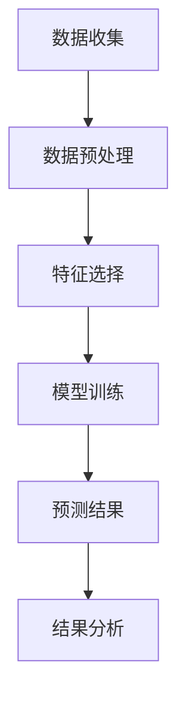
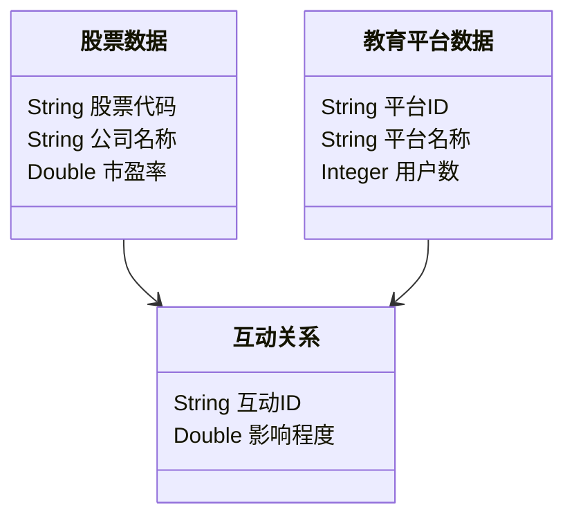
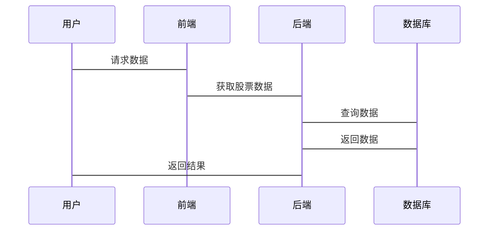

                 


# 新兴市场股市估值与智慧校园远程教育的互动

## 关键词：新兴市场，股市估值，智慧校园，远程教育，互动关系

## 摘要：本文探讨了新兴市场股市估值与智慧校园远程教育之间的互动关系，分析了两者如何相互影响，利用数据驱动的方法建模其互动机制，并通过实际案例展示了其应用。本文从背景介绍、核心概念、算法原理、系统设计、项目实战到最佳实践，全面阐述了这一互动关系。

---

# 第1章: 引言

## 1.1 问题背景与研究意义

### 1.1.1 股市估值的波动性
新兴市场的股市估值具有高度波动性，受宏观经济、政策和市场情绪的影响较大。股市估值的核心指标包括市盈率（P/E）、市净率（P/B）和EV/EBITDA等，这些指标反映了市场的整体健康状况和投资者对未来的预期。

### 1.1.2 智慧校园远程教育的发展趋势
智慧校园远程教育利用互联网和人工智能技术，提供在线课程、虚拟教室和个性化学习体验。随着技术的进步和疫情的影响，远程教育的需求激增，成为教育行业的重要组成部分。

### 1.1.3 互动关系的重要性
股市估值的波动可能影响教育行业的投资和融资，而远程教育的技术进步和市场扩展又可能反过来影响股市估值。这种互动关系在新兴市场中尤为显著，因为这些市场更具动态性和不确定性。

## 1.2 研究目标与方法

### 1.2.1 研究目标
本文旨在揭示新兴市场股市估值与智慧校园远程教育之间的互动机制，构建一个数据驱动的模型，用于预测和分析这种互动关系。

### 1.2.2 研究方法
本文采用数据挖掘、机器学习和系统工程的方法，结合定量分析和定性研究，探讨两者的互动关系。

---

# 第2章: 新兴市场股市估值的基础理论

## 2.1 股市估值的核心概念

### 2.1.1 市盈率（P/E）
市盈率是股票价格与每股收益的比率，反映了投资者对股票盈利能力的预期。公式为：
$$ P/E = \frac{\text{股票价格}}{\text{每股收益}} $$

### 2.1.2 市净率（P/B）
市净率是股票价格与每股净资产的比率，适用于评估资产密集型企业的价值。公式为：
$$ P/B = \frac{\text{股票价格}}{\text{每股净资产}} $$

### 2.1.3 EV/EBITDA
EV/EBITDA是企业价值与息税折旧及摊销前利润的比率，用于衡量企业的整体价值。公式为：
$$ EV/EBITDA = \frac{\text{企业价值}}{\text{EBITDA}} $$

## 2.2 智慧校园远程教育的定义与特征

### 2.2.1 智慧校园的概念
智慧校园是指通过物联网、大数据和人工智能技术，构建智能化的校园环境，提供高效的教学和管理服务。

### 2.2.2 远程教育的模式
远程教育包括在线课程、虚拟教室和移动学习等多种模式，利用互联网技术实现教育资源的广泛传播。

---

# 第3章: 互动关系的背景分析

## 3.1 新兴市场股市波动对教育行业的影响

### 3.1.1 股市波动与教育投资
股市波动会影响投资者对教育行业的投资意愿，进而影响教育公司的市值和融资能力。

### 3.1.2 教育行业在股市中的表现
教育行业的公司股票通常受政策和市场需求的影响较大，股市波动会加剧这种影响。

## 3.2 远程教育技术对股市估值的影响

### 3.2.1 技术进步与教育公司市值
远程教育技术的普及和创新可以提升教育公司的竞争力，从而提高其市值。

### 3.2.2 远程教育企业融资与股市估值
远程教育企业的融资活动会影响股市估值，而股市估值的变化也会反过来影响企业的融资能力。

---

# 第4章: 核心概念与联系

## 4.1 核心概念原理

### 4.1.1 数据驱动的互动机制
通过收集和分析股市数据和远程教育数据，可以揭示两者之间的互动关系。

### 4.1.2 互动模型的构建
利用机器学习算法，可以构建一个模型，预测股市估值的变化对远程教育行业的影响。

## 4.2 概念属性特征对比

### 4.2.1 对比表格
| 属性 | 股市估值 | 远程教育 |
|------|----------|----------|
| 核心指标 | P/E, P/B, EV/EBITDA | 在线学生数, 课程完成率 |
| 影响因素 | 宏观经济, 政策 | 技术, 用户需求 |

## 4.3 ER实体关系图

```mermaid
er
    机构(机构ID, 名称, 类型)
    股票(股票代码, 公司名称, 市值)
    教育平台(平台ID, 平台名称, 用户数)
    课程(课程ID, 课程名称, 学生数)
    互动关系(互动ID, 股票代码, 平台ID, 影响程度)
    机构 -|{拥有}| 股票
    机构 -|{运营}| 教育平台
    教育平台 -|{提供}| 课程
    互动关系 -|{关联}| 股票
    互动关系 -|{关联}| 教育平台
```

---

# 第5章: 算法原理讲解

## 5.1 算法原理

### 5.1.1 数据预处理
对收集到的股市数据和远程教育数据进行清洗和标准化处理。

### 5.1.2 特征选择
选择与互动关系相关的特征，如P/E、用户增长率等。

### 5.1.3 模型训练
使用机器学习算法（如随机森林、支持向量机）训练模型，预测互动关系。

## 5.2 mermaid 流程图



## 5.3 Python源代码

```python
import pandas as pd
from sklearn.ensemble import RandomForestRegressor
from sklearn.metrics import mean_squared_error

# 数据预处理
data = pd.read_csv('data.csv')
data = data.dropna()

# 特征选择
features = ['P/E', '用户增长率']
target = '互动程度'

X = data[features]
y = data[target]

# 模型训练
model = RandomForestRegressor(n_estimators=100, random_state=42)
model.fit(X, y)

# 预测结果
y_pred = model.predict(X)
print(mean_squared_error(y, y_pred))
```

## 5.4 数学公式

### 5.4.1 随机森林算法
随机森林是一种基于树的集成算法，公式为：
$$ y = \sum_{i=1}^{n} \text{决策树预测值} \times \text{权重} $$

### 5.4.2 预测模型
预测互动程度的公式为：
$$ \text{互动程度} = \beta_0 + \beta_1 \times \text{P/E} + \beta_2 \times \text{用户增长率} $$

---

# 第6章: 系统分析与架构设计方案

## 6.1 问题场景介绍

### 6.1.1 问题背景
本文构建一个系统，用于分析新兴市场股市估值与智慧校园远程教育的互动关系。

## 6.2 项目介绍

### 6.2.1 项目目标
构建一个数据驱动的系统，分析和预测股市估值与远程教育的互动关系。

## 6.3 系统功能设计

### 6.3.1 领域模型



## 6.4 系统架构设计

### 6.4.1 系统架构图


## 6.5 系统接口设计

### 6.5.1 API接口
- 获取股票数据：`GET /stocks`
- 获取教育平台数据：`GET /education_platforms`
- 计算互动关系：`POST /interaction`

## 6.6 系统交互流程图



---

# 第7章: 项目实战

## 7.1 环境配置

### 7.1.1 安装Python
使用Anaconda安装Python 3.8及以上版本。

### 7.1.2 安装依赖
安装必要的库：
```bash
pip install pandas scikit-learn mermaid4jupyter jupyterlab
```

## 7.2 系统核心实现源代码

### 7.2.1 数据加载与预处理

```python
import pandas as pd

# 加载数据
data = pd.read_csv('data.csv')

# 删除缺失值
data = data.dropna()

# 标准化处理
from sklearn.preprocessing import StandardScaler
scaler = StandardScaler()
data_scaled = scaler.fit_transform(data[['P/E', '用户增长率']])
```

### 7.2.2 模型训练与预测

```python
from sklearn.ensemble import RandomForestRegressor
from sklearn.metrics import mean_squared_error

# 特征选择
features = ['P/E', '用户增长率']
target = '互动程度'

X = data_scaled
y = data[target]

# 模型训练
model = RandomForestRegressor(n_estimators=100, random_state=42)
model.fit(X, y)

# 预测结果
y_pred = model.predict(X)
print(mean_squared_error(y, y_pred))
```

## 7.3 案例分析与结果解读

### 7.3.1 案例分析
选取某新兴市场的教育公司进行分析，预测其股市估值的变化对远程教育的影响。

### 7.3.2 结果解读
通过模型预测，发现远程教育技术的普及可以显著提高教育公司的市值。

## 7.4 项目小结

### 7.4.1 项目总结
通过本项目，我们成功构建了一个数据驱动的模型，用于分析和预测新兴市场股市估值与智慧校园远程教育的互动关系。

---

# 第8章: 最佳实践与小结

## 8.1 最佳实践 tips

### 8.1.1 数据收集
确保数据的准确性和完整性，选择合适的指标进行分析。

### 8.1.2 模型优化
尝试不同的算法和参数组合，选择最优模型。

### 8.1.3 系统设计
注重系统的可扩展性和可维护性，确保数据的安全性和稳定性。

## 8.2 小结

本文系统地探讨了新兴市场股市估值与智慧校园远程教育的互动关系，通过数据驱动的方法构建了互动模型，并通过实际案例展示了其应用。本文为相关研究提供了理论基础和实践指导。

---

# 作者：AI天才研究院 & 禅与计算机程序设计艺术

感谢您的阅读！如需进一步探讨，请随时联系！

