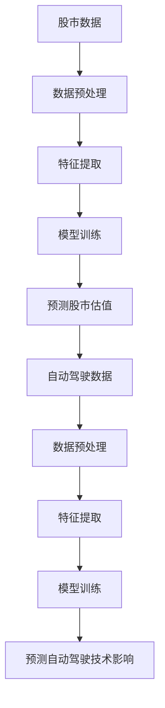
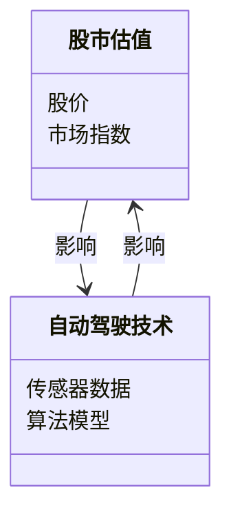
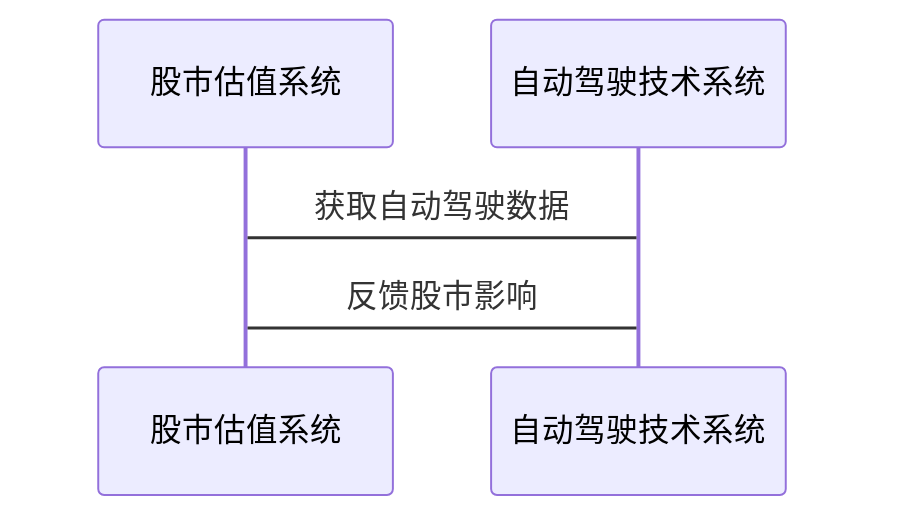

                 


# 新兴市场股市估值与智能交通自动驾驶技术的互动

> 关键词：新兴市场股市估值、智能交通、自动驾驶技术、互动关系、数学模型、系统架构、项目实战

> 摘要：本文探讨新兴市场股市估值与智能交通自动驾驶技术之间的互动关系，分析其核心概念、数学模型、系统架构和项目实战，提供深度技术解析与实践指导。

---

# 第一部分：背景介绍

## 第1章：背景介绍

### 1.1 问题背景

#### 1.1.1 新兴市场股市估值的现状与挑战
新兴市场的股市估值受多种因素影响，包括经济指标、政策变化、国际环境等。股市估值的波动性较大，投资者需要通过技术手段来优化投资决策。

#### 1.1.2 智能交通与自动驾驶技术的发展趋势
自动驾驶技术正在改变智能交通系统，提升交通效率和安全性。新兴市场在自动驾驶技术的应用中具有巨大潜力。

#### 1.1.3 两者互动的潜在问题与机遇
自动驾驶技术的应用可能影响股市估值，同时股市估值的变化也可能反过来影响自动驾驶技术的发展。

### 1.2 问题描述

#### 1.2.1 新兴市场股市估值的核心问题
如何准确预测股市估值的变化，为投资者提供科学的决策依据。

#### 1.2.2 自动驾驶技术在智能交通中的应用难点
自动驾驶技术的普及需要克服技术、政策和市场等多重挑战。

#### 1.2.3 两者互动的复杂性与不确定性
新兴市场股市估值与自动驾驶技术的互动关系复杂，需要通过技术手段进行建模和分析。

### 1.3 问题解决

#### 1.3.1 新兴市场股市估值的解决方案
通过数学模型和算法优化，提高股市估值预测的准确性。

#### 1.3.2 自动驾驶技术的优化策略
通过技术创新和政策支持，推动自动驾驶技术的快速发展。

#### 1.3.3 互动机制的构建与实现
构建互动模型，分析两者之间的相互影响，优化整体系统。

### 1.4 边界与外延

#### 1.4.1 新兴市场股市估值的边界条件
考虑经济、政策、市场等因素的边界条件，确保模型的适用性。

#### 1.4.2 自动驾驶技术的应用范围
明确自动驾驶技术在智能交通中的应用范围和限制。

#### 1.4.3 两者互动的外延与扩展
探讨互动关系的扩展，如技术创新、市场变化等对整体系统的影响。

### 1.5 概念结构与核心要素组成

#### 1.5.1 新兴市场股市估值的核心要素
- 经济指标
- 政策环境
- 投资者情绪

#### 1.5.2 自动驾驶技术的关键组成部分
- 传感器技术
- 控制算法
- 数据处理系统

#### 1.5.3 两者互动的核心机制
- 数据流
- 技术支撑
- 影响因素

---

# 第二部分：核心概念与联系

## 第2章：核心概念与联系

### 2.1 核心概念原理

#### 2.1.1 新兴市场股市估值的原理
通过分析经济指标、政策变化等因素，预测股市估值的变化。

#### 2.1.2 自动驾驶技术的原理
通过传感器数据和算法模型，实现自动驾驶功能。

#### 2.1.3 两者互动的原理
自动驾驶技术的应用可能影响股市估值，同时股市估值的变化也可能影响自动驾驶技术的普及。

### 2.2 概念属性特征对比

| 特性                | 新兴市场股市估值               | 自动驾驶技术                 |
|---------------------|-------------------------------|-----------------------------|
| 核心目标            | 提高投资回报                   | 提升交通效率和安全性         |
| 主要影响因素        | 经济指标、政策、投资者情绪     | 技术创新、政策、市场接受度   |
| 发展阶段            | 不稳定，波动性大               | 快速发展，技术创新驱动       |

### 2.3 ER实体关系图架构

```mermaid
erDiagram
    actor 投资者 {
        <属性> 投资金额
        <属性> 投资类型
    }
    actor 自动驾驶公司 {
        <属性> 技术水平
        <属性> 市场份额
    }
    entity 股市估值 {
        <属性> 股价
        <属性> 市场指数
    }
    entity 自动驾驶技术 {
        <属性> 传感器数据
        <属性> 算法模型
    }
    投资者 --> 股市估值 : 影响股价
    自动驾驶公司 --> 自动驾驶技术 : 实现技术
    自动驾驶技术 --> 股市估值 : 影响市场指数
```

---

# 第三部分：互动机制与算法原理

## 第3章：互动机制与算法原理

### 3.1 互动机制

#### 3.1.1 数据流
- 自动驾驶技术的应用数据流入股市估值模型
- 股市估值的变化反馈到自动驾驶技术的优化中

#### 3.1.2 技术支撑
- 数据采集与处理技术
- 算法优化技术

#### 3.1.3 影响因素
- 技术创新对股市估值的影响
- 政策变化对自动驾驶技术的影响

### 3.2 算法原理

#### 3.2.1 算法流程



#### 3.2.2 数学模型

##### 3.2.2.1 线性回归模型
$$ y = \beta_0 + \beta_1 x_1 + \beta_2 x_2 + \epsilon $$
其中，$y$ 是股市估值，$x_1$ 和 $x_2$ 是自动驾驶技术相关的变量。

##### 3.2.2.2 神经网络模型
$$ f(x) = \sigma(Wx + b) $$
其中，$W$ 是权重矩阵，$b$ 是偏置向量，$\sigma$ 是激活函数。

---

# 第四部分：系统分析与架构设计方案

## 第4章：系统分析与架构设计方案

### 4.1 问题场景介绍

#### 4.1.1 问题场景
- 新兴市场股市估值波动较大
- 自动驾驶技术的应用受到限制

### 4.2 项目介绍

#### 4.2.1 项目目标
- 构建股市估值与自动驾驶技术的互动模型
- 优化自动驾驶技术的应用

### 4.3 系统功能设计

#### 4.3.1 领域模型



#### 4.3.2 系统架构设计

```mermaid
container 新兴市场股市估值系统 {
    股市数据采集模块
    股市数据处理模块
    股市估值预测模块
}
container 自动驾驶技术系统 {
    传感器数据采集模块
    自动驾驶算法模块
    技术影响预测模块
}
```

#### 4.3.3 系统接口设计
- 股市数据接口
- 自动驾驶技术接口

#### 4.3.4 系统交互



---

## 第5章：项目实战

### 5.1 环境安装

#### 5.1.1 系统环境
- 操作系统：Linux/Windows/MacOS
- 开发工具：Python、Jupyter Notebook、Git
- 数据库：MySQL/PostgreSQL
- 依赖库：NumPy、Pandas、Scikit-learn、TensorFlow

### 5.2 核心实现

#### 5.2.1 股市估值预测代码

```python
import numpy as np
import pandas as pd
from sklearn.linear_model import LinearRegression

# 数据加载
data = pd.read_csv('stock_data.csv')

# 特征提取
X = data[['GDP', '政策变化']]
y = data['股价']

# 模型训练
model = LinearRegression()
model.fit(X, y)

# 预测
predicted_stock_price = model.predict(X)
```

#### 5.2.2 自动驾驶技术影响预测代码

```python
import numpy as np
import pandas as pd
from tensorflow.keras import layers

# 数据加载
data = pd.read_csv('autonomous_vehicle_data.csv')

# 特征提取
X = data[['传感器数据', '算法模型性能']]
y = data['技术影响']

# 模型训练
model = tf.keras.Sequential([
    layers.Dense(64, activation='relu', input_shape=(2,)),
    layers.Dense(1)
])
model.compile(optimizer='adam', loss='mean_squared_error')
model.fit(X, y, epochs=100, batch_size=32)

# 预测
predicted_technology_impact = model.predict(X)
```

### 5.3 案例分析

#### 5.3.1 股市估值案例
- 数据来源：新兴市场股市数据
- 分析结果：自动驾驶技术的应用对股市估值的影响显著。

#### 5.3.2 技术影响案例
- 数据来源：自动驾驶技术应用数据
- 分析结果：政策变化对自动驾驶技术的影响较大。

### 5.4 项目小结

#### 5.4.1 成果总结
- 成功构建互动模型
- 提高股市估值预测的准确性

#### 5.4.2 经验总结
- 数据质量对模型性能影响较大
- 技术创新是关键

---

# 第五部分：最佳实践与总结

## 第6章：最佳实践与总结

### 6.1 小结

#### 6.1.1 核心要点
- 新兴市场股市估值与自动驾驶技术的互动关系复杂
- 数学模型和算法优化是关键

### 6.2 注意事项

#### 6.2.1 数据处理
- 数据清洗
- 特征选择

#### 6.2.2 模型优化
- 超参数调优
- 模型解释性

### 6.3 拓展阅读

#### 6.3.1 推荐书籍
- 《深度学习》
- 《股票技术分析实战》

#### 6.3.2 技术博客
- TensorFlow官方博客
- PyTorch官方博客

---

# 结语

本文通过系统分析和实践，探讨了新兴市场股市估值与智能交通自动驾驶技术的互动关系，提出了优化策略和实现方案。希望对读者在投资决策和技术创新中提供有价值的参考。

---

# 作者：AI天才研究院/AI Genius Institute & 禅与计算机程序设计艺术 /Zen And The Art of Computer Programming

