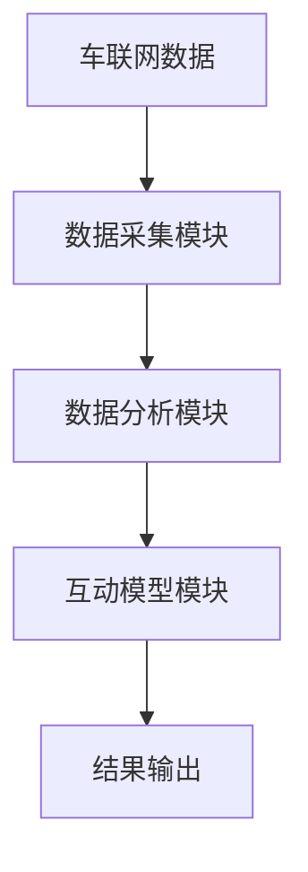
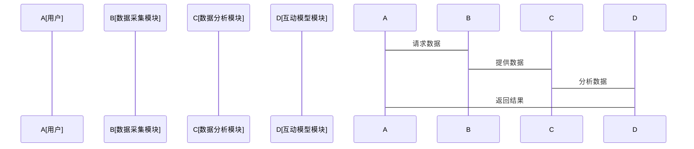

                 


# 新兴市场股市估值与智能交通车联网技术的互动

## 关键词：新兴市场，股市估值，智能交通，车联网技术，互动关系

## 摘要：本文探讨新兴市场股市估值与智能交通车联网技术之间的互动关系。通过分析股市估值的核心概念与分析方法，智能交通与车联网技术的原理，车联网数据对股市情绪的影响，构建一个结合股市数据与车联网数据的互动分析系统，并通过具体案例分析，展示车联网数据如何影响股市估值。

---

# 引言

新兴市场和智能交通车联网技术是两个看似不同的领域，但它们之间存在着复杂的互动关系。随着科技的进步，车联网技术在智能交通中的应用越来越广泛，而股市估值作为衡量市场健康的重要指标，也受到车联网数据的影响。本文将深入分析这两者之间的互动机制，并探讨如何利用车联网技术优化股市估值分析。

---

# 第一部分：新兴市场股市估值的基础知识

## 1.1 新兴市场的定义与特点

### 1.1.1 新兴市场的定义
新兴市场是指经济正在快速发展但尚未完全工业化的国家，如中国、印度等。

### 1.1.2 新兴市场的特点
- 经济快速增长
- 市场规模较小但潜力大
- 投资风险较高
- 法律法规不完善

### 1.1.3 新兴市场与发达市场的区别
- 经济结构不同
- 投资风险不同
- 市场流动性不同

## 1.2 股市估值的基本概念

### 1.2.1 股市估值的定义
股市估值是通过对公司财务数据和市场因素的分析，确定股票的合理价格。

### 1.2.2 股市估值的主要指标
- 市盈率（P/E Ratio）
- 市净率（P/B Ratio）
- 股息率（Dividend Yield）

### 1.2.3 股市估值的方法
- 基本分析法
- 技术分析法
- 行为分析法

## 1.3 智能交通与车联网技术的概述

### 1.3.1 智能交通的定义与特点
智能交通是利用信息技术优化交通系统，提高交通效率。

### 1.3.2 车联网技术的定义与特点
车联网技术是通过车辆与网络的连接，实现车辆间的通信和数据共享。

### 1.3.3 车联网技术的应用场景
- 实时交通监控
- 自动驾驶
- 智能停车

---

# 第二部分：新兴市场股市估值与智能交通车联网技术的互动关系

## 2.1 股市估值与智能交通的互动背景

### 2.1.1 新兴市场经济的特点
- 经济波动大
- 市场参与者多样化
- 政策影响显著

### 2.1.2 智能交通技术的发展趋势
- 技术成熟度提高
- 应用范围扩大
- 数据量增加

### 2.1.3 股市估值与智能交通技术的潜在联系
- 车联网数据影响股市情绪
- 智能交通技术影响股市表现
- 股市波动影响智能交通投资

## 2.2 股市估值与智能交通技术的互动机制

### 2.2.1 智能交通技术对股市的影响
- 提供实时交通数据
- 影响投资者情绪
- 改善企业运营效率

### 2.2.2 股市波动对智能交通技术的影响
- 影响企业投资决策
- 影响技术发展速度
- 影响市场信心

### 2.2.3 互动机制的数学模型

$$
\text{互动机制} = f(\text{车联网数据}, \text{股市数据})
$$

通过分析车联网数据和股市数据之间的相关性，建立互动模型。

## 2.3 互动关系的案例分析

### 2.3.1 新兴市场股市波动的案例
分析新兴市场股市波动的原因，包括经济政策、国际环境等。

### 2.3.2 智能交通技术应用的案例
以某城市为例，分析智能交通技术的应用及其对股市的影响。

### 2.3.3 互动关系的实际案例
结合具体数据，展示车联网数据如何影响股市估值。

---

# 第三部分：新兴市场股市估值的核心概念与分析方法

## 3.1 股市估值的核心概念

### 3.1.1 市盈率（P/E Ratio）
$$
\text{市盈率} = \frac{\text{股票价格}}{\text{每股收益}}
$$

### 3.1.2 市净率（P/B Ratio）
$$
\text{市净率} = \frac{\text{股票价格}}{\text{每股净资产}}
$$

### 3.1.3 股息率（Dividend Yield）
$$
\text{股息率} = \frac{\text{每股股息}}{\text{股票价格}}
$$

## 3.2 股市估值的分析方法

### 3.2.1 基本分析法
分析公司的财务状况、行业地位和竞争优势。

### 3.2.2 技术分析法
通过分析价格和成交量的历史数据，预测未来走势。

### 3.2.3 行为分析法
研究投资者心理和行为对股市的影响。

---

# 第四部分：智能交通车联网技术的系统分析与架构设计

## 4.1 问题场景介绍

### 4.1.1 车联网技术的应用场景
- 实时交通监控
- 自动驾驶
- 智能停车

### 4.1.2 股市估值与车联网技术的互动需求
- 实时数据共享
- 互动模型构建
- 系统设计与实现

## 4.2 系统功能设计

### 4.2.1 系统功能模块
- 数据采集模块
- 数据分析模块
- 互动模型模块

### 4.2.2 系统功能流程
1. 采集车联网数据
2. 分析数据
3. 构建互动模型
4. 输出结果

## 4.3 系统架构设计

### 4.3.1 系统架构图


### 4.3.2 系统接口设计
- 数据接口：车联网数据接口、股市数据接口
- API接口：提供互动模型的调用接口

## 4.4 系统交互设计

### 4.4.1 交互流程图


---

# 第五部分：新兴市场股市估值与智能交通车联网技术互动的项目实战

## 5.1 环境安装

### 5.1.1 系统环境
- 操作系统：Linux/Windows
- 开发工具：Python、Jupyter Notebook
- 数据库：MySQL

### 5.1.2 库的安装
```bash
pip install pandas numpy matplotlib seaborn scikit-learn
```

## 5.2 核心实现

### 5.2.1 数据采集模块
```python
import pandas as pd
import requests

def get_data():
    url = "https://api.example.com/stock_data"
    response = requests.get(url)
    data = response.json()
    df = pd.DataFrame(data)
    return df
```

### 5.2.2 数据分析模块
```python
def analyze_data(df):
    # 时间序列分析
    df['moving_average'] = df['price'].rolling(window=5).mean()
    return df
```

### 5.2.3 互动模型模块
```python
from sklearn.cluster import KMeans

def interaction_model(df):
    X = df[['price', 'volume']]
    kmeans = KMeans(n_clusters=3)
    kmeans.fit(X)
    df['cluster'] = kmeans.predict(X)
    return df
```

## 5.3 案例分析

### 5.3.1 数据来源
车联网数据与股市数据的结合，分析新兴市场股市波动。

### 5.3.2 数据分析
通过时间序列分析和聚类分析，识别车联网数据与股市波动的相关性。

### 5.3.3 案例总结
车联网数据可以显著影响股市估值，尤其是在新兴市场中。

---

# 结论

本文探讨了新兴市场股市估值与智能交通车联网技术之间的互动关系。通过理论分析、系统设计和项目实战，展示了车联网数据对股市情绪和估值的影响。未来，随着技术的进步，车联网与股市估值的互动分析将更加精准和高效。

---

# 作者

作者：AI天才研究院/AI Genius Institute  
联系邮箱：contact@aicourse.com  

--- 

感谢您的阅读！如需转载请注明出处。

