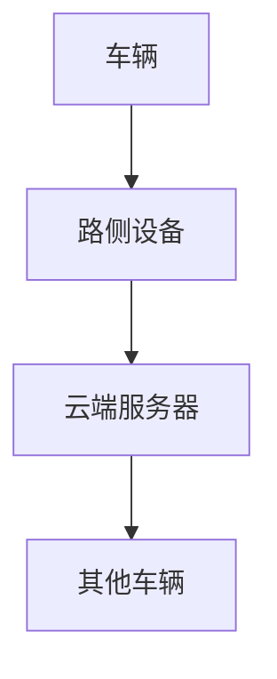
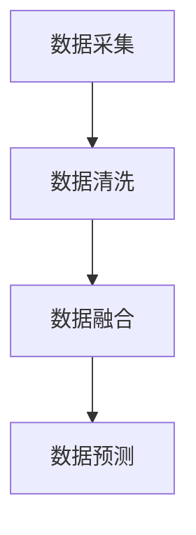

                 

# 《新兴市场股市估值与智能交通车路协同技术的互动》

> 关键词：新兴市场，股市估值，智能交通，车路协同，技术互动

> 摘要：本文探讨了新兴市场股市估值与智能交通车路协同技术之间的互动关系，分析了股市估值的核心算法与模型，以及车路协同技术的核心算法与系统架构，并通过实际案例分析与系统设计，展示了两者的互动机制与影响。

---

## 第一部分: 新兴市场股市估值与智能交通车路协同技术的互动概述

### 第1章: 新兴市场股市估值与智能交通车路协同技术的背景与互动关系

#### 1.1 新兴市场股市估值的基本概念

##### 1.1.1 新兴市场的定义与特点

新兴市场通常指那些经济快速发展但尚未完全工业化的国家或地区。这些市场的特点是经济增长迅速、人口年轻、消费潜力大，但同时也伴随着较高的波动性和不确定性。新兴市场的股市通常具有较高的波动性和不稳定性，这与发达国家市场的成熟和稳定性形成对比。

##### 1.1.2 股市估值的核心概念

股市估值是指通过对公司财务数据和市场环境的分析，评估股票的合理价格水平。常用的估值指标包括市盈率（P/E）、市净率（P/B）、股息率等。这些指标可以帮助投资者判断股票是否被高估或低估。

##### 1.1.3 新兴市场股市的独特性

新兴市场股市的独特性主要体现在以下几个方面：
1. **波动性高**：由于市场参与者的不成熟和信息不对称，新兴市场股市通常波动较大。
2. **政策影响大**：政府政策的变化对股市的影响更为显著。
3. **行业集中**：新兴市场的股市往往集中在少数行业，如科技、金融和制造业。

#### 1.2 智能交通车路协同技术的基本概念

##### 1.2.1 智能交通系统的定义与特点

智能交通系统（ITS）是指通过先进的信息技术、数据通信技术、传感器技术和控制技术，对交通系统进行智能化管理的系统。智能交通系统的目的是提高交通效率、减少拥堵和事故，以及优化资源利用。

##### 1.2.2 车路协同技术的核心原理

车路协同技术是指车辆与道路基础设施之间通过通信技术实现信息交互，从而实现协同决策和控制的技术。车路协同的核心是通过实时数据共享，使车辆能够感知周围环境并做出最优决策。

##### 1.2.3 车路协同技术的典型应用场景

车路协同技术的典型应用场景包括：
1. **自动驾驶**：通过车路协同实现车辆的自动驾驶。
2. **交通信号优化**：通过实时数据调整交通信号，减少拥堵。
3. **安全预警**：通过车路协同技术，提前预警潜在的安全隐患。

#### 1.3 新兴市场股市估值与智能交通车路协同技术的互动关系

##### 1.3.1 技术进步对股市估值的影响

技术进步对股市估值的影响主要体现在以下几个方面：
1. **技术创新推动企业增长**：技术创新可以提高企业的竞争力，从而提高其股票的估值。
2. **技术成熟度与市场预期**：技术的成熟度会影响市场对公司的未来预期，从而影响股票价格。
3. **行业集中度与技术壁垒**：技术壁垒的高低会影响行业的竞争格局，从而影响股市估值。

##### 1.3.2 经济发展与股市估值的互动

经济发展与股市估值的互动主要体现在：
1. **经济增长推动股市上涨**：经济增长通常会带动企业盈利增长，从而推动股市上涨。
2. **股市波动影响经济发展**：股市的波动可能会对投资者信心产生影响，从而影响经济发展。

##### 1.3.3 智能交通技术对经济发展的推动作用

智能交通技术对经济发展的推动作用主要体现在：
1. **提高交通效率**：通过智能交通系统，可以减少拥堵，提高交通效率，从而促进经济发展。
2. **降低运营成本**：智能交通技术可以降低交通运营成本，从而提高企业的盈利能力。
3. **促进技术创新**：智能交通技术的推广可以推动相关技术的发展，从而促进经济发展。

---

### 第2章: 新兴市场股市估值的核心算法与模型

#### 2.1 股市估值的基本方法

##### 2.1.1 市盈率（P/E）模型

市盈率（P/E）模型是通过将股票价格除以每股盈利（EPS）来计算股票的估值。公式如下：
$$ P/E = \frac{Price}{Earnings} $$

##### 2.1.2 市净率（P/B）模型

市净率（P/B）模型是通过将股票价格除以每股净资产（BPS）来计算股票的估值。公式如下：
$$ P/B = \frac{Price}{Book\ Value} $$

##### 2.1.3 现金流折现模型（DCF）

现金流折现模型（DCF）是通过将未来现金流折现到现值来计算股票的估值。步骤如下：
1. **预测未来现金流**：预测公司未来几年的现金流。
2. **确定折现率**：通常使用加权平均资本成本（WACC）作为折现率。
3. **计算现值**：将未来现金流折现到现值。
4. **计算终值**：假设公司有稳定的增长，计算终值。
5. **总和现值**：将现值和终值相加，得到股票的估值。

#### 2.2 新兴市场股市估值的特殊性

##### 2.2.1 新兴市场的波动性分析

新兴市场的波动性较高，主要由于市场参与者的不成熟和信息不对称。投资者在新兴市场中更容易受到情绪影响，导致股票价格波动较大。

##### 2.2.2 宏观经济指标对股市估值的影响

宏观经济指标如GDP增长率、通货膨胀率、利率等对股市估值有重要影响。例如，高利率可能导致股市估值下降，而低利率则可能推动股市上涨。

##### 2.2.3 行业周期对股市估值的影响

不同行业的周期性不同，新兴市场的股市估值也受到行业周期的影响。例如，科技行业通常具有较高的成长性，而传统制造业可能受经济周期的影响较大。

#### 2.3 股市估值的核心算法实现

##### 2.3.1 市盈率计算公式

市盈率计算公式：
$$ P/E = \frac{Price}{Earnings} $$

##### 2.3.2 市净率计算公式

市净率计算公式：
$$ P/B = \frac{Price}{Book\ Value} $$

##### 2.3.3 现金流折现模型（DCF）的实现步骤

现金流折现模型（DCF）的实现步骤：
1. 预测未来现金流。
2. 确定折现率。
3. 计算现值。
4. 计算终值。
5. 总和现值和终值，得到股票的估值。

---

### 第3章: 智能交通车路协同技术的核心算法与系统架构

#### 3.1 车路协同技术的核心算法

##### 3.1.1 车路协同的通信协议

车路协同的通信协议通常包括以下步骤：
1. **数据采集**：车辆和路侧设备采集交通数据。
2. **数据传输**：通过无线通信技术将数据传输到云端。
3. **数据处理**：云端对数据进行处理，生成控制指令。
4. **指令下发**：将控制指令下发给车辆或路侧设备。

##### 3.1.2 车路协同的实时数据处理

实时数据处理的核心算法包括：
1. **数据清洗**：去除噪声数据。
2. **数据融合**：将多源数据进行融合，提高数据准确性。
3. **数据预测**：基于历史数据预测未来交通状况。

##### 3.1.3 车路协同的决策算法

决策算法包括：
1. **路径规划**：基于实时数据，规划最优路径。
2. **冲突解决**：解决车辆与车辆之间的冲突。
3. **优先级调度**：根据紧急程度调度交通资源。

#### 3.2 车路协同系统的架构设计

##### 3.2.1 系统功能模块划分

系统功能模块包括：
1. **数据采集模块**：负责采集交通数据。
2. **数据处理模块**：负责数据的清洗、融合和预测。
3. **决策控制模块**：负责生成控制指令。
4. **通信模块**：负责数据的传输。

##### 3.2.2 系统架构的层次化设计

系统架构通常分为以下层次：
1. **感知层**：负责数据的采集。
2. **网络层**：负责数据的传输。
3. **计算层**：负责数据的处理和决策。
4. **应用层**：负责指令的执行和反馈。

##### 3.2.3 系统接口设计

系统接口设计需要考虑：
1. **数据接口**：数据的输入和输出接口。
2. **通信接口**：与其他系统或设备的通信接口。
3. **用户接口**：与用户的交互接口。

#### 3.3 车路协同技术的算法实现

##### 3.3.1 车路协同的通信流程图

##### 3.3.2 车路协同的实时数据处理流程图

##### 3.3.3 车路协同的决策算法实现步骤

1. 数据采集：通过传感器和通信设备采集交通数据。
2. 数据清洗：去除噪声数据，确保数据的准确性。
3. 数据融合：将多源数据进行融合，提高数据的可靠性。
4. 数据预测：基于历史数据预测未来交通状况。
5. 决策生成：根据预测结果生成控制指令。
6. 指令下发：将控制指令下发给车辆或路侧设备。

---

### 第4章: 新兴市场股市估值与智能交通车路协同技术的互动机制与影响

#### 4.1 技术进步对股市估值的推动作用

技术进步对股市估值的推动作用体现在：
1. **技术创新推动企业增长**：技术创新可以提高企业的竞争力，从而提高其股票的估值。
2. **技术成熟度与市场预期**：技术的成熟度会影响市场对公司的未来预期，从而影响股票价格。
3. **行业集中度与技术壁垒**：技术壁垒的高低会影响行业的竞争格局，从而影响股市估值。

#### 4.2 经济发展与股市估值的互动

经济发展与股市估值的互动体现在：
1. **经济增长推动股市上涨**：经济增长通常会带动企业盈利增长，从而推动股市上涨。
2. **股市波动影响经济发展**：股市的波动可能会对投资者信心产生影响，从而影响经济发展。

#### 4.3 智能交通技术对经济发展的推动作用

智能交通技术对经济发展的推动作用体现在：
1. **提高交通效率**：通过智能交通系统，可以减少拥堵，提高交通效率，从而促进经济发展。
2. **降低运营成本**：智能交通技术可以降低交通运营成本，从而提高企业的盈利能力。
3. **促进技术创新**：智能交通技术的推广可以推动相关技术的发展，从而促进经济发展。

---

### 第5章: 新兴市场股市估值与智能交通车路协同技术的案例分析与实际应用

#### 5.1 案例分析

##### 5.1.1 新兴市场股市估值的案例分析

以某新兴市场为例，分析其股市估值的变化趋势，并探讨其背后的技术和经济因素。

##### 5.1.2 智能交通车路协同技术的案例分析

以某智能交通项目为例，分析其实施过程中的技术挑战和解决方案，并探讨其对股市估值的影响。

#### 5.2 实际应用

##### 5.2.1 新兴市场股市估值的实际应用

通过实际数据，分析新兴市场股市估值的变化趋势，并探讨其与智能交通技术的互动关系。

##### 5.2.2 智能交通车路协同技术的实际应用

通过实际案例，展示智能交通车路协同技术的应用效果，并探讨其对股市估值的影响。

---

### 第6章: 新兴市场股市估值与智能交通车路协同技术的系统设计与优化

#### 6.1 系统设计

##### 6.1.1 系统功能模块划分

系统功能模块包括：
1. **数据采集模块**：负责采集交通数据。
2. **数据处理模块**：负责数据的清洗、融合和预测。
3. **决策控制模块**：负责生成控制指令。
4. **通信模块**：负责数据的传输。

##### 6.1.2 系统架构的层次化设计

系统架构通常分为以下层次：
1. **感知层**：负责数据的采集。
2. **网络层**：负责数据的传输。
3. **计算层**：负责数据的处理和决策。
4. **应用层**：负责指令的执行和反馈。

#### 6.2 系统优化

##### 6.2.1 系统性能优化

系统性能优化包括：
1. **数据处理效率优化**：通过算法优化提高数据处理速度。
2. **通信延迟优化**：通过优化通信协议减少数据传输延迟。
3. **系统稳定性优化**：通过冗余设计提高系统的稳定性。

##### 6.2.2 系统安全性优化

系统安全性优化包括：
1. **数据加密**：通过加密技术保护数据的安全性。
2. **访问控制**：通过权限管理控制系统的访问权限。
3. **异常处理**：通过异常处理机制减少系统故障。

---

### 第7章: 结论与展望

#### 7.1 结论

本文通过分析新兴市场股市估值与智能交通车路协同技术的互动关系，探讨了技术进步对股市估值的推动作用，以及智能交通技术对经济发展的推动作用。通过实际案例分析和系统设计，展示了两者的互动机制与影响。

#### 7.2 展望

未来，随着技术的进步和经济的发展，新兴市场股市估值与智能交通车路协同技术的互动关系将更加紧密。技术的进步将推动股市估值的进一步优化，而智能交通技术的推广将推动经济的进一步发展。

