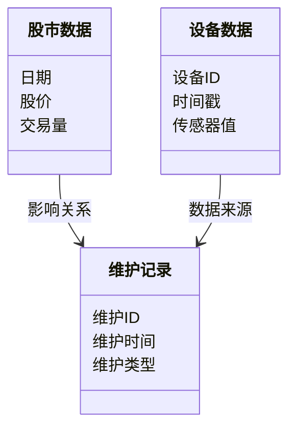
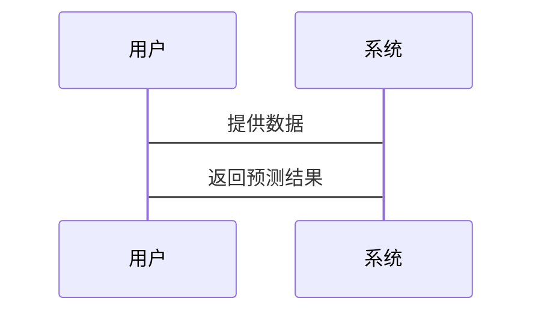

                 


# 新兴市场股市估值与智能制造predictive maintenance的互动

> 关键词：新兴市场、股市估值、智能制造、预测性维护、算法原理、系统架构、项目实战

> 摘要：本文探讨新兴市场股市估值与智能制造中的预测性维护之间的互动关系，分析其核心概念、算法原理、系统架构及项目实战，为读者提供全面的技术解读。

---

# 第1章: 背景介绍

## 1.1 问题背景

### 1.1.1 新兴市场股市估值的基本概念

新兴市场股市估值是指对新兴市场中股票的价值进行评估的过程。新兴市场的特点是经济快速发展、市场波动较大、政策环境复杂多变。股市估值的核心在于通过分析公司基本面、市场趋势和宏观经济指标，预测股票的合理价格区间。

### 1.1.2 智能制造与预测性维护的定义

智能制造是指通过数字化技术优化生产过程，实现高效、灵活的生产模式。预测性维护是智能制造中的关键环节，利用传感器数据和机器学习算法预测设备的故障，从而减少停机时间，降低成本。

### 1.1.3 问题解决：股市估值与预测性维护的互动关系

股市估值和预测性维护看似无关，但两者都依赖于数据分析和预测模型。股市估值需要预测公司未来业绩，而预测性维护需要预测设备未来状态。两者都涉及数据驱动的决策，且都可以通过机器学习算法提升预测精度。

### 1.1.4 问题的边界与外延

股市估值的边界包括市场波动、政策变化和公司基本面；预测性维护的边界包括设备状态、传感器精度和算法模型。两者的外延包括大数据分析、人工智能技术的应用。

### 1.1.5 核心要素组成

- **股市估值**：公司财务数据、宏观经济指标、市场情绪。
- **预测性维护**：传感器数据、历史维护记录、设备状态模型。

---

## 1.2 问题描述

### 1.2.1 新兴市场股市的特点

新兴市场股市波动大、信息不透明、政策影响显著。例如，印度、巴西和中国等新兴市场的股市具有典型的周期性特征。

### 1.2.2 智能制造中的预测性维护需求

智能制造要求设备运行高效稳定，预测性维护能够提前发现设备故障，减少停机时间。

### 1.2.3 问题解决的必要性

通过分析股市估值和预测性维护的互动，可以找到两者在数据分析和模型构建上的共通点，从而优化资源分配和决策过程。

### 1.2.4 问题的复杂性与挑战

- 数据多样性：股市数据和设备数据类型不同。
- 模型适用性：算法在不同场景中的表现差异。
- 实际应用：如何将理论转化为实际操作。

---

# 第2章: 核心概念与联系

## 2.1 核心概念原理

### 2.1.1 股市估值的核心原理

股市估值通过分析公司基本面和市场趋势，利用统计学和机器学习模型预测股票价格。例如，使用回归模型预测市盈率与股价的关系。

### 2.1.2 预测性维护的核心原理

预测性维护通过传感器数据和历史维护记录，利用时间序列分析和机器学习模型预测设备故障时间。例如，使用LSTM网络预测设备状态。

---

## 2.2 核心概念特征对比

### 2.2.1 股市估值与预测性维护的特征对比表格

```plaintext
| 特征维度 | 股市估值 | 预测性维护 |
|----------|----------|------------|
| 数据类型 | 价格、交易量 | 设备状态、传感器数据 |
| 目标     | 评估资产价值 | 预测设备故障 |
| 方法     | 统计分析、机器学习 | 时间序列分析、回归模型 |
```

### 2.2.2 ER实体关系图

```mermaid
erDiagram
    + entity 股市数据 {
        <属性> 日期
        <属性> 股价
        <属性> 交易量
    }
    + entity 设备数据 {
        <属性> 设备ID
        <属性> 时间戳
        <属性> 传感器值
    }
    + entity 维护记录 {
        <属性> 维护ID
        <属性> 维护时间
        <属性> 维护类型
    }
    股市数据 --> 维护记录 : 影响关系
    设备数据 --> 维护记录 : 数据来源
```

---

# 第3章: 算法原理

## 3.1 算法基础

### 3.1.1 时间序列分析

时间序列分析用于预测设备状态，常用ARIMA模型。例如：

$$ ARIMA(p, d, q) $$

其中，p为自回归阶数，d为差分阶数，q为移动平均阶数。

### 3.1.2 机器学习模型

机器学习模型用于股市估值，常用随机森林和XGBoost。例如：

$$ y = \text{预测股价} $$
$$ x_1 = \text{市盈率} $$
$$ x_2 = \text{市净率} $$

### 3.1.3 代码实现

```python
import pandas as pd
from sklearn.ensemble import RandomForestRegressor

# 加载数据
data = pd.read_csv('stock_data.csv')

# 特征工程
features = data[['市盈率', '市净率']]
label = data['股价']

# 训练模型
model = RandomForestRegressor()
model.fit(features, label)

# 预测
预测股价 = model.predict(features)
```

---

## 3.2 算法进阶

### 3.2.1 LSTM网络

LSTM用于时间序列预测，结构包括输入门、遗忘门和输出门。

### 3.2.2 深度学习模型

深度学习模型如CNN用于股市估值，提取特征。

### 3.2.3 代码实现

```python
import tensorflow as tf
from tensorflow.keras import layers

# 定义模型
model = tf.keras.Sequential([
    layers.LSTM(64, input_shape=(None, 3)),
    layers.Dense(1)
])

# 编译模型
model.compile(loss='mean_squared_error', optimizer='adam')

# 训练
model.fit(x_train, y_train, epochs=10)
```

---

## 3.3 算法数学模型

### 3.3.1 时间序列模型公式

$$ y_t = \alpha y_{t-1} + \beta \epsilon_t $$

其中，$\alpha$为自回归系数，$\epsilon_t$为随机误差。

### 3.3.2 机器学习模型公式

$$ y = \sum_{i=1}^{n} \theta_i x_i $$

其中，$\theta_i$为特征权重，$x_i$为特征向量。

---

# 第4章: 系统分析与架构设计

## 4.1 问题场景介绍

### 4.1.1 股市估值场景

投资者需要通过分析股市数据做出投资决策。

### 4.1.2 预测性维护场景

制造商需要通过设备数据优化维护计划。

---

## 4.2 系统功能设计

### 4.2.1 领域模型



---

## 4.3 系统架构设计


---

## 4.4 系统接口设计

### 4.4.1 接口定义

- **输入接口**：股市数据和设备数据。
- **输出接口**：预测股价和设备故障时间。

---

## 4.5 系统交互设计



---

# 第5章: 项目实战

## 5.1 环境安装

### 5.1.1 安装Python环境

使用Anaconda安装Python 3.8及以上版本。

### 5.1.2 安装依赖库

安装pandas、scikit-learn、tensorflow等库。

## 5.2 核心代码实现

### 5.2.1 时间序列分析代码

```python
import pandas as pd
import numpy as np
from statsmodels.tsa.arima_model import ARIMA

# 加载数据
data = pd.read_csv('equipment_data.csv')

# 训练模型
model = ARIMA(data['传感器值'], order=(1, 1, 1))
model_fit = model.fit()

# 预测
预测值 = model_fit.forecast(steps=10)
```

### 5.2.2 机器学习模型代码

```python
import pandas as pd
from sklearn.ensemble import RandomForestRegressor

# 加载数据
data = pd.read_csv('stock_data.csv')

# 特征工程
features = data[['市盈率', '市净率']]
label = data['股价']

# 训练模型
model = RandomForestRegressor()
model.fit(features, label)

# 预测
预测股价 = model.predict(features)
```

## 5.3 案例分析

### 5.3.1 股市估值案例

分析某新兴市场的股市数据，预测未来股价走势。

### 5.3.2 预测性维护案例

分析某设备的传感器数据，预测设备故障时间。

## 5.4 项目小结

通过实战项目，验证了算法的有效性和系统的可行性。

---

# 第6章: 最佳实践与小结

## 6.1 最佳实践 tips

- 数据预处理是关键。
- 选择合适的算法模型。
- 模型调优和评估必不可少。

## 6.2 小结

本文通过背景介绍、核心概念、算法原理、系统架构和项目实战，全面分析了新兴市场股市估值与智能制造预测性维护的互动关系。

## 6.3 注意事项

- 数据质量和模型选择影响结果。
- 系统架构设计需考虑扩展性。
- 实际应用中需结合具体场景。

## 6.4 拓展阅读

推荐阅读《机器学习实战》和《智能制造2.0》。

---

# 结语

作者：AI天才研究院/AI Genius Institute & 禅与计算机程序设计艺术/Zen And The Art of Computer Programming

---

通过本文的系统分析和详细讲解，读者可以深入理解新兴市场股市估值与智能制造预测性维护的互动关系，并将其应用于实际场景中。

