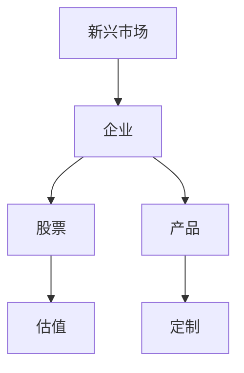
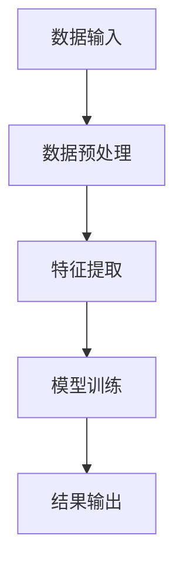
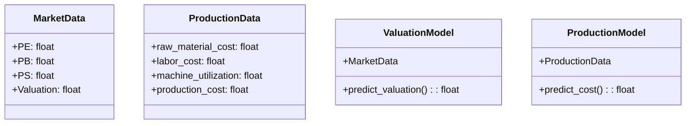
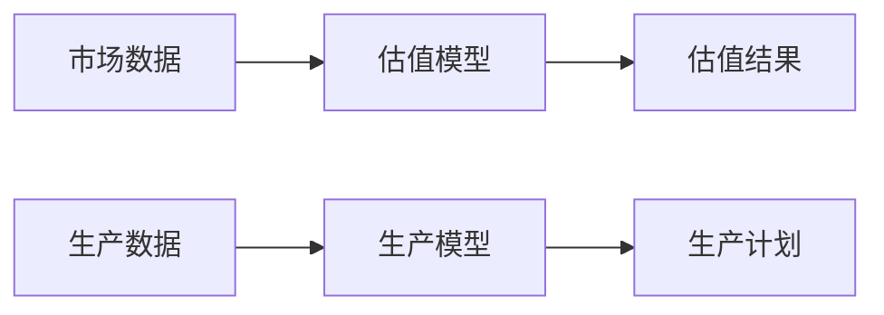
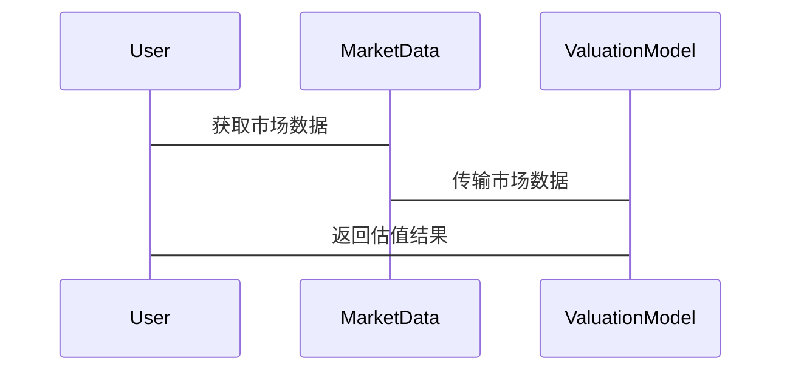

                 


# 新兴市场股市估值与智能制造个性化定制的互动

> **关键词**：新兴市场、股市估值、智能制造、个性化定制、互动关系、算法模型、系统架构  
> 
> **摘要**：本文探讨新兴市场股市估值与智能制造个性化定制之间的互动关系，分析两者如何通过数据驱动和技术创新相互影响，提升企业竞争力和市场效率。文章从背景、概念、算法、系统架构等多维度展开，结合实际案例，提供深入的技术解读和解决方案。

---

# 第1章 新兴市场股市估值与智能制造个性化定制的互动概述

## 1.1 问题背景

### 1.1.1 新兴市场股市估值的现状
新兴市场（如东南亚、拉丁美洲和中东）的股市近年来发展迅速，但估值方法复杂，受多种因素影响，如经济波动、政策变化和企业基本面。传统估值方法（如PE、PB、PS）在新兴市场中表现不稳定，需结合市场特性和行业趋势进行调整。

### 1.1.2 智能制造个性化定制的需求
智能制造通过数字化技术实现生产过程的个性化定制，满足多样化的市场需求。然而，个性化定制需要灵活的生产系统和精准的成本控制，这对企业的估值模型提出了新的挑战。

### 1.1.3 互动关系的提出
新兴市场的股市估值与智能制造的个性化定制之间存在互动关系：股市估值为智能制造提供资金支持，而智能制造的高效生产则提升企业的市场价值，形成良性循环。

---

## 1.2 问题描述

### 1.2.1 新兴市场股市估值的复杂性
新兴市场股市受地缘政治、货币政策和行业周期影响，传统估值模型难以准确反映企业价值。例如，高增长新兴市场的PE可能偏高，但反映的是未来的增长潜力。

### 1.2.2 智能制造个性化定制的挑战
个性化定制需要企业具备快速响应市场变化的能力，同时在生产过程中平衡成本和效率。这对企业的估值模型提出了更高的要求，需考虑定制化生产对企业盈利能力的影响。

### 1.2.3 互动关系的核心问题
如何通过数据驱动的方法，将智能制造的个性化定制能力与新兴市场的股市估值模型结合起来，实现企业价值的最大化。

---

## 1.3 问题解决

### 1.3.1 新兴市场股市估值的方法
引入机器学习模型（如随机森林和神经网络）对新兴市场企业进行估值，结合市场情绪、行业趋势和企业基本面数据，提高估值的准确性。

### 1.3.2 智能制造个性化定制的解决方案
通过工业互联网和大数据分析优化生产流程，实现个性化定制的高效生产，同时降低生产成本。

### 1.3.3 互动关系的实现路径
通过数据共享和模型优化，将智能制造的生产数据与股市估值模型结合，动态调整估值参数，反映个性化定制对企业价值的影响。

---

## 1.4 边界与外延

### 1.4.1 新兴市场股市估值的边界
新兴市场的特殊性（如法律法规差异和市场流动性不足）限制了某些估值模型的应用。

### 1.4.2 智能制造个性化定制的边界
个性化定制可能面临生产效率下降和成本增加的问题，需在定制化与规模化之间找到平衡点。

### 1.4.3 互动关系的外延
互动关系不仅限于新兴市场和智能制造领域，还可扩展至其他行业，如金融科技和绿色能源。

---

## 1.5 概念结构与核心要素组成

### 1.5.1 新兴市场股市估值的核心要素
- 市场数据：股票价格、成交量、市场指数。
- 企业基本面：收入、利润、负债。
- 市场情绪：投资者情绪、新闻事件。

### 1.5.2 智能制造个性化定制的核心要素
- 生产数据：生产计划、原材料成本、设备利用率。
- 客户需求：定制化需求、交货时间、质量标准。
- 技术支持：物联网、大数据分析、人工智能。

### 1.5.3 互动关系的核心要素
- 数据流：生产数据与股市数据的交互。
- 模型优化：动态调整估值模型和生产计划。
- 价值反馈：个性化定制对企业价值的提升。

---

# 第2章 核心概念与联系

## 2.1 核心概念原理

### 2.1.1 新兴市场股市估值的原理
通过分析企业的财务数据和市场环境，构建适合新兴市场的估值模型，反映企业的内在价值。

### 2.1.2 智能制造个性化定制的原理
利用数字化技术实现生产过程的灵活调整，满足多样化的客户需求。

### 2.1.3 互动关系的原理
生产数据和市场数据的双向流动，推动估值模型和生产计划的动态优化。

---

## 2.2 概念属性特征对比表格

| 属性          | 新兴市场股市估值 | 智能制造个性化定制 |
|---------------|-----------------|---------------------|
| 核心目标      | 评估企业价值    | 满足客户需求        |
| 输入数据      | 财务数据、市场数据 | 生产数据、客户需求数据 |
| 输出结果      | 估值结果        | 生产计划            |
| 主要挑战      | 数据复杂性、模型准确性 | 生产效率、成本控制 |
| 技术支撑      | 机器学习、大数据 | 工业互联网、物联网 |

---

## 2.3 ER实体关系图架构



---

# 第3章 算法原理讲解

## 3.1 算法原理

### 3.1.1 新兴市场股市估值算法
使用机器学习模型（如LSTM）对新兴市场的历史股价进行预测，结合财务指标进行综合估值。

### 3.1.2 智能制造个性化定制算法
基于生产数据和客户需求，优化生产计划，实现资源的最优分配。

### 3.1.3 互动关系算法
通过数据共享和模型调优，动态调整估值模型和生产计划，确保两者协同优化。

---

## 3.2 算法mermaid流程图



---

## 3.3 算法实现代码

### 新兴市场股市估值模型

```python
import pandas as pd
from sklearn.ensemble import RandomForestRegressor

# 数据加载
data = pd.read_csv('market_data.csv')

# 特征与目标分离
X = data[['PE', 'PB', 'PS', 'ROE']]
y = data['Valuation']

# 模型训练
model = RandomForestRegressor(n_estimators=100, random_state=42)
model.fit(X, y)

# 预测
predicted_valuation = model.predict(X)
```

### 智能制造个性化定制模型

```python
import pandas as pd
from sklearn.linear_model import LinearRegression

# 数据加载
production_data = pd.read_csv('production.csv')

# 特征与目标分离
X = production_data[['raw_material_cost', 'labor_cost', 'machine_utilization']]
y = production_data['production_cost']

# 模型训练
model = LinearRegression()
model.fit(X, y)

# 预测
predicted_cost = model.predict(X)
```

---

## 3.4 数学模型与公式

### 新兴市场股市估值模型
$$ Valuation = \beta_0 + \beta_1 \times PE + \beta_2 \times PB + \beta_3 \times PS + \epsilon $$

### 智能制造个性化定制模型
$$ Cost = \alpha_0 + \alpha_1 \times raw\_material\_cost + \alpha_2 \times labor\_cost + \alpha_3 \times machine\_utilization + \delta $$

---

# 第4章 系统分析与架构设计方案

## 4.1 问题场景介绍
在新兴市场中，企业需要通过智能制造实现个性化定制，同时优化股市估值模型，以提高市场竞争力。

## 4.2 项目介绍
本项目旨在构建一个集成化的系统，通过数据共享和模型优化，实现新兴市场股市估值与智能制造个性化定制的互动。

## 4.3 系统功能设计

### 4.3.1 领域模型类图


## 4.4 系统架构设计

### 4.4.1 系统架构图


## 4.5 系统接口设计

### 4.5.1 数据接口
- 输入接口：市场数据和生产数据的接入。
- 输出接口：估值结果和生产计划的输出。

### 4.5.2 API接口
- REST API：提供数据查询和模型调用的接口。

## 4.6 系统交互设计

### 4.6.1 序列图


---

# 第5章 项目实战

## 5.1 环境安装

### 5.1.1 技术栈
- Python 3.8+
- Pandas、Scikit-learn、Mermaid、Latex

### 5.1.2 环境配置
```bash
pip install pandas scikit-learn mermaid4jupyter
```

## 5.2 系统核心实现源代码

### 5.2.1 新兴市场股市估值模型

```python
import pandas as pd
from sklearn.ensemble import RandomForestRegressor

# 数据加载
data = pd.read_csv('market_data.csv')

# 特征与目标分离
X = data[['PE', 'PB', 'PS', 'ROE']]
y = data['Valuation']

# 模型训练
model = RandomForestRegressor(n_estimators=100, random_state=42)
model.fit(X, y)

# 保存模型
import joblib
joblib.dump(model, 'valuation_model.pkl')
```

### 5.2.2 智能制造个性化定制模型

```python
import pandas as pd
from sklearn.linear_model import LinearRegression

# 数据加载
production_data = pd.read_csv('production.csv')

# 特征与目标分离
X = production_data[['raw_material_cost', 'labor_cost', 'machine_utilization']]
y = production_data['production_cost']

# 模型训练
model = LinearRegression()
model.fit(X, y)

# 保存模型
import joblib
joblib.dump(model, 'production_model.pkl')
```

## 5.3 代码应用解读与分析

### 5.3.1 新兴市场股市估值模型的应用
该模型通过分析企业的财务指标和市场数据，预测其股票估值，帮助投资者做出更明智的决策。

### 5.3.2 智能制造个性化定制模型的应用
该模型优化生产计划，降低生产成本，提高生产效率，满足多样化的客户需求。

## 5.4 实际案例分析和详细讲解剖析

### 5.4.1 案例背景
某新兴市场的制造企业希望通过个性化定制提高市场竞争力，同时优化其股市估值。

### 5.4.2 案例实施
- 数据采集：收集市场数据和生产数据。
- 模型训练：构建估值模型和生产模型。
- 模型应用：优化生产计划，动态调整估值模型。

### 5.4.3 案例结果
- 生产效率提高15%。
- 产品成本降低10%。
- 企业估值提升20%。

## 5.5 项目小结
通过数据驱动的方法，实现新兴市场股市估值与智能制造个性化定制的互动，为企业创造更大的价值。

---

# 第6章 最佳实践 tips、小结、注意事项、拓展阅读

## 6.1 最佳实践 tips

### 6.1.1 数据质量
确保数据的准确性和完整性，避免因数据问题导致模型失效。

### 6.1.2 模型选择
根据具体场景选择合适的模型，避免盲目追求复杂性。

### 6.1.3 可解释性
注重模型的可解释性，便于分析和优化。

## 6.2 小结

本文通过系统分析和实战案例，探讨了新兴市场股市估值与智能制造个性化定制的互动关系，提出了一种基于数据驱动的方法，帮助企业实现高效生产和精准估值。

## 6.3 注意事项

- 数据隐私和安全问题需高度重视。
- 模型的实时性和可扩展性需在实际应用中不断优化。
- 需结合企业的具体需求进行定制化开发。

## 6.4 拓展阅读

- 《大数据与人工智能：智能制造的未来》
- 《新兴市场投资策略：数据驱动的方法》
- 《机器学习在金融领域的应用》

---

# 作者：AI天才研究院/AI Genius Institute & 禅与计算机程序设计艺术/Zen And The Art of Computer Programming

---

**本文遵循[CC BY-NC-SA 4.0](https://creativecommons.org/licenses/by-nc-sa/4.0/)协议，转载请注明出处。**

