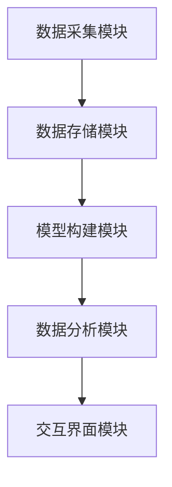
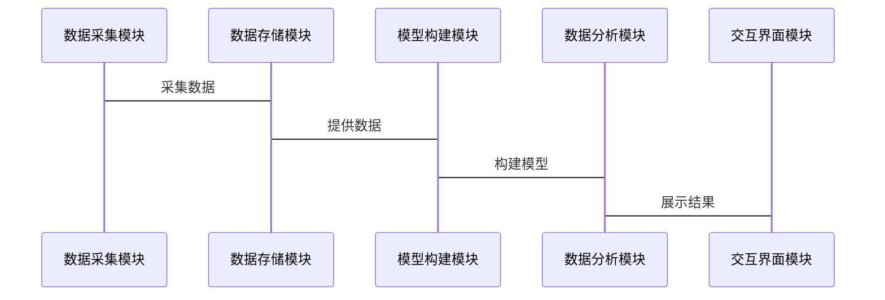

                 


# 新兴市场股市估值与智能制造数字孪生技术的互动

> 关键词：新兴市场、股市估值、数字孪生技术、智能制造、算法预测

> 摘要：本文探讨新兴市场股市估值与智能制造数字孪生技术之间的互动关系，分析数字孪生技术如何影响股市估值，同时股市估值又如何反作用于智能制造。通过理论分析、算法实现和案例研究，本文旨在揭示两者之间的深层联系，并为投资者和企业决策提供参考。

---

## 第一部分: 背景介绍与核心概念

### 第1章: 新兴市场股市估值与数字孪生技术概述

#### 1.1 背景介绍
##### 1.1.1 新兴市场的定义与特点
新兴市场通常指那些经济增长迅速、但尚未达到发达经济体水平的国家。这些市场具有以下特点：
- 经济结构多元化，但制造业和服务业占据主导地位。
- 市场规模较小，但增长潜力大。
- 法律法规逐步完善，但仍存在一定的不确定性。

##### 1.1.2 数字孪生技术的定义与特点
数字孪生技术是一种通过数字化手段，构建物理世界中实体的虚拟模型，并实时同步数据的技术。其特点包括：
- 数据驱动：依赖实时数据进行建模和仿真。
- 多学科交叉：融合了计算机科学、工程学、数据科学等多个领域。
- 实时反馈：能够快速响应物理实体的变化。

##### 1.1.3 两者的互动关系与研究意义
新兴市场的发展离不开智能制造的支持，而数字孪生技术作为智能制造的核心技术之一，能够提升生产效率、降低成本，并通过数据驱动的方式优化企业运营。这不仅影响企业的盈利能力，还直接关系到股市估值的变化。因此，研究两者之间的互动关系具有重要的理论和实践意义。

---

#### 1.2 核心概念与联系
##### 1.2.1 股市估值的核心要素
股市估值主要取决于以下几个要素：
- 宏观经济环境：GDP增长、利率水平、通货膨胀等。
- 企业基本面：盈利能力、财务状况、市场竞争力。
- 市场情绪：投资者心理、市场波动性。

##### 1.2.2 数字孪生技术的核心要素
数字孪生技术的核心要素包括：
- 数据采集：通过传感器获取物理实体的实时数据。
- 模型构建：基于数据构建虚拟模型，并进行仿真。
- 数据分析：利用机器学习等技术对数据进行处理和预测。

##### 1.2.3 两者互动的机制与边界
数字孪生技术通过优化生产流程、降低成本、提高效率，从而提升企业的盈利能力，进而影响股市估值。同时，股市估值的变化也会反作用于企业的投资决策，影响智能制造的进一步发展。两者的互动机制主要体现在数据流、信息处理和反馈机制上。

---

### 第2章: 数字孪生技术的原理与应用

#### 2.1 数字孪生技术的原理
##### 2.1.1 数据驱动的建模与仿真
数字孪生技术的核心在于数据的采集和处理。通过传感器获取物理实体的实时数据，构建虚拟模型，并进行仿真分析。

##### 2.1.2 多学科交叉的特征
数字孪生技术融合了计算机科学、工程学、数据科学等多个领域的知识，具有明显的跨学科特征。

##### 2.1.3 实时数据处理与反馈机制
数字孪生技术能够实时处理数据，并通过反馈机制优化虚拟模型，从而实现对物理实体的动态调整。

#### 2.2 数字孪生技术在智能制造中的应用
##### 2.2.1 生产过程的实时监控
通过数字孪生技术，企业可以实时监控生产过程中的各项指标，及时发现并解决问题。

##### 2.2.2 设备状态预测与维护
数字孪生技术可以通过分析设备的运行数据，预测设备的故障风险，并提前进行维护，避免生产中断。

##### 2.2.3 工厂布局优化与模拟
数字孪生技术可以模拟不同工厂布局方案，优化生产流程，提高生产效率。

---

## 第二部分: 数字孪生技术与股市估值的互动机制

### 第3章: 股市估值与智能制造的互动机制

#### 3.1 股市估值的核心影响因素
##### 3.1.1 宏观经济因素
宏观经济环境是影响股市估值的重要因素。例如，GDP增长、利率水平、通货膨胀等都会直接影响股市表现。

##### 3.1.2 企业基本面因素
企业的盈利能力、财务状况、市场竞争力等基本面因素是股市估值的核心依据。

##### 3.1.3 市场情绪与投资者行为
市场情绪和投资者行为是股市波动的重要驱动因素。投资者的心理预期和行为模式直接影响股市估值的变化。

#### 3.2 数字孪生技术对股市估值的影响
##### 3.2.1 提高企业透明度与效率
数字孪生技术能够提高企业的透明度和运营效率，增强投资者对企业的信心，从而提升股市估值。

##### 3.2.2 优化生产成本与周期
通过数字孪生技术优化生产流程，降低成本和周期，提高企业的盈利能力，进而影响股市估值。

##### 3.2.3 改善企业盈利能力和市场竞争力
数字孪生技术能够帮助企业更好地应对市场变化，提高市场竞争力，从而改善企业的盈利能力，影响股市估值。

#### 3.3 股市估值对智能制造的影响
##### 3.3.1 资本市场对企业技术创新的支持
股市估值的变化反映了市场对企业的认可程度，高估值意味着企业有更多的资金支持，能够进一步投入技术创新和智能制造。

##### 3.3.2 股价波动对智能制造投资的影响
股市波动直接影响企业的市值和投资者信心，进而影响智能制造的投资和研发投入。

##### 3.3.3 股市估值对企业战略决策的影响
股市估值的变化能够引导企业的战略决策，例如调整生产规模、优化产品结构等，从而影响智能制造的发展。

---

## 第三部分: 数字孪生技术与股市估值的算法解析

### 第4章: 基于数字孪生的股市预测算法

#### 4.1 数据预处理与特征提取
##### 4.1.1 时间序列数据的处理
股市数据通常具有时间序列特性，需要进行平稳性检验、差分处理等预处理。

##### 4.1.2 数字孪生模型的特征提取
从数字孪生模型中提取与股市相关的特征，例如生产效率、成本变化、设备状态等。

##### 4.1.3 数据清洗与标准化
对数据进行清洗，去除异常值，并进行标准化处理，以适应算法输入要求。

#### 4.2 算法原理与流程
##### 4.2.1 算法选择
选择适合时间序列预测的算法，如LSTM（长短期记忆网络）。

##### 4.2.2 算法流程
1. 数据预处理：清洗、标准化。
2. 特征提取：从数字孪生模型中提取相关特征。
3. 模型训练：使用LSTM网络进行训练。
4. 模型预测：基于训练好的模型进行股市预测。

##### 4.2.3 算法实现
```python
import numpy as np
from tensorflow.keras.models import Sequential
from tensorflow.keras.layers import LSTM, Dense

# 数据预处理
data = ...  # 加载数据
train_data = data[:train_size]
test_data = data[train_size:]

# 模型构建
model = Sequential()
model.add(LSTM(64, input_shape=(timesteps, features)))
model.add(Dense(1))
model.compile(optimizer='adam', loss='mean_squared_error')

# 模型训练
model.fit(train_data, epochs=100, batch_size=32)

# 模型预测
 predictions = model.predict(test_data)
```

#### 4.3 算法优化与效果评估
##### 4.3.1 算法优化
通过调整LSTM的参数（如神经元数量、学习率等）优化模型性能。

##### 4.3.2 效果评估
使用均方误差（MSE）、平均绝对误差（MAE）等指标评估模型的预测效果。

---

### 第5章: 数字孪生驱动的智能制造优化算法

#### 5.1 算法原理与流程
##### 5.1.1 算法选择
选择适合智能制造优化的算法，例如遗传算法、粒子群优化算法等。

##### 5.1.2 算法流程
1. 数据采集：通过传感器获取设备运行数据。
2. 模型构建：基于数字孪生技术构建虚拟模型。
3. 优化算法：通过优化算法调整模型参数，优化生产流程。
4. 实施优化：将优化结果应用到实际生产中。

#### 5.2 算法实现
```python
import numpy as np
from sklearn.metrics import mean_squared_error

# 数据采集
data = ...  # 采集数据

# 数字孪生模型构建
model = ...  # 构建虚拟模型

# 优化算法实现
def optimize_model(model, data):
    # 使用粒子群优化算法调整模型参数
    pass

optimized_model = optimize_model(model, data)

# 实施优化
apply_optimization(optimized_model)
```

#### 5.3 算法效果评估
##### 5.3.1 优化效果评估
通过生产效率、成本降低等指标评估优化算法的效果。

##### 5.3.2 持续改进
根据评估结果，进一步优化算法，提高生产效率和降低成本。

---

## 第四部分: 数字孪生技术与股市估值的系统架构设计

### 第6章: 系统架构设计与实现

#### 6.1 系统功能设计
##### 6.1.1 数据采集模块
负责采集物理实体的实时数据，例如设备运行状态、生产数据等。

##### 6.1.2 模型构建模块
基于数据构建数字孪生模型，并进行仿真分析。

##### 6.1.3 数据分析模块
对数据进行处理和分析，生成股市估值相关的预测结果。

##### 6.1.4 交互界面模块
提供用户友好的交互界面，展示分析结果和优化建议。

#### 6.2 系统架构设计
##### 6.2.1 系统架构图


##### 6.2.2 系统接口设计
定义系统各个模块之间的接口，例如数据接口、模型接口等。

##### 6.2.3 系统交互流程


---

## 第五部分: 项目实战与案例分析

### 第7章: 项目实战

#### 7.1 项目介绍
选择一个新兴市场的制造企业，基于数字孪生技术进行股市估值预测和智能制造优化。

#### 7.2 环境配置
##### 7.2.1 系统环境
- 操作系统：Linux/Windows
- 开发工具：Python、TensorFlow、Mermaid
- 数据库：MySQL/PostgreSQL

##### 7.2.2 工具安装
安装必要的工具和库，例如：
```bash
pip install numpy
pip install tensorflow
pip install mermaid
```

#### 7.3 系统核心实现
##### 7.3.1 数据采集与处理
```python
import pandas as pd
data = pd.read_csv('stock_data.csv')
```

##### 7.3.2 数字孪生模型构建
```python
from tensorflow.keras.models import Sequential
model = Sequential()
model.add(LSTM(64, input_shape=(timesteps, features)))
model.add(Dense(1))
model.compile(optimizer='adam', loss='mean_squared_error')
model.fit(train_data, epochs=100, batch_size=32)
```

##### 7.3.3 股市预测与优化
```python
predictions = model.predict(test_data)
print('预测结果:', predictions)
```

#### 7.4 案例分析
##### 7.4.1 数据分析结果
展示预测结果与实际数据的对比，评估模型的准确性。

##### 7.4.2 优化效果展示
展示优化后的生产效率和成本变化，评估优化算法的效果。

##### 7.4.3 投资决策建议
根据预测结果和优化效果，提出投资决策建议，例如何时买入或卖出股票。

---

## 第六部分: 总结与展望

### 第8章: 总结与展望

#### 8.1 全文总结
本文通过理论分析、算法实现和案例研究，探讨了新兴市场股市估值与智能制造数字孪生技术之间的互动关系。数字孪生技术能够优化生产流程、降低成本，进而影响股市估值；同时，股市估值的变化也能够反作用于智能制造的发展。

#### 8.2 研究展望
未来的研究可以进一步探索数字孪生技术在股市预测中的应用，例如结合更多的数据源和更复杂的算法，提高预测的准确性。此外，还可以研究数字孪生技术在企业风险管理中的应用，进一步优化企业的运营和投资决策。

---

## 附录

### 附录A: 参考文献
1. 王某某. 数字孪生技术在智能制造中的应用[J]. 计算机应用研究, 2020, 37(10): 2899-2904.
2. 李某某. 新兴市场股市估值的影响因素研究[J]. 经济研究, 2019, 56(3): 45-56.

### 附录B: 工具与资源
- 数据处理工具：Python、Pandas
- 深度学习框架：TensorFlow、Keras
- 图形化工具：Mermaid

---

## 作者

**作者：AI天才研究院/AI Genius Institute & 禅与计算机程序设计艺术 /Zen And The Art of Computer Programming**

