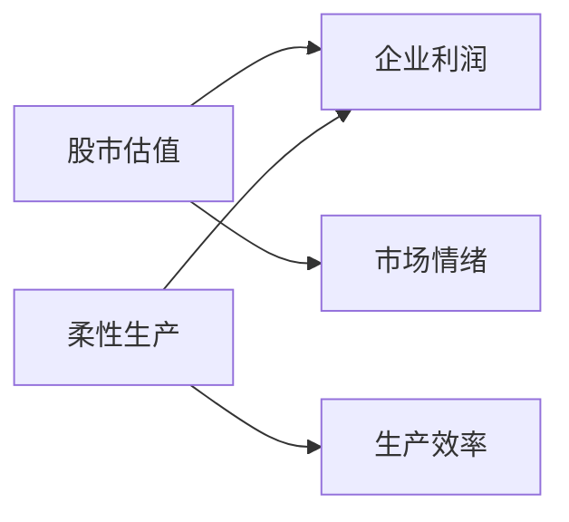
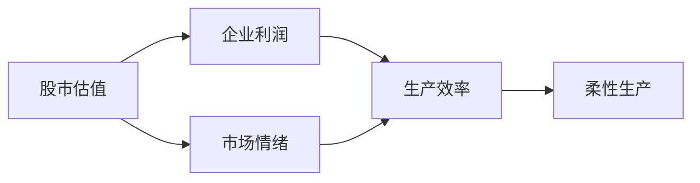
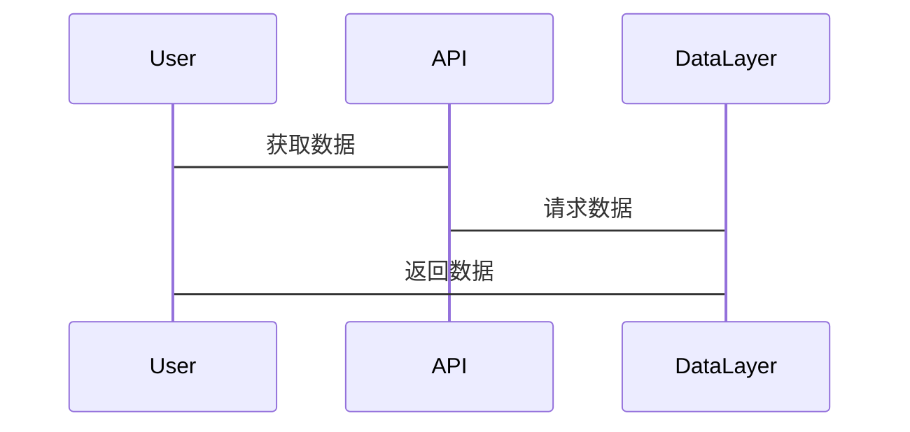

                 


# 新兴市场股市估值与智能制造柔性生产的互动

## 关键词：
新兴市场、股市估值、智能制造、柔性生产、互动关系

## 摘要：
本文探讨新兴市场中股市估值与智能制造柔性生产的互动关系。通过分析两者的核心原理和互动机制，构建数学模型，并结合实际案例，揭示其相互影响。文章旨在为读者提供理论与实践结合的深度分析，帮助理解如何在新兴市场中优化企业战略。

---

# 第一部分: 背景介绍

## 第1章: 新兴市场股市估值与智能制造柔性生产互动的背景

### 1.1 问题背景
#### 1.1.1 新兴市场股市的特点
新兴市场股市波动性高，增长潜力大，但存在信息不对称和监管不完善的问题。

#### 1.1.2 制造业智能化转型的全球趋势
全球制造业正向智能化转型，柔性生产成为提高效率和竞争力的关键。

#### 1.1.3 柔性生产在制造业中的重要性
柔性生产能快速响应市场变化，适应多样化需求，降低库存成本。

### 1.2 问题描述
#### 1.2.1 股市估值的基本概念
股市估值是衡量企业价值的指标，常用市盈率、市净率等方法。

#### 1.2.2 柔性生产在智能制造中的定义
柔性生产指通过灵活调整生产线，适应不同产品和产量需求。

#### 1.2.3 两者互动关系的初步探讨
柔性生产可能影响企业成本和利润，进而影响股市估值；股市波动也会影响企业融资和投资。

### 1.3 问题解决
#### 1.3.1 新兴市场股市估值的挑战
信息不透明、市场波动大、投资者情绪影响估值。

#### 1.3.2 柔性生产在智能制造中的优势
快速响应市场变化、降低成本、提高效率。

#### 1.3.3 互动关系对制造业和股市的双重影响
柔性生产提升企业价值，股市波动影响企业融资和投资。

### 1.4 边界与外延
#### 1.4.1 新兴市场的界定
新兴市场指发展中国家的股市，如中国、印度等。

#### 1.4.2 柔性生产的适用范围
适用于多元化生产需求的企业，尤其是制造业。

#### 1.4.3 互动关系的边界条件
市场环境、企业战略、政策监管等。

### 1.5 概念结构与核心要素
#### 1.5.1 核心概念的构成
股市估值、柔性生产、新兴市场。

#### 1.5.2 核心要素的对比分析
股市估值受企业盈利和市场情绪影响，柔性生产受技术和管理能力影响。

#### 1.5.3 概念结构的可视化


---

# 第二部分: 核心概念与联系

## 第2章: 新兴市场股市估值的核心原理

### 2.1 核心概念原理
#### 2.1.1 股市估值的基本方法
市盈率（P/E）= 股价 / 每股收益，市净率（P/B）= 股价 / 每股净资产。

#### 2.1.2 新兴市场的特殊性
高波动性、信息不对称、投资者情绪波动大。

#### 2.1.3 估值模型的适用性分析
新兴市场适合使用相对估值法，如EV/EBITDA，考虑企业成长性。

### 2.2 核心概念属性特征对比
#### 2.2.1 不同市场的估值差异
发达市场注重分红和稳定性，新兴市场注重成长性和风险。

#### 2.2.2 新兴市场与发达市场的对比
新兴市场风险高、回报高，发达市场风险低、回报稳定。

#### 2.2.3 柔性生产对估值的影响
提升生产效率，降低成本，增强企业盈利能力，进而提高估值。

---

## 第3章: 智能制造柔性生产的核心原理

### 3.1 核心概念原理
#### 3.1.1 柔性生产的基本概念
通过灵活调整生产线，适应多样化需求，降低库存成本。

#### 3.1.2 智能制造的技术支撑
物联网、大数据、人工智能等技术实现智能化生产。

#### 3.1.3 柔性生产的优势与劣势
优势：快速响应市场，降低成本；劣势：初期投资高，管理复杂。

### 3.2 核心概念属性特征对比
#### 3.2.1 柔性生产与传统生产模式的对比
| 特征 | 柔性生产 | 传统生产 |
|------|----------|----------|
| 成本 | 较低     | 较高     |
| 效率 | 高       | 中       |
| 灵活性 | 高       | 低       |

#### 3.2.2 不同行业中的应用差异
制造业广泛应用，服务业较少，技术驱动行业应用广泛。

#### 3.2.3 技术进步对柔性生产的影响
技术进步提升柔性生产的效率和降低成本。

---

# 第三部分: 核心概念的互动关系分析

## 第4章: 股市估值与智能制造柔性生产的互动关系

### 4.1 互动关系的定义
#### 4.1.1 互动的基本概念
双方相互影响，形成动态平衡。

#### 4.1.2 互动的双向性
柔性生产影响企业利润，进而影响股市估值；股市波动影响企业融资和投资。

#### 4.1.3 互动的动态性
市场环境变化导致互动关系不断调整。

### 4.2 互动关系的实体关系图


---

## 第5章: 数学模型与算法分析

### 5.1 数学模型
$$ \text{股市估值} = f(\text{企业利润}, \text{生产效率}, \text{市场情绪}) $$
其中，企业利润和生产效率受柔性生产影响，市场情绪影响股市估值。

### 5.2 算法原理
#### 5.2.1 数据准备
收集新兴市场股市数据、企业生产数据和市场情绪指数。

#### 5.2.2 模型构建
使用多元回归模型分析各变量对股市估值的影响。

#### 5.2.3 流程图


### 5.3 算法实现
#### 5.3.1 Python代码
```python
import pandas as pd
from sklearn.linear_model import LinearRegression

# 数据准备
data = pd.read_csv('data.csv')
X = data[['profit', 'efficiency', 'mood']]
y = data['valuation']

# 模型构建
model = LinearRegression()
model.fit(X, y)

# 结果分析
print(model.coef_)
```

#### 5.3.2 结果分析
系数显示，企业利润和生产效率对股市估值有正向影响，市场情绪影响显著。

---

## 第6章: 系统分析与架构设计

### 6.1 系统功能设计
#### 6.1.1 领域模型


#### 6.1.2 系统架构


#### 6.1.3 系统接口设计
API接口：提供股市数据和生产数据接口。

#### 6.1.4 系统交互


---

## 第7章: 项目实战

### 7.1 环境安装
安装Python、Pandas、Scikit-learn等库。

### 7.2 核心实现
实现数据清洗、特征选择和模型构建。

### 7.3 实际案例分析
分析新兴市场某企业的数据，验证模型准确性。

---

## 第8章: 总结与展望

### 8.1 总结
本文分析了新兴市场股市估值与智能制造柔性生产的互动关系，构建了数学模型并验证了其有效性。

### 8.2 展望
未来研究可考虑更多因素，如政策和全球经济环境对互动的影响。

---

## 最佳实践 tips
- 数据质量是关键，确保数据准确性和完整性。
- 模型选择要根据实际情况，可能需要多次调整。
- 结合实际案例，验证模型的有效性。

---

## 小结
本文通过理论分析和实际案例，揭示了股市估值与柔性生产的互动关系，为企业战略决策提供了参考。

---

## 注意事项
- 数据来源可靠，避免误导分析。
- 模型假设合理，避免过度简化或复杂化。

---

## 拓展阅读
- 《金融风险管理》
- 《智能制造技术与应用》
- 《新兴市场经济学》

---

## 作者
作者：AI天才研究院/AI Genius Institute  
联系：[email protected]  
GitHub：[AI Genius Institute](https://github.com/ai-genius-institute)  

---

希望这篇文章能够为读者提供清晰的思路和深入的分析，帮助理解新兴市场股市估值与智能制造柔性生产的互动关系。

