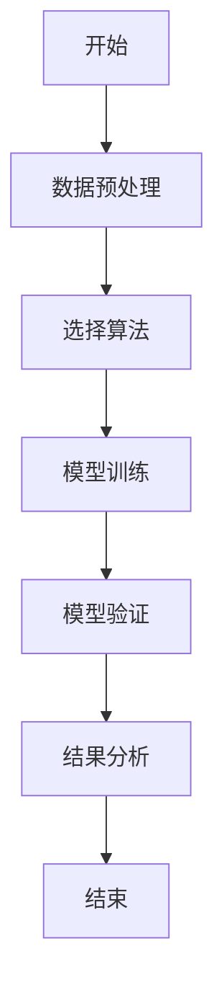

                 


# 新兴市场股市估值与智能制造柔性生产线的互动

## 关键词：新兴市场，股市估值，智能制造，柔性生产线，互动关系

## 摘要：本文探讨了新兴市场股市估值与智能制造柔性生产线之间的互动关系，分析了股市估值方法与智能制造生产线结构，构建了两者互动的数学模型，并通过系统架构设计和实战案例，展示了如何利用股市数据优化智能制造生产布局，实现企业价值最大化。

---

# 第一部分: 背景介绍与核心概念

## 第1章: 新兴市场股市估值与智能制造柔性生产线的背景与互动关系

### 1.1 背景介绍

#### 1.1.1 新兴市场的定义与特点
新兴市场是指那些经济增长迅速、工业化程度较高、但人均收入相对较低的国家和地区，如中国、印度、东南亚国家等。这些市场的特点是经济结构多元化、产业升级速度快，且受全球贸易和投资的影响较大。

#### 1.1.2 智能制造柔性生产线的定义与特点
智能制造柔性生产线是一种能够根据市场需求快速调整生产节奏和产品种类的生产线，具有高度的自动化、智能化和灵活性。其特点包括模块化设计、智能控制、快速响应和高效资源利用。

#### 1.1.3 股市估值与智能制造的互动关系
股市估值反映了市场对企业的价值预期，而智能制造柔性生产线的投入和产出直接影响企业的盈利能力和成长性，两者之间存在双向互动关系。

### 1.2 核心概念与联系

#### 1.2.1 股市估值的核心要素
- 市盈率（P/E）：衡量股票价格与每股收益的比例。
- 市净率（P/B）：衡量股票价格与每股净资产的比例。
- 现金流折现法：通过未来现金流的现值来评估企业价值。

#### 1.2.2 柔性生产线的核心要素
- 模块化设计：生产线由多个独立模块组成，便于灵活调整。
- 智能化控制：通过物联网和自动化技术实现生产过程的实时监控和优化。
- 柔性化优势：能够快速适应市场需求变化，减少库存浪费。

#### 1.2.3 股市估值与智能制造的互动机制
- 股市波动影响智能制造企业的投资决策。
- 智能制造的效率提升影响企业的盈利能力和股市估值。
- 柔性生产线的投入需要股市融资支持，反过来又会影响股市的资金流动。

---

## 第2章: 股市估值方法与智能制造柔性生产线的结构

### 2.1 股市估值方法

#### 2.1.1 市盈率法
市盈率法通过比较股票的市场价格与每股收益的比率，评估股票的估值是否合理。公式为：
$$ P/E = \frac{\text{股票价格}}{\text{每股收益}} $$

#### 2.1.2 市净率法
市净率法通过比较股票价格与每股净资产的比率，评估股票的估值是否合理。公式为：
$$ P/B = \frac{\text{股票价格}}{\text{每股净资产}} $$

#### 2.1.3 现金流折现法
现金流折现法通过将企业未来现金流折现，计算其当前价值。公式为：
$$ V = \sum_{t=1}^{n} \frac{\text{现金流}}{(1+r)^t} $$

### 2.2 柔性生产线的结构

#### 2.2.1 生产线的模块化设计
模块化设计将生产线分解为多个独立模块，每个模块负责不同的生产环节，便于灵活调整生产流程。

#### 2.2.2 生产线的智能化控制
智能化控制通过物联网、传感器和自动化技术实现生产过程的实时监控和优化，减少人工干预。

#### 2.2.3 生产线的柔性化优势
柔性化优势体现在快速适应市场需求变化、减少库存浪费和提高生产效率。

---

## 第3章: 股市估值与智能制造的互动机制

### 3.1 股市波动对智能制造投资的影响

#### 3.1.1 股市波动的定义
股市波动是指股票价格在短时间内出现剧烈波动，通常由市场情绪、经济数据和政策变化等因素引起。

#### 3.1.2 股市波动对智能制造企业的投资影响
股市波动会影响投资者对智能制造企业的信心，进而影响企业的融资能力和投资决策。

#### 3.1.3 股市波动对生产线布局的调整
股市波动可能导致企业调整生产线布局，优化资源配置，降低生产成本。

### 3.2 智能制造对股市估值的影响

#### 3.2.1 智能制造对企业盈利能力的影响
智能制造通过提高生产效率和降低生产成本，增强企业的盈利能力，进而提升股市估值。

#### 3.2.2 智能制造对企业成长性的提升
智能制造能够快速响应市场需求，推动企业技术创新和产品升级，增强企业的成长性，进而提升股市估值。

#### 3.2.3 智能制造对股市整体结构的优化
智能制造的普及和推广有助于优化股市整体结构，提高市场的流动性和稳定性。

---

# 第二部分: 核心概念与联系分析

## 第4章: 股市估值与智能制造的互动模型

### 4.1 股市估值与智能制造的互动关系图


### 4.2 股市估值与智能制造的互动机制

#### 4.2.1 回归分析模型
回归分析模型用于分析股市估值与智能制造投资之间的关系。公式为：
$$ y = \beta_0 + \beta_1x + \epsilon $$

#### 4.2.2 时间序列分析模型
时间序列分析模型用于分析股市波动对智能制造投资的影响。公式为：
$$ ARIMA(p, d, q) $$

---

## 第5章: 互动机制的数学模型与公式

### 5.1 股市估值与智能制造的互动关系模型

#### 5.1.1 回归分析公式
$$ y = \beta_0 + \beta_1x + \epsilon $$

#### 5.1.2 时间序列分析公式
$$ ARIMA(p, d, q) $$

### 5.2 数学公式与详细讲解

#### 5.2.1 回归分析公式
$$ y = \beta_0 + \beta_1x + \epsilon $$
其中，$y$ 是股市估值，$x$ 是智能制造投资，$\beta_0$ 和 $\beta_1$ 是回归系数，$\epsilon$ 是误差项。

#### 5.2.2 时间序列分析公式
$$ ARIMA(p, d, q) $$
其中，$p$ 是自回归阶数，$d$ 是差分阶数，$q$ 是移动平均阶数。

---

## 第6章: 算法原理与流程图

### 6.1 算法原理

#### 6.1.1 回归分析算法
回归分析算法通过最小二乘法估计回归系数，建立变量之间的线性关系模型。

#### 6.1.2 时间序列分析算法
时间序列分析算法通过分解时间序列数据，提取趋势、周期性和随机成分，建立预测模型。

### 6.2 Mermaid流程图



---

# 第三部分: 系统分析与架构设计

## 第7章: 系统分析与架构设计方案

### 7.1 问题场景介绍

#### 7.1.1 股市估值与智能制造的互动分析
通过分析股市数据和智能制造企业的生产数据，建立互动模型，优化生产布局。

#### 7.1.2 系统需求分析
系统需要实现数据采集、分析、预测和优化功能，支持企业实时调整生产策略。

#### 7.1.3 系统目标与范围
系统目标是通过股市估值优化智能制造生产线布局，提高企业利润和市场竞争力。

### 7.2 系统功能设计

#### 7.2.1 数据采集模块
负责采集股市数据和智能制造生产数据。

#### 7.2.2 数据分析模块
负责对数据进行清洗、转换和分析，建立互动模型。

#### 7.2.3 预测模块
基于互动模型，预测股市估值和智能制造投资的影响。

#### 7.2.4 优化模块
根据预测结果，优化智能制造生产线布局。

### 7.3 系统架构设计


---

## 第8章: 项目实战

### 8.1 环境安装

#### 8.1.1 数据库安装
安装MySQL或其他关系型数据库，用于存储股市数据和生产数据。

#### 8.1.2 开发工具安装
安装Python和相关数据分析库（如Pandas、NumPy、Scikit-learn）。

### 8.2 系统核心实现源代码

#### 8.2.1 数据采集代码
```python
import pandas as pd
import requests

url = "https://api.example.com/stock_data"
response = requests.get(url)
data = response.json()
df = pd.DataFrame(data)
```

#### 8.2.2 数据分析代码
```python
from sklearn.linear_model import LinearRegression
import numpy as np

model = LinearRegression()
X = df[['智能制造投资']]
y = df['股市估值']
model.fit(X, y)
```

#### 8.2.3 预测代码
```python
predicted_valuation = model.predict(new_investment_values)
```

### 8.3 代码应用解读与分析

#### 8.3.1 数据采集模块
通过API接口获取股市数据和智能制造投资数据，存储在数据库中。

#### 8.3.2 数据分析模块
使用回归分析模型分析数据，建立股市估值与智能制造投资之间的关系。

#### 8.3.3 预测模块
基于模型预测未来的股市估值和智能制造投资，优化生产布局。

### 8.4 实际案例分析和详细讲解剖析

#### 8.4.1 案例分析
以印度市场为例，分析股市估值与智能制造投资的互动关系。

#### 8.4.2 结果分析
通过模型预测，优化智能制造生产线布局，提高企业利润。

### 8.5 项目小结

#### 8.5.1 项目总结
通过系统的分析和优化，实现了股市估值与智能制造投资的互动关系，提高了企业的市场竞争力。

#### 8.5.2 经验总结
数据采集和模型选择是项目成功的关键，同时需要根据实际情况不断调整模型参数。

---

## 第四部分: 最佳实践 tips、小结、注意事项、拓展阅读

### 9.1 最佳实践 tips

- 数据采集：确保数据的准确性和完整性。
- 模型选择：根据实际情况选择合适的分析模型。
- 模型优化：定期更新模型，提高预测精度。

### 9.2 小结

本文通过分析股市估值与智能制造投资的互动关系，构建了数学模型，并通过系统设计和实战案例，展示了如何利用股市数据优化智能制造生产布局，实现企业价值最大化。

### 9.3 注意事项

- 数据隐私：注意保护数据隐私，遵守相关法律法规。
- 模型局限性：模型预测结果仅供参考，需结合实际情况进行调整。

### 9.4 拓展阅读

- 《股票技术分析》
- 《智能制造技术与应用》
- 《大数据分析与挖掘》

---

## 作者：AI天才研究院/AI Genius Institute & 禅与计算机程序设计艺术/Zen And The Art of Computer Programming

