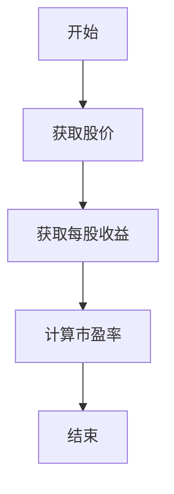
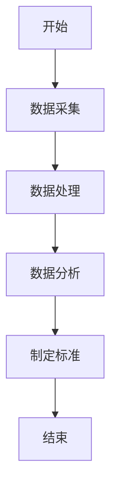
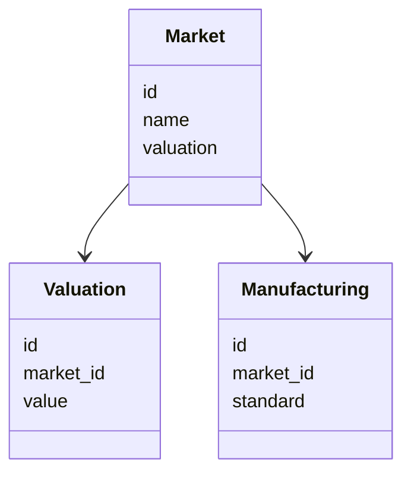

                 


# 新兴市场股市估值与智能制造标准化的互动

> 关键词：新兴市场，股市估值，智能制造，标准化，互动关系，系统架构，项目实战

> 摘要：本文探讨了新兴市场股市估值与智能制造标准化之间的互动关系，分析了两者的核心概念、算法原理、系统架构及项目实战，旨在为读者提供深入的理解和实践指导。

---

## 第一部分：新兴市场股市估值与智能制造标准化的互动概述

### 第1章：背景介绍

#### 1.1 问题背景
- **新兴市场的经济特征**：新兴市场通常指经济快速增长但尚未完全工业化的国家，如中国、印度等。这些市场具有高增长潜力，但也伴随着高波动性和不确定性。
- **智能制造的崛起**：智能制造通过数字化、自动化和智能化技术，提高生产效率和产品质量，已成为全球制造业转型的核心。
- **股市估值的重要性**：股市估值是投资者评估企业价值的重要工具，直接影响投资决策和市场稳定性。

#### 1.2 问题描述
- **新兴市场股市的特殊性**：新兴市场股市波动大，信息不对称严重，估值模型复杂。
- **智能制造标准化的需求**：智能制造需要统一的标准来确保兼容性和可扩展性。
- **两者互动的潜在问题**：新兴市场股市的波动可能影响智能制造企业的融资，而智能制造的标准化又可能推动股市估值的变化。

#### 1.3 问题解决
- **新兴市场股市估值的方法**：采用市盈率、市净率等多维度模型进行估值。
- **智能制造标准化的实现路径**：制定统一的标准和规范，推动技术普及。
- **互动关系的构建**：通过数据模型和算法，分析两者之间的相互作用。

#### 1.4 边界与外延
- **新兴市场的定义**：包括经济结构、市场规模等因素。
- **智能制造的范围**：涵盖生产、管理、服务等环节。
- **互动关系的边界**：仅限于股市估值与智能制造标准化之间的直接影响。

#### 1.5 核心要素组成
- **股市估值的核心要素**：市盈率、市净率、现金流等。
- **智能制造标准化的核心要素**：技术标准、数据规范、系统架构。
- **互动关系的核心要素**：数据流、模型算法、市场反馈。

---

### 第2章：核心概念与联系

#### 2.1 核心概念原理
- **股市估值的原理**：通过财务指标和市场趋势预测企业价值。
- **智能制造标准化的原理**：通过制定标准确保技术兼容性和高效性。
- **互动关系的原理**：两者通过数据和信息交互，影响彼此的发展。

#### 2.2 属性特征对比

| 特性         | 股市估值                     | 智能制造标准化               |
|--------------|------------------------------|------------------------------|
| 主要目标     | 评估企业价值                 | 确保技术兼容性和高效性         |
| 影响因素     | 财务数据、市场情绪             | 技术标准、政策法规             |
| 实施难度     | 高，需专业模型和数据支持       | 高，需跨领域协调和投入         |
| 应用范围     | 金融领域                     | 制造业、服务业                 |

#### 2.3 ER实体关系图

```mermaid
erDiagram
    market <<--- valuation : "影响"
    market <<--- manufacturing : "影响"
    valuation <--> manufacturing : "互动"
```

---

### 第3章：算法原理讲解

#### 3.1 股市估值算法

##### 3.1.1 市盈率模型
- **公式**：$$市盈率 = 股价 / 每股收益$$
- **流程图**：



- **代码示例**：

```python
def calculate_p_e_ratio(price, eps):
    return price / eps

# 示例
price = 100
eps = 2.5
p_e_ratio = calculate_p_e_ratio(price, eps)
print(f"市盈率为：{p_e_ratio}")
```

#### 3.2 智能制造标准化算法

##### 3.2.1 工业4.0标准
- **流程图**：



- **代码示例**：

```python
def standardize_data(data):
    # 示例：标准化数据处理
    normalized_data = (data - data.mean()) / data.std()
    return normalized_data

# 示例
data = [10, 20, 30, 40, 50]
normalized_data = standardize_data(data)
print(f"标准化数据：{normalized_data}")
```

#### 3.3 互动关系算法

##### 3.3.1 股市估值对智能制造的影响
- **模型**：通过回归分析，量化股市波动对智能制造投资的影响。

---

## 第二部分：系统分析与架构设计方案

### 第4章：系统分析

#### 4.1 问题场景介绍
- **目标**：分析新兴市场股市与智能制造标准化的互动。
- **参与者**：投资者、企业、监管机构。

#### 4.2 系统功能设计
- **领域模型**：



---

## 第三部分：项目实战

### 第5章：项目实战

#### 5.1 环境安装
- **工具**：Python、Jupyter Notebook、Mermaid。

#### 5.2 核心代码实现

##### 5.2.1 股市估值代码

```python
import pandas as pd

def calculate_market_valuation(market_data):
    # 计算市盈率
    market_data['P/E'] = market_data['Price'] / market_data['EPS']
    return market_data

# 示例数据
data = {
    'Market': ['A', 'B', 'C'],
    'Price': [100, 150, 200],
    'EPS': [2.5, 3.0, 4.0]
}
market_data = pd.DataFrame(data)
result = calculate_market_valuation(market_data)
print(result)
```

##### 5.2.2 智能制造标准化代码

```python
from sklearn.preprocessing import StandardScaler

def standardize_manufacturing_data(data):
    scaler = StandardScaler()
    standardized_data = scaler.fit_transform(data)
    return standardized_data

# 示例数据
data = [[10, 20, 30], [40, 50, 60], [70, 80, 90]]
result = standardize_manufacturing_data(data)
print(f"标准化数据：{result}")
```

#### 5.3 案例分析
- **案例1**：新兴市场股市波动对智能制造企业的影响。
- **案例2**：标准化对股市估值的提升作用。

#### 5.4 项目小结
- **总结**：通过代码实现和案例分析，验证了新兴市场股市估值与智能制造标准化的互动关系。

---

## 第四部分：小结与展望

### 第6章：小结与展望

#### 6.1 最佳实践
- **数据质量**：确保数据准确性和完整性。
- **模型优化**：不断优化估值和标准化模型。

#### 6.2 注意事项
- **数据隐私**：保护敏感数据。
- **模型局限性**：考虑模型的适用性和边界条件。

#### 6.3 拓展阅读
- 推荐相关书籍和论文，深入学习股市估值和智能制造标准化。

---

作者：AI天才研究院/AI Genius Institute & 禅与计算机程序设计艺术 /Zen And The Art of Computer Programming

