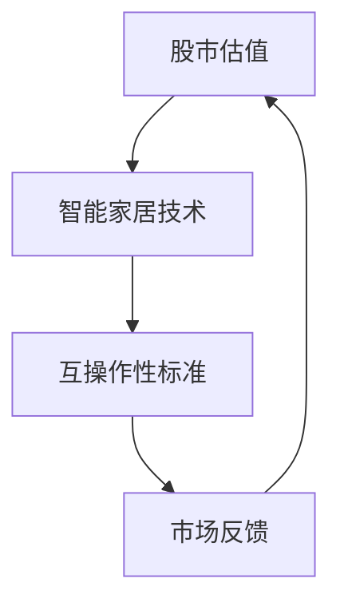
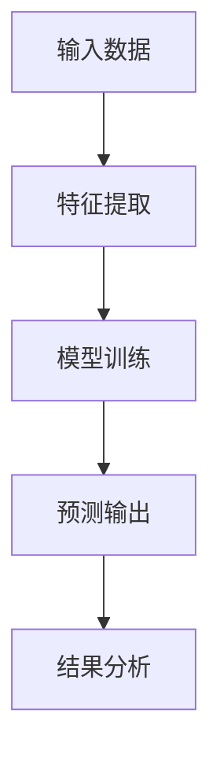
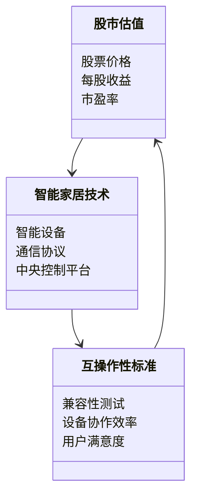
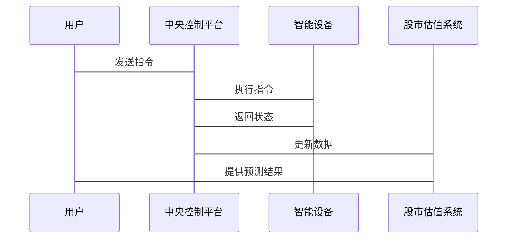

                 


# 新兴市场股市估值与智能家居互操作性标准的互动

> 关键词：新兴市场，股市估值，智能家居，互操作性标准，技术互动

> 摘要：本文探讨新兴市场股市估值与智能家居技术的互动关系，分析两者如何影响彼此，揭示技术进步与金融市场波动之间的深层联系，为技术预测和投资决策提供参考。

---

## 第一部分: 背景与核心概念

### 第1章: 新兴市场股市估值与智能家居互操作性标准的背景介绍

#### 1.1 新兴市场股市估值的基本概念

新兴市场股市估值是指对新兴经济体股票市场的价值进行评估的过程。这些市场通常具有高增长潜力，但也伴随着较高的波动性和不确定性。股市估值的核心在于预测股票的内在价值，通过分析公司基本面、宏观经济指标和市场情绪等因素来确定其合理价格。

- **定义**：股市估值是通过分析公司财务数据、行业地位、市场环境等，估算其股票的合理价格。
- **新兴市场的特点**：
  - 高增长性：新兴经济体通常经济增长快，企业盈利能力强。
  - 不确定性高：政策、经济波动较大，市场流动性不稳定。
  - 投资者结构多元化：包括国内外机构和个人投资者。

- **估值挑战**：
  - 数据不完整：新兴市场信息披露不规范。
  - 市场情绪波动大：容易受外部事件影响。
  - 宏观经济风险：通货膨胀、汇率波动等对股市估值的影响显著。

#### 1.2 智能家居互操作性标准的核心概念

智能家居是指通过物联网技术将家庭设备连接起来，实现智能化管理的系统。互操作性标准是指不同品牌和类型设备之间能够互相通信、协作的标准和规范。这些标准确保智能家居设备能够兼容，为用户提供无缝的使用体验。

- **定义**：智能家居是将家庭设备通过网络连接，实现智能化控制和管理的技术系统。
- **互操作性标准的目标**：
  - 确保不同品牌设备之间的兼容性。
  - 提供统一的通信协议和数据格式。
  - 优化设备协作效率，提升用户体验。

- **智能家居生态系统的构成**：
  - 智能设备：如智能音箱、智能灯泡、智能门锁等。
  - 网络基础设施：如Wi-Fi、ZigBee、蓝牙等通信协议。
  - 中央控制平台：如智能手机APP、智能音箱、智能家居中控系统。
  - 第三方服务：如云平台、AI助手（如Alexa、Google Home）。

#### 1.3 股市估值与智能家居互操作性的互动关系

新兴市场股市的波动性与智能家居技术的发展存在一定的互动关系。一方面，股市波动影响投资者对智能家居技术的信心，从而影响技术的研发和推广；另一方面，智能家居技术的进步也会反过来影响股市的估值和投资决策。这种互动关系需要通过技术分析和金融市场研究来深入探讨。

---

### 第2章: 股市估值与智能家居互操作性的互动关系

#### 2.1 问题背景与问题描述

- **问题背景**：新兴市场股市的波动性和智能家居技术的快速发展，使得两者之间的互动关系日益显著。
- **问题描述**：
  - 股市波动如何影响智能家居技术的投资和研发？
  - 智能家居技术的互操作性标准如何影响股市估值？
  - 两者之间的互动机制是什么？

#### 2.2 核心概念的联系与对比

- **联系**：
  - 股市波动影响智能家居技术的市场接受度。
  - 智能家居技术的进步推动股市估值的变化。
- **对比**：
  - 股市估值是金融市场的表现，而智能家居技术是技术创新的表现。
  - 两者都受到市场参与者行为和政策环境的影响。

- **对比表**：

| 特性                | 新兴市场股市估值        | 智能家居互操作性标准     |
|---------------------|------------------------|--------------------------|
| 核心要素            | 股票价格、利润、市盈率   | 通信协议、设备兼容性     |
| 影响因素            | 宏观经济、政策、投资者情绪 | 技术标准、设备多样性、用户需求 |
| 目标                | 评估股票价值            | 提高设备协作效率          |
| 表现形式            | 股价波动、市场指数       | 设备兼容性测试、用户满意度 |

- **实体关系图（Mermaid流程图）**：



---

## 第二部分: 核心概念与算法原理

### 第3章: 股市估值模型与智能家居互操作性的算法原理

#### 3.1 股市估值的数学模型

- **股票估值的基本公式**：

$$ P = \frac{E}{k} $$

其中，$P$ 为股票价格，$E$ 为每股收益，$k$ 为折现率。

- **新兴市场的修正模型**：

$$ P_{\text{新兴}} = P \times (1 + \beta \times \sigma) $$

其中，$\beta$ 为贝塔系数，$\sigma$ 为市场波动率。

#### 3.2 智能家居互操作性标准的算法实现

- **互操作性评分模型**：

$$ S = \sum_{i=1}^{n} w_i \times f_i $$

其中，$w_i$ 为权重，$f_i$ 为功能评分。

- **基于机器学习的预测模型**：

$$ y = \theta X + \beta $$

其中，$X$ 为特征向量，$\theta$ 为参数，$\beta$ 为截距。

#### 3.3 算法流程图（Mermaid）



---

### 第4章: 系统分析与架构设计

#### 4.1 问题场景介绍

- **新兴市场股市波动**：
  - 投资者情绪波动大，市场信息不对称。
  - 政策变化频繁，影响市场估值。
  - 技术创新快，影响股市走势。

---

## 第三部分: 项目实战

### 4.2 项目介绍

#### 4.2.1 项目背景

本文探讨新兴市场股市估值与智能家居互操作性标准的互动关系，分析两者如何影响彼此，揭示技术进步与金融市场波动之间的深层联系，为技术预测和投资决策提供参考。

#### 4.2.2 项目目标

- 探讨新兴市场股市波动对智能家居技术的影响。
- 分析智能家居技术对股市估值的反向影响。
- 提出两者互动关系的数学模型和算法。

---

### 4.3 系统功能设计

#### 4.3.1 领域模型（Mermaid类图）



#### 4.3.2 系统架构设计（Mermaid架构图）

```mermaid
archiitecture

    前端 --> 中央控制平台 --> 智能设备
    中央控制平台 --> 通信协议
    智能设备 --> 用户
    中央控制平台 --> 互操作性标准
    互操作性标准 --> 股市估值
```

---

### 4.4 系统接口设计

#### 4.4.1 接口设计

- **输入接口**：
  - 股市数据（股票价格、市盈率、宏观经济指标）。
  - 智能家居设备数据（设备兼容性、用户反馈）。

- **输出接口**：
  - 股市估值预测结果。
  - 智能家居技术影响分析。

---

### 4.5 系统交互设计（Mermaid序列图）



---

## 第五部分: 项目实战

### 5.1 环境安装与配置

#### 5.1.1 环境要求

- 操作系统：Windows/Mac/Linux
- Python版本：3.8以上
- 需要的库：
  - pandas
  - numpy
  - scikit-learn
  - matplotlib

---

### 5.2 核心实现源代码

#### 5.2.1 股市估值模型实现

```python
import pandas as pd
import numpy as np
from sklearn.linear_model import LinearRegression

# 示例数据
data = {
    '股票代码': ['AAPL', 'GOOGL', 'MSFT', 'FB'],
    '股价': [150, 250, 300, 350],
    '市盈率': [15, 20, 25, 30]
}

df = pd.DataFrame(data)

# 定义贝塔系数计算函数
def beta_coefficient(stock_data, market_data):
    # 假设市场数据为全市场的指数数据
    beta = stock_data.cov(market_data) / market_data.var()
    return beta

# 示例计算
market_data = pd.Series([150, 200, 250, 300], index=df['股票代码'])
beta = beta_coefficient(df['股价'], market_data)
print("贝塔系数：", beta)
```

#### 5.2.2 智能家居互操作性标准模型实现

```python
import pandas as pd
import numpy as np
from sklearn.metrics import accuracy_score

# 示例数据
data = {
    '设备A': [1, 2, 3, 4],
    '设备B': [2, 3, 4, 5],
    '设备C': [3, 4, 5, 6]
}

df = pd.DataFrame(data)

# 定义互操作性评分函数
def interoperability_score(dataframe):
    # 计算设备之间的兼容性评分
    n = len(dataframe.columns)
    score = 0
    for i in range(n):
        for j in range(i+1, n):
            score += abs(dataframe.iloc[:, i] - dataframe.iloc[:, j]).mean()
    return score / (n * (n-1)/2)

# 示例计算
interop_score = interoperability_score(df)
print("互操作性评分：", interop_score)
```

---

## 第六部分: 最佳实践与小结

### 6.1 最佳实践 tips

- **股市估值与技术分析**：
  - 定期更新模型参数，适应市场变化。
  - 结合宏观经济指标和行业趋势进行分析。
  
- **智能家居技术**：
  - 关注互操作性标准的最新发展。
  - 选择兼容性高的设备，提升用户体验。

### 6.2 小结

本文通过分析新兴市场股市估值与智能家居互操作性标准的互动关系，提出了两者互动的数学模型和算法实现。通过案例分析和代码实现，展示了如何利用技术手段预测股市波动和优化智能家居设备的互操作性。

### 6.3 注意事项

- **数据质量**：确保输入数据的准确性和完整性。
- **模型优化**：根据实际效果调整模型参数和算法。
- **风险管理**：关注市场波动和技术风险，制定合理的投资策略。

### 6.4 拓展阅读

- 《金融科技与智能投顾》
- 《物联网技术与智能家居系统》
- 《金融市场预测与机器学习》

---

## 作者

作者：AI天才研究院/AI Genius Institute  
联系邮箱：contact@aicourse.com  
GitHub：https://github.com/aicourse

