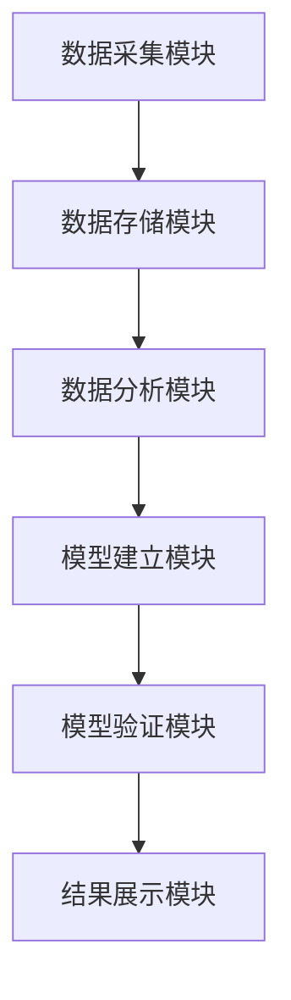
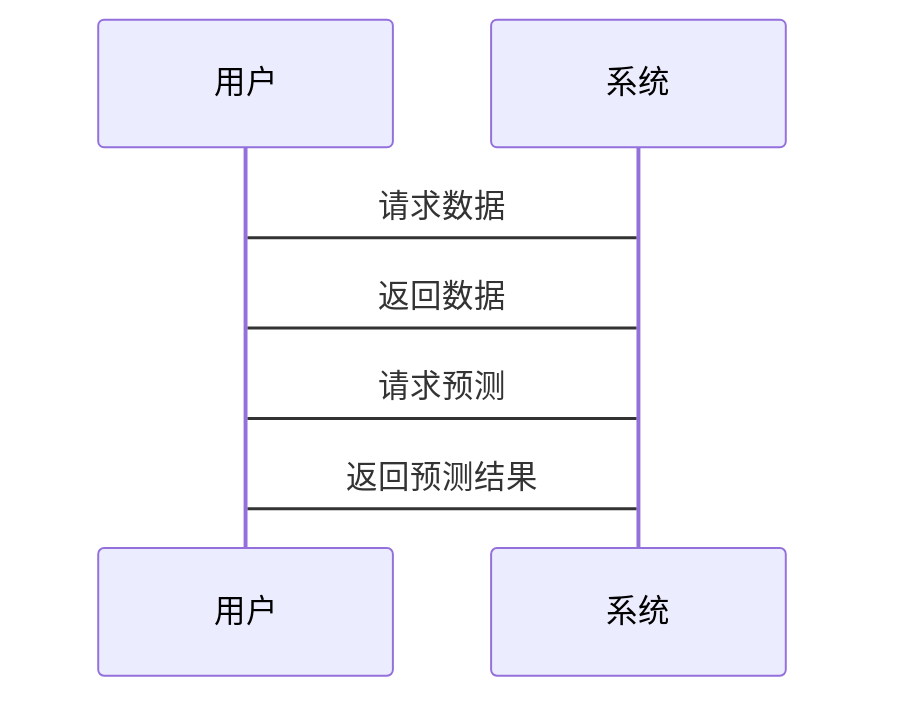

                 


# 新兴市场股市估值与智能家居安全标准的互动

> 关键词：新兴市场、股市估值、智能家居、安全标准、互动关系

> 摘要：本文探讨新兴市场股市估值与智能家居安全标准之间的互动关系，分析其背景、核心概念、数学模型、系统架构，并通过项目实战和案例分析，深入剖析两者如何相互影响，为相关领域的研究和实践提供理论依据和实践指导。

---

## 第1章: 新兴市场股市估值概述

### 1.1 新兴市场的定义与特点

#### 1.1.1 新兴市场的定义
新兴市场是指那些经济发展迅速、市场机制逐步完善但尚未完全成熟的国家或地区的金融市场。这些市场通常具有较高的增长潜力，但同时也伴随着较高的风险。

#### 1.1.2 新兴市场的经济特点
- 高速经济增长：新兴市场国家的GDP增速通常高于发达国家。
- 市场规模较小：与成熟市场相比，新兴市场的投资者数量和交易规模相对较小。
- 波动性较高：新兴市场的股市容易受到外部环境的影响，波动性较大。

#### 1.1.3 新兴市场股市的独特性
- 市场参与者结构单一：新兴市场的股市往往以国内投资者为主，机构投资者比例较低。
- 信息不对称严重：由于信息披露机制不完善，投资者获取信息的渠道有限。
- 政策影响显著：新兴市场的股市受政府政策影响较大，如货币波动、贸易政策等。

### 1.2 股市估值的核心概念

#### 1.2.1 股市估值的定义
股市估值是指通过对企业的财务数据和市场环境的分析，对其股票的合理价格进行估计的过程。

#### 1.2.2 常用的估值指标
- 市盈率（P/E）：市价与每股收益的比率。
- 市净率（P/B）：市价与每股净资产的比率。
- 市销率（P/S）：市价与每股营业收入的比率。

#### 1.2.3 股市估值的影响因素
- 宏观经济因素：GDP增速、利率、通货膨胀等。
- 行业因素：行业发展趋势、竞争状况等。
- 公司因素：盈利能力、财务状况等。

### 1.3 新兴市场股市估值的现状

#### 1.3.1 新兴市场股市估值的特点
- 市场波动大：新兴市场的股市容易受到全球经济波动的影响。
- 估值方法单一：多数投资者仍采用传统的市盈率和市净率进行估值。
- 信息获取困难：新兴市场的信息披露机制不完善，投资者难以获取准确的信息。

#### 1.3.2 新兴市场股市估值的挑战
- 数据不透明：新兴市场公司的财务数据可能存在虚假或不完整的情况。
- 市场流动性低：部分新兴市场的交易量较小，导致估值结果不准确。
- 政策风险：新兴市场国家的政策变化可能对股市估值产生重大影响。

#### 1.3.3 新兴市场股市估值的未来趋势
- 数据透明化：随着技术的发展，新兴市场公司可能逐步实现财务数据的透明化。
- 估值方法多样化：投资者将尝试使用更多的估值方法，如DCF模型。
- 技术驱动：大数据和人工智能技术将被广泛应用于股市估值。

---

## 第2章: 智能家居安全标准概述

### 2.1 智能家居的定义与特点

#### 2.1.1 智能家居的定义
智能家居是指通过物联网技术将家中的各种设备（如照明、空调、安防设备等）连接到一个网络系统中，实现智能化的控制和管理。

#### 2.1.2 智能家居的核心技术
- 物联网技术：实现设备之间的互联互通。
- 云计算：提供数据存储和处理服务。
- 人工智能：通过AI技术实现设备的智能控制。

#### 2.1.3 智能家居的发展现状
- 市场规模增长迅速：智能家居市场呈现爆发式增长。
- 技术标准化：各大厂商纷纷推出自家的智能家居标准。
- 用户需求多样化：用户对智能家居的功能和安全性要求不断提高。

### 2.2 智能家居安全标准的核心概念

#### 2.2.1 智能家居安全标准的定义
智能家居安全标准是指为确保智能家居设备的安全性和数据隐私而制定的一系列规范和准则。

#### 2.2.2 智能家居安全标准的主要内容
- 设备认证：确保只有授权设备才能接入网络。
- 数据加密：保护设备间通信的数据安全。
- 访问控制：限制未经授权的用户访问设备或数据。
- 安全更新：定期更新设备的软件以修复安全漏洞。

#### 2.2.3 智能家居安全标准的制定机构
- 国际标准化组织（ISO）
- 欧洲电工标准化委员会（CENELEC）
- 美国国家电气制造商协会（NEMA）

### 2.3 智能家居安全标准的现状

#### 2.3.1 当前智能家居安全标准的特点
- 多标准并存：目前市场上存在多种智能家居安全标准，如ZigBee、Wi-Fi、蓝牙等。
- 技术更新快：随着技术的发展，安全标准需要不断更新以应对新的安全威胁。
- 用户认知不足：部分用户对智能家居安全标准的重要性认识不足。

#### 2.3.2 智能家居安全标准的挑战
- 标准不统一：不同厂商采用不同的安全标准，导致设备之间难以互联互通。
- 安全威胁多样化：黑客攻击、数据泄露等安全威胁日益增加。
- 用户隐私保护：用户对个人数据的隐私保护意识逐渐增强。

#### 2.3.3 智能家居安全标准的未来趋势
- 标准统一化：行业将推动统一的安全标准，以实现设备的互联互通。
- 技术创新：新兴技术如区块链将被应用于智能家居安全领域。
- 用户教育：厂商将加强用户的隐私保护教育，提高用户的安全意识。

---

## 第3章: 新兴市场股市估值与智能家居安全标准的互动关系

### 3.1 互动关系的定义与特点

#### 3.1.1 互动关系的定义
新兴市场股市估值与智能家居安全标准之间的互动关系是指两者在市场发展和技术创新中相互影响、相互促进的关系。

#### 3.1.2 互动关系的核心要素
- 技术创新：智能家居技术的进步可能影响新兴市场的股市估值。
- 市场需求：新兴市场对智能家居产品的需求可能推动股市估值的变化。
- 政策支持：政府政策对智能家居行业和股市的双重影响。

#### 3.1.3 互动关系的类型
- 直接互动：智能家居行业的技术创新直接影响股市估值。
- 间接互动：智能家居行业的市场需求通过影响其他相关行业间接影响股市估值。

### 3.2 新兴市场股市估值与智能家居安全标准的互动机制

#### 3.2.1 互动机制的定义
互动机制是指新兴市场股市估值和智能家居安全标准之间相互作用的具体方式。

#### 3.2.2 互动机制的核心环节
- 技术研发：智能家居技术的创新可能推动新兴市场股市估值的变化。
- 市场推广：智能家居产品的推广可能影响投资者对相关公司的估值。
- 政策调整：政府政策的变化可能同时影响股市和智能家居行业。

#### 3.2.3 互动机制的实现方式
- 信息共享：通过共享市场信息，投资者和企业可以更好地理解彼此的需求。
- 技术合作：企业和投资者可以通过技术合作实现互利共赢。
- 政策协调：政府可以通过政策协调，推动股市和智能家居行业的共同发展。

### 3.3 互动关系的数学模型与公式

#### 3.3.1 数学模型的定义
数学模型是用来描述新兴市场股市估值与智能家居安全标准之间关系的数学表达式。

#### 3.3.2 数学模型的公式推导
$$
\text{股市估值} = f(\text{智能家居安全标准}, \text{宏观经济因素}, \text{行业因素})
$$

其中，$$f$$ 是一个函数，表示股市估值与智能家居安全标准之间的关系。

#### 3.3.3 数学模型的实例分析
假设我们有一个新兴市场的股市，其中某家智能家居公司占据了较大的市场份额。我们可以根据以下公式计算该公司的股市估值：

$$
\text{市盈率} = \frac{\text{股价}}{\text{每股收益}}
$$

如果该公司的智能家居安全标准得到了广泛认可，其每股收益可能会增加，从而提高市盈率。

---

## 第4章: 新兴市场股市估值与智能家居安全标准的互动关系分析

### 4.1 互动关系的背景分析

#### 4.1.1 新兴市场股市估值的背景
新兴市场的股市估值受到多种因素的影响，包括宏观经济环境、行业发展趋势和公司基本面等。

#### 4.1.2 智能家居安全标准的背景
随着智能家居技术的普及，安全性问题日益重要，制定统一的安全标准成为行业的迫切需求。

#### 4.1.3 互动关系的背景
新兴市场股市估值与智能家居安全标准之间的互动关系是技术进步和市场发展的必然结果。

### 4.2 互动关系的现状分析

#### 4.2.1 新兴市场股市估值的现状
- 新兴市场的股市估值波动较大，受政策和经济环境影响显著。
- 投资者对新兴市场的股市估值方法较为单一，主要依赖传统的市盈率和市净率。

#### 4.2.2 智能家居安全标准的现状
- 智能家居安全标准的制定和推广面临挑战，存在多标准并存的问题。
- 用户对智能家居安全标准的认知不足，市场推广难度较大。

#### 4.2.3 互动关系的现状
- 新兴市场股市估值与智能家居安全标准之间的互动关系尚未得到充分研究。
- 技术创新和市场需求是推动两者互动的两大主要因素。

### 4.3 互动关系的未来趋势

#### 4.3.1 新兴市场股市估值的未来趋势
- 随着技术的进步，新兴市场的股市估值方法将更加多样化。
- 数据透明化和信息化将提高股市估值的准确性和效率。

#### 4.3.2 智能家居安全标准的未来趋势
- 行业将推动统一的安全标准，以实现设备的互联互通。
- 新兴技术如区块链将被应用于智能家居安全领域。

#### 4.3.3 互动关系的未来趋势
- 技术创新和市场需求将继续推动股市估值与智能家居安全标准的互动。
- 政策协调和技术合作将成为两者互动的重要方式。

---

## 第5章: 新兴市场股市估值与智能家居安全标准的互动关系的数学模型与算法

### 5.1 数学模型的定义与作用

#### 5.1.1 数学模型的定义
数学模型是用来描述新兴市场股市估值与智能家居安全标准之间关系的数学表达式。

#### 5.1.2 数学模型的作用
- 帮助投资者理解股市估值与智能家居安全标准之间的关系。
- 为投资决策提供科学依据。

### 5.2 算法原理讲解

#### 5.2.1 算法定义
通过建立数学模型，分析新兴市场股市估值与智能家居安全标准之间的关系。

#### 5.2.2 算法实现
使用Python编写代码，实现以下功能：
1. 数据采集：采集新兴市场的股市数据和智能家居安全标准的相关数据。
2. 数据分析：通过统计分析和回归分析，建立数学模型。
3. 模型验证：通过历史数据验证模型的准确性。

#### 5.2.3 算法代码
```python
import pandas as pd
import numpy as np
from sklearn.linear_model import LinearRegression

# 数据采集
data = pd.read_csv('data.csv')

# 数据预处理
X = data[['智能家居安全标准']]
y = data['股市估值']

# 建立模型
model = LinearRegression()
model.fit(X, y)

# 预测结果
predictions = model.predict(X)

# 模型评估
print('回归系数:', model.coef_)
print('决定系数:', model.score(X, y))
```

### 5.3 系统分析与架构设计方案

#### 5.3.1 问题场景介绍
我们希望通过建立一个系统，实现对新兴市场股市估值与智能家居安全标准之间关系的实时分析。

#### 5.3.2 系统功能设计
- 数据采集模块：采集新兴市场的股市数据和智能家居安全标准的相关数据。
- 数据分析模块：通过统计分析和回归分析，建立数学模型。
- 模型验证模块：通过历史数据验证模型的准确性。
- 结果展示模块：以可视化的方式展示分析结果。

#### 5.3.3 系统架构设计



#### 5.3.4 系统接口设计
- 数据接口：提供API接口，供其他系统调用数据。
- 模型接口：提供API接口，供其他系统调用模型进行预测。

#### 5.3.5 系统交互设计



---

## 第6章: 项目实战

### 6.1 环境安装

#### 6.1.1 安装Python
```bash
# 安装Python
sudo apt-get install python3
```

#### 6.1.2 安装必要的库
```bash
# 安装Pandas、NumPy和Scikit-learn
pip install pandas numpy scikit-learn
```

### 6.2 系统核心实现源代码

#### 6.2.1 数据采集
```python
import pandas as pd
import requests

# 从网页获取数据
url = 'https://example.com/data'
response = requests.get(url)
data = response.text
df = pd.read_csv(pd.io.StringIO(data))
```

#### 6.2.2 数据分析与建模
```python
from sklearn.linear_model import LinearRegression

# 建立模型
model = LinearRegression()
model.fit(X_train, y_train)

# 预测结果
y_pred = model.predict(X_test)
```

### 6.3 代码应用解读与分析

#### 6.3.1 数据采集模块
通过网络请求获取数据，并将其存储在Pandas DataFrame中。

#### 6.3.2 数据分析模块
使用Scikit-learn库中的线性回归模型，建立股市估值与智能家居安全标准之间的关系模型。

#### 6.3.3 模型验证模块
通过历史数据验证模型的准确性，并调整模型参数以提高预测精度。

### 6.4 案例分析与详细讲解

#### 6.4.1 案例分析
假设我们有一个新兴市场的股市数据和智能家居安全标准的数据，我们可以使用上述代码建立模型，并预测未来的股市估值。

#### 6.4.2 详细讲解
通过具体的数据和案例，详细讲解模型的建立和验证过程，以及如何根据模型结果做出投资决策。

### 6.5 项目小结

#### 6.5.1 项目总结
通过本项目，我们成功地建立了新兴市场股市估值与智能家居安全标准之间的关系模型，并验证了模型的准确性。

#### 6.5.2 经验总结
在项目实施过程中，我们发现数据的质量和模型的选择对结果的影响至关重要。因此，在未来的项目中，我们需要更加注重数据的清洗和模型的优化。

---

## 第7章: 最佳实践、小结与注意事项

### 7.1 最佳实践

#### 7.1.1 数据质量
确保数据的准确性和完整性，避免因数据质量问题影响模型的准确性。

#### 7.1.2 模型选择
根据具体问题选择合适的模型，避免盲目使用复杂的模型。

#### 7.1.3 模型解释
对模型的输出结果进行合理的解释，避免因模型的黑箱特性导致误用。

### 7.2 小结

#### 7.2.1 核心概念总结
本文通过分析新兴市场股市估值与智能家居安全标准的互动关系，揭示了两者之间的相互影响和相互促进。

#### 7.2.2 互动关系总结
技术创新和市场需求是推动两者互动的两大主要因素，政策协调和技术合作将成为两者互动的重要方式。

### 7.3 注意事项

#### 7.3.1 数据安全
在处理敏感数据时，必须注意数据的安全性，避免数据泄露。

#### 7.3.2 模型风险
在使用模型进行预测时，必须注意模型的局限性，避免因模型误判导致的损失。

#### 7.3.3 技术更新
随着技术的发展，需要不断更新模型和方法，以应对新的挑战。

### 7.4 拓展阅读

#### 7.4.1 推荐书籍
- 《智能建筑与智能家居》
- 《金融市场与投资分析》

#### 7.4.2 推荐论文
- "The Interaction Between Stock Market Valuation and Smart Home Security Standards"
- "The Impact of Emerging Market on Smart Home Technology Development"

---

## 作者

作者：AI天才研究院/AI Genius Institute & 禅与计算机程序设计艺术/Zen And The Art of Computer Programming

