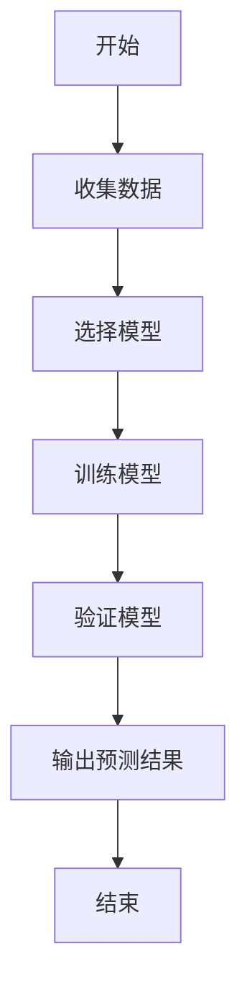
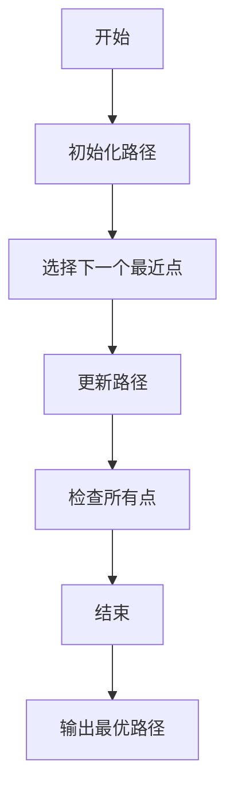
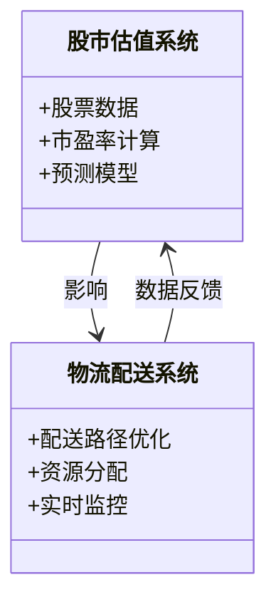

                 


# 新兴市场股市估值与智能物流Last-Mile配送的互动

> 关键词：新兴市场，股市估值，智能物流，Last-Mile配送，互动分析，技术应用

> 摘要：本文探讨新兴市场中股市估值与智能物流Last-Mile配送的互动关系，分析其核心概念、算法原理、数学模型、系统架构及实际应用，结合案例和最佳实践，总结互动的重要性与未来发展方向。

---

## 第一章：新兴市场股市估值与智能物流Last-Mile配送的背景与现状

### 1.1 新兴市场股市估值的特点
#### 1.1.1 新兴市场的定义与特点
新兴市场通常指经济快速发展但尚未完全工业化的国家，如中国、印度等。这些市场的特点是经济增长快、人口基数大、消费潜力大，但同时也面临股市波动性高、信息不对称等问题。

#### 1.1.2 新兴市场股市估值的挑战
新兴市场的股市估值受多种因素影响，包括经济政策、外部环境、企业基本面等。由于市场信息透明度较低，投资者难以准确评估企业价值，导致估值波动性大。

#### 1.1.3 新兴市场股市估值的重要性
准确的股市估值有助于投资者做出明智决策，促进资本合理配置，推动市场健康发展。

### 1.2 智能物流Last-Mile配送的核心概念
#### 1.2.1 Last-Mile配送的定义
Last-Mile配送指的是将货物从配送中心或仓库最终送到消费者手中的最后一段物流环节，是整个物流过程中成本最高、效率最低的环节。

#### 1.2.2 智能物流的关键技术
智能物流依赖于大数据、人工智能、物联网等技术，通过实时数据分析优化配送路径和资源分配。

#### 1.2.3 Last-Mile配送在物流中的重要性
Last-Mile配送直接影响客户体验和物流成本，是提升物流效率和服务质量的关键环节。

### 1.3 新兴市场股市估值与智能物流Last-Mile配送的互动关系
#### 1.3.1 互动的背景与驱动因素
新兴市场的经济增长推动了电商和物流行业的快速发展，股市估值的变化反映了市场对物流企业的投资信心。

#### 1.3.2 互动的主要表现形式
股市估值的变化影响物流企业的融资能力，进而影响其技术升级和配送能力；反之，物流效率的提升也能增强企业的盈利能力，推动股市估值上升。

#### 1.3.3 互动的潜在影响与机会
通过优化Last-Mile配送，物流企业可以降低成本、提高效率，从而提升股市估值；同时，股市资金的流入也为物流企业提供了更多技术升级的机会。

---

## 第二章：新兴市场股市估值与智能物流Last-Mile配送的核心概念与联系

### 2.1 核心概念原理
#### 2.1.1 股市估值的基本原理
股市估值基于对企业未来盈利能力的预测，常用的估值方法包括市盈率、市净率等。

#### 2.1.2 智能物流Last-Mile配送的基本原理
智能物流通过大数据和AI优化配送路径，减少时间和成本，提升客户满意度。

#### 2.1.3 两者的互动机制
股市估值的变化反映了市场对物流企业的信心，而物流效率的提升则会增强企业的盈利能力，形成良性循环。

### 2.2 核心概念属性特征对比
| 属性 | 股市估值 | 智能物流Last-Mile配送 |
|------|----------|-----------------------|
| 主体 | 投资者、企业 | 物流公司、客户 |
| 目标 | 实现资本优化配置 | 提高配送效率、降低成本 |
| 影响因素 | 经济指标、企业业绩 | 技术水平、政策环境 |

### 2.3 ER实体关系图
```mermaid
erDiagram
    customer[顾客]
    stock_market[股市]
    logistics[物流]
    customer --|{估值} stock_market
    customer --|{配送} logistics
    stock_market --|{影响} logistics
```

---

## 第三章：新兴市场股市估值与智能物流Last-Mile配送的算法原理

### 3.1 股市估值预测算法
#### 3.1.1 简单线性回归模型
股票价格与市盈率之间的关系可以通过线性回归模型进行预测。

$$ y = a + bx $$
其中，$y$ 是股票价格，$x$ 是市盈率，$a$ 和 $b$ 是回归系数。

#### 3.1.2 算法流程图


### 3.2 智能物流Last-Mile配送优化算法
#### 3.2.1 简单贪心算法
贪心算法用于优化配送路径，选择最近的配送点优先处理。

$$ \text{路径长度} = \sum_{i=1}^{n} d_i $$
其中，$d_i$ 是第$i$个配送点的距离。

#### 3.2.2 算法流程图


---

## 第四章：新兴市场股市估值与智能物流Last-Mile配送的数学模型

### 4.1 股市估值数学模型
$$ \text{市盈率} = \frac{\text{股价}}{\text{每股收益}} $$

### 4.2 智能物流配送数学模型
$$ \text{总成本} = \text{配送距离} \times \text{单位成本} $$

### 4.3 优化模型
$$ \min \sum_{i=1}^{n} c_i \times d_i $$
其中，$c_i$ 是第$i$个配送点的单位成本，$d_i$ 是配送距离。

---

## 第五章：新兴市场股市估值与智能物流Last-Mile配送的系统架构

### 5.1 问题场景介绍
新兴市场中，物流企业需要优化Last-Mile配送，同时股市估值的变化需要实时监控。

### 5.2 系统功能设计


### 5.3 系统架构设计


---

## 第六章：新兴市场股市估值与智能物流Last-Mile配送的项目实战

### 6.1 环境安装
- 安装Python和相关库（如pandas、scikit-learn）

### 6.2 核心代码实现
```python
import pandas as pd
from sklearn.linear_model import LinearRegression

# 股市估值预测
def stock_valuation_prediction(data):
    model = LinearRegression()
    model.fit(data[['市盈率']], data['股价'])
    return model.predict(data[['市盈率']])

# 物流配送优化
def logistics_optimization(distances):
    distances.sort()
    return distances[0]
```

### 6.3 案例分析
以印度某物流公司为例，分析其配送优化后的股市估值变化。

### 6.4 项目小结
通过技术手段优化Last-Mile配送，显著提升了物流效率，进而提高了企业的股市估值。

---

## 第七章：新兴市场股市估值与智能物流Last-Mile配送的最佳实践

### 7.1 最佳实践
- 数据驱动决策
- 技术创新
- 客户体验优化

### 7.2 小结
新兴市场中，股市估值与智能物流Last-Mile配送的互动关系日益重要，技术的应用将推动行业进步。

### 7.3 注意事项
- 数据隐私保护
- 技术适应性
- 成本控制

### 7.4 拓展阅读
建议阅读相关技术书籍和行业报告，深入理解互动机制。

---

## 作者信息

作者：AI天才研究院/AI Genius Institute & 禅与计算机程序设计艺术 /Zen And The Art of Computer Programming

