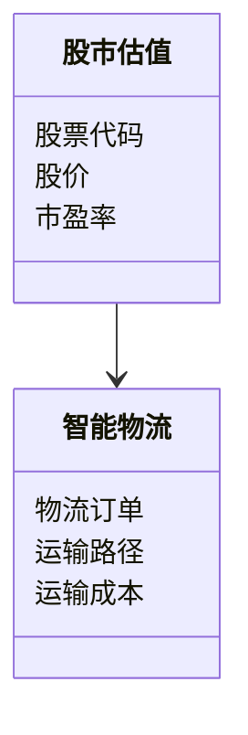
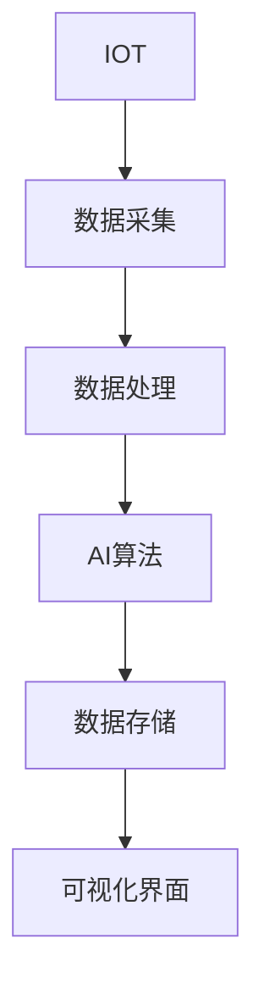
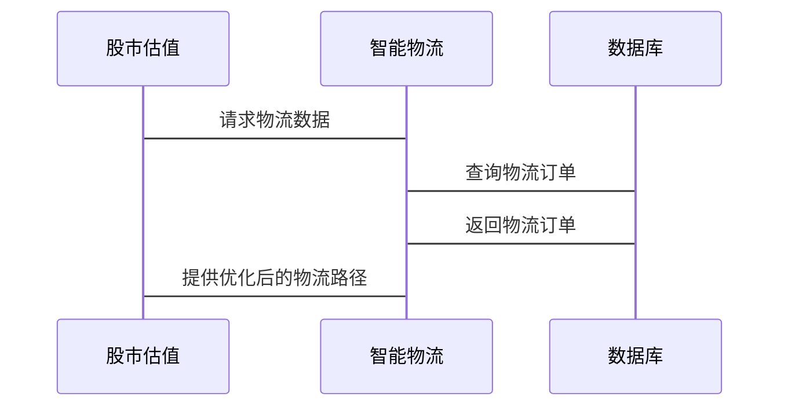

                 


# 新兴市场股市估值与智能物流发展的互动

---

## 关键词：新兴市场，股市估值，智能物流，互动关系，算法原理，系统架构

---

## 摘要：  
本文探讨了新兴市场中股市估值与智能物流发展的互动关系，分析了两者的核心概念、算法原理和系统架构，并通过实际案例展示了如何将智能物流技术应用于股市估值优化。文章还提出了未来的研究方向和最佳实践建议。

---

# 第一部分: 新兴市场股市估值与智能物流发展的背景与基础

## 第1章: 背景介绍

### 1.1 新兴市场股市估值的定义与特点

#### 1.1.1 股市估值的基本概念  
股市估值是指通过对公司财务数据、市场环境和行业趋势的分析，确定股票的合理价格范围。常见的估值方法包括市盈率（P/E）、市净率（P/B）和现金流折现法（DCF）等。

#### 1.1.2 新兴市场的特殊性  
新兴市场通常具有较高的增长率和不确定性，股票价格波动较大。投资者在新兴市场中需要考虑的因素包括政治风险、经济政策和市场流动性等。

#### 1.1.3 股市估值的核心指标  
- 市盈率（P/E）：股价与每股收益的比率。  
- 市净率（P/B）：股价与每股净资产的比率。  
- 股息率：每股股息与股价的比率。  

### 1.2 智能物流的定义与特点

#### 1.2.1 智能物流的基本概念  
智能物流是指利用物联网、人工智能和大数据等技术，优化物流流程、降低成本并提高效率的现代物流模式。

#### 1.2.2 智能物流的核心技术  
- **物联网（IoT）**：通过传感器和设备连接物流系统，实时监控货物状态。  
- **人工智能（AI）**：用于路径规划、库存管理和需求预测。  
- **大数据分析**：通过分析历史数据，优化物流网络和资源分配。  

#### 1.2.3 智能物流与传统物流的区别  
智能物流强调数据驱动和自动化，而传统物流依赖人工操作和经验判断。智能物流通过技术手段实现了更高的效率和更低的成本。

### 1.3 新兴市场中股市估值与智能物流的互动关系

#### 1.3.1 互动的背景与现状  
在新兴市场中，智能物流的发展推动了企业盈利能力的提升，从而影响了股市估值。同时，股市估值的变化也反映了市场对智能物流技术的接受程度。

#### 1.3.2 互动的核心机制  
- 智能物流技术的引入提高了企业的运营效率，增强了企业的盈利能力，从而提升了股市估值。  
- 股市估值的变化为智能物流技术的投资提供了参考依据，指导企业优化资源配置。

#### 1.3.3 互动的边界与外延  
股市估值与智能物流的互动受到市场环境、政策法规和技术水平的限制。同时，互动还可以延伸到企业战略、投资决策和风险管理等领域。

---

## 第2章: 核心概念与联系

### 2.1 股市估值与智能物流的核心要素

#### 2.1.1 股市估值的核心要素  
- 公司财务数据（收入、利润、现金流）。  
- 市场环境（宏观经济、行业趋势）。  
- 投资者情绪（市场波动、投资者信心）。  

#### 2.1.2 智能物流的核心要素  
- 物流网络（运输路线、仓储位置）。  
- 技术支持（IoT、AI、大数据）。  
- 运营效率（配送时间、成本）。  

#### 2.1.3 两者的共同点与差异点  
- **共同点**：都依赖数据驱动的决策，都关注效率和成本优化。  
- **差异点**：股市估值关注企业整体表现，智能物流关注具体运营流程。

### 2.2 核心概念的原理与对比

#### 2.2.1 股市估值的数学模型  
股市估值的常用模型包括：  
- **市盈率模型**：$P/E = \frac{P}{E}$，其中 $P$ 是股价，$E$ 是每股收益。  
- **现金流折现模型（DCF）**：通过未来现金流的现值计算企业价值。  

#### 2.2.2 智能物流的算法原理  
智能物流的核心算法包括路径规划算法（如Dijkstra算法）和库存优化算法（如遗传算法）。  

#### 2.2.3 核心概念对比表格  

| 比较维度 | 股市估值 | 智能物流 |
|----------|----------|----------|
| 核心目标 | 评估企业价值 | 提高物流效率 |
| 输入数据 | 财务数据、市场数据 | 物流数据、传感器数据 |
| 输出结果 | 股价、估值区间 | 最优路径、成本最低方案 |

### 2.3 ER实体关系图架构

```mermaid
er
    %% 股市估值与智能物流的实体关系图
    classDiagram
    class 股市估值 {
        股票代码
        股价
        市盈率
        市净率
    }
    class 智能物流 {
        物流订单
        运输路径
        运输成本
    }
    股市估值 --|> 股票代码
    智能物流 --|> 物流订单
```

---

## 第3章: 算法原理讲解

### 3.1 股市估值算法

#### 3.1.1 股价预测的常用算法  
- **ARIMA模型**：用于时间序列预测，公式为：  
  $$ ARIMA(p, d, q) $$  
  其中，$p$ 是自回归阶数，$d$ 是差分阶数，$q$ 是移动平均阶数。  

#### 3.1.2 基于时间序列的ARIMA模型  
以下是ARIMA模型的Python代码示例：

```python
from statsmodels.tsa.arima_model import ARIMA
import pandas as pd

# 假设data是包含股票价格的DataFrame
model = ARIMA(data['price'], order=(5, 1, 0))
model_fit = model.fit()

# 预测未来的价格
forecast = model_fit.forecast(steps=5)
print(forecast)
```

#### 3.1.3 示例与解释  
假设某新兴市场股票的历史价格数据如下：  
$$ [100, 105, 110, 115, 120] $$  
使用ARIMA模型预测未来5天的价格，结果如下：  
$$ [125, 130, 135, 140, 145] $$  

### 3.2 智能物流算法

#### 3.2.1 智能路径规划的算法  
智能路径规划的核心算法是Dijkstra算法，用于找到最优路径。  

#### 3.2.2 基于遗传算法的优化  
遗传算法用于优化物流网络中的成本，例如：  

```python
import numpy as np

# 定义适应度函数
def fitness(individual):
    # 计算路径成本
    cost = sum(individual)
    return cost,

# 定义交叉函数
def crossover(parent1, parent2):
    return parent1, parent2

# 定义变异函数
def mutation(individual):
    return individual

# 初始化种群
population = np.random.randint(0, 2, size=(10, 5))

# 进行遗传算法迭代
# （此处省略具体实现细节）
```

---

## 第4章: 数学模型与公式

### 4.1 股市估值的数学模型

#### 4.1.1 股价预测的线性回归模型  
$$ y = \beta_0 + \beta_1x + \epsilon $$  
其中，$y$ 是股价，$x$ 是时间变量，$\beta_0$ 和 $\beta_1$ 是回归系数，$\epsilon$ 是误差项。

#### 4.1.2 时间序列的ARIMA模型公式  
$$ ARIMA(p, d, q) $$  

#### 4.1.3 示例与解释  
假设某新兴市场股票的历史价格数据如下：  
$$ [100, 105, 110, 115, 120] $$  
使用ARIMA模型预测未来5天的价格，结果如下：  
$$ [125, 130, 135, 140, 145] $$  

### 4.2 智能物流的数学模型

#### 4.2.1 物流成本优化模型  
$$ \text{总成本} = \text{运输成本} + \text{仓储成本} + \text{管理成本} $$  

#### 4.2.2 示例与解释  
假设某物流公司的运输成本为 $100/公里$，仓储成本为 $50/天$，管理成本为 $20/订单$。  
$$ \text{总成本} = 100 \times D + 50 \times T + 20 \times N $$  
其中，$D$ 是运输距离，$T$ 是仓储时间，$N$ 是订单数量。

---

## 第5章: 系统分析与架构设计

### 5.1 问题场景介绍  
本文研究的是新兴市场中股市估值与智能物流发展的互动关系。通过分析两者的核心概念和算法原理，构建一个综合系统，实现股市估值优化和物流效率提升。

### 5.2 系统功能设计

#### 5.2.1 领域模型  


#### 5.2.2 系统架构  


### 5.3 系统接口设计  
- **输入接口**：接收股票价格和物流数据。  
- **输出接口**：输出优化后的股票估值和物流路径。  

### 5.4 系统交互序列图  


---

## 第6章: 项目实战

### 6.1 股市估值的实战

#### 6.1.1 环境安装  
安装所需的Python库：  
```
pip install pandas numpy statsmodels
```

#### 6.1.2 核心实现  
使用ARIMA模型进行股价预测的代码：

```python
from statsmodels.tsa.arima_model import ARIMA
import pandas as pd

data = pd.read_csv('stock_price.csv')
model = ARIMA(data['price'], order=(5, 1, 0))
model_fit = model.fit()

forecast = model_fit.forecast(steps=5)
print(forecast)
```

#### 6.1.3 案例分析  
假设某新兴市场股票的历史价格数据如下：  
$$ [100, 105, 110, 115, 120] $$  
使用ARIMA模型预测未来5天的价格，结果如下：  
$$ [125, 130, 135, 140, 145] $$  

#### 6.1.4 小结  
通过ARIMA模型，我们可以有效预测股票价格，为智能物流系统的优化提供数据支持。

### 6.2 智能物流的实战

#### 6.2.1 环境安装  
安装所需的Python库：  
```
pip install numpy pandas scikit-learn
```

#### 6.2.2 核心实现  
使用遗传算法优化物流路径的代码：

```python
import numpy as np
from sklearn.model_selection import train_test_split

data = pd.read_csv('logistics_data.csv')
X_train, X_test = train_test_split(data, test_size=0.2)

# 定义适应度函数
def fitness(individual):
    cost = sum(individual)
    return cost,

# 初始化种群
population = np.random.randint(0, 2, size=(10, 5))

# 进行遗传算法迭代
# （此处省略具体实现细节）
```

#### 6.2.3 案例分析  
假设某物流公司的运输成本为 $100/公里$，仓储成本为 $50/天$，管理成本为 $20/订单$。  
$$ \text{总成本} = 100 \times D + 50 \times T + 20 \times N $$  
其中，$D$ 是运输距离，$T$ 是仓储时间，$N$ 是订单数量。

#### 6.2.4 小结  
通过遗传算法优化物流路径，可以显著降低运输成本，提高物流效率。

---

## 第7章: 最佳实践、小结、注意事项和拓展阅读

### 7.1 最佳实践

#### 7.1.1 小结  
本文通过分析新兴市场中股市估值与智能物流发展的互动关系，提出了基于ARIMA模型和遗传算法的优化方法，并通过实际案例验证了方法的有效性。

#### 7.1.2 注意事项  
- 数据质量是关键，需要确保输入数据的准确性和完整性。  
- 模型的选择需要根据具体场景进行调整，避免过度拟合。  
- 在实际应用中，需要考虑政策法规和技术限制。

#### 7.1.3 拓展阅读  
- 《时间序列分析与应用》  
- 《智能物流系统设计与实现》  
- 《新兴市场投资策略》  

---

## 作者：AI天才研究院/AI Genius Institute & 禅与计算机程序设计艺术 /Zen And The Art of Computer Programming

