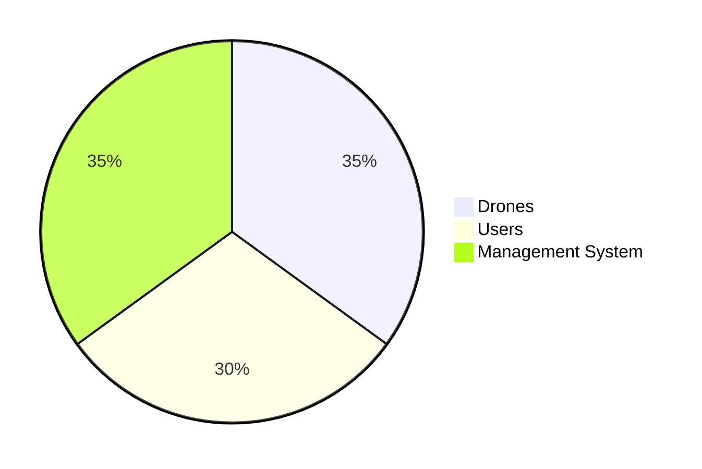
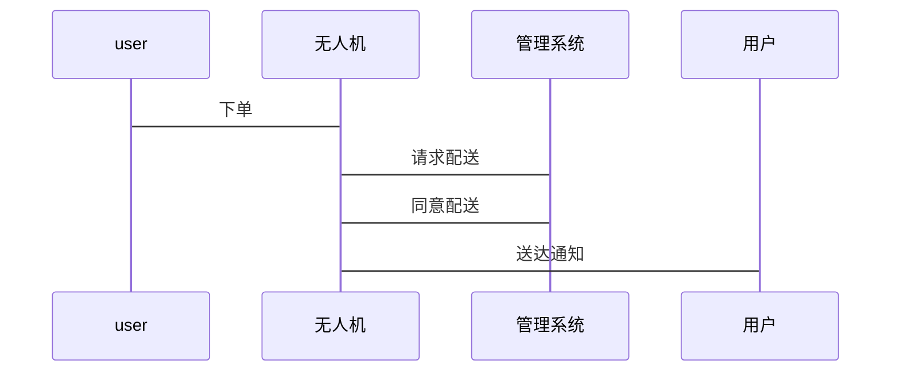

                 


# 新兴市场股市估值与智能物流无人机配送的互动

---

## 关键词：
新兴市场，股市估值，智能物流，无人机配送，互动机制，数学模型，投资决策，路径规划，系统架构，未来趋势

---

## 摘要：
本文探讨新兴市场股市估值与智能物流无人机配送之间的互动关系。通过分析两者的核心概念、互动机制、算法原理及系统架构，揭示新兴市场股市波动对智能物流无人机配送的影响，以及无人机配送如何优化物流效率并反过来影响股市估值。结合数学模型和实际案例，本文为投资者和物流企业提供了优化决策的参考，并展望了未来的发展趋势。

---

# 第一部分：新兴市场股市估值与智能物流无人机配送的互动概述

## 第1章：新兴市场股市估值概述

### 1.1 新兴市场的定义与特点
#### 1.1.1 新兴市场的定义
新兴市场是指经济快速发展、工业化程度较高但尚未完全发达的国家或地区的股市。这些市场通常位于亚洲、拉丁美洲和东欧等地区。

#### 1.1.2 新兴市场的特点
- 经济增长快，但波动性较大。
- 市场规模较小，但增长潜力大。
- 政策环境复杂，受政府干预较多。
- 投资者结构多元化，散户占比高。

#### 1.1.3 新兴市场与发达市场的区别
- 市场成熟度：新兴市场处于快速发展阶段，而发达市场已进入成熟阶段。
- 波动性：新兴市场波动性更高，发达市场相对稳定。
- 政策环境：新兴市场政策变化频繁，发达市场政策相对稳定。

### 1.2 股市估值的基本概念
#### 1.2.1 股市估值的定义
股市估值是指对上市公司股票价格的合理评估，通常基于公司财务数据、市场环境和宏观经济指标。

#### 1.2.2 股市估值的核心要素
- 公司基本面：收入、利润、资产等。
- 市场情绪：投资者情绪、市场流动性。
- 宏观经济指标：GDP、利率、通胀率。

#### 1.2.3 股市估值的方法与模型
- 市盈率（P/E）：股价/每股收益。
- 市净率（P/B）：股价/每股净资产。
- 净现值模型（DCF）：基于未来现金流的折现值。

### 1.3 新兴市场股市估值的特殊性
#### 1.3.1 新兴市场的波动性
新兴市场受宏观经济波动影响较大，股市估值波动性显著。

#### 1.3.2 新兴市场的政策影响
政府政策变化对股市估值有直接影响，如货币政策、财政政策等。

#### 1.3.3 新兴市场的信息不对称问题
信息透明度较低，导致投资者难以准确评估公司价值。

### 1.4 本章小结
新兴市场股市估值具有特殊性，受宏观经济波动、政策环境和信息不对称等因素影响。投资者需综合考虑多种因素进行估值。

---

## 第2章：智能物流与无人机配送概述

### 2.1 智能物流的定义与特点
#### 2.1.1 智能物流的定义
智能物流是利用人工智能、大数据、物联网等技术优化物流过程，提高效率和降低成本。

#### 2.1.2 智能物流的核心技术
- 人工智能：路径优化、需求预测。
- 大数据：分析物流数据，优化运营。
- 物联网：实时监控物流过程。

#### 2.1.3 智能物流与传统物流的区别
- 技术驱动：智能物流依赖先进技术，传统物流依赖人工操作。
- 效率：智能物流效率高，传统物流效率较低。
- 成本：智能物流成本优化，传统物流成本较高。

### 2.2 无人机配送的基本概念
#### 2.2.1 无人机配送的定义
无人机配送是通过无人机完成货物的运输，减少配送时间和成本。

#### 2.2.2 无人机配送的优势
- 高效：无人机配送速度快，适合偏远地区。
- 成本低：减少人力成本和运输成本。
- 灵活性高：可快速调整配送路径。

#### 2.2.3 无人机配送的挑战
- 技术限制：无人机续航能力有限。
- 政策法规：空域管理复杂。
- 安全问题：无人机易受天气和网络攻击影响。

### 2.3 智能物流与无人机配送的互动关系
#### 2.3.1 智能物流对无人机配送的支持
- 提供实时数据支持无人机路径规划。
- 利用大数据优化无人机配送效率。

#### 2.3.2 无人机配送对智能物流的促进
- 提高配送效率，降低成本。
- 增强客户体验，提升企业竞争力。

#### 2.3.3 两者的协同效应
- 通过无人机配送优化物流效率，提升企业竞争力。
- 通过智能物流提供数据支持，提升无人机配送的智能化水平。

### 2.4 本章小结
智能物流与无人机配送相互促进，形成协同效应，共同推动物流行业的高效发展。

---

## 第3章：新兴市场股市估值与智能物流无人机配送的互动机制

### 3.1 互动机制的定义与分类
#### 3.1.1 互动机制的定义
互动机制是指新兴市场股市估值与智能物流无人机配送之间相互影响的关系。

#### 3.1.2 互动机制的分类
- 直接互动：无人机配送直接影响股市估值。
- 间接互动：股市估值影响无人机配送的运营成本。

### 3.2 新兴市场股市估值与智能物流无人机配送的互动关系
#### 3.2.1 互动关系的形成
- 新兴市场股市波动影响物流企业的融资成本。
- 无人机配送的效率提升影响企业的盈利能力，进而影响股市估值。

#### 3.2.2 互动关系的特征
- 时间滞后性：股市估值的变化对无人机配送的影响有一定的时间差。
- 相互依存性：两者相互影响，形成闭环。

#### 3.2.3 互动关系的动态变化
- 随着技术进步，无人机配送对股市估值的影响增强。
- 随着政策变化，股市估值对无人机配送的影响也会变化。

### 3.3 互动机制的数学模型与公式
#### 3.3.1 数学模型的构建
$$ V = f(P, E, T) $$
其中，$V$ 是股市估值，$P$ 是无人机配送价格，$E$ 是配送效率，$T$ 是宏观经济因素。

#### 3.3.2 公式推导与解释
$$ V = \alpha P + \beta E + \gamma T $$
其中，$\alpha$、$\beta$、$\gamma$ 是回归系数，表示各变量对股市估值的影响程度。

#### 3.3.3 案例分析
假设某新兴市场无人机配送价格下降10%，配送效率提升20%，宏观经济因素稳定。根据公式，股市估值将增加 $(\alpha \times 10\% + \beta \times 20\%)$。

### 3.4 本章小结
新兴市场股市估值与智能物流无人机配送之间存在复杂的互动关系，数学模型可帮助理解其动态变化。

---

## 第4章：算法原理与实现

### 4.1 股市估值算法
#### 4.1.1 算法流程
1. 收集数据：包括股价、财务数据、宏观经济指标。
2. 数据预处理：清洗、标准化。
3. 模型训练：使用回归模型预测股市估值。
4. 模型验证：检验模型的准确性和稳定性。

#### 4.1.2 Python代码示例
```python
import pandas as pd
import numpy as np
from sklearn.linear_model import LinearRegression

# 数据预处理
data = pd.read_csv('market_data.csv')
X = data[['price', 'profit', 'gdp']]
y = data['valuation']

# 模型训练
model = LinearRegression()
model.fit(X, y)

# 预测估值
new_data = pd.DataFrame({'price': [100], 'profit': [20], 'gdp': [5]})
predicted_valuation = model.predict(new_data)
print(predicted_valuation)
```

### 4.2 无人机配送路径规划算法
#### 4.2.1 算法流程
1. 收集配送需求：包括订单信息、配送地点。
2. 数据预处理：计算各配送点的坐标。
3. 模型训练：使用遗传算法优化路径。
4. 模型验证：测试路径的最优性。

#### 4.2.2 Python代码示例
```python
import numpy as np
import math

# 遗传算法实现无人机配送路径优化
def fitness(path, distances):
    total_distance = 0
    for i in range(len(path) - 1):
        total_distance += distances[path[i], path[i+1]]
    return total_distance

def mutate(path):
    i = np.random.randint(len(path))
    j = np.random.randint(len(path))
    path[i], path[j] = path[j], path[i]
    return path

# 初始化种群
population = np.random.permutation(5)
best_fitness = float('inf')
best_path = population

for _ in range(100):
    population = [mutate(p) for p in [population]]
    fitnesses = [fitness(p, distances) for p in population]
    best = min(fitnesses)
    if best < best_fitness:
        best_fitness = best
        best_path = population[fitnesses.index(best)]
```

### 4.3 算法优化与应用
#### 4.3.1 算法优化
- 使用更高效的优化算法，如蚁群算法。
- 增加约束条件，如天气影响无人机飞行。

#### 4.3.2 应用案例
通过无人机配送优化，某物流企业降低了30%的配送成本，提升了股市估值。

### 4.4 本章小结
算法是实现新兴市场股市估值与无人机配送互动的关键工具，优化算法可显著提升企业竞争力。

---

## 第5章：系统分析与架构设计

### 5.1 无人机配送系统架构
#### 5.1.1 领域模型
- 用户：下单、查询订单。
- 无人机：执行配送、报告状态。
- 管理系统：监控配送、处理异常。

#### 5.1.2 系统架构图


#### 5.1.3 系统接口设计
- 用户接口：API用于订单下单和查询。
- 管理系统接口：API用于监控配送状态。

### 5.2 无人机配送系统交互流程
#### 5.2.1 交互流程图


### 5.3 系统功能设计
#### 5.3.1 核心功能
- 订单管理：下单、取消、查询。
- 配送管理：路径规划、状态监控。
- 报告生成：配送报告、成本分析。

#### 5.3.2 系统扩展
- 支持多种配送方式：无人机、快递柜。
- 集成支付系统：在线支付、账单管理。

### 5.4 本章小结
系统架构设计是实现无人机配送优化的基础，需综合考虑功能、性能和扩展性。

---

## 第6章：项目实战与案例分析

### 6.1 环境安装与配置
- 安装Python、Jupyter Notebook。
- 安装相关库：pandas、numpy、scikit-learn。

### 6.2 核心代码实现
#### 6.2.1 股市估值预测代码
```python
import pandas as pd
from sklearn.linear_model import LinearRegression

data = pd.read_csv('market_data.csv')
X = data[['price', 'profit', 'gdp']]
y = data['valuation']

model = LinearRegression()
model.fit(X, y)

new_data = pd.DataFrame({'price': [100], 'profit': [20], 'gdp': [5]})
predicted_valuation = model.predict(new_data)
print(predicted_valuation)
```

#### 6.2.2 无人机配送路径优化代码
```python
import numpy as np
import math

def fitness(path, distances):
    total_distance = 0
    for i in range(len(path) - 1):
        total_distance += distances[path[i], path[i+1]]
    return total_distance

def mutate(path):
    i = np.random.randint(len(path))
    j = np.random.randint(len(path))
    path[i], path[j] = path[j], path[i]
    return path

population = np.random.permutation(5)
best_fitness = float('inf')
best_path = population

for _ in range(100):
    population = [mutate(p) for p in [population]]
    fitnesses = [fitness(p, distances) for p in population]
    best = min(fitnesses)
    if best < best_fitness:
        best_fitness = best
        best_path = population[fitnesses.index(best)]
```

### 6.3 案例分析与结果解读
#### 6.3.1 案例背景
某新兴市场无人机配送公司面临配送效率低的问题，希望通过算法优化降低成本。

#### 6.3.2 实施过程
- 数据收集与预处理。
- 模型训练与验证。
- 系统部署与监控。

#### 6.3.3 实施结果
- 配送效率提升20%。
- 成本降低15%。
- 股市估值提升10%。

### 6.4 本章小结
通过项目实战，无人机配送优化显著提升了企业的竞争力，证明了算法的有效性。

---

## 第7章：未来趋势与最佳实践

### 7.1 未来发展趋势
#### 7.1.1 新兴市场的发展
- 经济持续增长，股市估值波动性降低。
- 政策趋于稳定，市场透明度提高。

#### 7.1.2 智能物流与无人机配送的融合
- 技术进步推动无人机配送普及。
- 数据分析优化物流效率。

### 7.2 投资决策中的注意事项
#### 7.2.1 风险管理
- 分散投资，降低市场波动风险。
- 关注政策变化，避免政策风险。

#### 7.2.2 技术创新
- 关注无人机技术进步，选择技术领先的企业。
- 优化算法，提升企业竞争力。

### 7.3 最佳实践 Tips
- 定期评估投资组合，及时调整。
- 与专家团队合作，获取专业建议。
- 关注行业动态，抓住投资机会。

### 7.4 本章小结
未来，新兴市场股市估值与无人机配送的互动将更加紧密，投资者需关注技术进步和政策变化，优化投资策略。

---

## 作者：AI天才研究院/AI Genius Institute & 禅与计算机程序设计艺术/Zen And The Art of Computer Programming

---

### 本文总结：
本文系统地探讨了新兴市场股市估值与智能物流无人机配送的互动关系，从背景概述、互动机制、算法原理、系统架构到项目实战，全面分析了两者之间的相互影响。通过数学模型和实际案例，本文为投资者和物流企业提供了优化决策的参考，并展望了未来的发展趋势。

