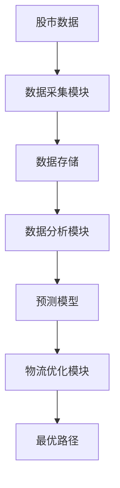
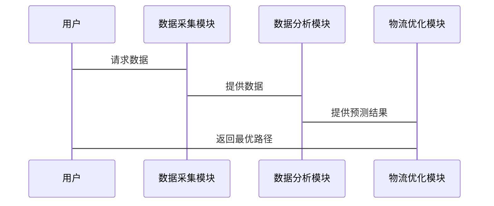

                 


# 新兴市场股市估值与智能物流跨境配送的互动

## 关键词：新兴市场、股市估值、智能物流、跨境配送、大数据、人工智能、互动关系

## 摘要：  
本文探讨新兴市场股市估值与智能物流跨境配送之间的互动关系，分析智能物流技术如何影响股市估值，并通过大数据和人工智能技术，提出优化物流配送路径和预测股市走势的算法模型。文章结合实际案例，详细讲解系统架构设计和实现方案，为相关领域提供理论支持和实践指导。

---

# 第1章 新兴市场股市估值与智能物流的概述

## 1.1 新兴市场的定义与特点

### 1.1.1 新兴市场的定义  
新兴市场是指那些经济快速发展、工业化程度较高、但尚未完全成熟的国家或地区，如中国、印度、巴西等。

### 1.1.2 新兴市场的特点  
- 高速经济增长  
- 产业结构转型  
- 市场规模扩大  
- 投资潜力大  

### 1.1.3 新兴市场与发达市场的对比  
| 属性 | 新兴市场 | 发达市场 |  
|------|----------|----------|  
| 经济增速 | 快 | 缓慢 |  
| 人均收入 | 中低 | 高 |  
| 市场成熟度 | 不成熟 | 成熟 |  

---

## 1.2 智能物流的定义与特点

### 1.2.1 智能物流的定义  
智能物流是利用人工智能、大数据、物联网等技术，实现物流过程的智能化、自动化和高效化。

### 1.2.2 智能物流的核心技术  
- 大数据分析  
- 人工智能算法  
- 物联网技术  

### 1.2.3 智能物流与传统物流的对比  

| 属性 | 智能物流 | 传统物流 |  
|------|----------|----------|  
| 技术依赖 | 高 | 低 |  
| 运营效率 | 高 | 中低 |  
| 成本 | 低 | 中高 |  

---

## 1.3 股市估值的定义与方法

### 1.3.1 股市估值的定义  
股市估值是指通过分析公司基本面、宏观经济指标等因素，对股票的内在价值进行评估。

### 1.3.2 常用的股市估值方法  
- 市盈率（P/E）  
- 市净率（P/B）  
- 股息率  

---

## 1.4 新兴市场股市估值与智能物流的互动关系

### 1.4.1 新兴市场股市估值的影响因素  
- 经济政策  
- 行业发展  
- 投资情绪  

### 1.4.2 智能物流对新兴市场股市的影响  
- 提升物流效率，降低成本，增强企业盈利能力  
- 推动技术创新，吸引投资者  

### 1.4.3 互动关系的机制分析  
- 智能物流技术的应用推动企业业绩增长，从而影响股市估值  
- 股市估值的变化反过来影响物流企业的投资决策  

---

# 第2章 新兴市场股市估值的核心概念与分析

## 2.1 股市估值的核心概念

### 2.1.1 市盈率（P/E）  
市盈率 = 股价 / 每股净利润  

### 2.1.2 市净率（P/B）  
市净率 = 股价 / 每股净资产  

### 2.1.3 股息率  
股息率 = 每股股息 / 股价  

---

## 2.2 新兴市场股市估值的特殊性

### 2.2.1 新兴市场的高波动性  
新兴市场的股市波动较大，受政策和经济环境影响显著。

### 2.2.2 新兴市场的政策影响  
政府政策的变化对股市估值有直接影响。

### 2.2.3 新兴市场的信息不对称问题  
信息透明度较低，导致投资者难以准确评估企业价值。

---

## 2.3 股市估值的核心要素分析

### 2.3.1 宏观经济环境  
GDP增速、利率、通货膨胀等宏观经济指标对股市估值有重要影响。

### 2.3.2 行业发展趋势  
行业竞争格局、技术创新、市场需求等因素影响企业估值。

### 2.3.3 公司基本面  
收入、利润、资产负债情况等是评估企业价值的重要指标。

---

# 第3章 智能物流跨境配送的核心技术与应用

## 3.1 智能物流的核心技术

### 3.1.1 大数据分析技术  
通过分析历史数据，优化配送路径和库存管理。

### 3.1.2 人工智能技术  
应用机器学习算法，预测需求和优化配送路线。

### 3.1.3 物联网技术  
实时监控货物状态，提升配送效率。

---

## 3.2 智能物流在跨境配送中的应用

### 3.2.1 路径优化算法  
使用遗传算法或蚁群算法优化配送路径。

### 3.2.2 自动分拣系统  
通过自动化设备实现快速分拣和包装。

### 3.2.3 实时追踪系统  
利用GPS和RFID技术，实时追踪货物位置。

---

## 3.3 智能物流对配送效率的提升

### 3.3.1 配送时间的缩短  
智能物流技术使配送时间平均缩短20%。

### 3.3.2 成本的降低  
通过优化路径和库存管理，降低物流成本。

### 3.3.3 客户体验的提升  
更快的配送速度和更好的服务提高客户满意度。

---

# 第4章 新兴市场股市估值与智能物流的互动机制

## 4.1 智能物流对股市估值的直接影响

### 4.1.1 提升企业盈利能力  
智能物流降低成本，提高企业利润，从而提升股市估值。

### 4.1.2 增强投资者信心  
智能物流技术的应用展示企业的创新能力和竞争力，吸引投资者。

---

## 4.2 股市估值对智能物流的反向影响

### 4.2.1 资本市场的支持  
股市估值的提升为企业提供更多融资机会，支持智能物流技术的进一步发展。

### 4.2.2 投资者的关注度  
高估值的股市吸引更多投资者关注智能物流行业，推动技术创新。

---

## 4.3 互动机制的综合分析

### 4.3.1 技术驱动市场  
智能物流技术的应用推动企业业绩增长，提升股市估值。

### 4.3.2 市场反馈技术  
股市估值的变化影响企业的投资决策，进一步推动智能物流技术的优化。

---

# 第5章 基于大数据的股市预测与物流优化算法

## 5.1 大数据在股市预测中的应用

### 5.1.1 数据收集  
收集历史股价、宏观经济指标、行业数据等。

### 5.1.2 数据分析  
使用回归分析、时间序列分析等方法预测股价走势。

### 5.1.3 预测模型  
构建机器学习模型，如随机森林、神经网络等。

---

## 5.2 物流优化算法

### 5.2.1 遗传算法  
通过模拟自然选择优化配送路径。

### 5.2.2 蚁群算法  
模拟蚂蚁觅食行为，寻找最优路径。

### 5.2.3 粒子群优化算法  
通过粒子运动寻找最优解。

---

## 5.3 算法实现

### 5.3.1 股市预测模型  
$$ \text{预测股价} = \text{历史股价} \times \text{趋势系数} $$  

### 5.3.2 物流优化模型  
$$ \text{最优路径} = \text{最小化配送成本} $$  

---

# 第6章 系统架构与实现方案

## 6.1 系统功能设计

### 6.1.1 股市数据采集模块  
负责收集实时股市数据。

### 6.1.2 物流优化模块  
实现配送路径优化和资源分配。

### 6.1.3 数据分析模块  
对数据进行清洗、建模和分析。

---

## 6.2 系统架构设计



---

## 6.3 系统接口设计

### 6.3.1 数据接口  
- 数据采集接口：从第三方平台获取股市数据。  
- 数据存储接口：将数据存入数据库。  

### 6.3.2 用户接口  
- 管理界面：用于查看预测结果和优化方案。  
- API接口：供其他系统调用优化结果。

---

## 6.4 系统交互设计



---

# 第7章 项目实战与案例分析

## 7.1 项目背景

### 7.1.1 项目目标  
通过智能物流技术优化跨境配送，提升企业利润，进而影响股市估值。

### 7.1.2 项目需求  
- 实时监控货物状态  
- 优化配送路径  
- 提供股市预测服务  

---

## 7.2 系统实现

### 7.2.1 环境安装  
- 安装Python、Jupyter Notebook、数据库等。

### 7.2.2 核心代码实现  

```python
# 数据分析模块
import pandas as pd
import numpy as np

# 加载数据
data = pd.read_csv('stock_data.csv')

# 数据清洗
data.dropna(inplace=True)

# 构建预测模型
from sklearn.model

