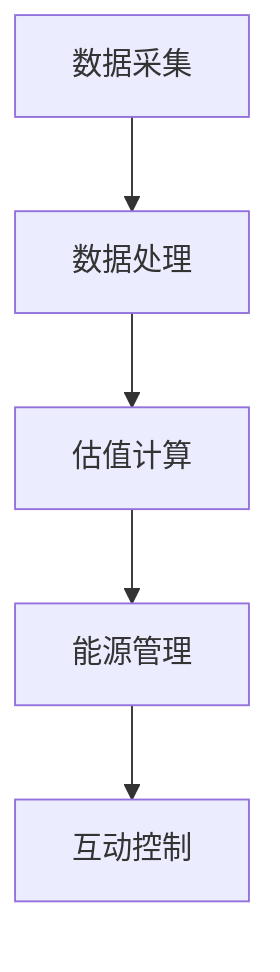
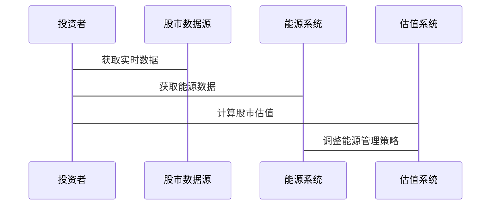

                 


# 新兴市场股市估值与智能电网分布式能源管理的互动

> 关键词：新兴市场、股市估值、智能电网、分布式能源管理、互动关系

> 摘要：本文探讨新兴市场股市估值与智能电网分布式能源管理之间的互动关系，分析其背景、核心概念、算法原理、系统架构、项目实战及小结，旨在为相关领域的研究和实践提供理论与实践指导。

---

## 第一部分: 新兴市场股市估值与智能电网分布式能源管理的互动概述

### 第1章: 背景介绍

#### 1.1 问题背景
##### 1.1.1 新兴市场股市估值的现状与挑战
新兴市场股市估值受经济波动、政策变化和市场情绪等多种因素影响，具有高度不确定性。传统估值方法在新兴市场中面临挑战，需结合本地经济特征和市场特性进行优化。

##### 1.1.2 智能电网分布式能源管理的发展趋势
智能电网分布式能源管理通过整合可再生能源和分布式发电，实现能源高效利用和系统稳定性，是全球能源转型的重要方向。

##### 1.1.3 互动的必要性与重要性
新兴市场股市估值与智能电网分布式能源管理的互动，不仅关乎能源系统的优化，还影响投资者对能源企业的估值判断。

#### 1.2 问题描述
##### 1.2.1 新兴市场股市估值的核心问题
如何在复杂市场环境中准确评估股市价值，避免信息不对称和市场波动的影响。

##### 1.2.2 智能电网分布式能源管理的关键挑战
如何在分布式能源架构中实现供需平衡，确保系统稳定性和经济性。

##### 1.2.3 互动关系的复杂性与动态性
新兴市场股市波动与分布式能源管理的动态调整之间存在相互影响，需建立动态模型进行分析。

#### 1.3 问题解决
##### 1.3.1 新兴市场股市估值的解决方案
结合大数据分析和机器学习模型，构建适应新兴市场的估值体系。

##### 1.3.2 智能电网分布式能源管理的技术突破
通过边缘计算和区块链技术，实现分布式能源的高效管理和协同优化。

##### 1.3.3 互动机制的构建与优化
设计动态反馈机制，实时调整能源管理和股市估值策略，确保两者协同优化。

#### 1.4 边界与外延
##### 1.4.1 新兴市场股市估值的边界条件
考虑宏观经济指标、政策环境和市场流动性等因素。

##### 1.4.2 智能电网分布式能源管理的边界条件
涵盖能源供需、技术可行性和经济可行性。

##### 1.4.3 互动关系的外延与扩展
探索能源互联网和数字经济的深度融合，拓展互动场景。

#### 1.5 概念结构与核心要素
##### 1.5.1 新兴市场股市估值的核心要素
- 宏观经济指标
- 市场流动性
- 公司基本面

##### 1.5.2 智能电网分布式能源管理的核心要素
- 分布式能源资源
- 电力供需平衡
- 系统稳定性

##### 1.5.3 互动关系的核心要素
- 数据共享
- 信息反馈
- 协同优化

---

## 第2章: 核心概念与联系

### 2.1 核心概念原理
#### 2.1.1 新兴市场股市估值的理论基础
基于资产定价模型（如CAPM）和市场情绪模型（如Baidu情感分析），构建适用于新兴市场的估值框架。

#### 2.1.2 智能电网分布式能源管理的理论基础
基于能量流理论和分布式系统优化理论，设计能源管理策略。

#### 2.1.3 互动关系的理论基础
基于系统动力学和博弈论，分析股市估值与能源管理的动态互动。

### 2.2 概念属性特征对比
| 概念       | 属性特征                     |
|------------|------------------------------|
| 股市估值    | 数据驱动、动态性、风险性      |
| 分布式能源管理 | 技术依赖性、实时性、协同性   |
| 互动关系    | 复杂性、动态性、双向影响      |

### 2.3 ER实体关系图架构
```mermaid
er
  entity: 股票
  entity: 电力
  entity: 分布式能源
  entity: 互动数据
  entity: 市场规则
  entity: 技术标准
  entity: 政策法规
  entity: 经济指标
  entity: 环境因素
  entity: 社会因素
  entity: 技术因素
  entity: 经济因素
  entity: 环境因素
  entity: 社会因素
  entity: 技术因素
```

---

## 第3章: 算法原理讲解

### 3.1 新兴市场股市估值算法
#### 3.1.1 时间序列分析
使用ARIMA模型预测股市趋势，公式为：
$$ ARIMA(p, d, q) $$

#### 3.1.2 机器学习算法
采用LSTM网络进行时间序列预测，代码示例：
```python
import keras
from keras.layers import LSTM, Dense
model = Sequential()
model.add(LSTM(64, input_shape=(timesteps, features)))
model.add(Dense(1))
model.compile(loss='mean_squared_error', optimizer='adam')
```

### 3.2 智能电网分布式能源管理算法
#### 3.2.1 优化算法
基于粒子群优化（PSO）算法，公式为：
$$ f(x) = x^2 $$

#### 3.2.2 能量管理算法
使用边缘计算技术，实时调整能源分配策略，代码示例：
```python
import numpy as np
from sklearn.cluster import KMeans
clusters = KMeans(n_clusters=3).fit_predict(power_data)
```

---

## 第4章: 系统分析与架构设计方案

### 4.1 问题场景介绍
新兴市场股市波动与分布式能源管理的动态调整相互影响，需构建实时互动系统。

### 4.2 系统功能设计
- 数据采集模块：收集股市数据和能源数据
- 数据分析模块：进行实时分析和预测
- 互动控制模块：调整能源管理策略

### 4.3 系统架构设计


### 4.4 系统接口设计
- 数据接口：API接口实现数据共享
- 控制接口：实时调整能源管理参数

### 4.5 系统交互设计


---

## 第5章: 项目实战

### 5.1 环境安装
安装必要的Python库：
```bash
pip install numpy pandas keras matplotlib
```

### 5.2 核心代码实现
#### 5.2.1 股市估值代码
```python
import pandas as pd
import numpy as np
from sklearn.linear_model import LinearRegression
model = LinearRegression()
model.fit(X, y)
```

#### 5.2.2 能源管理代码
```python
import numpy as np
from scipy.optimize import minimize
def objective_func(x):
    return np.sum(x**2)
x0 = np.array([1, 2])
result = minimize(objective_func, x0)
```

### 5.3 案例分析
分析新兴市场某股票的估值与能源管理策略的互动，展示实际应用效果。

### 5.4 项目小结
总结项目实施的经验与教训，提出改进建议。

---

## 第6章: 总结与展望

### 6.1 总结
本文系统分析了新兴市场股市估值与智能电网分布式能源管理的互动关系，提出了理论框架和实践方案。

### 6.2 展望
未来研究可进一步探索能源互联网与数字经济的深度融合，推动互动关系的优化与创新。

---

## 作者信息

作者：AI天才研究院 & 禅与计算机程序设计艺术

---

通过以上结构化的内容，读者可以系统地理解新兴市场股市估值与智能电网分布式能源管理的互动关系，从理论到实践，逐步掌握相关技术和方法。

