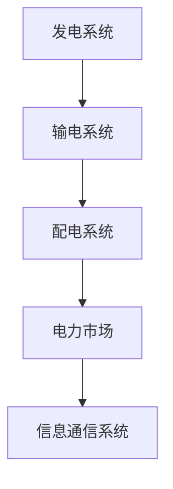
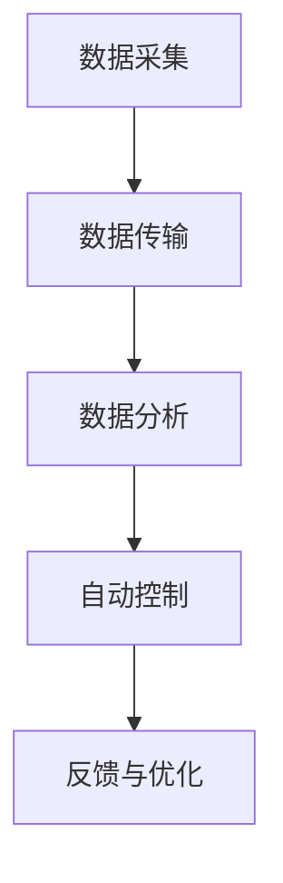
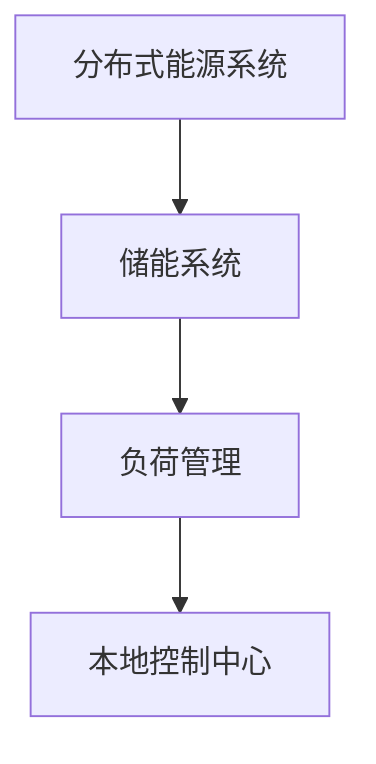
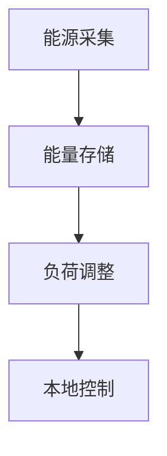
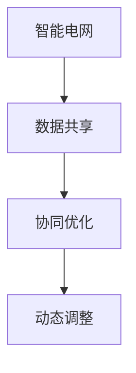

                 

# 第二章: 智能电网与微电网技术的核心概念与联系

## 2.1 智能电网的核心原理

### 2.1.1 智能电网的组成结构

智能电网由以下几个主要部分组成：

1. **发电系统**：包括传统发电厂和可再生能源发电设备（如风力和太阳能）。
2. **输电系统**：负责将电力从发电厂输送到负荷中心。
3. **配电系统**：将电力分配到各个用户端。
4. **电力市场**：包括电力交易和定价机制。
5. **信息通信系统**：用于实时数据传输和系统控制。

**Mermaid 组成结构图：**

---

### 2.1.2 智能电网的工作原理

智能电网通过实时数据采集、分析和反馈，实现电力系统的智能化管理。以下是其工作流程：

1. 数据采集：通过传感器和监测设备采集电力系统中的各项数据（如电压、电流、负荷等）。
2. 数据传输：利用信息通信系统将数据传输到控制中心。
3. 数据分析：通过算法对数据进行分析，预测电力需求和供应情况。
4. 自动控制：根据分析结果，自动调整电力系统的运行参数。
5. 反馈与优化：根据系统反馈不断优化电力系统的运行效率。

**Mermaid 工作原理图：**

---

### 2.1.3 智能电网的数据流分析

智能电网的数据流主要涉及以下几个方面：

- **实时数据流**：包括发电、输电和配电过程中的实时数据。
- **控制数据流**：用于系统控制和优化的数据。
- **市场数据流**：包括电力交易和定价信息。

---

## 2.2 微电网的核心原理

### 2.2.1 微电网的组成结构

微电网由以下几个主要部分组成：

1. **分布式能源系统**：包括太阳能、风能等可再生能源发电设备。
2. **储能系统**：用于存储多余的能源，以备不时之需。
3. **负荷管理**：根据能源需求调整电力输出。
4. **本地控制中心**：负责微电网的运行管理和优化。

**Mermaid 组成结构图：**

---

### 2.2.2 微电网的工作原理

微电网通过本地能源的自给自足和灵活管理，实现能源的高效利用。以下是其工作流程：

1. **能源采集**：通过分布式能源系统采集太阳能、风能等可再生能源。
2. **能量存储**：将多余的能量存储在储能系统中。
3. **负荷调整**：根据能源需求调整电力输出。
4. **本地控制**：通过本地控制中心优化微电网的运行效率。

**Mermaid 工作原理图：**

---

### 2.2.3 微电网的数据流分析

微电网的数据流主要涉及以下几个方面：

- **能源数据流**：包括能源采集和存储过程中的数据。
- **负荷数据流**：包括负荷需求和电力输出数据。
- **控制数据流**：用于微电网运行管理和优化的数据。

---

## 2.3 智能电网与微电网技术的对比分析

### 2.3.1 技术特征对比

以下是智能电网与微电网技术在技术特征上的对比：

| 特性       | 智能电网                          | 微电网                          |
|------------|-----------------------------------|-----------------------------------|
| 技术复杂性  | 高                                | 较低                             |
| 覆盖范围    | 广泛（全国或区域）                | 局部（单个社区或企业）           |
| 可扩展性    | 较低（受地理限制）                | 较高（易于扩展）                 |

---

### 2.3.2 应用场景对比

| 场景       | 智能电网                          | 微电网                          |
|------------|-----------------------------------|-----------------------------------|
| 主要应用领域 | 电力输送和配电                   | 偏远地区电力供应                 |
| 技术需求   | 高（需要先进的信息通信技术）      | 较低（依赖本地能源和储能系统）    |

---

### 2.3.3 优缺点对比

| 特性       | 智能电网                          | 微电网                          |
|------------|-----------------------------------|-----------------------------------|
| 优点       | 高效、可靠、可扩展                | 灵活、经济、环保                  |
| 缺点       | 投资大、技术复杂                  | 依赖外部能源、容量有限          |

---

## 2.4 智能电网与微电网技术的互动关系

### 2.4.1 技术互补性分析

智能电网和微电网技术在以下几个方面具有互补性：

- **能源管理**：智能电网可以优化能源输送和分配，而微电网可以实现局部能源的自给自足。
- **数据共享**：智能电网的信息化系统可以为微电网提供数据支持，而微电网的数据反馈可以为智能电网的优化提供参考。

---

### 2.4.2 应用协同性分析

智能电网和微电网技术的应用协同性主要体现在以下几个方面：

- **分布式能源整合**：智能电网可以将微电网作为分布式能源的一部分，实现整体能源的优化管理。
- **负荷管理**：微电网可以通过智能电网的负荷预测和调整，实现更高效的能源利用。

---

### 2.4.3 互动机制

智能电网与微电网技术的互动机制可以分为以下几个步骤：

1. **数据共享**：智能电网和微电网之间通过信息通信系统共享数据。
2. **协同优化**：根据共享数据，智能电网和微电网共同优化能源管理和分配。
3. **动态调整**：根据实时反馈，动态调整电力系统的运行参数。

**Mermaid 互动机制图：**

---

## 2.5 本章小结

本章详细讲解了智能电网和微电网技术的核心原理和组成结构，并通过对比分析探讨了它们的技术特征和应用场景。同时，我们还分析了智能电网与微电网技术的互动关系，包括技术互补性、应用协同性和互动机制。这些内容为后续章节的深入分析奠定了基础。

---

接下来，我会继续撰写第三章，重点分析智能电网与微电网技术如何影响股市估值。如果您有任何反馈或需要调整的地方，请随时告诉我！

