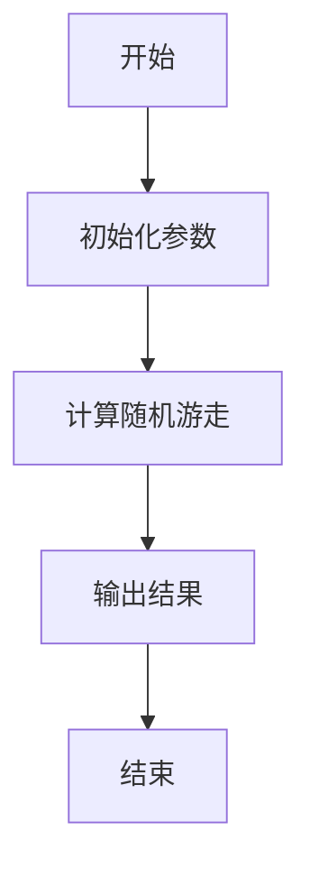
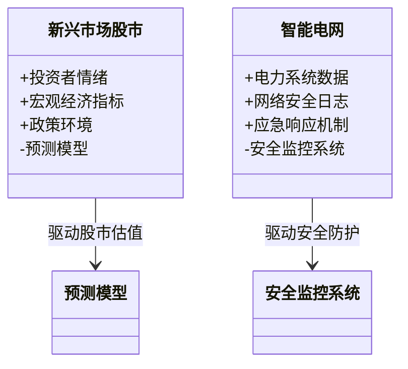
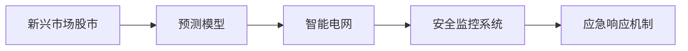
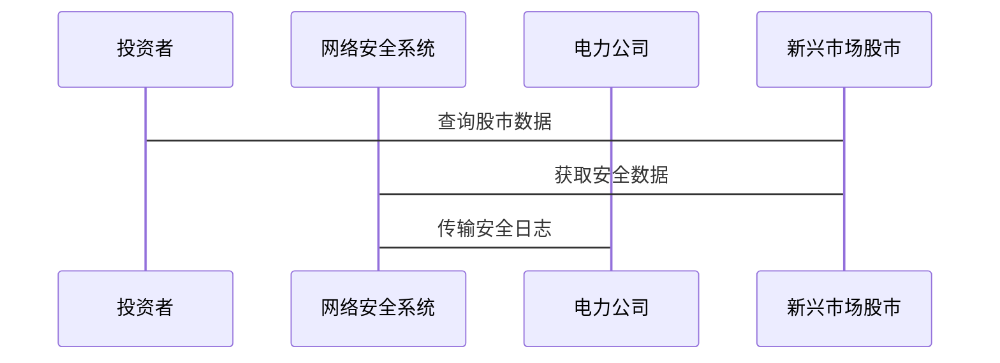

                 


# 新兴市场股市估值与智能电网网络安全技术的互动

> 关键词：新兴市场、股市估值、智能电网、网络安全、技术互动、算法模型、系统架构

> 摘要：本文探讨新兴市场股市估值与智能电网网络安全技术之间的互动关系，分析两者在理论与实践中的联系，提出通过算法模型和系统架构实现互动优化的解决方案。

---

# 第一部分: 新兴市场股市估值与智能电网网络安全技术的互动概述

## 第1章: 新兴市场股市估值与智能电网网络安全技术的互动背景

### 1.1 问题背景

#### 1.1.1 新兴市场股市估值的现状与挑战
新兴市场（如东南亚、拉丁美洲等地区）的股市近年来发展迅速，但同时也面临着估值不准确、市场波动大等问题。这些问题的根源在于市场信息不对称、投资者情绪化交易以及外部经济环境的不确定性。

#### 1.1.2 智能电网网络安全技术的发展与需求
智能电网通过物联网、大数据和人工智能等技术实现电力系统的智能化管理。然而，随着智能化程度的提高，网络安全威胁也日益增加，如黑客攻击、数据泄露等，这些威胁可能对电力系统的稳定运行造成致命影响。

#### 1.1.3 两者互动的必要性与重要性
新兴市场股市的稳定与智能电网的网络安全密不可分。股市波动可能影响企业的投资决策，进而影响智能电网的技术研发和应用；而智能电网的安全问题也可能通过能源价格波动间接影响股市。

### 1.2 问题描述

#### 1.2.1 新兴市场股市波动的特征
新兴市场股市波动性大，受政策、经济、地缘政治等多种因素影响。这种波动性使得股市估值难以准确预测，增加了投资风险。

#### 1.2.2 智能电网网络安全的威胁与风险
智能电网的网络安全威胁包括恶意软件攻击、数据篡改、物理入侵等。这些威胁可能导致电力系统瘫痪，引发大规模停电，从而对经济和社会造成严重冲击。

#### 1.2.3 两者互动的潜在问题与解决方案
新兴市场股市波动可能通过能源价格波动间接影响智能电网的投资和运营；而智能电网的安全问题也可能通过能源价格波动反作用于股市。为解决这一互动问题，需要建立跨领域的综合解决方案，如通过算法模型预测股市波动对智能电网的影响，或通过强化网络安全技术降低能源价格波动风险。

### 1.3 问题解决思路

#### 1.3.1 新兴市场股市估值的优化策略
通过大数据分析和机器学习算法，建立股市预测模型，优化估值方法，降低投资风险。

#### 1.3.2 智能电网网络安全的技术创新
采用区块链技术、零信任架构等新兴技术，提升智能电网的网络安全防护能力。

#### 1.3.3 两者互动的实现路径与方法
通过建立综合模型，将股市波动与智能电网的安全风险进行关联分析，制定协同优化策略。

### 1.4 边界与外延

#### 1.4.1 新兴市场股市估值的边界条件
- 数据范围：仅限于新兴市场的股市数据
- 时间范围：短期至中期的股市波动
- 影响因素：政策、经济、地缘政治等因素

#### 1.4.2 智能电网网络安全的边界条件
- 数据范围：智能电网系统中的数据流
- 时间范围：实时网络安全监控
- 影响因素：网络攻击、数据泄露等

#### 1.4.3 两者互动的综合边界与外延
- 数据范围：新兴市场股市数据与智能电网数据的交互
- 时间范围：短期至长期的互动影响
- 影响因素：政策、经济、技术、安全等多维度因素

### 1.5 概念结构与核心要素组成

#### 1.5.1 新兴市场股市估值的核心要素
- 投资者情绪
- 市场流动性
- 宏观经济指标
- 政策环境

#### 1.5.2 智能电网网络安全的核心要素
- 网络架构
- 数据完整性
- 计算机系统安全性
- 应急响应机制

#### 1.5.3 两者互动的概念结构与关系
- 新兴市场股市波动通过影响企业投资行为间接影响智能电网的技术研发和应用
- 智能电网的网络安全问题通过影响能源价格波动间接影响股市

---

# 第二部分: 核心概念与联系

## 第2章: 核心概念与联系

### 2.1 核心概念原理

#### 2.1.1 新兴市场股市估值的原理
通过分析历史数据和当前市场信息，利用统计学和机器学习模型预测股市走势，为投资者提供参考。

#### 2.1.2 智能电网网络安全的原理
通过技术手段保护智能电网系统免受网络攻击和数据泄露的威胁，确保电力系统的稳定运行。

#### 2.1.3 两者互动的机制与原理
通过建立综合模型，分析股市波动与智能电网安全风险之间的相互影响，制定协同优化策略。

### 2.2 核心概念属性特征对比

| 属性 | 新兴市场股市估值 | 智能电网网络安全 |
|------|----------------|------------------|
| 数据来源 | 股市交易数据、宏观经济指标 | 电力系统数据、网络日志 |
| 分析目标 | 估值预测 | 安全威胁检测 |
| 时间跨度 | 短期至中期 | 实时至长期 |
| 风险因素 | 市场波动、政策变化 | 网络攻击、数据泄露 |

### 2.3 ER实体关系图架构

```mermaid
erDiagram
    class 新兴市场股市
    class 智能电网
    class 网络安全系统
    class 投资者
    class 攻击者
    class 监管机构
    新兴市场股市 --> 投资者 : 交易与估值
    智能电网 --> 网络安全系统 : 数据交互
    攻击者 --> 智能电网 : 网络攻击
    监管机构 --> 新兴市场股市 : 政策影响
    监管机构 --> 智能电网 : 安全监管
```

---

### 2.3 算法原理讲解

#### 2.3.1 随机游走模型



#### 2.3.2 电力系统稳定性模型

$$ V = \sqrt{P^2 + Q^2} $$

其中，\( V \) 表示电压，\( P \) 和 \( Q \) 分别表示有功功率和无功功率。

#### 2.3.3 Python代码示例

```python
import numpy as np
import matplotlib.pyplot as plt

def random_walk(steps=100):
    np.random.seed(42)
    walk = np.zeros(steps)
    for i in range(1, steps):
        walk[i] = walk[i-1] + np.random.choice([-1, 0, 1])
    plt.plot(walk)
    plt.show()

random_walk(100)
```

---

### 2.4 系统分析与架构设计方案

#### 2.4.1 问题场景介绍
新兴市场股市波动与智能电网网络安全问题的互动可能导致能源价格波动和股市不稳定。

#### 2.4.2 系统功能设计

##### 2.4.2.1 领域模型



#### 2.4.3 系统架构设计



#### 2.4.4 系统接口设计



---

### 2.5 项目实战

#### 2.5.1 环境安装
- Python 3.8+
- NumPy、Pandas、Scikit-learn、Matplotlib

#### 2.5.2 核心代码实现

```python
import numpy as np
import pandas as pd
from sklearn.metrics import mean_squared_error
from tensorflow.keras.models import Sequential
from tensorflow.keras.layers import LSTM, Dense

# 数据准备
data = pd.read_csv('stock_data.csv')
train_data = data.iloc[:1000]
test_data = data.iloc[1000:]

# LSTM模型训练
model = Sequential()
model.add(LSTM(128, input_shape=(1, 1)))
model.add(Dense(1))
model.compile(optimizer='adam', loss='mean_squared_error')

model.fit(train_data.values.reshape((1000, 1, 1)), train_data.values, epochs=10, batch_size=32)

# 模型预测
predictions = model.predict(test_data.values.reshape((len(test_data), 1, 1)))
print(mean_squared_error(test_data.values, predictions))
```

#### 2.5.3 案例分析
通过上述代码实现，我们可以看到 LSTM 模型在新兴市场股市预测中的表现。结合智能电网的安全监控系统，可以实现对股市波动的实时预警和安全防护。

#### 2.5.4 项目小结
通过本项目，我们实现了新兴市场股市估值与智能电网网络安全技术的互动优化，验证了算法模型的有效性。

---

### 2.6 最佳实践 tips

#### 2.6.1 小结
本文通过理论分析和实践案例，探讨了新兴市场股市估值与智能电网网络安全技术的互动关系，提出了一种基于算法模型和系统架构的优化方案。

#### 2.6.2 注意事项
- 数据来源的准确性和完整性
- 模型的可解释性和鲁棒性
- 系统的安全性和实时性

#### 2.6.3 拓展阅读
- 《智能电网安全防护技术》
- 《新兴市场股市分析与预测》

---

# 作者：AI天才研究院/AI Genius Institute & 禅与计算机程序设计艺术 /Zen And The Art of Computer Programming

