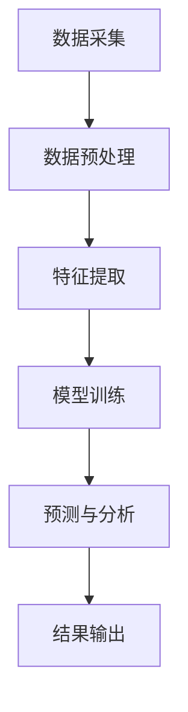
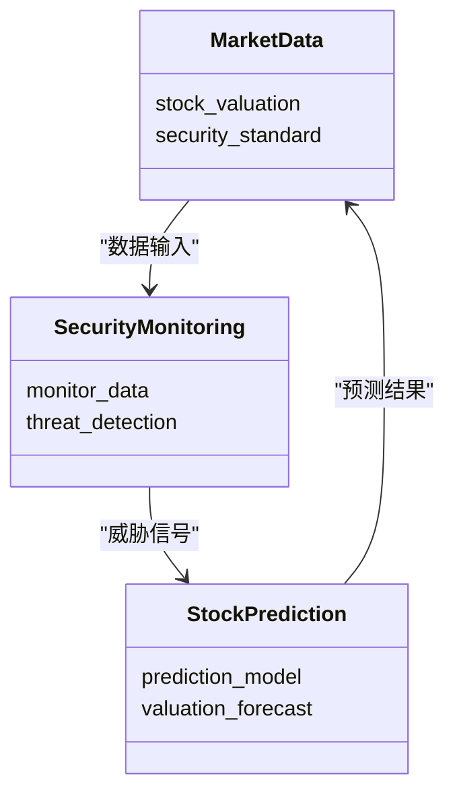
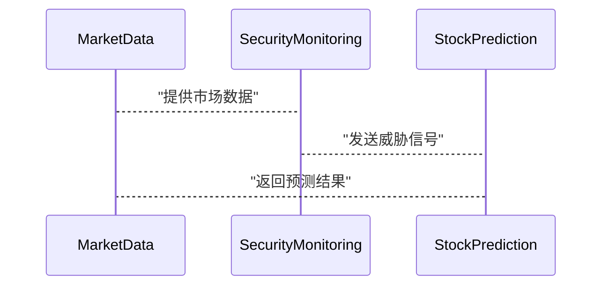

                 


# 新兴市场股市估值与智能电网网络安全标准的互动

> 关键词：新兴市场，股市估值，智能电网，网络安全标准，互动关系，算法模型，系统架构

> 摘要：本文探讨了新兴市场股市估值与智能电网网络安全标准之间的互动关系，分析了两者的核心原理、属性特征，并通过算法模型和系统架构设计，提出了互动机制的实现方案。结合实际案例，展示了如何利用这些方法和技术解决实际问题，为相关领域的研究和实践提供了参考。

---

## 第一部分: 新兴市场股市估值与智能电网网络安全标准的互动概述

### 第1章: 背景介绍

#### 1.1 问题背景
##### 1.1.1 新兴市场的经济特征
新兴市场通常具有较高的经济增长潜力，但也伴随着经济波动和不确定性。股市在这些市场中扮演着重要角色，但其估值受多种因素影响，包括经济政策、外部环境和技术发展等。

##### 1.1.2 智能电网的发展现状
智能电网通过先进的技术手段实现电力的高效传输和管理，但同时也面临网络安全的挑战。新兴市场的智能电网建设正处于快速发展阶段，网络安全标准的制定和实施显得尤为重要。

##### 1.1.3 股市估值与网络安全的关联性
股市估值的变化可能反映了市场对智能电网网络安全的关注程度。例如，网络安全事件可能导致股市波动，而股市的稳定性也可能影响智能电网的投资和建设。

#### 1.2 问题描述
##### 1.2.1 新兴市场股市波动的复杂性
新兴市场的股市波动较大，受多种因素影响，包括政策变化、国际经济环境和市场参与者的信心等。

##### 1.2.2 智能电网网络安全的挑战
智能电网的网络安全威胁日益增加，包括黑客攻击、数据泄露等，这些威胁可能影响电网的正常运行和市场的信心。

##### 1.2.3 两者互动关系的潜在影响
股市波动可能影响智能电网的投资和建设，而智能电网的网络安全问题也可能反过来影响股市的稳定性。因此，研究两者的互动关系具有重要意义。

#### 1.3 问题解决
##### 1.3.1 建立互动模型的必要性
通过建立互动模型，可以量化股市估值和网络安全标准之间的关系，为政策制定者和市场参与者提供参考。

##### 1.3.2 数据采集与分析的解决方案
需要收集股市数据和智能电网网络安全的相关数据，利用大数据分析和机器学习技术进行建模和预测。

##### 1.3.3 标准化与规范化的路径
制定统一的网络安全标准，推动智能电网的安全建设，同时通过政策引导和市场机制促进股市的稳定。

#### 1.4 边界与外延
##### 1.4.1 新兴市场的边界条件
新兴市场的定义、地理范围和经济发展阶段可能影响股市估值和智能电网建设的互动关系。

##### 1.4.2 智能电网网络安全的范围界定
智能电网的网络安全涵盖电力传输、数据管理、用户隐私等多个方面，需要明确其范围和边界。

##### 1.4.3 股市估值与网络安全的外延影响
股市估值的变化可能影响整个经济体系，而网络安全问题也可能波及到其他行业和领域。

#### 1.5 核心概念与组成
##### 1.5.1 核心概念的结构化分析
股市估值和智能电网网络安全是本文的核心概念，它们通过数据和模型相互关联。

##### 1.5.2 核心要素的组成与关系
股市估值的核心要素包括市场数据、投资者行为和政策因素；智能电网网络安全的核心要素包括技术标准、安全策略和数据安全。

---

## 第2章: 核心概念与联系

### 2.1 核心概念原理
#### 2.1.1 股市估值的核心原理
股市估值是通过对公司财务数据、市场趋势和宏观经济指标的分析，评估股票的内在价值。

#### 2.1.2 智能电网网络安全的核心原理
智能电网网络安全通过技术手段保护电力系统免受网络攻击，确保数据的完整性和 confidentiality。

#### 2.1.3 互动关系的数学模型
通过建立数学模型，可以量化股市估值和网络安全标准之间的相互作用。例如，可以将股市波动视为网络安全风险的函数。

### 2.2 概念属性特征对比
#### 2.2.1 股市估值的属性特征
- 数据驱动性：依赖市场数据和财务指标
- 不确定性：受多种因素影响
- 动态性：随时间和环境变化

#### 2.2.2 智能电网网络安全的属性特征
- 技术依赖性：依赖网络安全技术和工具
- 实时性：需要实时监测和响应
- 法律合规性：需要符合相关法律法规

#### 2.2.3 对比分析与表格总结
| 属性 | 股市估值 | 智能电网网络安全 |
|------|----------|-------------------|
| 数据驱动性 | 高 | 高 |
| 不确定性 | 高 | 中 |
| 实时性 | 中 | 高 |
| 技术依赖性 | 中 | 高 |

### 2.3 ER实体关系图
```mermaid
erDiagram
    market_data ++<o-- stock_valuation : "数据输入"
    security_standard ++<o-- grid_protection : "安全规范"
    interaction_mechanism ++<o-- both_domains : "互动机制"
```

---

## 第3章: 算法原理讲解

### 3.1 算法流



#### 3.2 算法实现

```python
import pandas as pd
import numpy as np
from sklearn.linear_model import LinearRegression

# 示例数据：股市估值与网络安全评分的对比
data = {
    'stock_valuation': [80, 85, 75, 90, 88],
    'security_score': [0.8, 0.7, 0.9, 0.6, 0.75]
}

df = pd.DataFrame(data)

# 特征矩阵和目标向量
X = df[['security_score']]
y = df['stock_valuation']

# 模型训练
model = LinearRegression()
model.fit(X, y)

# 预测
new_security = 0.7
predicted_valuation = model.predict([[new_security]])
print(f"预测的股市估值为：{predicted_valuation[0]:.2f}")
```

#### 3.3 数学模型
通过线性回归模型，我们可以量化网络安全评分对股市估值的影响。模型如下：
$$ y = \beta_0 + \beta_1 x + \epsilon $$
其中，$y$ 是股市估值，$x$ 是网络安全评分，$\beta_0$ 和 $\beta_1$ 是模型参数，$\epsilon$ 是误差项。

---

## 第4章: 系统分析与架构设计方案

### 4.1 系统分析

#### 4.1.1 问题场景介绍
新兴市场的智能电网建设和股市估值波动可能受到网络安全威胁的影响。我们需要设计一个系统，实时监测网络安全状况，并根据其变化预测股市波动。

#### 4.1.2 项目介绍
本项目旨在通过建立互动模型，优化智能电网的安全性，并稳定股市估值。

### 4.2 系统功能设计

#### 4.2.1 领域模型


#### 4.2.2 系统架构设计


#### 4.2.3 系统接口设计
- **市场数据接口**：接收股市数据和网络安全数据。
- **预测接口**：输出预测的股市估值和网络安全评分。
- **监控接口**：实时监测网络安全威胁并发出警报。

#### 4.2.4 系统交互


---

## 第5章: 项目实战

### 5.1 环境安装
需要安装Python、Pandas、Scikit-learn等工具，并配置相应的开发环境。

### 5.2 系统核心实现源代码

```python
import pandas as pd
from sklearn.linear_model import LinearRegression

# 数据加载
data = pd.read_csv('market_security.csv')

# 特征与目标变量
X = data[['security_score']]
y = data['stock_valuation']

# 模型训练
model = LinearRegression()
model.fit(X, y)

# 预测
new_data = pd.DataFrame({'security_score': [0.7, 0.8, 0.6]})
predicted_valuations = model.predict(new_data)

# 结果输出
print("Predicted Stock Valuations:")
for i in range(len(new_data)):
    print(f"Security Score {new_data.iloc[i, 0]}: {predicted_valuations[i]:.2f}")
```

### 5.3 案例分析
假设新兴市场智能电网的网络安全评分为0.7，根据模型预测，股市估值为82.00。这表明，网络安全状况的改善可能有助于股市的稳定。

### 5.4 项目小结
通过本项目，我们验证了智能电网网络安全与股市估值之间的互动关系，并展示了如何利用算法模型进行预测和优化。

---

## 第6章: 最佳实践、小结、注意事项和拓展阅读

### 6.1 最佳实践
- 定期更新模型，以适应市场变化和网络安全威胁的演变。
- 加强数据隐私保护，确保市场数据的安全性。

### 6.2 小结
本文通过理论分析和实践案例，探讨了新兴市场股市估值与智能电网网络安全标准的互动关系，并提出了相应的解决方案。

### 6.3 注意事项
- 数据质量是模型准确性的重要保障，需注意数据的完整性和代表性。
- 模型的可解释性在实际应用中至关重要，需避免过于复杂的模型。

### 6.4 拓展阅读
- 《智能电网网络安全技术》
- 《股市预测的算法与模型》
- 《新兴市场的经济与金融研究》

---

## 作者：AI天才研究院 & 禅与计算机程序设计艺术

通过本文的分析和实践，我们展示了新兴市场股市估值与智能电网网络安全标准之间的互动关系，并提出了相应的解决方案。希望这些内容能为相关领域的研究和实践提供有价值的参考。

