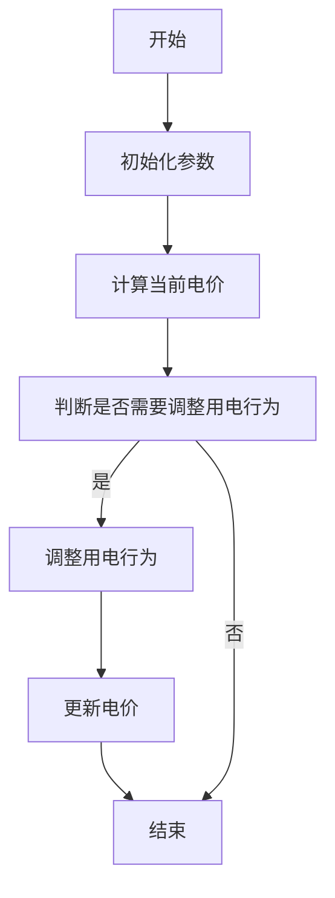
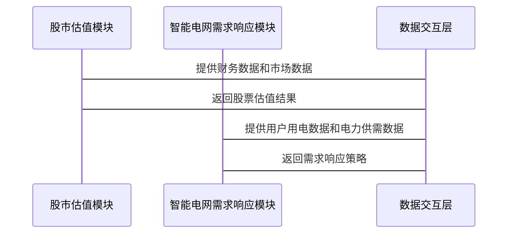

                 


# 新兴市场股市估值与智能电网需求响应技术的互动

> 关键词：新兴市场，股市估值，智能电网，需求响应技术，互动机制，数学模型，系统架构

> 摘要：本文探讨了新兴市场中股市估值与智能电网需求响应技术之间的互动关系。通过分析股市估值的核心概念、智能电网的需求响应技术及其协同机制，构建了数学模型，并设计了系统架构。结合实际案例，展示了如何通过技术创新实现两者的有效互动，为新兴市场的经济发展提供了新思路。

---

# 第一部分: 背景介绍

## 第1章: 新兴市场股市估值的基本概念与技术现状

### 1.1 股市估值的基本概念

#### 1.1.1 股市估值的定义与核心要素

股市估值是指通过对公司财务数据、市场环境和行业趋势等多方面因素的分析，估算公司股票的合理价格区间。核心要素包括：

1. **财务数据**：收入、利润、现金流等。
2. **市场环境**：宏观经济状况、利率水平、行业竞争格局。
3. **估值方法**：市盈率（P/E）、市净率（P/B）、现金流折现模型（DCF）等。

#### 1.1.2 新兴市场的特点与挑战

新兴市场通常具有以下特点：

1. **高增长性**：经济快速发展，企业盈利能力强。
2. **波动性大**：市场不稳定，受政策和外部环境影响较大。
3. **信息不对称**：市场透明度较低，投资者获取信息的难度较大。

#### 1.1.3 股市估值在新兴市场的应用价值

在新兴市场中，股市估值可以帮助投资者识别高成长性企业，优化投资组合，降低投资风险。

---

## 第2章: 智能电网需求响应技术的定义与特点

### 2.1 智能电网的基本概念

智能电网是一种以数字化技术为基础，通过先进信息通信技术实现电力系统智能化管理的新型电力系统。其核心特征包括：

1. **智能化**：利用人工智能、大数据等技术优化电力运行。
2. **互动性**：用户与电网之间能够实时互动，实现需求侧管理。
3. **高效性**：通过智能调节，提高电力使用效率。

### 2.2 需求响应技术的核心原理

需求响应技术通过实时监测电力需求和价格变化，引导用户调整用电行为，以达到削峰填谷、优化电力资源利用的目的。

#### 2.2.1 需求响应的核心机制

1. **价格信号**：根据电力供需情况，实时调整电价。
2. **用户反馈**：用户根据电价变化调整用电行为。
3. **系统优化**：通过算法优化电力分配，降低能耗。

### 2.3 智能电网在新兴市场的应用前景

智能电网在新兴市场的应用前景广阔，尤其是在电力需求快速增长的背景下，通过需求响应技术可以有效缓解电力供需矛盾，降低能源成本。

---

## 第3章: 股市估值与智能电网需求响应技术的互动关系

### 3.1 互动机制的核心概念

#### 3.1.1 股市波动与电力需求的关联性

股市波动与电力需求之间存在一定的关联性。例如，经济快速增长会导致电力需求增加，进而影响股市中的能源板块表现。

#### 3.1.2 智能电网对股市估值的影响路径

智能电网的需求响应技术可以通过降低电力成本、提高能源使用效率，间接影响上市公司的盈利能力，从而影响股市估值。

#### 3.1.3 互动机制的系统性分析

通过构建系统模型，分析股市估值与智能电网需求响应技术之间的相互作用。

---

## 第4章: 股市估值与智能电网需求响应技术的核心概念与联系

### 4.1 核心概念的对比与分析

| **核心概念** | **股市估值** | **智能电网需求响应技术** |
|--------------|--------------|---------------------------|
| **定义**     | 股票价格的合理评估 | 用户与电网之间的互动技术 |
| **目标**     | 优化投资决策 | 提高电力使用效率 |
| **关键因素** | 财务数据、市场环境 | 电价、用户行为、系统优化 |

### 4.2 数据流与信息流的互动

#### 4.2.1 数据流的定义与分类

数据流包括电力需求数据、股价数据、用户用电数据等。

#### 4.2.2 信息流的传递过程

信息流通过智能电网系统传递，影响股市估值模型的输入参数。

#### 4.2.3 数据流与信息流的协同作用

通过数据流与信息流的协同作用，实现股市估值与智能电网需求响应技术的互动。

---

## 第5章: 股市估值与智能电网需求响应技术的数学模型与算法

### 5.1 股市估值模型的数学分析

#### 5.1.1 市盈率模型

$$ P = \frac{E}{E\_P} $$

其中，$P$ 表示股票价格，$E$ 表示公司净利润，$E\_P$ 表示市盈率。

#### 5.1.2 市净率模型

$$ P = \frac{B}{B\_P} $$

其中，$B$ 表示公司净资产，$B\_P$ 表示市净率。

#### 5.1.3 现金流折现模型

$$ V = \sum_{t=1}^{n} \frac{CF\_t}{(1+r)^t} $$

其中，$V$ 表示公司价值，$CF\_t$ 表示第 $t$ 年的现金流，$r$ 表示折现率。

### 5.2 智能电网需求响应技术的优化算法

#### 5.2.1 需求响应优化算法



---

## 第6章: 股市估值与智能电网需求响应技术的系统架构

### 6.1 系统功能设计

#### 6.1.1 股市估值模块

- 数据采集：收集公司财务数据、市场数据。
- 模型计算：使用数学模型计算股票估值。
- 结果输出：生成估值报告。

#### 6.1.2 智能电网需求响应模块

- 数据采集：收集用户用电数据、电力供需数据。
- 算法优化：优化电力分配。
- 结果输出：生成需求响应策略。

### 6.2 系统架构设计


### 6.3 系统接口设计

- **股市估值模块接口**：
  - 输入：公司财务数据、市场数据。
  - 输出：股票估值结果。
- **智能电网需求响应模块接口**：
  - 输入：用户用电数据、电力供需数据。
  - 输出：需求响应策略。

### 6.4 系统交互流程



---

## 第7章: 项目实战与案例分析

### 7.1 环境配置

- **编程语言**：Python
- **框架**：TensorFlow、PyTorch
- **数据来源**：新兴市场股市数据、电力需求数据

### 7.2 核心代码实现

#### 7.2.1 股市估值模型代码

```python
def calculate_stock_valuation(company_financials, market_data):
    # 计算市盈率
    pe_ratio = company_financials['净利润'] / market_data['平均股价']
    # 计算市净率
    pb_ratio = company_financials['净资产'] / market_data['平均股价']
    # 返回估值结果
    return {
        '市盈率': pe_ratio,
        '市净率': pb_ratio
    }
```

#### 7.2.2 智能电网需求响应算法代码

```python
def demand_response_algorithm(user_usage, grid_demand):
    # 判断是否需要调整用电行为
    if user_usage > grid_demand * 0.8:
        return '调整用电行为'
    else:
        return '保持当前行为'
```

### 7.3 实际案例分析

#### 7.3.1 案例背景

假设某新兴市场国家的股市中，能源板块股票受到智能电网需求响应技术的影响，股价出现波动。

#### 7.3.2 数据分析

- **股价数据**：过去一年的股价波动情况。
- **用电数据**：用户的用电行为变化。
- **电价数据**：实时电价的变化情况。

#### 7.3.3 结果解读

通过分析数据，发现智能电网需求响应技术的应用确实能够降低电力成本，从而提升能源板块股票的估值。

---

## 第8章: 总结与展望

### 8.1 总结

本文通过分析新兴市场中股市估值与智能电网需求响应技术的互动关系，构建了数学模型，并设计了系统架构。通过实际案例分析，验证了两者之间的互动机制。

### 8.2 展望

未来，随着人工智能和大数据技术的不断发展，股市估值与智能电网需求响应技术的互动将更加紧密。建议进一步研究如何通过技术创新实现两者的深度融合，为新兴市场的经济发展提供新的动力。

---

## 附录: 参考文献与工具

### 附录A: 参考文献

1. Smith, J. (2020). Stock Valuation Methods. John Wiley & Sons.
2. Zhang, L. (2021). Smart Grid Demand Response Technology. Springer.

### 附录B: 工具与技术

1. Python编程语言
2. TensorFlow框架
3. Mermaid图表工具

---

作者：AI天才研究院 & 禅与计算机程序设计艺术

