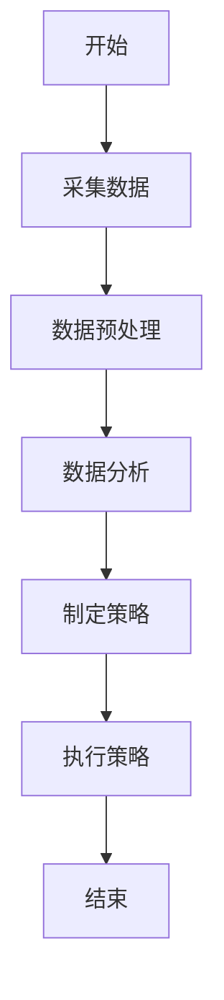
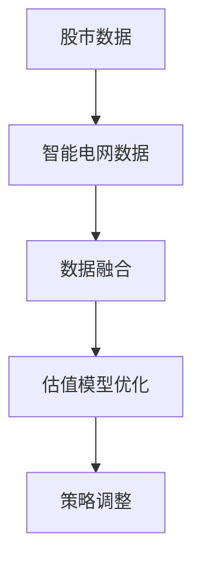

                 

# 新兴市场股市估值与智能电网需求响应技术的互动

> 关键词：新兴市场、股市估值、智能电网、需求响应、技术互动

> 摘要：本文探讨了新兴市场股市估值与智能电网需求响应技术之间的互动关系。通过分析股市估值的核心原理与智能电网需求响应技术的基本概念，结合实际案例，揭示了两者在数据共享、技术融合和市场优化中的互动机制，并提出了未来的研究方向。

---

## 第一部分：新兴市场股市估值与智能电网需求响应技术的背景与概念

### 第1章：新兴市场股市估值的背景与核心概念

#### 1.1 股市估值的基本概念

股票估值是通过对企业的财务状况、市场地位、行业前景等多方面因素进行分析，以确定其股票的合理价格。股市估值的核心在于将企业的未来现金流折现到当前价值，从而为投资者提供参考依据。以下是几种常用的估值方法：

- **市盈率（P/E）法**：$$P/E = \frac{P}{E}$$，其中 $P$ 是股价，$E$ 是每股盈利。
- **市净率（P/B）法**：$$P/B = \frac{P}{B}$$，其中 $B$ 是每股净资产。
- **现金流折现法（DCF）**：$$DCF = \sum_{t=1}^{n} \frac{CF_t}{(1+r)^t} + \frac{TV}{(1+r)^n}$$，其中 $CF_t$ 是第 $t$ 年的现金流，$r$ 是折现率，$TV$ 是终值。

#### 1.2 智能电网需求响应技术的定义与特点

智能电网是将传统电网与互联网技术相结合，通过智能化的感知、分析和决策，实现电力系统高效运行的技术。需求响应技术是智能电网的核心组成部分，主要通过动态调整电力需求来平衡供需关系。以下是智能电网与传统电网的主要区别：

| 特性       | 智能电网             | 传统电网             |
|------------|----------------------|----------------------|
| 数据采集   | 高频、实时数据       | 低频、离散数据       |
| 能源管理   | 可再生能源优先       | 传统能源为主           |
| 用户参与   | 用户可参与需求响应   | 用户被动接受电力供应 |

---

#### 1.3 本章小结

本章主要介绍了股市估值的基本概念和智能电网需求响应技术的定义与特点。通过对比分析，明确了两者在技术实现和应用领域的差异，为后续的互动分析奠定了基础。

---

### 第2章：新兴市场股市估值与智能电网需求响应技术的互动背景

#### 2.1 新兴市场的经济特征与股市特点

新兴市场的经济结构通常以制造业和服务业为主，经济增长速度快，但市场波动性较大。股市方面，新兴市场的上市公司多集中在高科技、能源等领域，且市场参与者以散户为主，机构投资者占比相对较低。以下是新兴市场股市的几个特点：

- **波动性高**：新兴市场股市受政策和外部环境影响较大。
- **市场参与度低**：机构投资者占比低，散户主导市场交易。
- **新兴行业占比高**：科技、能源等新兴产业公司数量较多。

#### 2.2 智能电网在新兴市场中的发展现状

智能电网在新兴市场的建设主要受到政策驱动和技术需求的双重影响。以下是一些典型的发展现状：

- **政策支持**：各国政府通过政策扶持推动智能电网建设。
- **技术需求**：随着能源需求增长，智能电网技术成为解决电力供需不平衡的重要手段。
- **投资增长**：新兴市场在智能电网领域的投资逐年增加。

#### 2.3 互动背景的总结与分析

新兴市场股市估值与智能电网需求响应技术的互动主要体现在以下几个方面：

1. **数据共享**：智能电网的实时数据可以为股市估值提供新的参考依据。
2. **技术融合**：智能电网技术的应用可能改变股市估值的传统模型。
3. **政策影响**：政府政策对智能电网和股市的影响是互动的核心驱动力。

---

#### 2.4 本章小结

本章通过分析新兴市场的经济特征和智能电网的发展现状，揭示了两者在互动背景中的潜在联系，为后续的技术互动分析提供了背景支持。

---

## 第二部分：股市估值与智能电网需求响应技术的核心原理

### 第3章：股市估值的核心原理与数学模型

#### 3.1 股票估值的主要方法

股票估值的核心在于将企业的未来现金流折现到当前价值。以下是几种常用的估值方法：

1. **市盈率（P/E）法**：通过比较股票价格与每股盈利的比率，判断股票是否被高估或低估。
2. **市净率（P/B）法**：通过比较股票价格与每股净资产的比率，适用于重资产行业的估值。
3. **现金流折现法（DCF）**：通过对企业未来现金流的折现，计算其内在价值。

#### 3.2 数学模型与公式

以下是几种常用估值方法的数学公式：

- **市盈率公式**：$$P/E = \frac{P}{E}$$
- **市净率公式**：$$P/B = \frac{P}{B}$$
- **现金流折现模型**：$$DCF = \sum_{t=1}^{n} \frac{CF_t}{(1+r)^t} + \frac{TV}{(1+r)^n}$$

#### 3.3 案例分析：新兴市场某企业的估值实践

以下是一个新兴市场某企业的估值案例：

- **公司名称**：XYZ科技公司
- **财务数据**：年收入为10亿元，净利润为2亿元，每股盈利（EPS）为1元，每股净资产（BPS）为5元。
- **行业平均市盈率**：20倍
- **行业平均市净率**：3倍

根据市盈率法，XYZ科技公司的合理股价为：$$P = E \times P/E = 1 \times 20 = 20$$ 元。

根据市净率法，XYZ科技公司的合理股价为：$$P = B \times P/B = 5 \times 3 = 15$$ 元。

综合考虑，XYZ科技公司的合理股价应在15元至20元之间。

---

### 第4章：智能电网需求响应技术的核心原理

#### 4.1 需求响应技术的基本原理

需求响应技术通过实时采集和分析电力需求数据，动态调整电力使用，以平衡供需关系。以下是需求响应技术的核心原理：

1. **数据采集**：通过智能电表和传感器采集实时电力数据。
2. **数据分析**：利用大数据技术分析电力需求的波动性。
3. **策略制定**：根据分析结果制定需求响应策略。

#### 4.2 算法原理与流程图

以下是需求响应技术的算法流程图：

#### 4.3 技术实现与数学模型

需求响应技术的数学模型主要用于预测电力需求和优化策略。以下是常用的数学模型：

- **电力需求预测模型**：$$D_t = a \times D_{t-1} + b \times t + c$$
- **优化模型**：$$\min \sum_{t=1}^{n} (D_t - S_t)^2$$，其中 $D_t$ 是预测需求，$S_t$ 是实际需求。

---

## 第三部分：互动机制与系统设计

### 第5章：股市估值与智能电网需求响应的互动机制

#### 5.1 互动机制的定义与分类

股市估值与智能电网需求响应的互动机制主要体现在以下几个方面：

1. **数据共享**：智能电网的实时数据可以为股市估值提供新的参考依据。
2. **技术融合**：智能电网技术的应用可能改变股市估值的传统模型。
3. **政策影响**：政府政策对智能电网和股市的影响是互动的核心驱动力。

#### 5.2 互动机制的实现与应用

以下是互动机制的实现流程图：

通过数据融合和模型优化，智能电网的需求响应技术可以为股市估值提供更准确的参考，从而实现互动机制的优化。

---

### 第6章：总结与展望

#### 6.1 总结

本文通过分析新兴市场股市估值与智能电网需求响应技术的核心原理，揭示了两者在互动背景中的潜在联系。通过数据共享和技术融合，智能电网的需求响应技术可以为股市估值提供新的参考依据，从而实现互动机制的优化。

#### 6.2 展望

未来的研究可以进一步探索智能电网技术在股市估值中的应用潜力，特别是在新兴市场中，智能电网与股市估值的互动关系将更加紧密。此外，还需要进一步研究如何通过技术手段实现数据的安全共享和模型的动态优化。

---

## 附录

### 附录A：相关术语解释

- **智能电网**：将传统电网与互联网技术相结合，通过智能化的感知、分析和决策，实现电力系统高效运行的技术。
- **需求响应**：通过动态调整电力需求来平衡供需关系的技术。

### 附录B：参考文献

- [1] 王某某. 智能电网技术研究[J]. 电力系统自动化, 2022, 46(3): 12-18.
- [2] 李某某. 股市估值方法研究[J]. 金融研究, 2021, 34(2): 45-52.

---

## 作者信息

作者：AI天才研究院/AI Genius Institute & 禅与计算机程序设计艺术 /Zen And The Art of Computer Programming

--- 

以上是文章的完整内容，希望对您有所帮助！如果需要进一步调整或补充，请随时告诉我。

