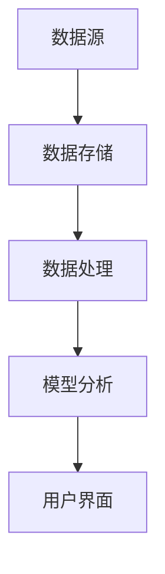
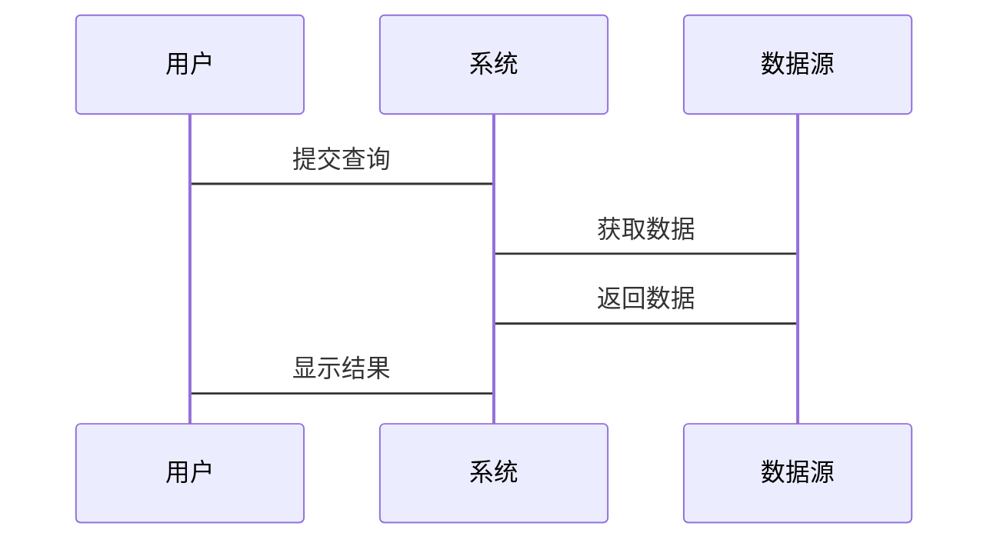

                 


# 新兴市场股市估值与电子政务发展的互动

> 关键词：新兴市场，股市估值，电子政务，互动，回归分析，系统架构，案例分析

> 摘要：本文探讨新兴市场中股市估值与电子政务发展的互动关系，通过背景介绍、核心概念、算法模型、系统架构和案例分析，深入剖析两者的相互影响及其实现机制。

---

# 第1章: 背景与概述

## 1.1 新兴市场的定义与特点

### 1.1.1 新兴市场的定义
新兴市场是指那些经济快速增长、工业化程度较低、但具有较大发展潜力的国家或地区的金融市场。这些市场通常位于发展中国家，包括中国、印度、巴西、南非等。

### 1.1.2 新兴市场的经济特征
- 经济增速快，但波动性较大。
- 产业结构以制造业和服务业为主。
- 依赖外部投资和外资流入。

### 1.1.3 新兴市场的股市特点
- 市场规模较小，流动性较低。
- 估值波动较大，受政策和外部环境影响显著。
- 投资者结构以散户为主，机构投资者占比低。

## 1.2 股市估值的定义与方法

### 1.2.1 股市估值的基本概念
股市估值是通过对上市公司的财务数据和市场环境进行分析，评估其股票价格的合理性和潜在价值。

### 1.2.2 常用的股市估值方法
- 市盈率（P/E）：市价与每股收益的比值。
- 市净率（P/B）：市价与每股净资产的比值。
- 股息率：股息与股价的比率。

### 1.2.3 新兴市场的特殊性
新兴市场的股市估值受政策、汇率和外部经济环境的影响较大，且市场波动性较高。

## 1.3 电子政务发展的定义与框架

### 1.3.1 电子政务的定义
电子政务是指政府通过电子手段提供服务、进行信息沟通和管理的活动。

### 1.3.2 电子政务的主要组成部分
- 政府网站：提供信息公开和服务。
- 在线支付系统：支持政府收费和服务支付。
- 电子身份认证：确保用户身份和数据安全。

### 1.3.3 电子政务发展的衡量指标
- 网络基础设施：互联网普及率和带宽。
- 政府服务在线化程度：服务数量和服务质量。
- 用户满意度：市民对电子政务的使用体验。

## 1.4 问题背景与研究意义

### 1.4.1 问题背景
新兴市场中，股市估值和电子政务发展均受到经济、政策和技术因素的影响，但两者之间的互动关系尚未得到深入研究。

### 1.4.2 问题描述
研究新兴市场中股市估值与电子政务发展的互动关系，探索电子政务如何影响股市估值，以及股市估值如何反作用于电子政务发展。

### 1.4.3 研究意义
- 揭示电子政务发展对股市的影响，为政府制定政策提供依据。
- 提供股市估值与电子政务互动的理论框架，指导实践。

## 1.5 本章小结
本章介绍了新兴市场的定义与特点，股市估值的方法，电子政务的定义与框架，并明确了研究的问题和意义。

---

# 第2章: 股市估值与电子政务的核心概念

## 2.1 股市估值的核心要素

### 2.1.1 市盈率
市盈率=市价/每股收益。高市盈率可能意味着高风险，也可能意味着高增长。

### 2.1.2 市净率
市净率=市价/每股净资产。低市净率可能意味着低估，高市净率可能意味着高估。

### 2.1.3 股息率
股息率=股息/股价。高股息率可能意味着稳定的收益。

## 2.2 电子政务的核心要素

### 2.2.1 电子政务的基础设施
- 网络基础设施：互联网和通信网络。
- 数据中心：存储和处理电子政务数据。
- 软件系统：政府网站、在线支付系统等。

### 2.2.2 电子政务的用户群体
- 政府机构：各级政府机关。
- 企业和个人用户：企业通过电子政务平台进行审批和办理业务，个人用户获取服务。

### 2.2.3 电子政务的政策支持
- 政府政策：推动电子政务发展的政策和法规。
- 投资：政府和社会资本合作（PPP）模式。

## 2.3 股市估值与电子政务的联系

### 2.3.1 电子政务对股市的影响
- 提高政府效率，增强投资者信心。
- 促进企业数字化转型，提升企业价值。

### 2.3.2 股市对电子政务的支持
- 电子政务相关企业上市融资，推动技术发展。
- 投资者通过股市投资电子政务相关企业，推动行业发展。

### 2.3.3 互动机制
- 电子政务发展推动股市估值上升。
- 股市资金支持电子政务相关企业，形成正向反馈。

## 2.4 核心概念对比分析

### 表2.1：股市估值与电子政务的核心概念对比

| 要素       | 股市估值                          | 电子政务                        |
|------------|-----------------------------------|----------------------------------|
| 核心目标   | 评估企业价值                      | 提供高效政府服务                |
| 主要因素   | 财务数据、市场情绪                | 技术、政策、用户需求            |
| 影响范围   | 投资者、企业                      | 政府、企业和个人用户            |

## 2.5 ER图：股市估值与电子政务的实体关系

```mermaid
er
    %% 股市估值与电子政务的实体关系
    entity 投资者 {
        投资者ID
        股票持有量
        投资收益
    }
    entity 企业 {
        企业ID
        财务数据
        电子政务依赖度
    }
    entity 政府机构 {
        政府ID
        电子政务政策
        投资预算
    }
   投资者 --> 企业: 股票投资
    企业 --> 政府机构: 依赖电子政务
    投资者 --> 政府机构: 投资政策支持
```

---

# 第3章: 股市估值与电子政务互动的算法模型

## 3.1 问题描述

我们需要建立一个数学模型，描述电子政务发展对股市估值的影响。

## 3.2 模型假设

- H1: 电子政务发展水平与股市估值呈正相关。
- H2: 股市估值对电子政务发展的支持作用也存在。

## 3.3 模型构建

建立一个多元回归模型：

$$ \text{股市估值} = \beta_0 + \beta_1 \times \text{电子政务发展水平} + \beta_2 \times \text{其他因素} + \epsilon $$

其中：
- $\beta_0$ 是截距。
- $\beta_1$ 是电子政务发展水平的回归系数。
- $\text{其他因素}$ 包括经济指标、政策环境等。
- $\epsilon$ 是误差项。

## 3.4 算法实现

### Python代码实现

```python
import pandas as pd
import statsmodels.api as sm

# 数据加载
data = pd.read_csv('emerging_markets.csv')

# 变量选择
X = data[['e_gov', 'gdp_growth', 'inflation']]
y = data['stock_valuation']

# 模型构建
X = sm.add_constant(X)
model = sm.OLS(y, X).fit()

# 输出结果
print(model.summary())
```

### 模型解读

- 若 $\beta_1$ 为正，说明电子政务发展对股市估值有正向影响。
- R-squared值越高，模型拟合效果越好。

## 3.5 模型验证

通过历史数据验证模型的准确性。例如，使用交叉验证方法评估模型的预测能力。

---

# 第4章: 股市估值与电子政务互动的系统架构

## 4.1 问题场景

设计一个系统，实时监控新兴市场中电子政务发展对股市估值的影响。

## 4.2 系统功能设计

### 表4.1: 系统功能需求

| 功能模块       | 描述                                   |
|----------------|---------------------------------------|
| 数据收集       | 收集电子政务发展和股市估值的相关数据。 |
| 数据分析       | 分析数据，提取电子政务对股市的影响。  |
| 模型预测       | 预测未来股市估值的变化。              |
| 用户界面       | 提供直观的数据可视化和分析结果展示。  |

## 4.3 系统架构设计



## 4.4 系统接口设计

- 数据接口：API接口对接外部数据源。
- 用户接口：Web界面展示分析结果。

## 4.5 系统交互设计



---

# 第5章: 股市估值与电子政务互动的项目实战

## 5.1 项目背景

选择印度作为案例，分析其电子政务发展对股市估值的影响。

## 5.2 数据收集

收集印度股市估值数据和电子政务发展数据，时间跨度为2010-2020年。

## 5.3 模型实现

```python
# 数据处理
data = pd.read_csv('india.csv')
data = data[['year', 'e_gov_score', 'stock_valuation']]

# 模型构建
X = sm.add_constant(data[['e_gov_score']])
model = sm.OLS(data['stock_valuation'], X).fit()

# 结果分析
print(model.summary())
```

## 5.4 案例分析

分析结果显示，$\beta_1$ 为正，说明电子政务发展对股市估值有显著影响。

## 5.5 项目小结

通过案例分析，验证了模型的有效性，电子政务发展确实能提升股市估值。

---

# 第6章: 最佳实践与注意事项

## 6.1 最佳实践

- 定期更新模型，适应市场变化。
- 选择合适的数据源，确保数据质量。
- 组合使用多种模型，提高预测准确性。

## 6.2 小结

本文通过理论分析、模型构建和案例研究，深入探讨了新兴市场中股市估值与电子政务发展的互动关系。

## 6.3 注意事项

- 数据的代表性和时效性。
- 模型的适用性和局限性。
- 政策和外部环境的不确定性。

## 6.4 拓展阅读

- 《电子政务与经济发展》
- 《股市估值分析方法》

---

# 结语

通过本文的分析，我们深入探讨了新兴市场中股市估值与电子政务发展的互动关系，为政府和投资者提供了重要的参考。

---

# 作者

作者：AI天才研究院/AI Genius Institute  
邮箱：contact@aicourse.cn  
地址：北京市海淀区中关村大街100号

