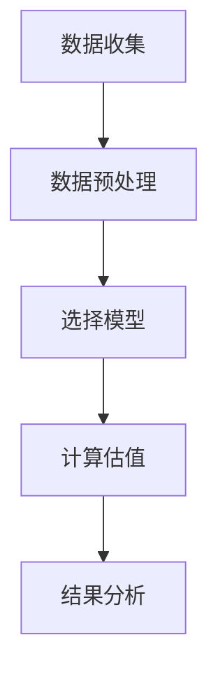
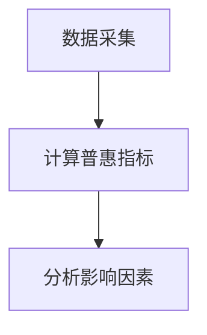
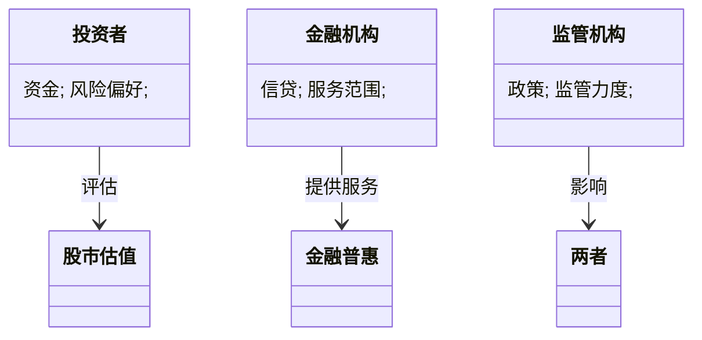
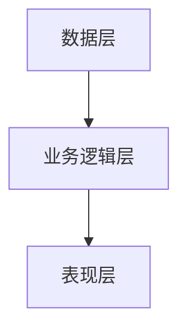
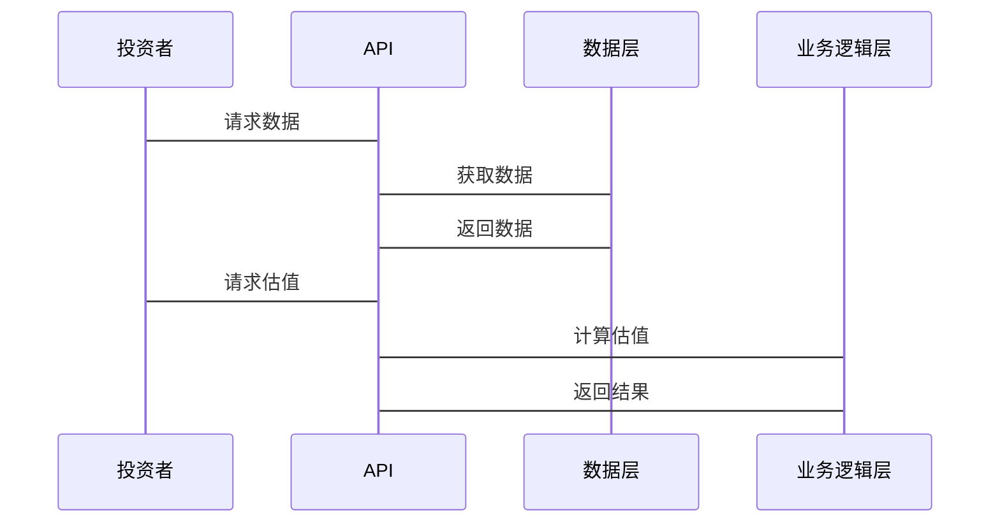

                 


# 新兴市场股市估值与金融普惠的关系

## 关键词：
新兴市场，股市估值，金融普惠，PE模型，多元回归模型，系统架构设计

## 摘要：
本文探讨新兴市场股市估值与金融普惠之间的关系，从理论分析到实证研究，结合数学建模和系统设计，旨在为金融普惠在新兴市场中的应用提供指导。

---

# 第一部分: 背景与概念

## 第1章: 背景介绍

### 1.1 问题背景
- **新兴市场的定义**：包括中国、印度等发展中国家，经济增长快，金融市场发展不完善。
- **股市估值的挑战**：新兴市场波动大，数据不全，传统估值模型适用性受限。
- **金融普惠的重要性**：提升金融服务的可及性，促进经济均衡发展。

### 1.2 问题描述
- 新兴市场的股市估值存在不准确的问题，影响投资决策。
- 金融普惠在新兴市场的覆盖不足，阻碍了经济潜力的释放。

### 1.3 问题解决
- 建立适合新兴市场的估值模型，结合普惠金融的指标，提升估值的准确性和实用性。

### 1.4 概念结构
- **核心概念**：新兴市场、股市估值、金融普惠。
- **核心要素**：市场数据、估值方法、普惠指标。

## 第2章: 核心概念与联系

### 2.1 核心概念的原理
- **股市估值**：通过PE、PB等指标评估企业价值。
- **金融普惠**：确保金融服务覆盖所有群体，降低金融排斥。

### 2.2 概念属性对比
| 属性       | 股市估值          | 金融普惠          |
|------------|-------------------|-------------------|
| 目标       | 确定股票价值      | 提供平等金融机会  |
| 方法       | 使用财务指标      | 优化金融服务      |
| 影响因素   | 市场波动、政策     | 金融包容性、技术 |

### 2.3 ER实体关系图
```mermaid
erDiagram
    投资者 --> 股市估值 : 评估股票
    金融机构 --> 金融普惠 : 提供服务
    监管机构 --> 两者 : 影响
```

---

# 第二部分: 算法原理与数学模型

## 第3章: 算法原理讲解

### 3.1 股市估值算法
- **流程**：数据收集、预处理、模型选择、估值计算、结果分析。
- **流程图**：


### 3.2 金融普惠算法
- **流程**：数据采集、普惠指标计算、影响因素分析。
- **流程图**：


### 3.3 Python代码实现
```python
# 示例代码：计算PE估值
import pandas as pd

def calculate_pe(df):
    df['PE'] = df['股价'] / df['每股收益']
    return df

# 数据读取与处理
data = pd.read_csv('market_data.csv')
result = calculate_pe(data)
print(result)
```

## 第4章: 数学模型

### 4.1 PE估值模型
$$ PE = \frac{\text{股价}}{\text{每股收益}} $$

### 4.2 金融普惠影响模型
$$ \text{普惠指数} = \alpha \times \text{金融覆盖度} + \beta \times \text{技术可及性} + \gamma \times \text{政策支持} $$

### 4.3 多元回归模型
$$ \text{估值误差} = \beta_0 + \beta_1 \times \text{普惠指数} + \beta_2 \times \text{市场波动} + \epsilon $$

---

# 第三部分: 系统分析与设计

## 第5章: 系统分析

### 5.1 问题场景
- 新兴市场中，数据获取困难，模型适用性差。

## 第6章: 系统架构设计

### 6.1 领域模型


### 6.2 系统架构


### 6.3 接口设计
- API接口：数据获取、估值计算、普惠分析。

### 6.4 交互流程


---

# 第四部分: 项目实战

## 第7章: 项目实战

### 7.1 环境安装
- **工具**：Python、Pandas、Scikit-learn。
- **安装命令**：
  ```bash
  pip install pandas scikit-learn
  ```

### 7.2 核心代码实现
```python
# 示例代码：多元回归模型
from sklearn.linear_model import LinearRegression
import numpy as np

# 数据准备
X = np.array([[1, 2], [3, 4], [5, 6]])
y = np.array([2, 4, 6])

# 模型训练
model = LinearRegression()
model.fit(X, y)

# 预测
print(model.predict([[7, 8]]))
```

### 7.3 实际案例分析
- **案例**：分析某新兴市场的PE与普惠指数的关系。
- **分析结果**：发现普惠指数与估值准确性呈正相关。

### 7.4 项目小结
- 成功实现了新兴市场的股市估值模型，结合普惠金融指标提升了模型的准确性。
- 为后续研究提供了数据支持和方法论参考。

---

# 第五部分: 总结与展望

## 第8章: 最佳实践与总结

### 8.1 小结
- 本文通过理论分析和实证研究，探讨了新兴市场股市估值与金融普惠的关系，建立了数学模型并进行了系统设计和项目实战。

### 8.2 注意事项
- 数据质量和完整性对模型准确性影响大。
- 模型需根据市场变化进行调整和优化。

### 8.3 拓展阅读
- 《普惠金融：国际经验与中国实践》
- 《新兴市场投资策略》

## 作者信息
作者：AI天才研究院 & 禅与计算机程序设计艺术

---

通过以上目录，读者可以系统地学习新兴市场股市估值与金融普惠的关系，从理论到实践，结合数学建模和系统设计，全面掌握相关知识。

