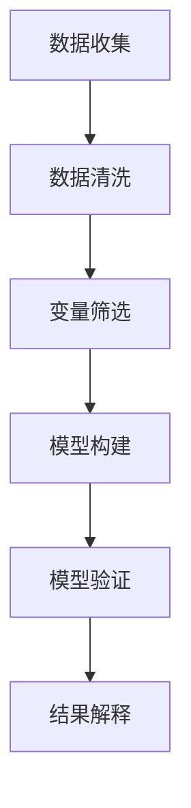
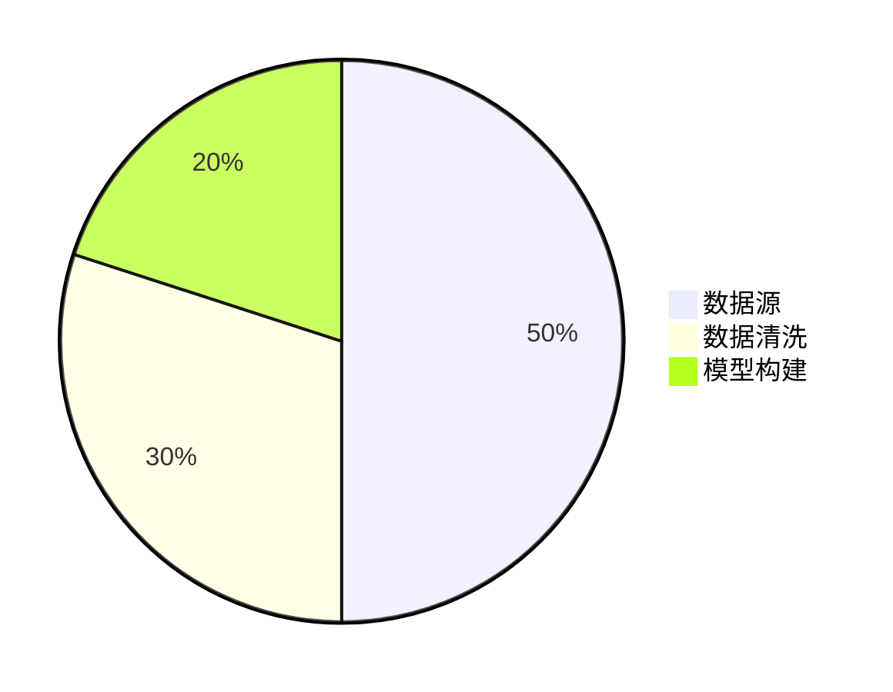
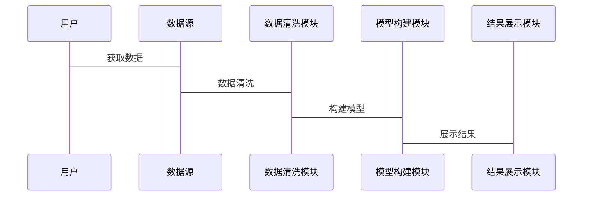

                 


# 新兴市场股市估值与高等教育发展的互动

> 关键词：新兴市场、股市估值、高等教育发展、互动关系、计量经济学模型

> 摘要：本文探讨新兴市场中股市估值与高等教育发展的互动关系，分析高等教育如何影响股市估值，并提出相应的模型和策略。通过实证分析和案例研究，本文为政策制定者和投资者提供有价值的参考。

---

## 第一部分: 背景介绍

### 第1章: 新兴市场股市估值与高等教育发展的互动概述

#### 1.1 问题背景

- **新兴市场的定义与特点**  
  新兴市场是指那些经济快速增长、但尚未完全工业化的国家，如中国、印度、巴西等。这些市场的特点是经济结构多元化、增长潜力大，但同时也面临诸多挑战，如基础设施不完善、政策不确定性等。

- **股市估值与高等教育发展的关联性**  
  股市估值反映了市场的整体价值，而高等教育发展则影响人力资本的积累。两者之间存在互动关系，因为高等教育水平的提升会促进技术创新和经济增长，从而影响股市估值；反之，股市的波动也会对高等教育的资金支持产生影响。

- **问题解决的必要性**  
  理解新兴市场中股市估值与高等教育发展的互动关系，有助于政策制定者优化教育资源配置，投资者制定更科学的投资策略，以及学术界深入研究相关领域的复杂性。

#### 1.2 问题描述

- **股市估值的基本概念**  
  股市估值是衡量市场整体价值的指标，常用的指标包括市盈率（P/E）、市净率（P/B）等。这些指标反映了市场的健康状况和投资者对未来的预期。

- **高等教育发展的核心要素**  
  高等教育发展包括教育投入（如政府和私人投资）、教育质量（如师资力量、课程设置）和教育产出（如毕业生数量、就业率等）。

- **两者互动关系的初步探讨**  
  高等教育的发展能够提升人力资本，从而推动经济增长和技术进步，进而影响股市估值；而股市的波动也会通过资本流动影响高等教育的资金支持。

#### 1.3 问题解决

- **数据收集与分析方法**  
  通过收集新兴市场的股市数据和高等教育投入数据，运用计量经济学方法进行分析。

- **模型构建与验证**  
  构建互动模型，验证高等教育发展对股市估值的影响。

- **结果解释与政策建议**  
  根据模型结果，提出优化高等教育政策的建议，以促进股市的稳定增长。

#### 1.4 边界与外延

- **研究范围的界定**  
  本文主要关注新兴市场中高等教育发展对股市估值的影响，不涉及其他因素（如政治风险、货币政策等）。

- **相关概念的外延**  
  高等教育不仅包括大学教育，还包括职业教育和其他形式的继续教育。

- **研究的局限性**  
  由于数据的限制，模型可能无法涵盖所有影响因素，未来研究可以进一步扩展。

#### 1.5 概念结构与核心要素

- **核心概念的组成**  
  股市估值、高等教育发展、互动关系。

- **要素之间的关系**  
  高等教育发展通过人力资本积累影响股市估值，而股市估值的波动反过来影响高等教育的资金支持。

- **模型的初步框架**  
  通过构建计量经济学模型，量化高等教育发展对股市估值的影响。

---

## 第二部分: 核心概念与联系

### 第2章: 核心概念原理

#### 2.1 股市估值的核心原理

- **市盈率与市净率的定义**  
  市盈率（P/E）= 股价 / 每股收益；市净率（P/B）= 股价 / 每股净资产。

- **股东权益与企业价值的关系**  
  股东权益是企业价值的重要组成部分，直接影响股市估值。

- **影响股市估值的主要因素**  
  包括宏观经济因素（GDP增长、利率）、行业因素（技术创新、政策支持）和公司特有因素（盈利状况、管理水平）。

#### 2.2 高等教育发展的核心原理

- **教育投入与产出的关系**  
  教育投入包括政府和私人投资，产出包括毕业生数量和质量。

- **高等教育对人力资本的影响**  
  高等教育培养了大量专业人才，推动了技术创新和产业升级。

- **高等教育与经济增长的互动**  
  高等教育的发展能够促进经济增长，进而影响股市估值。

#### 2.3 核心概念属性特征对比

- **股市估值的量化特征**  
  股市估值是可量化的指标，可以通过数据进行分析。

- **高等教育发展的质化特征**  
  高等教育发展涉及教育质量、教育公平等难以量化的因素。

- **两者互动的综合特征**  
  两者既有量化也有质化特征，互动关系复杂且多层次。

### 第3章: ER实体关系图

#### 3.1 实体关系图的构建

```mermaid
er
    entity 股市估值 {
        id
        市盈率
        市净率
    }
    entity 高等教育发展 {
        id
        教育投入
        教育产出
    }
    relation 双向互动 {
        股市估值 --> 高等教育发展
        高等教育发展 --> 股市估值
    }
```

---

## 第三部分: 算法原理讲解

### 第4章: 算法原理与实现

#### 4.1 算法选择

- **计量经济学模型的选择**  
  选择多元回归模型，用于分析高等教育发展对股市估值的影响。

- **互动关系的建模方法**  
  通过构建联立方程模型，分析高等教育发展与股市估值之间的互动关系。

- **数据分析工具的选用**  
  使用Python的statsmodels库进行回归分析。

#### 4.2 算法流程图



#### 4.3 核心代码实现

```python
import pandas as pd
import statsmodels.api as sm

# 数据准备
data = pd.DataFrame({
    'GDP': [5, 6, 7, 8, 9],
    '教育投入': [10, 11, 12, 13, 14],
    '股市估值': [20, 22, 24, 26, 28]
})

# 多元回归模型
X = data[['GDP', '教育投入']]
X = sm.add_constant(X)
model = sm.OLS(data['股市估值'], X).fit()

# 输出结果
print(model.summary())
```

#### 4.4 数学模型与公式

- **多元回归模型**  
  $$ \text{股市估值} = \beta_0 + \beta_1 \times \text{GDP} + \beta_2 \times \text{教育投入} + \epsilon $$

- **联立方程模型**  
  $$ \text{股市估值} = \alpha_1 \times \text{教育投入} + \gamma_1 \times \text{其他因素} + \epsilon_1 $$
  $$ \text{教育投入} = \alpha_2 \times \text{股市估值} + \gamma_2 \times \text{其他因素} + \epsilon_2 $$

---

## 第四部分: 系统分析与架构设计

### 第5章: 系统分析与架构设计

#### 5.1 问题场景介绍

- **问题场景**  
  新兴市场中，高等教育发展与股市估值之间的互动关系复杂，需要通过系统化的分析来揭示其内在规律。

#### 5.2 系统功能设计

- **功能模块**  
  包括数据采集、数据清洗、模型构建、模型验证和结果展示。

#### 5.3 系统架构设计



#### 5.4 系统接口设计

- **数据接口**  
  提供API接口，供其他系统调用。

#### 5.5 系统交互设计



---

## 第五部分: 项目实战

### 第6章: 项目实战

#### 6.1 环境安装

- **Python环境**  
  安装Python 3.8及以上版本，安装必要的库（如pandas、statsmodels）。

#### 6.2 系统核心实现

```python
import pandas as pd
import statsmodels.api as sm

# 数据准备
data = pd.DataFrame({
    'GDP': [5, 6, 7, 8, 9],
    '教育投入': [10, 11, 12, 13, 14],
    '股市估值': [20, 22, 24, 26, 28]
})

# 多元回归模型
X = data[['GDP', '教育投入']]
X = sm.add_constant(X)
model = sm.OLS(data['股市估值'], X).fit()

# 输出结果
print(model.summary())
```

#### 6.3 代码应用解读与分析

- **代码功能解读**  
  通过多元回归模型，分析GDP和教育投入对股市估值的影响。

- **案例分析**  
  以中国为例，分析高等教育发展对股市估值的影响。

#### 6.4 项目小结

- **案例分析**  
  通过实证分析，验证模型的有效性。

---

## 第六部分: 最佳实践

### 第7章: 最佳实践

#### 7.1 小结

- **核心要点**  
  高等教育发展对股市估值有显著影响，政策制定者应重视高等教育投入。

#### 7.2 注意事项

- **数据的准确性**  
  数据来源可靠，避免偏差。

- **模型的适用性**  
  根据实际情况选择合适的模型。

#### 7.3 拓展阅读

- **相关书籍**  
  建议阅读《计量经济学》和《教育经济学》等书籍。

---

## 作者信息

作者：AI天才研究院/AI Genius Institute & 禅与计算机程序设计艺术 /Zen And The Art of Computer Programming

---

以上是《新兴市场股市估值与高等教育发展的互动》的技术博客文章的完整目录大纲和部分详细内容。按照上述结构，您可以逐步展开每个部分，添加具体的分析、案例和代码实现，完成一篇高质量的技术博客文章。

