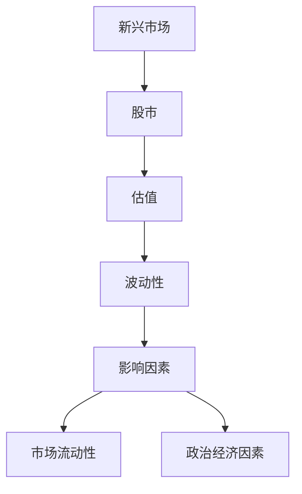
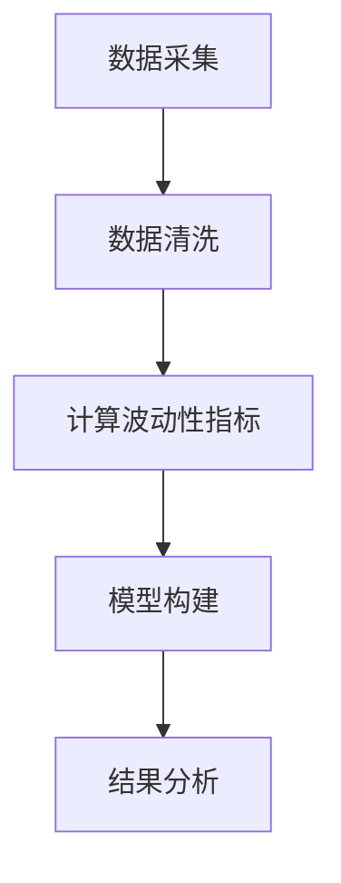

                 


# 新兴市场股市估值的波动性研究

## 关键词：新兴市场，股市估值，波动性，算法，系统架构

## 摘要：本文通过分析新兴市场股市估值的波动性，探讨其影响因素和数学模型，结合实际案例和算法实现，为投资者和研究者提供参考。

## 第一部分: 新兴市场股市估值的波动性研究概述

### 第1章: 背景介绍

#### 1.1 问题背景
新兴市场是指那些经济快速发展、市场机制逐步完善的国家的股市。由于这些市场的特殊性，其股市估值波动性较大。本文旨在研究这种波动性的规律。

#### 1.2 问题描述
股市估值的波动性是衡量市场风险的重要指标。新兴市场由于市场流动性不足、信息不透明等因素，波动性更为显著。

#### 1.3 问题解决与核心概念
通过构建数学模型，分析波动性的影响因素，提出有效的风险管理策略。

### 第2章: 核心概念与联系

#### 2.1 核心概念的原理
股市估值波动性可以通过统计学方法和机器学习模型进行分析。常用的指标包括标准差、波动率等。

#### 2.2 核心概念的属性特征对比
| 特性       | 波动率高的市场 | 波动率低的市场 |
|------------|----------------|----------------|
| 风险       | 高             | 低             |
| 投资者行为  | 不稳定         | 稳定           |

#### 2.3 ER实体关系图架构


## 第二部分: 波动性分析与算法实现

### 第3章: 算法原理讲解

#### 3.1 波动性计算的算法流程


#### 3.2 算法实现代码
```python
import pandas as pd
import numpy as np

def calculate_volatility(data):
    returns = data.pct_change()
    volatility = returns.std() * np.sqrt(252)
    return volatility

# 示例数据
data = pd.read_csv('stock_data.csv')
volatility = calculate_volatility(data)
print(f"波动率: {volatility}")
```

## 第三部分: 系统分析与架构设计

### 第4章: 系统架构设计

#### 4.1 系统功能设计
模块包括数据采集、清洗、建模和结果分析。

#### 4.2 系统架构图


## 第四部分: 项目实战

### 第5章: 项目实战

#### 5.1 环境安装
安装所需的库，如Pandas、NumPy等。

#### 5.2 代码实现
编写代码，实现波动性计算和模型构建。

#### 5.3 案例分析
分析实际案例，解读结果。

## 第五部分: 小结与展望

### 第6章: 小结

总结研究成果，强调波动性分析的重要性。

### 第7章: 展望

提出未来可能的研究方向，如引入更多影响因素。

## 作者

作者：AI天才研究院/AI Genius Institute & 禅与计算机程序设计艺术 /Zen And The Art of Computer Programming

