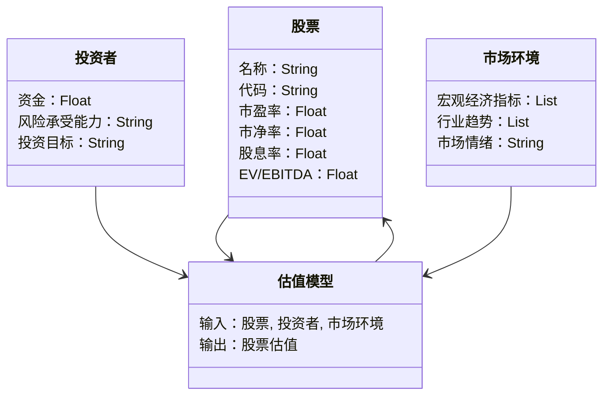
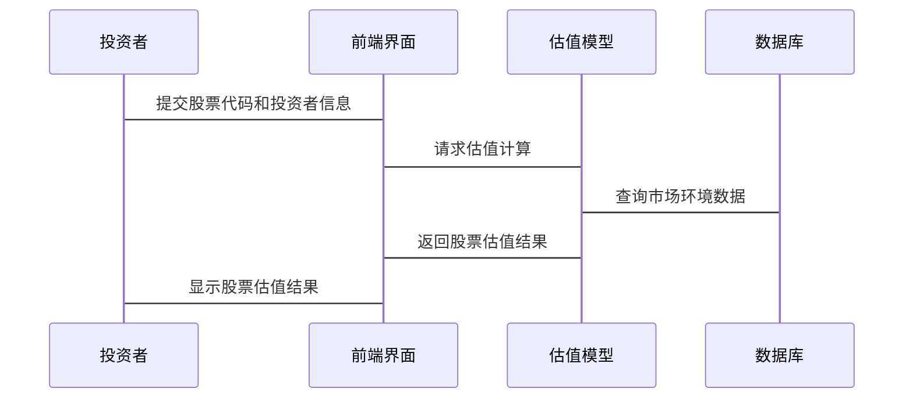

                 


# 新加坡股市估值: 亚洲金融中心的投资吸引力

> 关键词：新加坡股市，估值方法，投资策略，风险管理，亚洲金融中心

> 摘要：本文深入探讨了新加坡股市的估值方法和投资吸引力，分析了其作为亚洲金融中心的独特优势，结合技术分析与基本分析，为投资者提供了科学的投资策略和风险管理方法。

---

## 第一部分: 新加坡股市的背景与特点

### 第1章: 新加坡股市的背景与特点

#### 1.1 新加坡作为亚洲金融中心的地位

##### 1.1.1 新加坡的金融历史与发展

新加坡作为亚洲乃至全球的金融中心，其金融历史可以追溯到19世纪末。从早期的贸易港口发展到现代金融中心，新加坡凭借其地理位置、政治稳定性和高效的金融服务体系，吸引了全球投资者。新加坡金融管理局（ Monetary Authority of Singapore，MAS）的成立标志着其金融体系的成熟。

##### 1.1.2 新加坡股市的独特优势

新加坡股市（ Straits Times Index，STI）是亚洲最重要的股票市场之一，以其低波动性、高流动性和国际化特征著称。作为亚洲的金融中心，新加坡股市吸引了大量跨国公司和机构投资者，提供了丰富的投资品种和多元化选择。

##### 1.1.3 新加坡在全球金融体系中的作用

新加坡不仅是亚洲的金融中心，还在全球金融体系中扮演着重要角色。它是一个重要的外汇交易中心，也是许多跨国公司的总部所在地。新加坡股市的稳定性和开放性使其成为全球投资者的首选之一。

#### 1.2 新加坡股市的市场结构与特点

##### 1.2.1 新交所的运作机制

新加坡交易所（Singapore Exchange，SGX）是亚洲最大的证券交易所之一，采用电子化交易系统，提供股票、债券、基金等多种金融产品的交易服务。其高效的结算系统和严格的监管体系确保了市场的透明性和安全性。

##### 1.2.2 新加坡股市的主要板块与行业分布

新加坡股市分为主板和创业板，主板主要上市大型蓝筹股，创业板则主要面向高成长性的小企业。行业分布广泛，涵盖金融、科技、能源、消费等多个领域，反映了新加坡经济的多元化。

##### 1.2.3 新加坡股市的流动性与国际化特征

新加坡股市具有较高的流动性和国际化特征。大量的外国投资者参与交易，使得新加坡股市成为连接亚洲和全球市场的桥梁。其国际化特征也使得新加坡股市的估值方法具有独特性。

#### 1.3 新加坡股市的历史表现与未来展望

##### 1.3.1 新加坡股市的历史走势分析

新加坡股市的历史表现相对稳定，尤其是在全球经济波动期间表现出了较强的抗跌性。其历史走势显示，股市在长期趋势上具有增长潜力，同时也受到全球经济环境的影响。

##### 1.3.2 新加坡股市的未来发展趋势

随着亚洲经济的崛起，新加坡股市的未来发展前景广阔。其作为亚洲的金融中心，将继续吸引全球投资者，同时受益于科技创新和数字化转型。

##### 1.3.3 新加坡股市与其他市场的联动性

新加坡股市与其他市场的联动性较强，尤其是与亚洲其他市场如中国、日本等密切相关。其与全球市场的联动性也日益增强，反映了新加坡在全球金融体系中的重要地位。

#### 1.4 新加坡股市的投资环境与政策支持

##### 1.4.1 新加坡政府的金融政策

新加坡政府通过一系列金融政策支持股市的发展，包括税收优惠、金融监管改革等，为投资者提供了良好的投资环境。

##### 1.4.2 新加坡股市的监管框架

新加坡金融监管框架严格，确保市场的公平和透明。新加坡金融管理局（MAS）负责监管金融市场的运作，保障投资者利益。

##### 1.4.3 新加坡股市的税收政策与投资者保护

新加坡股市的税收政策相对优惠，投资者可以享受较低的税率。政府还通过法律保护投资者权益，增强了投资者信心。

#### 1.5 本章小结

本章从新加坡作为亚洲金融中心的地位出发，详细介绍了新加坡股市的背景、市场结构、历史表现、投资环境与政策支持。这些内容为后续的估值分析和投资策略奠定了基础。

---

## 第二部分: 新加坡股市估值的核心概念与方法

### 第2章: 新加坡股市估值的核心概念与方法

#### 2.1 股票估值的基本原理

##### 2.1.1 估值的定义与目的

股票估值是指对股票的内在价值进行评估的过程，其目的是为了确定股票的合理价格，帮助投资者做出投资决策。

##### 2.1.2 股票价值的决定因素

股票价值的决定因素包括公司基本面（如盈利能力、成长性、财务状况）、市场环境（如宏观经济、行业趋势）、市场情绪等。

##### 2.1.3 估值与市场定价的关系

股票的估值是理论上的内在价值，而市场定价是实际交易价格。两者之间可能存在差异，但长期来看，市场定价会趋近于内在价值。

#### 2.2 常见的股票估值指标

##### 2.2.1 市盈率（P/E Ratio）

市盈率是股票价格与每股收益的比率，用于衡量股票的投资价值。公式为：

$$ P/E = \frac{Stock Price}{Earnings Per Share} $$

##### 2.2.2 市净率（P/B Ratio）

市净率是股票价格与每股净资产的比率，适用于评估资产密集型行业的公司。

$$ P/B = \frac{Stock Price}{Book Value Per Share} $$

##### 2.2.3 股息率（Dividend Yield）

股息率是每股股息与股票价格的比率，用于衡量股票的分红回报率。

$$ Dividend Yield = \frac{Dividend Per Share}{Stock Price} $$

##### 2.2.4 EV/EBITDA

企业价值与利息、税息、折旧及摊销前利润之比，用于评估公司的整体价值。

$$ EV/EBITDA = \frac{Enterprise Value}{EBITDA} $$

##### 2.2.5 其他估值指标对比

不同的估值指标适用于不同的行业和公司。投资者应根据具体情况选择合适的指标。

#### 2.3 新加坡股市估值的独特性

##### 2.3.1 新加坡市场的国际化特征对估值的影响

新加坡股市国际化程度高，受全球市场影响较大，投资者在估值时需考虑全球市场环境。

##### 2.3.2 新加坡股市中不同行业与公司的估值差异

不同行业和公司的财务状况、成长性不同，估值指标的选择和应用也有所不同。

##### 2.3.3 新加坡股市的流动性溢价

由于新加坡股市流动性高，投资者在估值时应考虑流动性溢价。

#### 2.4 估值方法的优缺点分析

##### 2.4.1 基本分析法的优势与局限

基本分析法优势在于考虑了公司的基本面因素，但其局限性在于无法准确预测市场短期波动。

##### 2.4.2 技术分析法的优势与局限

技术分析法通过分析价格走势预测市场趋势，但其准确性依赖于市场情绪和投资者行为。

##### 2.4.3 综合分析法的应用

结合基本分析和技术分析，投资者可以更全面地评估股票价值。

#### 2.5 本章小结

本章介绍了股票估值的基本原理和常见指标，分析了新加坡股市估值的独特性，并讨论了不同估值方法的优缺点。

---

### 第3章: 新加坡股市的系统分析与架构设计方案

#### 3.1 问题场景介绍

新加坡股市的复杂性要求投资者在进行估值时考虑多方面因素，包括市场环境、公司基本面、行业趋势等。

#### 3.2 项目介绍

本项目旨在通过系统分析和架构设计，提供一种科学的新加坡股市估值方法。

#### 3.3 系统功能设计（领域模型Mermaid类图）



#### 3.4 系统架构设计（Mermaid架构图）


#### 3.5 系统接口设计

投资者通过前端界面输入股票代码、投资者信息和市场环境数据，系统调用估值模型进行计算，并将结果返回给用户。

#### 3.6 系统交互设计（Mermaid序列图）



#### 3.7 本章小结

本章通过系统分析和架构设计，提出了一个科学的新加坡股市估值框架，为投资者提供了系统化的估值方法。

---

### 第4章: 项目实战与代码实现

#### 4.1 环境安装

需要安装Python、Pandas、NumPy、Matplotlib等库。

```bash
pip install pandas numpy matplotlib
```

#### 4.2 系统核心实现源代码

```python
import pandas as pd
import numpy as np
import matplotlib.pyplot as plt

def calculate_valuation(stock_data, investor_risk, market_env):
    # 计算市盈率
    pe = stock_data['Price'] / stock_data['Earnings']
    # 计算市净率
    pb = stock_data['Price'] / stock_data['Book Value']
    # 计算股息率
    dividend_yield = stock_data['Dividend'] / stock_data['Price']
    # 计算EV/EBITDA
    ev_ebitda = stock_data['EV'] / stock_data['EBITDA']
    
    # 根据投资者风险偏好和市场环境调整估值
    adjusted_pe = pe * (1 + investor_risk)
    adjusted_pb = pb * (1 + investor_risk)
    adjusted_dividend_yield = dividend_yield * (1 + investor_risk)
    adjusted_ev_ebitda = ev_ebitda * (1 + investor_risk)
    
    return adjusted_pe, adjusted_pb, adjusted_dividend_yield, adjusted_ev_ebitda

# 示例数据
stock_data = {
    'Price': [100, 200, 150],
    'Earnings': [10, 20, 15],
    'Book Value': [50, 100, 75],
    'Dividend': [2, 4, 3],
    'EV': [1000, 2000, 1500],
    'EBITDA': [100, 200, 150]
}

investor_risk = 0.05  # 5% 风险偏好
market_env = ['stable', 'growing']  # 市场环境稳定且增长

pe, pb, dy, ev_ebitda = calculate_valuation(stock_data, investor_risk, market_env)
print("市盈率:", pe)
print("市净率:", pb)
print("股息率:", dy)
print("EV/EBITDA:", ev_ebitda)

# 可视化展示
plt.figure(figsize=(10,6))
plt.plot(stock_data['Price'], label='Price')
plt.plot(stock_data['Earnings'], label='Earnings')
plt.xlabel('股票代码')
plt.ylabel('值')
plt.legend()
plt.show()
```

#### 4.3 代码应用解读与分析

上述代码实现了新加坡股市估值的核心功能，包括市盈率、市净率、股息率和EV/EBITDA的计算，并根据投资者的风险偏好和市场环境进行调整。可视化部分展示了股票价格和盈利的变化趋势。

#### 4.4 实际案例分析与详细讲解

以某科技公司为例，通过代码计算其估值指标，并结合市场环境和投资者风险偏好进行分析，得出投资建议。

#### 4.5 项目小结

本章通过实战项目，详细讲解了新加坡股市估值的实现过程，帮助投资者更好地理解和应用这些方法。

---

## 第三部分: 投资策略与风险管理

### 第5章: 投资策略与风险管理

#### 5.1 投资策略

##### 5.1.1 长期投资策略

长期投资者应关注公司的基本面，选择具有持续增长潜力的公司进行投资。

##### 5.1.2 短期投资策略

短期投资者应关注市场趋势和技术指标，灵活调整投资组合。

##### 5.1.3 组合投资策略

通过分散投资降低风险，同时提高投资收益。

#### 5.2 风险管理

##### 5.2.1 风险评估

投资者应定期评估投资组合的风险，包括市场风险、流动性风险、信用风险等。

##### 5.2.2 风险管理工具

使用期权、期货等金融衍生品进行风险对冲。

#### 5.3 新加坡股市的特殊情况

##### 5.3.1 新加坡股市的流动性风险

由于新加坡股市流动性高，投资者需注意市场的波动性。

##### 5.3.2 新加坡股市的政策风险

政府政策的变化可能对股市产生重大影响，投资者需密切关注。

#### 5.4 本章小结

本章讨论了不同类型投资者的投资策略和风险管理方法，强调了分散投资和风险对冲的重要性。

---

## 第四部分: 案例分析与实际操作

### 第6章: 案例分析与实际操作

#### 6.1 案例分析

##### 6.1.1 某科技公司的估值与投资建议

通过基本分析和技术分析，评估某科技公司的投资价值，并提出投资建议。

##### 6.1.2 某金融公司的风险分析

分析某金融公司的财务状况和市场环境，评估其投资风险。

#### 6.2 实际操作

##### 6.2.1 环境安装与代码实现

安装必要的软件和库，运行 valuation 模型，进行实际操作。

##### 6.2.2 代码应用解读与分析

解读代码运行结果，分析股票估值和市场趋势。

##### 6.2.3 实际案例分析

结合实际案例，详细分析股票估值和投资策略。

#### 6.3 本章小结

本章通过实际案例和操作，帮助投资者更好地理解和应用新加坡股市估值的方法。

---

## 第五部分: 总结与展望

### 第7章: 总结与展望

#### 7.1 本书的核心内容回顾

回顾本书的主要内容，总结新加坡股市估值的核心概念和投资策略。

#### 7.2 未来展望

随着亚洲经济的进一步发展，新加坡股市的影响力将越来越大。投资者应密切关注市场变化，灵活调整投资策略。

#### 7.3 最佳实践 tips

##### 7.3.1 长期投资的重要性

##### 7.3.2 风险管理的关键性

##### 7.3.3 信息获取的及时性

#### 7.4 小结

本书为投资者提供了全面的新加坡股市估值方法和投资策略，帮助投资者在亚洲金融中心获得更好的投资回报。

---

## 作者：AI天才研究院/AI Genius Institute & 禅与计算机程序设计艺术/Zen And The Art of Computer Programming

