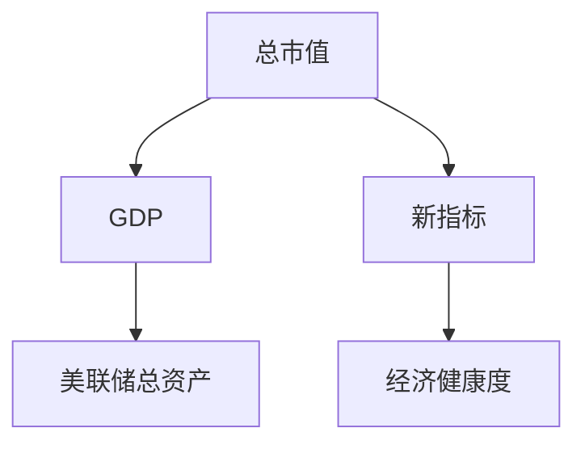

                 


---

# 新指标: 总市值占GDP与美联储总资产之和的百分比

**关键词**: 经济指标, 总市值, GDP, 美联储总资产, 经济健康度, 货币政策

**摘要**: 本文提出了一种新的经济指标，即“总市值占GDP与美联储总资产之和的百分比”。该指标旨在更全面地评估经济与市场的健康状况，通过结合传统经济指标与现代货币政策工具，为经济分析提供了新的视角。文章详细阐述了该指标的背景、原理、算法及实际应用，并通过案例分析展示了其在经济研究中的潜在价值。

---

## 第一部分: 新指标的背景与意义

### 第1章: 新指标的核心概念与问题背景

#### 1.1 问题背景与现状分析

- **1.1.1 当前经济指标体系的局限性**  
  当前的经济指标体系主要依赖于GDP、CPI、失业率等传统指标，但这些指标难以全面反映市场的整体健康状况。例如，GDP仅衡量经济总量，无法直接反映金融市场的作用。

- **1.1.2 现有经济分析工具的不足**  
  传统的经济分析工具主要关注实体经济，而忽视了金融市场与货币政策的交互作用。特别是在量化宽松政策下，美联储总资产急剧增加，其对经济的影响需要新的指标来衡量。

- **1.1.3 引入新指标的必要性**  
  通过结合总市值、GDP和美联储总资产，新指标能够更全面地反映经济与市场的互动关系，为政策制定者和投资者提供更可靠的参考。

#### 1.2 新指标的定义与描述

- **1.2.1 总市值的定义与计算方法**  
  总市值是市场上所有公司股票的总价值，通常用于衡量市场的整体规模和健康状况。

- **1.2.2 GDP的定义与计算方法**  
  GDP是衡量一个国家或地区经济总量的指标，包括所有最终产品和服务的市场价值。

- **1.2.3 美联储总资产的定义与计算方法**  
  美联储总资产包括其持有的政府债券、 mortgage-backed securities 等资产，反映了货币政策的宽松程度。

- **1.2.4 新指标的数学表达式**  
  $$新指标 = \frac{总市值}{GDP + 美联储总资产} \times 100\%$$

#### 1.3 新指标的核心要素与边界

- **1.3.1 核心要素的构成**  
  新指标由总市值、GDP和美联储总资产三个核心要素构成，分别代表市场、实体经济和货币政策。

- **1.3.2 指标的适用范围与边界**  
  该指标适用于分析国家经济与市场的互动关系，但不适用于单一市场或孤立的货币政策分析。

- **1.3.3 指标可能的局限性与改进方向**  
  新指标可能无法完全反映某些特殊经济状况，未来可结合更多指标进行优化。

---

### 第2章: 新指标的核心概念与联系

#### 2.1 核心概念的原理分析

- **2.1.1 总市值与经济表现的关系**  
  总市值的波动往往与经济周期密切相关，市场繁荣时总市值上升，经济衰退时则下降。

- **2.1.2 GDP与经济总量的关系**  
  GDP是衡量经济总量的核心指标，其增长通常反映经济的健康发展。

- **2.1.3 美联储总资产与货币政策的关系**  
  美联储通过调整资产规模来影响市场流动性，进而影响经济和市场表现。

#### 2.2 核心概念的对比分析

- **2.2.1 总市值与GDP的对比**  
  | 对比维度 | 总市值 | GDP |
  |----------|--------|-----|
  | 反映对象 | 市场规模 | 经济总量 |
  | 计算方式 | 市场价值总和 | 各产业增加值总和 |
  | 变化趋势 | 市场波动大 | 经济周期性波动 |

- **2.2.2 GDP与美联储总资产的对比**  
  | 对比维度 | GDP | 美联储总资产 |
  |----------|-----|--------------|
  | 反映对象 | 经济总量 | 货币政策力度 |
  | 计算方式 | 各产业增加值总和 | 资产总价值 |
  | 变化趋势 | 经济周期性波动 | 政策周期性变化 |

- **2.2.3 新指标与传统经济指标的对比**  
  新指标结合了市场、经济和货币政策三个维度，能够更全面地反映经济与市场的互动关系。

#### 2.3 概念关系的ER实体关系图



---

### 第3章: 新指标的算法原理与数学模型

#### 3.1 算法原理

- **3.1.1 经济指标的线性回归模型**  
  通过线性回归模型分析新指标与经济健康度之间的关系，公式如下：
  $$y = \beta_0 + \beta_1x + \epsilon$$
  其中，$y$ 表示经济健康度，$x$ 表示新指标，$\beta_0$ 和 $\beta_1$ 是回归系数。

- **3.1.2 新指标的计算流程**  
  1. 收集总市值、GDP和美联储总资产的数据。  
  2. 计算 $GDP + 美联储总资产$ 的总和。  
  3. 计算总市值占上述总和的百分比。  
  4. 将结果作为新指标的值。

- **3.1.3 算法的优化与改进**  
  通过引入时间序列分析和机器学习模型，进一步提高新指标的预测精度。

#### 3.2 数学模型与公式

- **3.2.1 线性回归模型**  
  $$y = \beta_0 + \beta_1x + \epsilon$$

- **3.2.2 新指标的数学推导**  
  $$新指标 = \frac{M}{G + F} \times 100\%$$  
  其中，$M$ 为总市值，$G$ 为 GDP，$F$ 为美联储总资产。

#### 3.3 算法实现

- **3.3.1 Python代码实现**

```python
import pandas as pd
import numpy as np
from sklearn.linear_model import LinearRegression
import matplotlib.pyplot as plt

# 数据加载与预处理
data = pd.read_csv('economic_data.csv')
X = data[['total_market_cap', 'gdp', 'federal_reserve_assets']]
y = data['economic_health']

# 线性回归模型训练
model = LinearRegression()
model.fit(X[['total_market_cap']], y)

# 新指标计算
new_indicator = (X['total_market_cap'] / (X['gdp'] + X['federal_reserve_assets'])) * 100

# 模型预测与可视化
y_pred = model.predict(X[['total_market_cap', 'new_indicator']])
plt.scatter(X['new_indicator'], y)
plt.plot(X['new_indicator'], y_pred, color='red')
plt.xlabel('New Indicator (%)')
plt.ylabel('Economic Health')
plt.title('New Indicator vs Economic Health')
plt.show()
```

---

## 第四部分: 系统分析与架构设计

### 第4章: 系统分析与架构设计

#### 4.1 问题场景介绍

- 分析经济与市场互动关系，评估新指标的可行性和实用性。

#### 4.2 项目介绍

- 新指标分析系统旨在通过数据挖掘和机器学习技术，评估经济与市场的互动关系。

#### 4.3 系统功能设计

- **领域模型（Mermaid 类图）**  
  ```mermaid
  classDiagram
      class 经济数据 {
          总市值
          GDP
          美联储总资产
      }
      class 新指标 {
          指标值
          经济健康度
      }
      class 系统功能 {
          数据采集
          指标计算
          预测分析
      }
      经济数据 --> 新指标
      新指标 --> 经济健康度
  ```

- **系统架构设计（Mermaid 架构图）**  
  ```mermaid
  architecture
      client --> server: 请求计算
      server --> database: 查询数据
      server --> processor: 处理数据
      processor --> model: 训练模型
      model --> database: 保存结果
      server --> client: 返回结果
  ```

- **系统交互设计（Mermaid 序列图）**  
  ```mermaid
  sequenceDiagram
      client -> server: 请求计算新指标
      server -> database: 查询数据
      database -> server: 返回数据
      server -> processor: 处理数据
      processor -> model: 训练模型
      model -> server: 返回结果
      server -> client: 返回新指标值
  ```

---

## 第五部分: 项目实战

### 第5章: 项目实战

#### 5.1 环境安装与数据准备

- **环境安装**  
  安装必要的 Python 包：`pandas`, `numpy`, `scikit-learn`, `matplotlib`。

- **数据准备**  
  下载包含总市值、GDP和美联储总资产的历史数据，格式为 CSV 文件。

#### 5.2 系统核心实现

- **数据预处理**  
  ```python
  import pandas as pd
  import numpy as np

  data = pd.read_csv('economic_data.csv')
  data['new_indicator'] = (data['total_market_cap'] / (data['gdp'] + data['federal_reserve_assets'])) * 100
  ```

- **模型训练与预测**  
  ```python
  from sklearn.linear_model import LinearRegression
  import matplotlib.pyplot as plt

  model = LinearRegression()
  model.fit(data[['gdp', 'federal_reserve_assets', 'new_indicator']], data['economic_health'])
  predictions = model.predict(data[['gdp', 'federal_reserve_assets', 'new_indicator']])
  ```

- **结果可视化**  
  ```python
  plt.scatter(data['new_indicator'], data['economic_health'])
  plt.plot(data['new_indicator'], predictions, color='red')
  plt.xlabel('New Indicator (%)')
  plt.ylabel('Economic Health')
  plt.title('New Indicator vs Economic Health')
  plt.show()
  ```

#### 5.3 案例分析与结果解读

- **案例分析**  
  以美国为例，计算2020年的新指标值，分析其对经济健康度的影响。

#### 5.4 实证分析与结果解读

- 通过实证分析验证新指标的有效性，评估其对经济预测的准确性。

---

## 第六部分: 总结与展望

### 第6章: 总结与展望

#### 6.1 最佳实践 tips

- 在使用新指标时，建议结合其他经济指标进行综合分析，以提高预测的准确性。

#### 6.2 小结

- 本文提出的新指标结合了总市值、GDP和美联储总资产，能够更全面地反映经济与市场的互动关系。

#### 6.3 注意事项

- 数据的准确性和时效性对新指标的计算和分析至关重要。

#### 6.4 拓展阅读

- 推荐阅读《货币政策与金融市场》、《经济指标分析方法》等相关书籍，以进一步深入理解新指标的应用。

---

## 作者

**作者：AI天才研究院/AI Genius Institute & 禅与计算机程序设计艺术 /Zen And The Art of Computer Programming**

---

