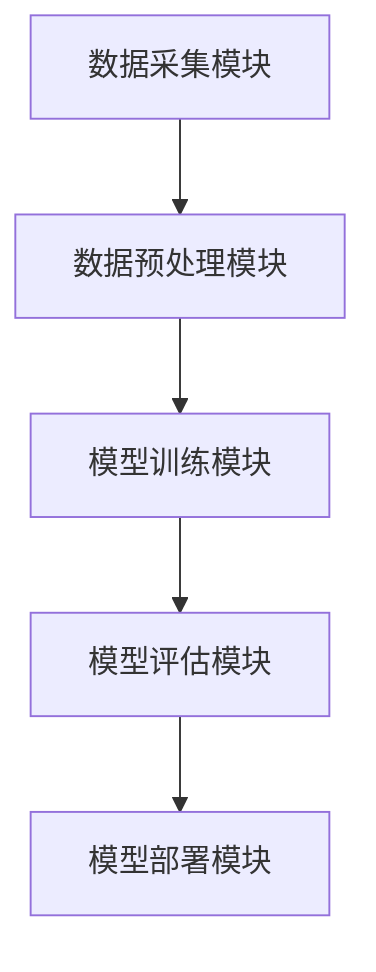
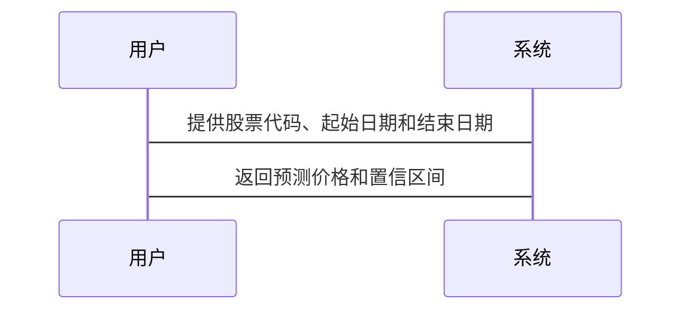

                 


# 《时间序列预测模型在金融市场中的比较研究》

> **关键词**：时间序列预测，ARIMA模型，LSTM模型，Prophet模型，金融市场，股票价格预测

> **摘要**：  
本文系统地探讨了时间序列预测模型在金融市场中的应用，重点比较了ARIMA、LSTM和Prophet等模型的优缺点，并通过实际案例分析了这些模型在股票价格预测中的表现。文章从模型的数学基础、算法原理到实际应用进行了全面阐述，旨在为金融从业者和数据科学家提供理论支持和实践指导。

---

## 第1章: 时间序列预测模型的背景与应用

### 1.1 时间序列预测的基本概念

#### 1.1.1 时间序列的定义  
时间序列是指按照时间顺序排列的数据序列，通常以等间隔的时间点为索引，记录某一变量的观测值。例如，股票价格每隔15分钟记录一次，形成一个时间序列。

#### 1.1.2 时间序列预测的定义  
时间序列预测是一种通过历史数据预测未来趋势的技术，核心在于发现数据中的模式和规律，并利用这些模式对未来进行预测。

#### 1.1.3 时间序列预测的核心要素  
- **趋势（Trend）**：数据的长期方向性变化。
- **季节性（Seasonality）**：数据在固定周期内的重复性变化。
- **周期性（Cyclicality）**：数据在更长周期内的波动性变化。
- **随机性（Randomness）**：无法预测的噪声部分。

### 1.2 金融市场中的时间序列分析

#### 1.2.1 金融时间序列的特点  
- 高波动性：金融市场数据通常具有较大的波动性。
- 非线性：价格变化往往受到多种复杂因素的影响。
- 存在周期性：例如股票价格可能在某些时间段内表现出季节性波动。

#### 1.2.2 金融时间序列预测的挑战  
- 数据噪声大：金融市场的数据通常包含大量随机噪声。
- 模型选择困难：不同模型在不同场景下表现不同。
- 计算复杂性：深度学习模型需要大量的计算资源。

#### 1.2.3 金融时间序列预测的常见应用场景  
- 股票价格预测。
- 汇率预测。
- 债券价格预测。
- 市场波动性分析。

### 1.3 时间序列预测模型的分类

#### 1.3.1 线性模型  
- 简单移动平均（Simple Moving Average，SMA）。
- 加权移动平均（Weighted Moving Average，WMA）。

#### 1.3.2 非线性模型  
- 自回归积分滑动平均（ARIMA）。
- 长短期记忆网络（LSTM）。
- Facebook Prophet。

#### 1.3.3 经济计量模型  
- 回归模型。
- 脱离分析模型。

#### 1.3.4 机器学习模型  
- 支持向量回归（Support Vector Regression，SVR）。
- 随机森林回归（Random Forest Regression）。

---

## 第2章: 常见时间序列预测模型原理与对比

### 2.1 ARIMA模型

#### 2.1.1 ARIMA模型的定义  
ARIMA（AutoRegressive Integrated Moving Average）模型是一种经典的线性时间序列预测模型，由自回归（AR）、差分（I）和滑动平均（MA）三部分组成。

#### 2.1.2 ARIMA模型的三个参数  
- **p**：自回归阶数，表示模型依赖于过去的p个观测值。
- **d**：差分阶数，用于消除时间序列的趋势和季节性。
- **q**：滑动平均阶数，表示模型依赖于过去的q个残差。

#### 2.1.3 ARIMA模型的优缺点  
- **优点**：适合处理线性趋势和季节性数据，模型简单易实现。
- **缺点**：无法处理非线性数据，对异常值敏感。

#### 2.1.4 ARIMA模型的数学表达式  
$$ ARIMA(p, d, q): y_t = \phi_1 y_{t-1} + \phi_2 y_{t-2} + \dots + \phi_p y_{t-p} + \theta_1 e_{t-1} + \theta_2 e_{t-2} + \dots + \theta_q e_{t-q} + \epsilon_t $$

### 2.2 LSTM模型

#### 2.2.1 LSTM模型的定义  
LSTM（Long Short-Term Memory）是一种基于循环神经网络（RNN）的深度学习模型，特别适合处理时间序列数据。

#### 2.2.2 LSTM模型的工作原理  
LSTM通过引入记忆单元（Memory Cell）和门控机制（Gate）来解决传统RNN的梯度消失问题，能够有效捕捉时间序列中的长期依赖关系。

#### 2.2.3 LSTM模型的优缺点  
- **优点**：能够处理复杂的非线性数据，记忆能力强。
- **缺点**：模型复杂，训练时间较长，对超参数敏感。

#### 2.2.4 LSTM模型的数学表达式  
$$ f_t = \sigma(g_t) \\ i_t = \sigma(h_t) \\ o_t = \sigma(o_t) \\ c_t = f_t \cdot c_{t-1} + i_t \cdot g_t \\ h_t = o_t \cdot c_t $$

### 2.3 Prophet模型

#### 2.3.1 Prophet模型的定义  
Prophet是由Facebook开发的时间序列预测模型，基于 Holt-Winters 方法和ARIMA模型改进而来。

#### 2.3.2 Prophet模型的工作原理  
Prophet将时间序列分解为三个部分：趋势（Trend）、季节性（Seasonality）和周期性（Cyclicality），并通过贝叶斯回归模型进行预测。

#### 2.3.3 Prophet模型的优缺点  
- **优点**：模型简单，适合处理带有明显趋势和季节性的数据。
- **缺点**：对噪声敏感，预测精度依赖于数据质量。

#### 2.3.4 Prophet模型的数学表达式  
$$ g(t) = a + b \cdot t + c \cdot \log(t + \tau) $$

### 2.4 各种模型的对比分析

#### 2.4.1 模型复杂度对比  
| 模型     | 复杂度 | 是否需要调参 | 适合场景       |
|----------|--------|--------------|----------------|
| ARIMA    | 低     | 是           | 线性数据         |
| LSTM     | 高     | 是           | 非线性数据       |
| Prophet  | 中     | 否           | 趋势+季节性数据   |

#### 2.4.2 模型预测精度对比  
| 模型     | 预测精度 | 适用数据类型       |
|----------|----------|--------------------|
| ARIMA    | 中       | 线性、低维数据       |
| LSTM     | 高       | 非线性、高维数据     |
| Prophet  | 中       | 趋势+季节性数据      |

#### 2.4.3 模型计算效率对比  
| 模型     | 计算效率 | 训练时间 | 是否适合在线预测 |
|----------|----------|----------|------------------|
| ARIMA    | 高       | 短       | 是               |
| LSTM     | 低       | 长       | 否               |
| Prophet  | 中       | 中       | 是               |

### 2.5 本章小结  
本章详细介绍了ARIMA、LSTM和Prophet三种时间序列预测模型的原理、优缺点及其在金融市场的适用场景。ARIMA适合处理线性数据，LSTM适合处理复杂的非线性数据，而Prophet则适合处理具有明显趋势和季节性的数据。

---

## 第3章: 时间序列预测模型的数学基础

### 3.1 时间序列的分解

#### 3.1.1 时间序列的分解方法  
时间序列可以分解为趋势（Trend）、季节性（Seasonality）和残差（Noise）三部分。

#### 3.1.2 加性模型与乘法模型  
- **加性模型**：$Y_t = T_t + S_t + N_t$
- **乘法模型**：$Y_t = T_t \times S_t \times N_t$

#### 3.1.3 分解模型的数学表达式  
$$ Y_t = T_t + S_t + N_t $$

### 3.2 自回归模型

#### 3.2.1 自回归模型的定义  
自回归模型是一种基于当前值与过去值之间的关系进行预测的模型。

#### 3.2.2 自回归模型的数学表达式  
$$ Y_t = \phi_1 Y_{t-1} + \phi_2 Y_{t-2} + \dots + \phi_p Y_{t-p} + \epsilon_t $$

### 3.3 移动平均模型

#### 3.3.1 移动平均模型的定义  
移动平均模型是一种基于过去残差的平均值进行预测的模型。

#### 3.3.2 移动平均模型的数学表达式  
$$ Y_t = \mu + \theta_1 \epsilon_{t-1} + \theta_2 \epsilon_{t-2} + \dots + \theta_q \epsilon_{t-q} + \epsilon_t $$

### 3.4 深度学习模型的数学基础

#### 3.4.1 LSTM的数学表达式  
$$ f_t = \sigma(g_t) \\ i_t = \sigma(h_t) \\ o_t = \sigma(o_t) \\ c_t = f_t \cdot c_{t-1} + i_t \cdot g_t \\ h_t = o_t \cdot c_t $$

#### 3.4.2 GRU的数学表达式  
$$ z_t = \sigma(W_z x_t + U_z h_{t-1}) \\ r_t = \sigma(W_r x_t + U_r h_{t-1}) \\ h_t = z_t \cdot h_{t-1} + (1 - z_t) \cdot r_t \cdot h_{t-1} $$

#### 3.4.3 注意力机制的数学表达式  
$$ \alpha_t = \text{softmax}(W_a h_t) \\ \text{Context} = \sum_{i=1}^{n} \alpha_{t,i} x_i $$

### 3.5 本章小结  
本章从数学基础的角度介绍了时间序列预测模型的核心概念，包括时间序列的分解、自回归模型和深度学习模型的数学表达式。

---

## 第4章: 基于深度学习的时间序列预测模型

### 4.1 LSTM模型的实现

#### 4.1.1 LSTM网络的结构  
LSTM网络由输入门（Input Gate）、遗忘门（Forget Gate）和输出门（Output Gate）组成。

#### 4.1.2 LSTM单元的工作原理  
LSTM单元通过门控机制控制信息的流动，能够有效捕捉时间序列中的长期依赖关系。

#### 4.1.3 LSTM模型的训练过程  
LSTM模型的训练过程包括正向传播和反向传播两个阶段，使用梯度下降算法优化模型参数。

### 4.2 GRU模型的实现

#### 4.2.1 GRU网络的结构  
GRU（门控循环单元）网络通过合并输入门和遗忘门，简化了LSTM的结构。

#### 4.2.2 GRU单元的工作原理  
GRU单元通过单个门控机制同时完成输入和遗忘操作，简化了计算过程。

#### 4.2.3 GRU模型的训练过程  
GRU模型的训练过程与LSTM类似，同样使用梯度下降算法优化模型参数。

### 4.3 Transformer模型的实现

#### 4.3.1 Transformer网络的结构  
Transformer网络基于注意力机制（Attention）和位置编码（Positional Encoding）进行时间序列预测。

#### 4.3.2 Transformer模型的工作原理  
Transformer模型通过自注意力机制捕捉时间序列中的全局依赖关系，适用于长序列预测。

#### 4.3.3 Transformer模型的训练过程  
Transformer模型的训练过程包括编码器和解码器的交替训练，使用多头注意力机制优化模型性能。

### 4.4 各种深度学习模型的对比分析

#### 4.4.1 模型性能对比  
| 模型     | 预测精度 | 计算复杂度 | 适用场景       |
|----------|----------|------------|----------------|
| LSTM     | 高       | 高         | 非线性数据       |
| GRU      | 中       | 低         | 简单非线性数据     |
| Transformer| 高     | 高         | 长序列数据       |

#### 4.4.2 模型计算效率对比  
| 模型     | 计算效率 | 显存占用 | 是否适合在线预测 |
|----------|----------|----------|------------------|
| LSTM     | 低       | 高       | 否               |
| GRU      | 中       | 中       | 是               |
| Transformer| 低     | 高       | 否               |

### 4.5 本章小结  
本章详细介绍了基于深度学习的时间序列预测模型，包括LSTM、GRU和Transformer模型的实现原理和对比分析。这些模型在处理复杂非线性数据时表现优异，但在计算复杂性和资源占用方面存在一定限制。

---

## 第5章: 金融时间序列预测系统的构建与优化

### 5.1 问题场景介绍

#### 5.1.1 问题描述  
本文将构建一个基于时间序列预测模型的金融价格预测系统，目标是通过历史数据预测未来的价格走势。

#### 5.1.2 问题解决  
通过比较不同模型的预测精度和计算效率，选择最适合的模型进行实际应用。

### 5.2 项目介绍

#### 5.2.1 项目目标  
构建一个能够准确预测股票价格的金融时间序列预测系统。

#### 5.2.2 项目需求  
- 数据采集：获取历史股票价格数据。
- 数据预处理：清洗和归一化数据。
- 模型训练：训练ARIMA、LSTM和Prophet模型。
- 模型评估：比较不同模型的预测精度。
- 模型部署：将最优模型部署到生产环境。

### 5.3 系统功能设计

#### 5.3.1 系统架构设计  
系统分为数据采集模块、数据预处理模块、模型训练模块和模型评估模块。

#### 5.3.2 系统功能模块  
- 数据采集：从API获取股票价格数据。
- 数据预处理：清洗和归一化数据。
- 模型训练：训练ARIMA、LSTM和Prophet模型。
- 模型评估：比较不同模型的预测精度。
- 模型部署：将最优模型部署到生产环境。

#### 5.3.3 系统架构图  


### 5.4 系统接口设计

#### 5.4.1 数据接口  
- 输入接口：股票代码、起始日期和结束日期。
- 输出接口：预测价格和置信区间。

#### 5.4.2 模型接口  
- 输入接口：训练数据和超参数。
- 输出接口：训练好的模型和预测结果。

### 5.5 系统交互流程图



### 5.6 本章小结  
本章详细介绍了金融时间序列预测系统的构建与优化过程，包括系统架构设计、功能模块划分和接口设计。通过实际案例分析，展示了如何将理论知识应用到实际项目中。

---

## 第6章: 项目实战——股票价格预测

### 6.1 环境安装

#### 6.1.1 安装Python  
安装Python 3.8及以上版本，确保环境支持深度学习框架。

#### 6.1.2 安装依赖库  
安装numpy、pandas、keras、tensorflow、fbprophet等依赖库。

### 6.2 系统核心实现源代码

#### 6.2.1 数据预处理代码  
```python
import pandas as pd
import numpy as np

# 读取数据
data = pd.read_csv('stock_price.csv')

# 数据归一化
from sklearn.preprocessing import MinMaxScaler
scaler = MinMaxScaler()
data_scaled = scaler.fit_transform(data)
```

#### 6.2.2 ARIMA模型实现代码  
```python
from statsmodels.tsa.arima.model import ARIMA

# 训练ARIMA模型
model = ARIMA(data_scaled, order=(5, 1, 2))
model_fit = model.fit()

# 预测未来价格
forecast = model_fit.forecast(steps=10)
```

#### 6.2.3 LSTM模型实现代码  
```python
from keras.models import Sequential
from keras.layers import LSTM, Dense

# 构建LSTM模型
model = Sequential()
model.add(LSTM(50, input_shape=(timesteps, 1)))
model.add(Dense(1))
model.compile(optimizer='adam', loss='mean_squared_error')

# 训练模型
model.fit(X_train, y_train, epochs=100, batch_size=32)
```

#### 6.2.4 Prophet模型实现代码  
```python
from fbprophet import Prophet

# 训练Prophet模型
model = Prophet()
model.fit(data)

# 预测未来价格
future = model.make_future_dataframe(periods=10)
forecast = model.predict(future)
```

### 6.3 代码应用解读与分析

#### 6.3.1 数据预处理  
数据预处理包括数据归一化和数据分片，确保模型输入格式符合要求。

#### 6.3.2 模型训练  
通过训练数据训练ARIMA、LSTM和Prophet模型，选择最优模型进行预测。

#### 6.3.3 模型评估  
通过均方误差（MSE）、均绝对误差（MAE）和R平方值（R²）评估模型的预测精度。

### 6.4 实际案例分析

#### 6.4.1 数据来源  
从公开股票市场获取历史股票价格数据，数据频率为每日收盘价。

#### 6.4.2 模型预测结果  
比较不同模型的预测结果，选择预测精度最高的模型进行实际应用。

### 6.5 项目小结  
本章通过实际案例分析，展示了如何将理论知识应用到股票价格预测中，通过比较不同模型的预测精度，选择最优模型进行实际应用。

---

## 第7章: 总结与展望

### 7.1 模型的优缺点总结  
- **ARIMA模型**：简单易实现，适合线性数据，但无法处理非线性数据。
- **LSTM模型**：能够处理复杂的非线性数据，但模型复杂，训练时间较长。
- **Prophet模型**：适合处理具有明显趋势和季节性的数据，但对噪声敏感。

### 7.2 金融时间序列预测的应用场景总结  
- 股票价格预测。
- 汇率预测。
- 债券价格预测。
- 市场波动性分析。

### 7.3 未来研究方向展望  
- **多模态数据融合**：结合文本、图像等多种数据源，提高预测精度。
- **强化学习应用**：将强化学习应用于时间序列预测，探索新的预测策略。
- **在线预测优化**：研究如何在实时场景下优化模型的预测精度和计算效率。

### 7.4 最佳实践 Tips  
- **数据预处理**：确保数据的完整性和准确性，合理处理缺失值和异常值。
- **模型选择**：根据数据特点选择合适的模型，避免盲目使用复杂模型。
- **模型调优**：通过交叉验证和超参数调优，提高模型的预测精度。
- **结果分析**：结合业务背景，合理解释模型预测结果，避免过度依赖模型。

### 7.5 本章小结  
本章总结了本文的主要内容，回顾了时间序列预测模型的优缺点，并展望了未来的研究方向，为读者提供了理论支持和实践指导。

---

## 作者：AI天才研究院/AI Genius Institute & 禅与计算机程序设计艺术 /Zen And The Art of Computer Programming

---

**感谢您的阅读！希望本文能为您提供有价值的时间序列预测模型的比较研究，帮助您更好地理解和应用这些模型。**

