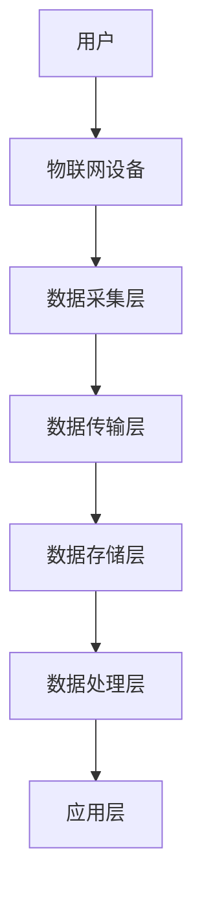

                 

<think>
好的，我将按照您的要求来撰写这篇文章。首先，我需要了解您想要的文章内容和结构。您提供的大纲已经非常详细，涵盖了智慧城市技术的背景、核心应用以及投资与可持续发展的策略。

为了让文章更加丰富和专业，我将按照以下步骤进行思考和撰写：

1. **背景介绍**：我需要先介绍智慧城市的定义、核心概念和其在可持续发展中的作用。这部分需要简单明了，让读者能够理解智慧城市的整体框架。

2. **核心技术应用**：接下来，我将详细讲解物联网、大数据和云计算在智慧城市中的具体应用。每一部分都需要有具体的案例和实际应用场景，确保读者能够理解这些技术如何推动城市的可持续发展。

3. **投资与可持续发展**：在这一部分，我需要分析智慧城市技术的投资策略，包括如何评估项目的可行性和经济效益，同时结合实际案例来说明成功的投资模式。

4. **系统架构与算法原理**：为了增加文章的深度，我将介绍智慧城市的系统架构设计，可能包括使用Mermaid图来展示系统架构图和序列图。同时，我会简要说明相关的算法原理，如用于交通优化的算法。

5. **项目实战与最佳实践**：我将提供一个具体的项目案例，展示如何在实际中应用这些技术，并总结经验教训。此外，还会给出一些最佳实践的建议和注意事项。

6. **结论与展望**：最后，我将总结文章的主要观点，并对未来智慧城市的可持续发展方向进行展望。

为了让文章更生动，我会在适当的地方加入实际案例和数据，使内容更具说服力。同时，我也会确保技术部分的准确性，避免过于复杂的术语，使读者能够轻松理解。

现在，我可以开始按照这个思考过程撰写文章了。

---

**标题：智慧城市技术在可持续发展中的应用与投资**

**关键词**：智慧城市、物联网、大数据、云计算、可持续发展、投资策略、系统架构

**摘要**：  
随着全球城市化进程的加快，智慧城市的建设成为实现可持续发展的重要途径。本文从智慧城市的定义和核心概念入手，详细探讨了物联网、大数据和云计算等技术在智慧交通、智慧能源和智慧环保等领域的具体应用。同时，结合可持续发展的视角，分析了智慧城市技术的投资策略和实际案例。通过系统架构设计和算法原理的讲解，进一步展示了智慧城市的实现路径。最后，本文总结了智慧城市建设中的最佳实践和未来发展方向。

---

**文章正文**

---

### **第一部分：智慧城市与可持续发展背景**

#### **1. 智慧城市的基本概念**

智慧城市是通过运用先进的信息技术，将城市中的各个系统（如交通、能源、环保等）进行整合，以实现城市资源的高效利用和优化管理。其核心目标是提高城市的运行效率，改善居民生活质量，并推动城市的可持续发展。

##### 1.1 智慧城市的定义与内涵
- **定义**：智慧城市是利用物联网、大数据、云计算等技术，构建一个智能化的城市运行和管理系统。
- **内涵**：
  - **智能化**：通过技术手段实现城市资源的智能化管理。
  - **高效性**：优化资源配置，提高城市运行效率。
  - **可持续性**：在城市发展中注重环境保护和资源节约。

##### 1.2 智慧城市的核心特征
- **数据驱动**：以数据为基础，进行城市规划和管理。
- **互联互通**：城市各个系统之间实现数据共享和协同。
- **动态优化**：根据实时数据调整城市运行策略。

##### 1.3 智慧城市与可持续发展的关系
- **可持续发展**：指在满足当代需求的同时，不损害后代满足其需求的能力。
- **智慧城市的作用**：
  - 通过技术手段减少资源浪费，提高能源利用效率。
  - 优化交通系统，减少碳排放。
  - 提供更加智能化的公共服务，改善居民生活质量。

---

#### **2. 可持续发展与智慧城市**

##### 2.1 可持续发展的基本概念
- 可持续发展强调经济、社会和环境的协调发展。
- 在城市化进程中，智慧城市的建设是实现可持续发展的重要手段。

##### 2.2 智慧城市在可持续发展中的作用
- **资源节约**：通过智能化管理减少能源和资源的浪费。
- **环境保护**：减少污染排放，改善城市环境质量。
- **社会福利**：提供更加高效和便捷的公共服务，提升居民幸福感。

##### 2.3 全球智慧城市发展的现状与趋势
- **现状**：全球范围内，许多城市已经开始智慧城市建设，如新加坡、巴塞罗那、纽约等。
- **趋势**：未来的智慧城市将更加注重绿色技术的应用，推动城市的低碳发展。

---

### **第二部分：智慧城市技术的核心与应用**

#### **1. 物联网技术在智慧城市中的应用**

##### 1.1 物联网技术的基本原理
- **定义**：物联网（IoT）是指通过各种信息传感设备，按照约定的协议，把任何物品与互联网连接起来，进行信息交换和通信。
- **组成**：
  - **传感器**：采集数据。
  - **通信网络**：数据传输。
  - **数据处理中心**：分析和应用数据。

##### 1.2 物联网在智慧交通中的应用
- **智能交通管理系统**：通过传感器和大数据分析，实时监控交通流量，优化信号灯控制。
- **停车管理**：通过物联网设备实时监测停车位的使用情况，帮助司机快速找到停车位。
- **交通监控**：实时监控交通事故，及时进行应急处理。

##### 1.3 物联网在智慧能源中的应用
- **智慧能源管理系统**：通过传感器实时监测能源使用情况，优化能源分配。
- **能源监测**：实时监控能源消耗，发现异常情况及时报警。
- **能源优化**：通过数据分析，制定最优的能源使用计划，减少浪费。

---

#### **2. 大数据技术在智慧城市中的应用**

##### 2.1 大数据技术的基本原理
- **定义**：大数据是指数据量大、类型多样、处理速度快的海量数据。
- **关键技术**：
  - **数据采集**：从各种来源获取数据。
  - **数据存储**：高效存储和管理海量数据。
  - **数据分析**：利用算法对数据进行挖掘和分析，提取有用信息。

##### 2.2 大数据在智慧交通中的应用
- **交通流量预测**：通过历史数据和实时数据，利用大数据分析技术预测交通流量，优化交通信号灯控制。
- **交通调度**：基于大数据分析结果，优化公交车、出租车等交通工具的调度策略。
- **交通规划**：通过大数据分析，制定更加科学的交通网络规划。

##### 2.3 大数据在智慧环保中的应用
- **环境监测**：通过大数据分析，实时监测空气质量、水质等环境指标。
- **污染治理**：分析污染源，制定有效的污染治理措施。
- **环境预测**：通过大数据分析，预测未来可能出现的环境问题，提前采取应对措施。

---

#### **3. 云计算技术在智慧城市中的应用**

##### 3.1 云计算技术的基本原理
- **定义**：云计算是一种基于互联网的计算方式，通过共享资源池为用户提供计算能力。
- **关键技术**：
  - **虚拟化**：将物理资源虚拟化为多个虚拟资源。
  - **分布式计算**：将任务分布到多个计算节点上进行处理。

##### 3.2 云计算在智慧能源中的应用
- **能源管理系统**：通过云计算技术，实现能源数据的集中管理与分析。
- **能源优化**：基于云计算平台，优化能源使用计划，减少浪费。
- **能源共享**：通过云计算技术，实现能源资源的共享利用，提高能源利用效率。

##### 3.3 云计算在智慧社区中的应用
- **社区服务系统**：通过云计算技术，构建智能化的社区服务系统，提供便捷的社区管理和服务。
- **资源共享**：通过云计算平台，实现社区内资源的共享利用，如停车位、充电桩等。
- **社区管理**：通过云计算技术，优化社区管理流程，提高管理效率。

---

### **第三部分：智慧城市技术的投资与可持续发展**

#### **1. 智慧城市技术的投资策略**

##### 1.1 投资背景
- **市场现状**：全球智慧城市建设正在快速推进，市场规模不断扩大。
- **投资热点**：智慧交通、智慧能源、智慧环保等领域是当前的投资热点。
- **投资风险**：技术更新快、市场竞争激烈，存在一定的投资风险。

##### 1.2 投资评估
- **可行性分析**：评估项目的市场需求、技术可行性、经济可行性等方面。
- **经济效益评估**：分析项目的投资回报率、成本回收期等经济指标。
- **社会效益评估**：评估项目对社会环境、居民生活质量等方面的影响。

##### 1.3 投资案例
- **国内外案例分析**：如新加坡的智慧城市建设、巴塞罗那的智慧交通系统等。
- **成功经验总结**：成功的投资案例通常注重技术创新和市场需求的结合。
- **失败教训总结**：失败的案例往往是因为技术不成熟或市场需求不足。

---

#### **2. 可持续发展视角下的智慧城市技术**

##### 2.1 可持续发展对智慧城市技术的要求
- **节能环保**：技术应用过程中应尽量减少能源消耗和环境污染。
- **资源高效利用**：通过技术手段提高资源利用效率，减少浪费。

##### 2.2 可持续发展中的技术创新
- **绿色技术**：发展节能减排的技术，如太阳能、风能等可再生能源技术。
- **智能技术**：通过智能化管理，实现资源的优化配置。

##### 2.3 可持续发展中的政策支持
- **政策鼓励**：政府应制定相关政策，鼓励智慧城市建设。
- **资金支持**：提供资金支持，促进技术创新和应用。

---

### **第四部分：系统架构与算法原理**

#### **1. 系统架构设计**

##### 1.1 系统架构图


##### 1.2 系统功能设计
- **用户层**：用户通过手机APP或网页界面与系统交互。
- **物联网设备层**：传感器、摄像头等设备采集数据。
- **数据采集层**：对物联网设备采集的数据进行初步处理。
- **数据传输层**：通过网络将数据传输到云端。
- **数据存储层**：将数据存储在数据库中。
- **数据处理层**：对数据进行分析和处理，生成有用信息。
- **应用层**：将处理后的信息应用于实际场景，如交通管理、能源优化等。

##### 1.3 算法原理
- **交通优化算法**：通过实时数据分析，优化交通信号灯控制。
  ```mermaid
  graph TD
      A[交通流量数据] --> B[数据处理层]
      B --> C[交通优化算法]
      C --> D[信号灯控制]
  ```

---

### **第五部分：项目实战与最佳实践**

#### **1. 项目案例分析**

##### 1.1 项目背景
- **项目名称**：某城市智慧交通系统建设项目。
- **项目目标**：通过智慧交通系统，优化城市交通流量，减少拥堵和污染。

##### 1.2 核心实现
- **系统架构**：基于云计算和物联网技术，构建实时交通监控系统。
- **核心代码**（Python示例）：
  ```python
  import requests
  import json

  def get_traffic_data():
      response = requests.get('http://localhost:8000/traffic')
      return json.loads(response.text)

  def optimize_traffic_light():
      data = get_traffic_data()
      if data['density'] > 0.8:
          return 'red'
      else:
          return 'green'

  print(optimize_traffic_light())
  ```

##### 1.3 经验总结
- **成功经验**：系统的实时性和准确性是项目成功的关键。
- **教训总结**：在项目实施过程中，需要注意技术的可扩展性和系统的稳定性。

#### **2. 最佳实践 tips**
- **技术选型**：选择成熟且可靠的技术，避免盲目追求新技术。
- **数据安全**：重视数据安全，保护用户隐私。
- **持续优化**：定期对系统进行优化和更新，保持系统的先进性。

---

### **第六部分：结论与展望**

#### **结论**
智慧城市技术是实现城市可持续发展的重要手段。通过物联网、大数据和云计算等技术的应用，可以有效提高城市的运行效率，改善居民生活质量，推动城市的可持续发展。

#### **展望**
未来，随着技术的不断进步，智慧城市建设将更加注重绿色技术和智能化管理。同时，智慧城市技术的投资也将更加注重经济效益和社会效益的结合，为城市的可持续发展提供更加有力的支持。

---

**作者：AI天才研究院 & 禅与计算机程序设计艺术**

