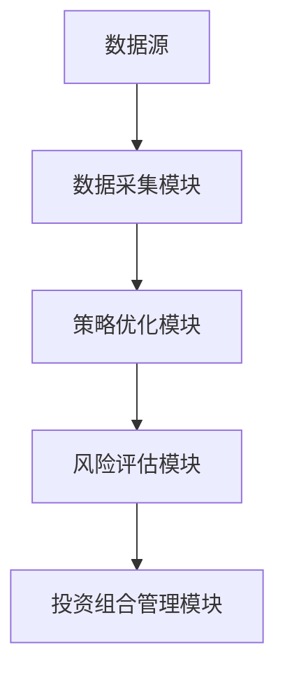

                 


# 智能Beta策略：结合被动和主动投资的优势

> 关键词：智能Beta策略、被动投资、主动投资、风险控制、投资组合优化、算法优化

> 摘要：本文深入探讨了智能Beta策略的定义、核心原理及其在投资组合优化中的应用。通过结合被动投资的低成本和长期稳定性与主动投资的灵活性和高收益潜力，智能Beta策略为投资者提供了一种创新的投资解决方案。文章详细介绍了智能Beta策略的数学模型、优化算法、系统架构设计以及实际项目案例，帮助读者全面理解并掌握这一策略。

---

## 第一部分：智能Beta策略的背景与概念

### 第1章：智能Beta策略的背景与概念

#### 1.1 投资策略的演变

- **1.1.1 传统被动投资与主动投资的对比**
  - 被动投资：基于指数基金，追求市场平均收益，成本低、操作简单。
  - 主动投资：依赖专业投资经理的选股能力，追求超额收益，但成本高、风险大。
  - 传统策略的局限性：被动投资收益受限，主动投资风险较高且费用昂贵。

- **1.1.2 Beta策略的核心概念**
  - Beta系数：衡量资产或投资组合对市场波动的敏感度，Beta值越高，风险越大，潜在收益也越高。
  - Beta策略：通过调整Beta值来优化投资组合，平衡风险与收益。

- **1.1.3 智能Beta策略的定义与特点**
  - 智能Beta策略：结合被动投资的低成本和主动投资的灵活性，通过算法优化实现投资组合的动态调整。
  - 特点：低成本、低风险、高收益潜力，结合主动与被动投资的优势。

#### 1.2 智能Beta策略的优势

- **1.2.1 结合被动与主动投资的优势**
  - 成本优化：继承被动投资的低成本优势。
  - 灵活性：通过主动调整Beta值实现动态优化。

- **1.2.2 智能Beta策略的风险控制能力**
  - 通过算法优化降低投资组合的整体风险。
  - 动态调整Beta值，平衡市场波动带来的风险。

- **1.2.3 长期收益潜力**
  - 通过优化Beta值，提升投资组合的长期收益潜力。
  - 结合市场趋势和投资者风险偏好，实现收益最大化。

#### 1.3 智能Beta策略的应用场景

- **1.3.1 机构投资者的应用**
  - 理财基金、养老基金等机构投资者可以通过智能Beta策略优化投资组合。
  - 降低风险，提高收益稳定性。

- **1.3.2 个人投资者的应用**
  - 个人投资者可以利用智能Beta策略进行资产配置，实现个性化投资目标。
  - 无需频繁交易，降低交易成本和税务负担。

- **1.3.3 不同市场环境下的表现**
  - 在牛市中，智能Beta策略可以通过高Beta值捕捉更多收益。
  - 在熊市中，通过降低Beta值减少损失，实现稳健投资。

---

## 第二部分：智能Beta策略的核心原理

### 第2章：智能Beta策略的数学模型

#### 2.1 智能Beta策略的数学模型

- **2.1.1 Beta系数的计算公式**
  - Beta值计算公式：$$ Beta = \frac{Cov(r_i, r_m)}{Var(r_m)} $$
  - 其中，$r_i$ 是资产i的收益率，$r_m$ 是市场指数的收益率。

- **2.1.2 智能Beta策略的优化算法**
  - 算法目标：最大化投资组合的超额收益，同时控制整体风险。
  - 约束条件：Beta值范围、投资组合的分散化要求。

- **2.1.3 风险调整后的收益模型**
  - 使用CAPM模型计算风险调整后的收益：
    $$ E(r_i) = r_f + Beta_i (E(r_m) - r_f) $$
  - 其中，$r_f$ 是无风险利率，$E(r_m)$ 是市场预期收益率。

#### 2.2 智能Beta策略的算法流程

- **2.2.1 数据采集与处理**
  - 采集历史数据，包括资产收益率和市场指数收益率。
  - 数据清洗与标准化处理。

- **2.2.2 策略优化与组合构建**
  - 使用优化算法（如均值-方差优化）构建最优Beta组合。
  - 确定每个资产的目标Beta值。

- **2.2.3 风险评估与调整**
  - 计算投资组合的整体Beta值。
  - 根据市场变化动态调整Beta值，控制风险。

#### 2.3 智能Beta策略的实现步骤

- **2.3.1 数据预处理**
  - 数据清洗：处理缺失值、异常值。
  - 数据标准化：归一化处理。

- **2.3.2 策略参数优化**
  - 确定优化目标：最大化夏普比率或最小化风险。
  - 调整约束条件：Beta值范围、投资比例限制。

- **2.3.3 组合构建与风险评估**
  - 使用优化算法构建最优Beta组合。
  - 计算组合的风险调整后收益。

---

## 第三部分：智能Beta策略的系统架构设计

### 第3章：智能Beta策略的系统架构设计

#### 3.1 系统功能模块设计

- **3.1.1 数据采集模块**
  - 数据源：市场数据API、历史数据文件。
  - 功能：采集资产收益率和市场指数收益率。

- **3.1.2 策略优化模块**
  - 功能：根据优化算法构建最优Beta组合。
  - 接口：接收优化目标和约束条件。

- **3.1.3 风险评估模块**
  - 功能：计算投资组合的整体风险。
  - 接口：接收组合Beta值和市场数据。

- **3.1.4 投资组合管理模块**
  - 功能：动态调整Beta值，管理投资组合。
  - 接口：接收市场变化信号和用户指令。

#### 3.2 系统架构图



---

## 第四部分：智能Beta策略的项目实战

### 第4章：智能Beta策略的项目实战

#### 4.1 环境安装与配置

- 安装Python环境：使用Anaconda或virtualenv。
- 安装依赖库：numpy、pandas、scipy、plotly。

#### 4.2 核心实现代码

```python
import numpy as np
import pandas as pd
from scipy.optimize import minimize

# 示例数据
market_returns = np.random.normal(0, 0.1, 100)
asset_returns = np.random.normal(0, 0.1, 100)

# 定义优化函数
def optimize_portfolio(weights, market_returns, asset_returns):
    Cov = np.cov(asset_returns, market_returns)
    Var = np.var(market_returns)
    Beta = Cov / Var
    risk = np.sum(weights * Beta)
    return risk

# 约束条件
def constraint(weights):
    return np.sum(weights) - 1  # 权重和为1

# 目标函数
def objective(weights, asset_returns, market_returns):
    return optimize_portfolio(weights, asset_returns, market_returns)

# 初始化权重
weights = np.array([1.0/len(asset_returns)] * len(asset_returns))

# 调用优化函数
result = minimize(objective, weights, args=(asset_returns, market_returns), 
                  method='SLSQP', constraints={'type': 'eq', 'fun': constraint})

print("最优权重:", result.x)
```

#### 4.3 代码实现与解读

- **优化函数**：计算投资组合的整体Beta值。
- **约束条件**：确保权重和为1，避免过拟合。
- **目标函数**：最小化整体风险，实现Beta值的优化。

#### 4.4 案例分析与结果解读

- 通过优化算法计算得出最优权重，构建最优Beta组合。
- 分析投资组合的Beta值和整体风险，验证策略的有效性。

---

## 第五部分：智能Beta策略的最佳实践

### 第5章：智能Beta策略的最佳实践

#### 5.1 小结

- 智能Beta策略通过结合被动与主动投资的优势，为投资者提供了一种高效的投资解决方案。
- 通过算法优化实现Beta值的动态调整，平衡风险与收益。

#### 5.2 注意事项

- 投资者需根据自身风险承受能力和投资目标选择合适的Beta值。
- 定期监控市场变化，动态调整Beta值，确保投资组合的稳健性。

#### 5.3 未来的发展方向

- 结合人工智能技术，进一步提升策略的智能化水平。
- 探索更多应用场景，如量化交易、风险管理等。

---

## 作者信息

作者：AI天才研究院/AI Genius Institute & 禅与计算机程序设计艺术 /Zen And The Art of Computer Programming

---

通过以上结构和内容的详细展开，本文全面介绍了智能Beta策略的核心概念、数学模型、系统架构设计和实际应用案例，帮助读者深入理解并掌握这一创新的投资策略。

