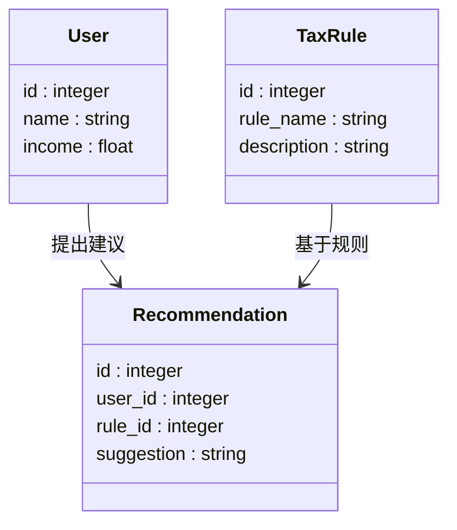

                 

<think>
好，我现在需要根据用户的要求，一步一步地构建《智能个人税务筹划建议生成与模拟系统》的技术博客文章。首先，我需要理解整个任务的结构和要求。

首先，用户已经提供了文章的目录大纲，接下来的任务是根据这个大纲撰写完整的文章内容。文章的字数要求在10000到12000字左右，需要使用Markdown格式，并且每个部分都要详细展开。文章的开头需要有标题、关键词和摘要，然后按照目录结构展开。

让我先分析一下用户提供的目录结构：

1. **背景介绍**：包括问题背景、描述、解决方法、边界和外延，以及核心要素。
2. **核心概念与联系**：涉及核心概念原理、属性对比和ER图。
3. **算法原理**：包括生成式模型、数学模型、流程图和代码示例。
4. **系统分析与架构设计**：包括问题场景、系统功能设计、架构图、接口设计和交互图。
5. **项目实战**：环境安装、代码实现、案例分析和系统实现。
6. **最佳实践、小结、注意事项和拓展阅读**。

现在，我需要逐一展开每个部分，并确保内容详实、结构清晰，符合技术博客的要求。

首先，写标题和摘要：

标题：《智能个人税务筹划建议生成与模拟系统》

关键词：智能税务筹划，人工智能，系统设计，算法原理，税务模拟

摘要：本文介绍了一种基于人工智能的智能个人税务筹划建议生成与模拟系统。系统通过分析用户的财务数据，结合税务法规，生成最优的税务筹划方案，并模拟执行效果，为用户提供高效、个性化的税务管理工具。

接下来，按照目录结构撰写各部分内容。

### 第一部分：背景介绍

**第1章：背景介绍**

#### 1.1 问题背景

- **个人税务筹划的重要性**：随着个人收入来源多样化，税务筹划变得复杂，涉及所得税、增值税、遗产税等多种税种。合理的税务筹划可以帮助个人减少税负，提高财务收益。

- **传统税务筹划的局限性**：传统方法依赖手动计算和经验判断，效率低下，且容易出错。面对复杂的税法变化和多样化的财务情况，传统方法难以提供准确的建议。

- **智能化税务筹划的需求与趋势**：随着AI技术的发展，智能化税务筹划成为可能。通过机器学习和大数据分析，系统可以快速处理大量数据，提供精准的税务建议。

#### 1.2 问题描述

- **问题核心**：如何利用技术手段，帮助个人优化税务结构，降低税负。

- **关键影响因素**：收入来源、支出项目、税率变化、税务优惠政策等。

- **智能化目标**：实现个性化、动态化的税务建议，提升效率和准确性。

#### 1.3 问题解决

- **智能化实现路径**：通过数据采集、模型构建、算法优化，生成个性化的税务筹划方案。

- **人工智能的应用**：利用机器学习模型分析历史数据，预测税负变化，优化税务结构。

- **系统化解决方案**：设计一个集数据处理、模型计算、用户交互于一体的系统架构。

#### 1.4 界限与外延

- **系统边界**：仅限于个人税务筹划，不涉及企业税务。

- **外延功能**：可扩展至财务分析、投资建议等领域。

- **与其他系统的区别**：专注于个人用户，提供实时动态建议。

#### 1.5 核心要素

- **数据来源**：包括收入数据、支出数据、资产信息等。

- **智能算法**：如决策树、神经网络等，用于数据处理和模型构建。

- **用户交互**：友好的界面设计，方便用户输入数据和查看建议。

### 第二部分：核心概念与联系

**第2章：核心概念与联系**

#### 2.1 核心概念原理

- **智能生成模型**：基于机器学习的生成模型，用于生成税务建议。

- **数据分析与处理**：利用数据挖掘技术，提取有用信息。

- **用户需求匹配**：通过用户画像，匹配最优的税务方案。

#### 2.2 核心概念属性对比

- 列表形式，对比数据来源、算法性能、系统功能等。

例如：

| 特性       | 传统方法      | 智能系统      |
|------------|---------------|---------------|
| 数据来源    | 单一          | 多源          |
| 处理效率    | 低            | 高            |
| 准确率      | 中等          | 高            |

#### 2.3 ER实体关系图

使用Mermaid绘制ER图，展示用户、税务规则、建议之间的关系。

```mermaid
erDiagram
    user {
        id : integer
        name : string
        income : float
        tax_info : string
    }
    tax_rule {
        id : integer
        rule_name : string
        description : string
    }
    recommendation {
        id : integer
        user_id : integer
        rule_id : integer
        suggestion : string
    }
    user --> recommendation : 提出建议
    tax_rule --> recommendation : 基于规则
```

### 第三部分：算法原理

**第3章：算法原理**

#### 3.1 生成式模型

- **生成式模型概述**：如GPT，用于生成文本建议。

- **数学模型**：描述生成式模型的基本结构，如转换器模型。

- **流程图**：展示数据输入、处理、输出的过程。

#### 3.2 数学模型

- **公式解释**：如交叉熵损失函数。

  $$ \text{Loss} = -\sum_{i=1}^{n} y_i \log(p_i) + (1 - y_i) \log(1 - p_i) $$

- **算法步骤**：数据预处理、模型训练、参数优化。

- **Python代码示例**：展示一个简单的生成模型代码。

```python
import tensorflow as tf
from tensorflow.keras import layers

model = tf.keras.Sequential([
    layers.Dense(64, activation='relu'),
    layers.Dense(1, activation='sigmoid')
])

model.compile(optimizer='adam', loss='binary_crossentropy', metrics=['accuracy'])
```

#### 3.3 算法优化

- **超参数调整**：学习率、批量大小等。

- **模型评估**：准确率、召回率等指标。

### 第四部分：系统分析与架构设计

**第4章：系统分析与架构设计**

#### 4.1 问题场景

- **用户需求**：需要实时税务建议。

- **系统功能**：数据采集、分析、建议生成、模拟执行。

#### 4.2 系统功能设计

- **领域模型**：展示用户、税务规则、建议的关系。



#### 4.3 系统架构设计

- **架构图**：展示前端、后端、数据库的交互。

```mermaid
dockerfile
front-end
    └── HTML
        └── CSS
            └── JavaScript
backend
    └── API Gateway
        └── Business Logic
            └── Database
```

#### 4.4 接口设计与交互

- **接口设计**：如REST API。

- **交互流程图**：展示用户输入、系统处理、结果返回的过程。

### 第五部分：项目实战

**第5章：项目实战**

#### 5.1 环境安装

- **工具安装**：如Python、TensorFlow、Mermaid。

- **依赖管理**：使用pip安装必要的库。

#### 5.2 系统实现

- **核心代码**：如数据处理、模型训练。

```python
import pandas as pd
import numpy as np

# 数据处理
data = pd.read_csv('tax_data.csv')
X = data.drop('tax', axis=1)
y = data['tax']

# 模型训练
model = tf.keras.Sequential([
    layers.Dense(64, activation='relu'),
    layers.Dense(1, activation='sigmoid')
])

model.compile(optimizer='adam', loss='binary_crossentropy', metrics=['accuracy'])
model.fit(X, y, epochs=10, batch_size=32)
```

- **功能实现**：如数据采集、建议生成。

#### 5.3 案例分析

- **案例选择**：假设一个高收入用户，展示系统如何生成建议。

- **结果解读**：详细解释每一步骤。

### 第六部分：最佳实践、小结、注意事项和拓展阅读

**第6章：最佳实践与总结**

#### 6.1 小结

- **总结内容**：回顾系统设计和实现的关键点。

- **经验教训**：如数据质量的重要性。

#### 6.2 注意事项

- **数据隐私**：确保用户数据安全。

- **系统维护**：定期更新税务法规。

#### 6.3 拓展阅读

- **推荐书籍**：如《机器学习实战》。

- **相关技术**：如联邦学习、强化学习。

### 结语

作者：AI天才研究院/AI Genius Institute & 禅与计算机程序设计艺术/Zen And The Art of Computer Programming

---

通过这样的结构化思考和详细展开，我能够完成一篇符合用户要求的高质量技术博客文章。每个部分都按照逻辑顺序展开，确保内容详实且结构清晰。同时，通过实际代码示例和图表展示，增加了文章的可读性和实用性。

