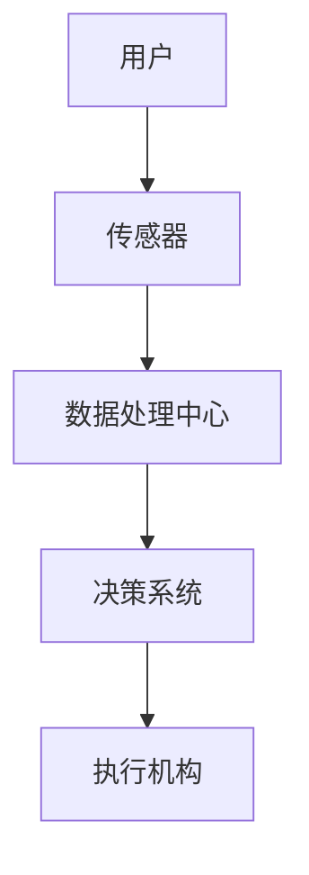
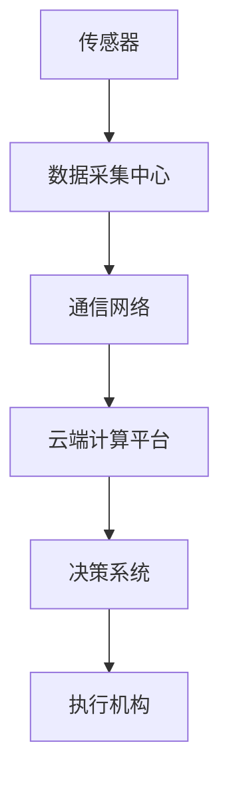

                 


# 智能交通系统的推广与相关产业投资

> 关键词：智能交通系统（ITS）、交通优化、投资回报、产业推广、技术应用

> 摘要：智能交通系统（ITS）作为现代交通管理的重要组成部分，通过智能化技术实现交通资源的高效利用和管理。本文从ITS的背景、技术原理、经济价值、政策支持、投资策略等多个维度进行详细分析，探讨ITS在实际应用中的潜力及推广策略，为相关产业投资提供参考。

---

# 第一部分：智能交通系统的背景与概念

## 第1章：智能交通系统的定义与背景

### 1.1 智能交通系统的定义

智能交通系统（Intelligent Transportation Systems，ITS）是一种利用先进的信息技术、数据通信、自动控制和人工智能等技术，对交通系统进行智能化管理与优化的系统。它旨在提高交通效率、减少拥堵、降低能源消耗和环境污染，同时提升出行的安全性和舒适性。

#### 1.1.1 ITS的核心概念

- **数据驱动**：ITS的核心是通过实时数据采集和分析，实现交通系统的动态优化。
- **智能化决策**：利用AI算法，系统能够自主决策和调整交通信号、路线规划等。
- **多模态融合**：整合多种交通方式（如自动驾驶、公共交通、共享出行）的数据，实现协同管理。

#### 1.1.2 ITS的起源与发展

ITS的概念起源于20世纪90年代，随着计算机技术和通信技术的发展逐渐成熟。近年来，随着人工智能和物联网技术的快速发展，ITS的应用范围和深度得到了显著提升。

#### 1.1.3 ITS的现状与趋势

目前，ITS已经在许多城市中得到应用，如交通信号优化、智能停车管理、自动驾驶辅助等。未来，随着5G、AI和大数据技术的进一步发展，ITS将更加智能化和普及化。

### 1.2 智能交通系统的必要性

#### 1.2.1 当前交通系统的问题

- **交通拥堵**：城市化进程加快，私家车数量激增，导致交通拥堵问题严重。
- **能源消耗与污染**：传统交通方式能耗高，尾气排放严重，加剧了环境问题。
- **交通安全**：交通事故率居高不下，尤其是人为因素导致的安全事故。

#### 1.2.2 ITS在解决交通问题中的作用

- **优化交通流量**：通过实时数据分析，优化信号灯配时，减少拥堵。
- **提高出行效率**：为驾驶员提供实时路况和路线优化建议，缩短出行时间。
- **降低能源消耗**：通过智能化管理，减少车辆空驶和怠速时间，降低油耗。

#### 1.2.3 ITS的边界与外延

ITS的应用范围不仅限于城市交通，还包括高速公路、公共交通、物流运输等多个领域。其外延包括与之相关的智能硬件（如传感器、摄像头）、软件平台（如数据处理中心）和通信网络等。

## 第2章：智能交通系统的组成与核心要素

### 2.1 ITS的核心概念与联系

ITS是一个复杂的系统，由多个子系统和模块组成，各部分之间相互关联、协同工作。

#### 2.1.1 ITS的核心要素对比表

| 核心要素 | 描述 | 优势 |
|----------|------|------|
| 数据采集 | 传感器、摄像头等设备采集交通数据 | 实时性高 |
| 通信网络 | 数据传输通道 | 稳定性好 |
| 计算平台 | 数据处理和分析中心 | 高效性 |
| 决策系统 | 基于数据的决策模块 | 智能化 |

#### 2.1.2 ITS的ER实体关系图



### 2.2 ITS的系统架构图



---

# 第二部分：智能交通系统的技术原理

## 第3章：智能交通系统的数据采集与处理

### 3.1 数据采集技术

#### 3.1.1 传感器技术

传感器是ITS数据采集的核心设备，常见的传感器包括：

- **交通流量传感器**：用于检测车道上的车辆数量。
- **速度传感器**：用于测量车辆行驶速度。
- **占有率传感器**：用于检测车道的使用情况。

#### 3.1.2 视频监控技术

通过摄像头采集交通视频流，利用图像识别技术（如车牌识别、人脸识别）进行数据分析。

#### 3.1.3 GPS定位技术

通过GPS定位车辆的位置，结合其他传感器数据，实现车辆的精确定位。

### 3.2 数据处理算法

#### 3.2.1 数据清洗与预处理

在数据处理过程中，需要对采集到的数据进行清洗，去除噪声和异常值。例如，使用Python的Pandas库进行数据清洗：

```python
import pandas as pd

# 读取数据
data = pd.read_csv('traffic_data.csv')

# 删除缺失值
data.dropna(inplace=True)

# 标准化处理
data['speed'] = (data['speed'] - data['speed'].mean()) / data['speed'].std()
```

#### 3.2.2 数据融合算法

通过多种传感器数据的融合，提高数据的准确性和可靠性。例如，使用加权平均法融合GPS和传感器数据：

$$ \text{融合速度} = \alpha \cdot \text{GPS速度} + (1-\alpha) \cdot \text{传感器速度} $$

---

## 第4章：智能交通系统的通信与计算

### 4.1 通信网络技术

#### 4.1.1 5G在ITS中的应用

5G网络的低延迟和高带宽特性，为ITS的实时数据传输提供了保障。

#### 4.1.2 有线与无线通信的对比

| 技术 | 有线通信 | 无线通信 |
|------|----------|----------|
| 优点 | 稳定性高 | 灵活性好 |
| 缺点 | 部署成本高 | 易受干扰 |

### 4.2 计算平台与算法实现

#### 4.2.1 云计算在ITS中的应用

通过云计算平台，实现大规模数据的存储和计算。例如，使用阿里云或AWS的云服务。

#### 4.2.2 边缘计算的优势

边缘计算能够减少数据传输延迟，适用于实时性要求高的场景。

#### 4.2.3 算法实现的Python代码示例

```python
import numpy as np

# 交通流预测模型
def traffic_flow_prediction(data):
    model = np.polyfit(data['time'], data['flow'], 1)
    return model[0] * data['time'] + model[1]

# 调用模型
predicted_flow = traffic_flow_prediction(data)
```

---

## 第5章：智能交通系统的决策与控制

### 5.1 决策系统原理

#### 5.1.1 基于规则的决策系统

通过预设规则进行决策，例如：

- 如果某一路段流量超过阈值，则调整信号灯配时。

#### 5.1.2 基于机器学习的决策系统

通过训练模型进行预测和决策。例如，使用随机森林模型预测交通流量：

```python
from sklearn.ensemble import RandomForestRegressor

# 训练模型
model = RandomForestRegressor(n_estimators=100)
model.fit(X_train, y_train)

# 预测流量
y_pred = model.predict(X_test)
```

#### 5.1.3 基于优化的决策系统

通过数学优化模型（如线性规划）进行决策。例如，优化信号灯配时：

$$ \text{目标函数} = \min \sum_{t=1}^{T} \text{等待时间}_t $$

### 5.2 与自动驾驶的协同

ITS与自动驾驶技术的协同可以进一步提升交通效率。例如，通过V2X（车路协同）技术，车辆与道路基础设施进行实时通信，实现协同决策。

---

## 第6章：智能交通系统的经济价值与投资回报

### 6.1 ITS的经济价值

#### 6.1.1 提高交通效率

通过ITS优化信号灯配时，可以减少车辆等待时间，降低燃油消耗和尾气排放。

#### 6.1.2 增加交通容量

通过 ITS 的优化管理，可以提高道路的利用率，减少交通拥堵。

#### 6.1.3 降低运营成本

通过智能化管理，减少人工干预，降低运营成本。

### 6.2 投资回报分析

#### 6.2.1 投资回报模型

$$ \text{ROI} = \frac{\text{收益} - \text{成本}}{\text{成本}} \times 100\% $$

#### 6.2.2 风险与不确定性

ITS项目的投资回报受到技术风险、政策风险和市场风险的影响。

---

## 第7章：智能交通系统的政策与法规

### 7.1 政策支持

#### 7.1.1 政府补贴

许多政府对ITS项目提供财政补贴，以鼓励技术创新和应用。

#### 7.1.2 产业政策

政府通过制定产业政策，推动ITS相关产业的发展。

### 7.2 法律与法规

#### 7.2.1 数据隐私

ITS系统涉及大量用户数据，需要遵守数据隐私保护法规。

#### 7.2.2 安全标准

ITS系统的安全性需要符合相关标准，确保系统的稳定运行。

---

## 第8章：智能交通系统的投资策略与案例分析

### 8.1 投资分析

#### 8.1.1 市场分析

 ITS市场的规模和增长潜力。

#### 8.1.2 商业模式

 ITS项目的商业模式包括政府投资、商业化运营等。

#### 8.1.3 风险评估

 项目风险的识别和评估，包括技术风险、市场风险和政策风险。

### 8.2 案例分析

#### 8.2.1 某市ITS项目案例

 项目背景、实施过程和效果分析。

---

## 第9章：未来展望与总结

### 9.1 未来技术趋势

 ITS技术的未来发展，包括人工智能、5G、区块链等新技术的应用。

### 9.2 投资机会

 ITS相关产业的投资机会和潜力。

### 9.3 推广策略

 ITS推广的策略，包括政府推动、企业合作等。

---

作者：AI天才研究院 & 禅与计算机程序设计艺术

