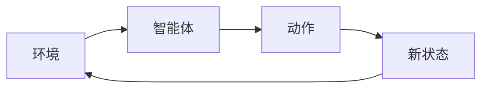

                 


```markdown
# 智能体协作增强价值投资的市场份额预测

> 关键词：智能体协作，价值投资，市场份额预测，算法原理，系统架构，项目实战

> 摘要：本文探讨智能体协作在价值投资中的应用，分析其如何通过协作机制增强投资决策，并详细讲解基于智能体协作的市场份额预测方法。文章从理论基础、算法实现到系统架构，层层剖析，结合实际案例，为读者提供全面的指导。

---

# 第一部分：智能体协作与价值投资的背景与概念

## 第1章：问题背景与描述

### 1.1 智能体协作的定义与特点

#### 1.1.1 智能体的基本概念
智能体（Agent）是能够感知环境、自主决策并采取行动的实体。智能体协作是指多个智能体通过通信和协调，共同完成复杂任务的过程。

#### 1.1.2 智能体协作的核心特征
- **分布式性**：智能体分布在不同的节点或位置。
- **自主性**：每个智能体都能独立决策。
- **协作性**：智能体之间通过通信和协商，共同完成目标。
- **适应性**：智能体能够根据环境变化调整策略。

#### 1.1.3 智能体协作的应用场景
- 金融投资：多个智能体协作分析市场数据，优化投资策略。
- 自动驾驶：车辆之间协作避免碰撞，提高交通效率。
- 智能城市：智能体协作管理资源分配，优化城市运行。

### 1.2 价值投资与市场份额预测的定义

#### 1.2.1 价值投资的基本概念
价值投资是一种投资策略，通过分析企业的基本面，寻找被市场低估的投资标的。核心在于找到具有长期增长潜力的公司。

#### 1.2.2 市场份额预测的定义与方法
市场份额预测是指估算某企业在市场中的占有率。常用方法包括历史数据分析、市场趋势分析和数学模型预测。

#### 1.2.3 价值投资与市场份额预测的关系
价值投资通过分析企业的内在价值，帮助企业确定其在市场中的合理地位，而市场份额预测则为企业提供外部竞争环境的参考。

### 1.3 问题解决与边界

#### 1.3.1 智能体协作如何增强价值投资
智能体协作通过分布式计算和信息共享，提高分析效率和准确性，帮助投资者做出更明智的决策。

#### 1.3.2 智能体协作在市场份额预测中的作用
智能体协作能够实时分析市场动态，预测竞争对手的策略，为市场份额预测提供更精准的数据支持。

#### 1.3.3 问题的边界与外延
- **边界**：仅关注智能体协作在价值投资和市场份额预测中的应用。
- **外延**：不涉及智能体协作在其他领域的具体应用，如自动驾驶或智能城市。

## 第2章：核心概念与联系

### 2.1 智能体协作的原理

#### 2.1.1 多智能体系统的构成
- **智能体**：独立决策的个体。
- **通信机制**：智能体之间的信息交换。
- **协作协议**：定义协作规则和流程。
- **协调机制**：解决冲突，确保协作顺利进行。

#### 2.1.2 智能体协作的机制
- **信息共享**：智能体共享数据和分析结果。
- **任务分配**：根据智能体的能力分配任务。
- **协同决策**：基于共享信息做出集体决策。

#### 2.1.3 智能体协作的数学模型
- **通信模型**：描述智能体之间的信息交换。
- **协作模型**：定义协作规则和流程。
- **决策模型**：基于信息做出最优决策。

### 2.2 价值投资与市场份额预测的关联

#### 2.2.1 价值投资的数学模型
价值投资模型通常基于企业的财务数据，如市盈率、市净率等指标，评估其内在价值。

#### 2.2.2 市场份额预测的数学模型
市场份额预测模型可以是基于回归分析、时间序列分析或机器学习模型。

#### 2.2.3 智能体协作如何影响价值投资和市场份额预测
智能体协作通过分布式计算和信息共享，提高分析的准确性和效率，从而增强价值投资决策，并提供更精准的市场份额预测。

### 2.3 核心概念的对比分析

#### 2.3.1 智能体协作与传统投资方法的对比
| 特性 | 智能体协作 | 传统投资方法 |
|------|------------|---------------|
| 决策主体 | 多智能体协作 | 单一决策者 |
| 数据来源 | 分布式数据 | 中央数据源 |
| 计算效率 | 高 | 一般 |

#### 2.3.2 市场份额预测的传统方法与智能体协作方法的对比
| 方法 | 传统方法 | 智能体协作方法 |
|------|-----------|----------------|
| 数据处理 | 中央处理 | 分布式处理 |
| 计算效率 | 低 | 高 |
| 可扩展性 | 一般 | 高 |

#### 2.3.3 价值投资与市场份额预测的核心要素对比
| 要素 | 价值投资 | 市场份额预测 |
|------|-----------|---------------|
| 关注点 | 内在价值 | 市场地位 |
| 数据来源 | 财务数据 | 市场数据 |
| 方法 | 定性分析 | 定量分析 |

---

# 第二部分：智能体协作增强价值投资的算法原理

## 第3章：算法原理讲解

### 3.1 强化学习在智能体协作中的应用

#### 3.1.1 强化学习的基本概念
强化学习是一种机器学习方法，通过智能体与环境的交互，学习最优策略。

#### 3.1.2 强化学习在协作中的应用
智能体通过强化学习，学习协作策略，提高整体收益。

#### 3.1.3 强化学习算法的实现


### 3.2 博弈论在智能体协作中的应用

#### 3.2.1 博弈论的基本概念
博弈论研究多个决策者在冲突或合作情况下的策略选择。

#### 3.2.2 博弈论在协作中的应用
智能体通过博弈论，制定协作规则，避免冲突，提高效率。

#### 3.2.3 博弈论算法的实现


### 3.3 算法实现与代码解读

#### 3.3.1 强化学习算法实现
```python
import numpy as np

class Agent:
    def __init__(self, state_space, action_space):
        self.state_space = state_space
        self.action_space = action_space
        self.Q = np.zeros((state_space, action_space))

    def act(self, state):
        return np.argmax(self.Q[state])

    def update(self, state, action, reward, next_state):
        self.Q[state, action] += reward
```

#### 3.3.2 博弈论算法实现
```python
def nash_equilibrium(payoff_matrix):
    # 计算纳什均衡
    pass
```

---

# 第三部分：智能体协作增强价值投资的系统架构

## 第4章：系统分析与架构设计

### 4.1 问题场景介绍
系统需要实时分析市场数据，预测市场份额，辅助投资决策。

### 4.2 系统功能设计

#### 4.2.1 系统模块划分
| 模块 | 功能 |
|------|------|
| 数据采集 | 收集市场数据 |
| 智能体协作 | 分析数据，预测市场份额 |
| 投资决策 | 基于预测结果，制定投资策略 |

#### 4.2.2 系统功能流程


### 4.3 系统架构设计

#### 4.3.1 系统架构图


### 4.4 系统接口设计

#### 4.4.1 API接口
```http
POST /api/predict
{
    "data": [...]
}
```

### 4.5 系统交互设计

#### 4.5.1 交互流程图


---

# 第四部分：智能体协作增强价值投资的项目实战

## 第5章：项目实战

### 5.1 环境安装

#### 5.1.1 安装Python
```bash
python --version
pip install --upgrade pip
```

#### 5.1.2 安装依赖库
```bash
pip install numpy pandas matplotlib
```

### 5.2 核心代码实现

#### 5.2.1 智能体协作模块
```python
import numpy as np

class CollaborativeAgent:
    def __init__(self, agents):
        self.agents = agents

    def collaborate(self, data):
        for agent in self.agents:
            agent.update(data)
        return self.agents[0].act(data)
```

### 5.3 代码解读与分析

#### 5.3.1 智能体协作模块解读
```python
class CollaborativeAgent:
    def __init__(self, agents):
        self.agents = agents

    def collaborate(self, data):
        for agent in self.agents:
            agent.update(data)
        return self.agents[0].act(data)
```

### 5.4 案例分析与详细讲解

#### 5.4.1 案例分析
分析某企业的市场份额预测，使用智能体协作模块进行预测。

### 5.5 项目小结

#### 5.5.1 项目总结
智能体协作能够有效提高市场份额预测的准确性和效率。

---

# 第五部分：智能体协作增强价值投资的总结与展望

## 第6章：总结与展望

### 6.1 最佳实践 tips
- 数据质量是关键，确保数据的准确性和完整性。
- 系统架构设计要合理，确保模块间的高效协作。

### 6.2 小结
智能体协作通过分布式计算和信息共享，显著提升了价值投资的效率和准确性。

### 6.3 注意事项
- 数据隐私问题需重视。
- 系统的可扩展性和稳定性需保证。

### 6.4 拓展阅读
- 推荐阅读《强化学习入门》和《博弈论与经济行为》。

---

# 作者

作者：AI天才研究院/AI Genius Institute & 禅与计算机程序设计艺术/Zen And The Art of Computer Programming
```

