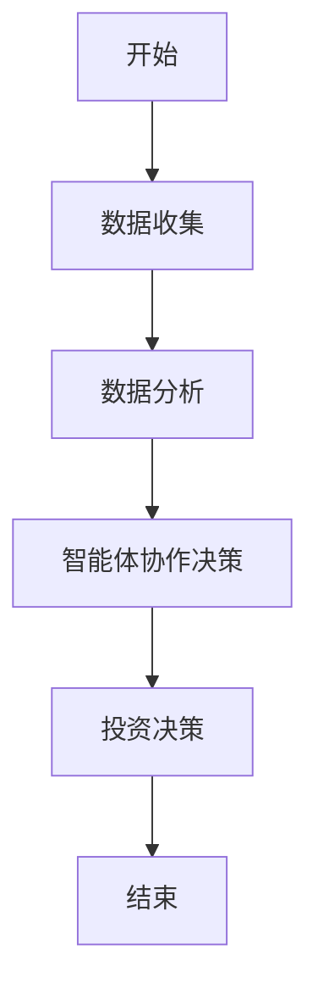
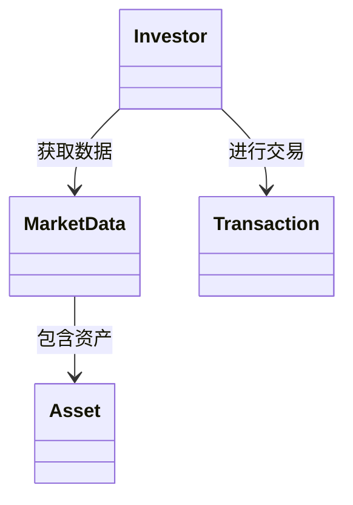
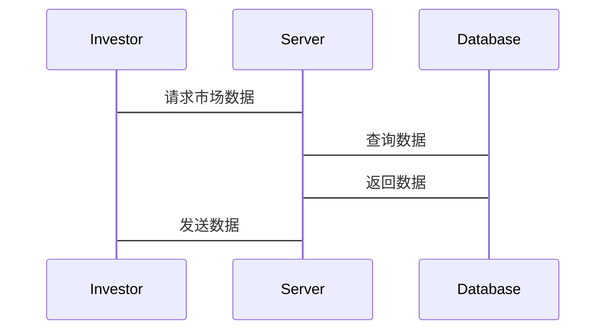

                 


```markdown
# 智能体协作增强价值投资的新兴市场机会识别

> 关键词：智能体协作，价值投资，新兴市场，机会识别，算法原理，系统架构，项目实战

> 摘要：随着人工智能技术的快速发展，智能体协作在价值投资中的应用日益广泛。本文通过分析智能体协作的核心原理，探讨其在新兴市场机会识别中的应用，结合实际案例，详细阐述智能体协作如何增强价值投资的效率和准确性。文章内容包括背景介绍、核心概念、算法原理、系统架构设计、项目实战和未来展望，旨在为读者提供全面的理论和技术指导。

---

# 第一部分：智能体协作与价值投资概述

## 第1章：智能体协作的背景与概念

### 1.1 智能体协作的定义与特点
智能体协作是指多个智能体通过协同工作，共同完成复杂任务的过程。其特点包括：
- **自主性**：每个智能体能够独立决策。
- **协作性**：智能体之间通过通信和协调完成任务。
- **适应性**：能够动态调整策略以应对变化。

### 1.2 价值投资的演变与新兴市场机会
#### 1.2.1 价值投资的定义与历史
价值投资是一种以内在价值为导向的投资策略，由本杰明·格雷厄姆提出，强调以低于内在价值的价格买入优质资产。

#### 1.2.2 新兴市场的特点与潜力
新兴市场通常指经济快速增长、资本市场尚未完全成熟的国家或地区。这些市场具有高增长潜力，但也伴随着高风险。

#### 1.2.3 智能体协作在价值投资中的作用
智能体协作通过数据挖掘、模式识别和决策优化，帮助投资者发现潜在机会，降低投资风险。

### 1.3 智能体协作与新兴市场机会的关系
#### 1.3.1 智能体协作如何增强价值投资
智能体协作通过分析海量数据，识别市场趋势，优化投资组合。

#### 1.3.2 新兴市场机会识别的挑战与机遇
新兴市场数据复杂、波动大，但智能体协作能够通过分布式计算和协同学习克服这些挑战。

#### 1.3.3 智能体协作在新兴市场中的应用案例
例如，在新兴市场中，智能体协作可以用于实时监控市场动态，识别潜在投资机会。

## 第2章：智能体协作的核心概念与联系

### 2.1 智能体协作的核心原理
智能体协作基于分布式计算和多智能体系统，通过通信和协调完成任务。

### 2.2 智能体协作与价值投资的对比
| 智能体协作 | 价值投资 |
|------------|-----------|
| 分布式决策 | 依赖专家判断 |
| 数据驱动 | 数据与经验结合 |

### 2.3 智能体协作的ER实体关系图
```mermaid
erDiagram
    customer[投资者]
    market[市场]
    asset[资产]
    transaction[交易]
    customer --> transaction : 进行交易
    market --> asset : 包含资产
    transaction --> asset : 涉及资产
```

---

# 第二部分：智能体协作的算法原理与数学模型

## 第3章：智能体协作的算法原理

### 3.1 智能体协作的算法流程图


### 3.2 智能体协作的数学模型
假设市场中有n个智能体，每个智能体的策略表示为π_i，收益为R_i。目标是通过协作最大化总体收益：
$$ \max_{\{\pi_i\}_{i=1}^n} \sum_{i=1}^n R_i $$

### 3.3 智能体协作的Python实现示例
```python
import numpy as np
from sklearn.cluster import KMeans

class Agent:
    def __init__(self, data):
        self.data = data
        self.model = KMeans(n_clusters=3)
        self.model.fit(data)

    def predict(self, new_data):
        return self.model.predict(new_data)

agents = [Agent(data1), Agent(data2), Agent(data3)]
results = [agent.predict(test_data) for agent in agents]
```

---

# 第三部分：智能体协作的系统架构与设计

## 第4章：智能体协作的系统设计

### 4.1 系统功能设计（领域模型）


### 4.2 系统架构设计


### 4.3 系统接口设计
接口设计包括数据接口、交易接口和分析接口，确保各模块之间的通信顺畅。

### 4.4 系统交互设计


---

# 第四部分：智能体协作的项目实战

## 第5章：项目实战

### 5.1 环境安装
安装必要的Python库，如NumPy、Pandas、Scikit-learn等。

### 5.2 核心代码实现
```python
import numpy as np
from sklearn.decomposition import PCA

def optimize_portfolio(returns):
    # 计算最优投资组合
    cov_matrix = np.cov(returns)
    inv_cov = np.linalg.inv(cov_matrix)
    weights = inv_cov / np.sum(inv_cov, axis=0)
    return weights
```

### 5.3 案例分析
以某新兴市场为例，分析智能体协作如何识别投资机会，优化投资组合。

### 5.4 项目小结
总结项目实施过程，分析结果，提出改进建议。

---

# 第五部分：智能体协作的未来展望与最佳实践

## 第6章：未来展望与最佳实践

### 6.1 智能体协作的发展趋势
未来，智能体协作将更加智能化、自动化，应用场景将更加广泛。

### 6.2 最佳实践 tips
- 数据质量是关键，确保数据来源可靠。
- 定期更新模型，适应市场变化。
- 团队协作是成功的关键，加强跨学科合作。

### 6.3 小结
智能体协作在价值投资中的应用前景广阔，值得深入研究和实践。

---

作者：AI天才研究院/AI Genius Institute & 禅与计算机程序设计艺术 /Zen And The Art of Computer Programming
```

