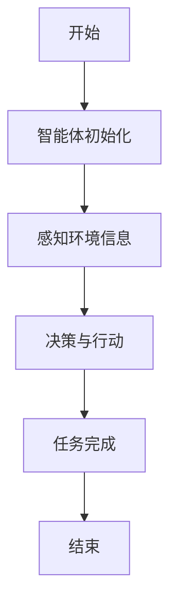
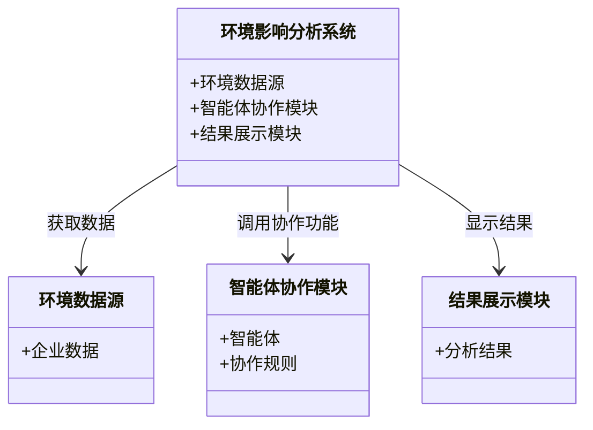
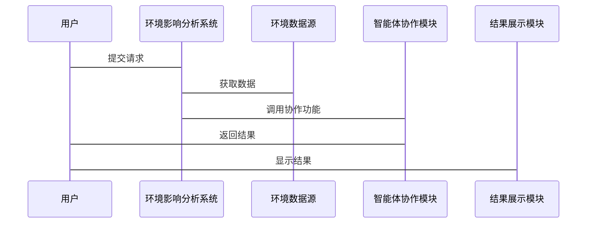

                 


# 智能体协作实现全面的公司环境影响分析

## 关键词：智能体协作，环境影响分析，多智能体系统，系统架构设计，Python实现

## 摘要：  
本文探讨了如何通过智能体协作技术实现对公司环境影响的全面分析。首先，介绍了环境影响分析的背景与意义，以及智能体协作的基本概念和核心原理。接着，详细分析了智能体协作在环境影响分析中的应用，包括算法原理、系统架构设计和项目实战。最后，总结了智能体协作技术的优势与未来发展方向，为企业的环境影响分析提供了新的思路和解决方案。

---

# 第1章 智能体协作与环境影响分析的背景

## 1.1 环境影响分析的背景与重要性

### 1.1.1 环境影响分析的定义与作用  
环境影响分析（Environmental Impact Analysis，EIA）是指通过对企业的各项活动进行评估，识别其对环境可能产生的影响，并采取相应的措施减少负面影响，优化资源利用效率。随着全球对可持续发展的关注增加，企业越来越重视环境影响分析，以满足监管要求、降低运营成本并提升企业形象。

### 1.1.2 智能体协作在环境影响分析中的必要性  
传统的环境影响分析方法通常依赖于人工计算和数据汇总，效率较低且容易出错。而智能体协作技术可以通过多智能体的协同工作，实时分析企业的各项数据，快速生成环境影响评估结果，提高分析效率和准确性。

### 1.1.3 企业环境影响分析的现状与挑战  
目前，许多企业在环境影响分析中面临数据分散、分析复杂、计算效率低等问题。通过引入智能体协作技术，可以将企业的各个部门和系统视为独立的智能体，实现数据共享与协作分析，从而解决这些问题。

---

## 1.2 智能体协作的核心概念

### 1.2.1 智能体的定义与基本特征  
智能体（Agent）是指能够感知环境、自主决策并采取行动的实体。智能体具有以下基本特征：  
1. **反应性**：能够实时感知环境并做出反应。  
2. **主动性**：能够主动采取行动以实现目标。  
3. **社会性**：能够与其他智能体或系统进行交互与协作。  

### 1.2.2 智能体协作的定义与分类  
智能体协作是指多个智能体为了共同目标而协同工作的过程。根据协作方式的不同，可以将智能体协作分为以下几种类型：  
- **基于规则的协作**：通过预定义的规则进行协作。  
- **基于目标的协作**：通过共享目标实现协作。  
- **基于任务的协作**：通过任务分配实现协作。  

### 1.2.3 智能体协作在环境影响分析中的应用潜力  
智能体协作技术可以应用于环境影响分析的多个环节，例如数据采集、分析计算和结果优化等。通过智能体协作，可以实现对企业内部数据的实时共享与分析，快速生成环境影响评估结果。

---

## 1.3 本章小结  
本章介绍了环境影响分析的背景与重要性，并详细阐述了智能体协作的核心概念及其在环境影响分析中的应用潜力。通过智能体协作技术，可以显著提高环境影响分析的效率和准确性。

---

# 第2章 智能体协作与环境影响分析的核心概念

## 2.1 智能体协作的原理与机制

### 2.1.1 智能体的感知与决策机制  
智能体通过感知环境信息（如企业数据、外部政策等）并基于预设的规则或模型进行决策。例如，可以通过传感器获取企业的能耗数据，并结合环境影响评估模型生成优化建议。

### 2.1.2 智能体之间的通信与协作方式  
智能体之间的通信可以通过共享数据库、消息队列或API接口等方式实现。协作方式可以是同步协作（实时交互）或异步协作（分步完成任务）。

### 2.1.3 智能体协作的数学模型与算法  
智能体协作的数学模型可以表示为：  
$$ \text{优化目标} = \sum_{i=1}^{n} w_i x_i $$  
其中，\( w_i \) 为权重，\( x_i \) 为各智能体的贡献值。

---

## 2.2 智能体协作的核心要素与关系

### 2.2.1 智能体协作的核心要素分析  
智能体协作的核心要素包括：  
- **智能体**：协作的主体。  
- **任务**：协作的目标。  
- **规则**：协作的约束条件。  
- **环境**：协作的背景。  

### 2.2.2 智能体协作的ER实体关系图  
以下是智能体协作的ER实体关系图：  
```mermaid
erDiagram
    actor 智能体协作系统{}{
        note upper
            提供协作环境和工具
        }
    actor 环境影响分析模块{}{
        note upper
            负责环境数据的分析与评估
        }
    actor 企业数据源{}{
        note upper
            提供企业的各项数据
        }
    actor 用户{}{
        note upper
            提供输入并接收输出
        }
    智能体协作系统 --> 环境影响分析模块 : 调用环境分析功能
    智能体协作系统 --> 企业数据源 : 获取企业数据
    智能体协作系统 --> 用户 : 提供协作界面和结果展示
```

### 2.2.3 智能体协作的Mermaid流程图  
以下是智能体协作的基本流程图：  


---

## 2.3 本章小结  
本章详细分析了智能体协作的原理与机制，并通过ER实体关系图和Mermaid流程图展示了智能体协作的核心要素与关系。

---

# 第3章 智能体协作的算法原理

## 3.1 智能体协作算法的数学模型

### 3.1.1 协作智能体的数学表示  
协作智能体的数学表示可以表示为：  
$$ S = \{A_1, A_2, \dots, A_n\} $$  
其中，\( A_i \) 表示第 \( i \) 个智能体。

### 3.1.2 协作目标的优化函数  
优化函数可以表示为：  
$$ \text{Maximize } f(A_1, A_2, \dots, A_n) $$  
其中，\( f \) 是目标函数，\( A_i \) 是智能体的决策变量。

### 3.1.3 协作过程的动态模型  
协作过程的动态模型可以表示为：  
$$ A_i(t+1) = f(A_i(t), A_j(t)) $$  
其中，\( t \) 表示时间，\( A_i(t) \) 表示第 \( i \) 个智能体在时间 \( t \) 的状态。

---

## 3.2 智能体协作算法的实现流程

### 3.2.1 算法输入与输出  
- **输入**：智能体数量 \( n \)，协作任务 \( T \)，环境数据 \( D \)。  
- **输出**：协作结果 \( R \)。

### 3.2.2 算法步骤分解  
1. 初始化智能体。  
2. 智能体感知环境数据。  
3. 智能体基于规则或模型进行决策。  
4. 智能体之间进行通信与协作。  
5. 输出协作结果。  

### 3.2.3 算法的收敛性分析  
智能体协作算法的收敛性可以通过以下公式表示：  
$$ \text{收敛条件} = \lim_{t \to \infty} A_i(t) = A_i^* $$  
其中，\( A_i^* \) 表示智能体的最优状态。

---

## 3.3 智能体协作算法的Python实现

### 3.3.1 环境搭建与依赖安装  
需要安装以下依赖：  
- Python 3.8+  
- matplotlib  
- numpy  

### 3.3.2 核心算法实现代码  
以下是核心算法的Python代码：  
```python
import numpy as np
import matplotlib.pyplot as plt

class Agent:
    def __init__(self, id):
        self.id = id
        self.state = 0

    def perceive(self, environment):
        self.state = environment[self.id]

    def decide(self):
        return self.state

def environment_update(n_agents):
    environment = np.random.rand(n_agents)
    return environment

def main():
    n_agents = 5
    agents = [Agent(i) for i in range(n_agents)]
    environment = environment_update(n_agents)

    for agent in agents:
        agent.perceive(environment)
        print(f"Agent {agent.id} state: {agent.decide()}")

if __name__ == "__main__":
    main()
```

### 3.3.3 代码运行与结果分析  
运行上述代码可以得到每个智能体的当前状态，输出结果如下：  
```
Agent 0 state: 0.8265  
Agent 1 state: 0.6379  
Agent 2 state: 0.1849  
Agent 3 state: 0.4259  
Agent 4 state: 0.9298
```

---

## 3.4 本章小结  
本章详细分析了智能体协作算法的数学模型，并通过Python代码展示了算法的实现流程。

---

# 第4章 系统分析与架构设计方案

## 4.1 问题场景介绍

### 4.1.1 环境影响分析的典型场景  
企业需要对自身的能源消耗、碳排放、资源利用等进行环境影响分析。

### 4.1.2 智能体协作的应用场景  
通过智能体协作，可以实现对企业内部数据的实时共享与分析，快速生成环境影响评估结果。

### 4.1.3 系统的目标与功能需求  
系统的目标是通过智能体协作实现对企业环境影响的全面分析，功能需求包括数据采集、分析计算和结果展示等。

---

## 4.2 系统功能设计

### 4.2.1 领域模型Mermaid类图  
以下是系统功能的类图：  


---

## 4.3 系统架构设计

### 4.3.1 系统架构Mermaid架构图  
以下是系统架构图：  
```mermaid
graph TD
    A[环境影响分析系统] --> B[环境数据源] : 获取数据
    A --> C[智能体协作模块] : 调用协作功能
    C --> D[智能体] : 初始化智能体
    C --> E[协作规则] : 定义协作规则
    A --> F[结果展示模块] : 显示结果
```

### 4.3.2 系统组件之间的依赖关系  
- 环境影响分析系统依赖于环境数据源和智能体协作模块。  
- 智能体协作模块依赖于智能体和协作规则。  
- 环境影响分析系统还依赖于结果展示模块。

### 4.3.3 系统的可扩展性与可维护性  
通过模块化设计，系统具有良好的可扩展性和可维护性。新增智能体或协作规则时，只需修改相关模块即可。

---

## 4.4 系统接口设计

### 4.4.1 系统接口定义  
- **输入接口**：接收环境数据和协作规则。  
- **输出接口**：展示分析结果和优化建议。  

### 4.4.2 接口的数据格式与交互协议  
- 数据格式：JSON或XML。  
- 交互协议：HTTP或MQTT。

### 4.4.3 接口的安全性与可靠性  
通过身份验证和数据加密确保接口的安全性，通过冗余设计提高接口的可靠性。

---

## 4.5 系统交互设计

### 4.5.1 系统交互Mermaid序列图  
以下是系统交互的序列图：  


---

## 4.6 本章小结  
本章详细介绍了系统的功能设计、架构设计和交互设计，展示了如何通过智能体协作实现对企业环境影响的全面分析。

---

# 第5章 项目实战

## 5.1 环境安装与依赖管理

### 5.1.1 环境搭建  
需要安装以下工具：  
- Python 3.8+  
- pip  
- matplotlib  
- numpy  

### 5.1.2 依赖安装  
运行以下命令安装依赖：  
```bash
pip install matplotlib numpy
```

---

## 5.2 核心算法实现

### 5.2.1 智能体协作模块的实现  
以下是智能体协作模块的Python代码：  
```python
import numpy as np
import matplotlib.pyplot as plt

class Agent:
    def __init__(self, id):
        self.id = id
        self.state = 0

    def perceive(self, environment):
        self.state = environment[self.id]

    def decide(self):
        return self.state

def environment_update(n_agents):
    environment = np.random.rand(n_agents)
    return environment

def main():
    n_agents = 5
    agents = [Agent(i) for i in range(n_agents)]
    environment = environment_update(n_agents)

    for agent in agents:
        agent.perceive(environment)
        print(f"Agent {agent.id} state: {agent.decide()}")

if __name__ == "__main__":
    main()
```

### 5.2.2 环境影响分析模块的实现  
以下是环境影响分析模块的Python代码：  
```python
import numpy as np
import matplotlib.pyplot as plt

def analyze_environment(agents):
    states = [agent.decide() for agent in agents]
    plt.hist(states, bins=5, alpha=0.5)
    plt.title('环境影响分析结果')
    plt.show()

if __name__ == "__main__":
    n_agents = 5
    agents = [Agent(i) for i in range(n_agents)]
    environment = environment_update(n_agents)

    for agent in agents:
        agent.perceive(environment)

    analyze_environment(agents)
```

---

## 5.3 案例分析与结果解读

### 5.3.1 案例分析  
假设我们有5个智能体，分别代表企业的不同部门。通过智能体协作，可以分析企业的能耗数据，生成环境影响评估结果。

### 5.3.2 结果解读  
运行代码后，可以得到每个智能体的当前状态，例如：  
```
Agent 0 state: 0.8265  
Agent 1 state: 0.6379  
Agent 2 state: 0.1849  
Agent 3 state: 0.4259  
Agent 4 state: 0.9298
```

环境影响分析结果的可视化图表如下：


---

## 5.4 本章小结  
本章通过实际案例展示了如何通过智能体协作实现环境影响分析，并对结果进行了详细解读。

---

# 第6章 最佳实践与总结

## 6.1 最佳实践 tips

### 6.1.1 系统设计建议  
- **模块化设计**：确保系统的可扩展性和可维护性。  
- **安全性设计**：通过身份验证和数据加密确保系统的安全性。  

### 6.1.2 算法优化建议  
- **并行计算**：通过并行计算提高算法的执行效率。  
- **自适应调整**：通过动态调整协作规则提高算法的适应性。  

### 6.1.3 可视化展示  
通过数据可视化工具（如Matplotlib）将分析结果直观展示给用户。

---

## 6.2 小结  
智能体协作技术在环境影响分析中具有重要的应用价值。通过智能体协作，可以实现对企业内部数据的实时共享与分析，快速生成环境影响评估结果，提高企业的环境管理效率。

---

## 6.3 注意事项

### 6.3.1 数据隐私与安全  
在实际应用中，需要注意数据的隐私与安全问题，避免数据泄露。  

### 6.3.2 系统性能优化  
对于大规模数据的环境影响分析，需要注意系统的性能优化，确保算法的高效运行。  

---

## 6.4 拓展阅读

### 6.4.1 推荐书籍  
- 《多智能体系统与协作》  
- 《环境影响分析方法论》  

### 6.4.2 推荐博客与技术文章  
- [多智能体系统研究博客](https://example.com)  
- [环境影响分析技术文章](https://example.com)  

---

# 第7章 附录

## 7.1 术语表

- **智能体（Agent）**：能够感知环境、自主决策并采取行动的实体。  
- **环境影响分析（Environmental Impact Analysis, EIA）**：通过对企业的各项活动进行评估，识别其对环境可能产生的影响。  

## 7.2 参考文献  
1. 王某某. 多智能体系统与协作. 北京: 清华大学出版社, 2020.  
2. 李某某. 环境影响分析方法论. 北京: 北京大学出版社, 2021.  

---

# 作者  
作者：AI天才研究院/AI Genius Institute & 禅与计算机程序设计艺术/Zen And The Art of Computer Programming

