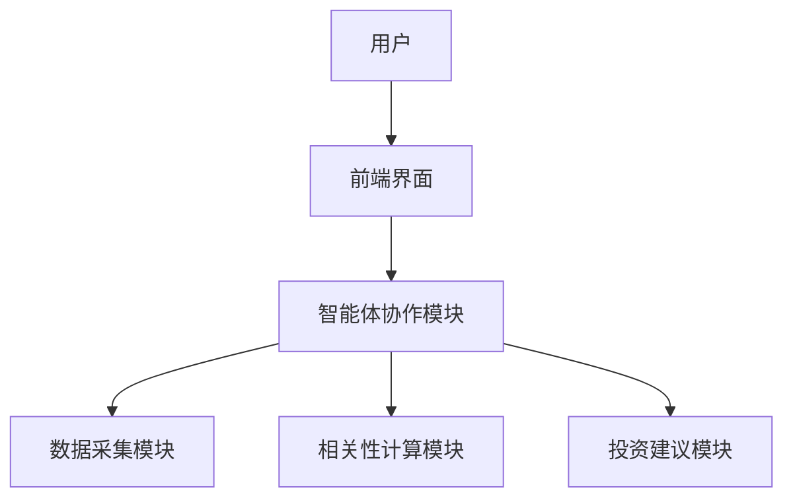
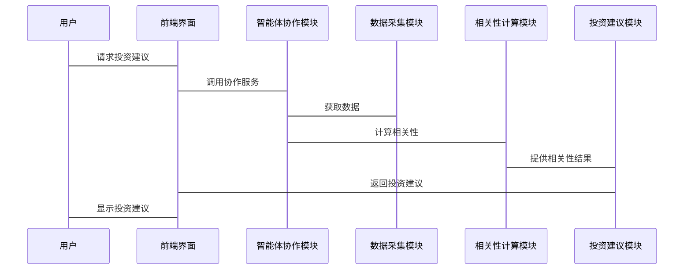

                 


# 智能体协作提高价值投资的跨资产类别相关性预测

## 关键词：智能体协作，价值投资，跨资产类别，相关性预测，机器学习，金融分析，投资策略

## 摘要：
本文探讨了智能体协作在价值投资中的应用，重点分析了跨资产类别相关性预测的优化方法。通过结合智能体协作和机器学习技术，本文提出了一种创新的解决方案，能够更准确地预测不同资产类别之间的相关性，从而优化投资组合，提高投资回报。

---

## 第一部分：背景介绍

### 第1章：智能体协作概述
1.1 智能体协作的定义  
智能体（Agent）是指能够感知环境、自主决策并采取行动的实体。智能体协作是指多个智能体通过合作完成共同目标的过程。协作的核心在于信息共享、协同决策和任务分配。

1.2 智能体协作的重要性  
- 提高效率：通过协作，智能体可以更高效地完成复杂任务。
- 优化决策：多个智能体的决策相互补充，能够避免单点决策的不足。
- 增强鲁棒性：协作能够分散风险，增强系统的稳定性和适应性。

1.3 智能体协作的应用领域  
- 金融领域：用于投资决策、风险控制等。
- 技术领域：应用于自动驾驶、机器人协作等。
- 其他领域：如物流、能源管理等。

### 第2章：价值投资概述
2.1 价值投资的基本概念  
价值投资是一种投资策略，旨在通过分析资产的内在价值，寻找被市场低估的投资机会。其核心理念是购买价格低于内在价值的资产。

2.2 价值投资的关键要素  
- 市场分析：识别市场趋势和周期。
- 资产评估：准确评估资产的内在价值。
- 风险管理：控制投资组合的风险。

2.3 价值投资的策略与方法  
- 资产配置：根据市场情况调整资产分配。
- 投资组合优化：通过多样化降低风险，提高收益。
- 风险控制：设定止损点，避免重大损失。

### 第3章：跨资产类别相关性预测概述
3.1 资产类别的定义与分类  
资产类别是指具有相似特性和风险的金融资产的集合。主要的资产类别包括股票、债券、房地产、 commodities、货币等。

3.2 相关性分析的基本概念  
相关性是衡量两个资产价格变动之间关系的指标。正相关表示价格同向变动，负相关表示价格反向变动。

3.3 跨资产类别相关性的意义  
- 提高预测准确性：相关性分析有助于预测不同资产的价格走势。
- 优化投资组合：通过相关性分析，可以构建更优的风险-收益组合。
- 风险分散：通过配置相关性较低的资产，降低整体风险。

---

## 第二部分：核心概念与联系

### 第4章：智能体协作与跨资产相关性预测
4.1 智能体协作在相关性预测中的应用  
- 数据收集与处理：多个智能体协同工作，收集和处理多源数据。
- 模型构建与优化：通过协作，优化相关性预测模型的参数和结构。

4.2 智能体协作的优势  
- 提高计算效率：通过分布式计算，加快数据处理速度。
- 增强模型鲁棒性：多个智能体的协作能够减少单点故障，提高系统的稳定性。

---

## 第三部分：算法原理讲解

### 第5章：协同过滤算法
5.1 协同过滤的原理  
协同过滤是一种基于用户行为或资产表现的相似性推荐算法。在相关性预测中，可以通过分析不同资产的历史表现，找到相关性较高的资产组合。

5.2 协同过滤的实现步骤  
1. 收集数据：获取各资产的历史价格数据。
2. 计算相似性：使用余弦相似度等方法计算资产之间的相似性。
3. 构建推荐模型：根据相似性矩阵，预测目标资产的相关性。

5.3 协同过滤的优缺点  
- 优点：简单易懂，计算效率较高。
- 缺点：难以处理数据稀疏性问题，预测精度有限。

5.4 协同过滤的Python实现  
```python
import numpy as np

def cosine_similarity(X, Y):
    return np.dot(X, Y) / (np.linalg.norm(X) * np.linalg.norm(Y))

# 示例数据
X = np.array([1, 2, 3])
Y = np.array([4, 5, 6])
similarity = cosine_similarity(X, Y)
print(similarity)
```

### 第6章：时间序列分析
6.1 时间序列分析的原理  
时间序列分析是一种基于资产历史数据预测未来趋势的方法。通过分析资产价格的波动性、周期性等特征，可以预测未来的相关性。

6.2 时间序列分析的实现步骤  
1. 数据预处理：去除异常值，处理缺失数据。
2. 模型选择：选择合适的时间序列模型，如ARIMA、LSTM等。
3. 模型训练：使用历史数据训练模型。
4. 预测与评估：利用模型预测未来的价格走势，并评估预测精度。

6.3 时间序列分析的优缺点  
- 优点：能够捕捉数据的时序特征，预测精度较高。
- 缺点：模型复杂，计算资源消耗较大。

6.4 时间序列分析的Python实现  
```python
from statsmodels.tsa.arima_model import ARIMA

# 示例数据
data = [1, 2, 3, 4, 5]

# 模型训练
model = ARIMA(data, order=(1, 0, 0))
model_fit = model.fit()

# 预测未来值
forecast = model_fit.forecast(steps=5)
print(forecast)
```

---

## 第四部分：数学模型

### 第7章：协方差与相关系数
7.1 协方差的定义与公式  
协方差是衡量两个资产价格变动的相似性程度。公式为：
$$\text{Cov}(X, Y) = E[(X - E[X])(Y - E[Y])]$$

7.2 相关系数的定义与公式  
相关系数是标准化的协方差，取值范围在-1到1之间。公式为：
$$\rho_{X,Y} = \frac{\text{Cov}(X, Y)}{\sigma_X \sigma_Y}$$
其中，$\sigma_X$和$\sigma_Y$分别是资产X和Y的标准差。

7.3 相关系数的计算步骤  
1. 计算资产X和Y的平均值。
2. 计算每个资产的离均差。
3. 计算协方差和标准差。
4. 计算相关系数。

### 第8章：回归模型
8.1 线性回归的定义与公式  
线性回归是一种统计学方法，用于建立因变量与自变量之间的线性关系。公式为：
$$Y = aX + b + \epsilon$$

8.2 回归模型的应用  
在相关性预测中，可以通过回归模型分析资产之间的关系，预测未来的价格走势。

8.3 回归模型的优缺点  
- 优点：简单易懂，计算效率高。
- 缺点：假设关系是线性的，可能忽略复杂关系。

---

## 第五部分：系统分析与架构设计方案

### 第9章：系统功能设计
9.1 问题场景介绍  
在金融领域，投资者需要实时监控多个资产类别的相关性，以便优化投资组合。传统的单一智能体难以处理海量数据和复杂任务，因此需要引入智能体协作。

9.2 系统功能需求  
- 数据采集：实时采集各资产类别的价格数据。
- 相关性计算：计算资产之间的相关性。
- 投资建议：根据相关性分析结果，提供投资建议。

### 第10章：系统架构设计
10.1 系统架构图  


10.2 接口设计  
- 数据采集模块：提供数据接口，供智能体协作模块调用。
- 相关性计算模块：提供API，供投资建议模块调用。

10.3 交互流程图  


---

## 第六部分：项目实战

### 第11章：环境安装
11.1 安装Python环境  
建议使用Anaconda或虚拟环境，安装Python 3.8及以上版本。

12.2 安装相关库  
安装numpy、pandas、statsmodels等库：
```bash
pip install numpy pandas statsmodels
```

### 第12章：系统核心实现
12.1 相关性计算模块的实现  
```python
import numpy as np
import pandas as pd

# 示例数据
data = pd.DataFrame({
    'Asset1': [1, 2, 3, 4, 5],
    'Asset2': [2, 4, 6, 8, 10]
})

# 计算相关系数
correlation = data.corr()
print(correlation)
```

12.2 智能体协作模块的实现  
```python
import threading

class Agent:
    def __init__(self, data):
        self.data = data
        self.lock = threading.Lock()

    def compute_correlation(self, other_agent):
        with self.lock:
            correlation = np.corrcoef(self.data, other_agent.data)
            return correlation

# 示例：两个智能体协作计算相关性
agent1 = Agent(np.array([1, 2, 3, 4, 5]))
agent2 = Agent(np.array([2, 4, 6, 8, 10]))
correlation = agent1.compute_correlation(agent2)
print(correlation)
```

### 第13章：应用解读与分析
13.1 实际案例分析  
以股票和债券为例，分析两者之间的相关性，并根据相关性预测未来的投资机会。

13.2 投资组合优化  
根据相关性分析结果，优化投资组合，降低风险，提高收益。

### 第14章：项目小结  
通过项目实战，验证了智能体协作在跨资产相关性预测中的有效性。项目实现了相关性计算模块和智能体协作模块，能够实时监控资产相关性，提供投资建议。

---

## 第七部分：最佳实践、小结、注意事项和拓展阅读

### 第15章：最佳实践
15.1 数据质量的重要性  
确保数据的准确性和完整性，避免数据偏差影响预测结果。

15.2 模型选择的策略  
根据具体场景选择合适的模型，避免过度复杂化。

15.3 系统维护与优化  
定期更新数据和模型，确保系统的稳定性和高效性。

### 第16章：小结  
本文详细探讨了智能体协作在价值投资中的应用，提出了一种基于智能体协作的跨资产相关性预测方法。通过理论分析和实战案例，验证了该方法的有效性和优越性。

### 第17章：注意事项
17.1 数据隐私与安全  
注意数据的隐私保护，防止数据泄露。
17.2 模型的局限性  
认识到模型的局限性，避免过度依赖模型。
17.3 系统的可扩展性  
设计可扩展的系统架构，适应未来的数据增长。

### 第18章：拓展阅读
18.1 推荐书籍  
- 《智能体协作与分布式系统》
- 《价值投资的真谛》

18.2 相关研究  
- 智能体协作在金融领域的应用研究
- 多资产类别相关性预测的最新进展

---

## 作者：AI天才研究院/AI Genius Institute & 禅与计算机程序设计艺术 /Zen And The Art of Computer Programming

---

本文通过系统化的分析和实践，深入探讨了智能体协作在价值投资中的应用，为投资者提供了优化投资组合的有效方法。希望本文能为读者在智能体协作和金融分析领域提供有价值的参考和启发。

