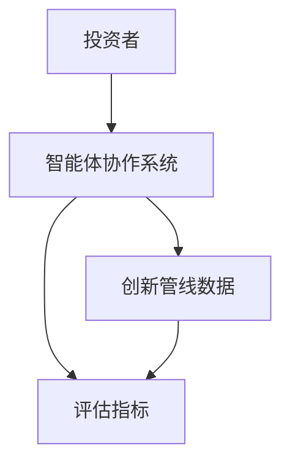
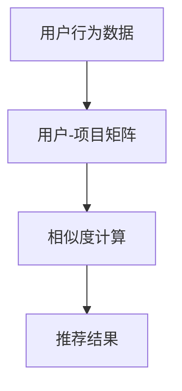
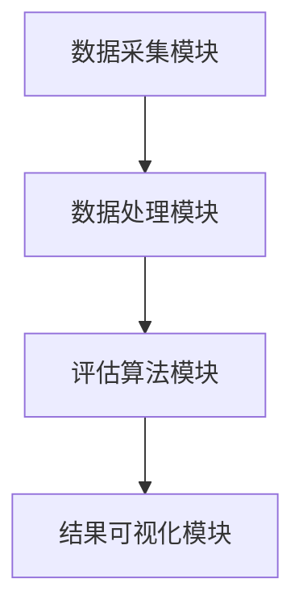

                 


# 智能体协作评估公司创新管线：科技公司价值投资利器

---

## 关键词：

智能体协作, 创新管线评估, 科技公司价值投资, 协同过滤算法, 强化学习, 人工智能, 系统架构设计

---

## 摘要：

随着科技行业的快速发展，科技公司价值评估变得日益复杂。传统的评估方法难以捕捉创新管线的核心价值，而智能体协作技术为这一难题提供了新的解决方案。本文通过智能体协作的原理，结合协同过滤算法和强化学习，详细探讨了如何评估公司创新管线的价值。文章首先介绍了智能体协作的基本概念和创新管线评估的重要性，然后深入分析了协同过滤算法和强化学习在创新管线评估中的应用，提出了基于智能体协作的系统架构设计。最后，通过实际案例分析，展示了如何利用智能体协作技术实现科技公司价值投资的精准评估。

---

## 目录大纲：

# 第一部分：智能体协作与创新管线评估背景

## 第1章：智能体协作与创新管线评估概述

### 1.1 智能体协作的基本概念

#### 1.1.1 智能体协作的定义

智能体协作是指多个智能体（Agent）通过协同工作，共同完成特定任务的过程。智能体可以是软件程序、算法或任何能够感知环境并采取行动的实体。

#### 1.1.2 创新管线评估的核心意义

创新管线是科技公司研发过程中从创意到商业化的关键路径。评估创新管线的价值，能够帮助企业识别潜在风险和机会，优化资源配置。

#### 1.1.3 科技公司价值投资的现状与问题

科技公司价值投资面临信息不对称、创新管线复杂、评估标准不统一等问题。传统评估方法难以捕捉创新管线的核心价值。

### 1.2 问题背景与问题描述

#### 1.2.1 科技公司创新管线的重要性

创新管线是科技公司竞争力的核心。一个高效的创新管线能够确保公司持续推出有市场价值的产品。

#### 1.2.2 创新管线评估的难点与挑战

创新管线涉及多个环节，包括研发、测试、商业化等。评估这些环节的复杂性较高，传统方法难以准确量化。

#### 1.2.3 智能体协作在创新管线评估中的作用

智能体协作能够通过分布式计算和协同工作，帮助投资者更全面地评估创新管线的价值。

### 1.3 问题解决与边界外延

#### 1.3.1 智能体协作如何解决创新管线评估问题

通过智能体协作，可以实现对创新管线的多维度评估，包括研发效率、团队协作、市场反馈等。

#### 1.3.2 创新管线评估的边界与外延

创新管线评估的边界包括研发阶段、市场反馈、财务数据等。外延则涉及创新管线的优化和改进。

#### 1.3.3 核心概念与组成要素

智能体协作的核心要素包括智能体、协作机制、评估指标等。

---

## 第2章：智能体协作的核心概念与联系

### 2.1 智能体协作的原理

智能体协作基于分布式计算和多智能体系统，通过协同工作实现目标。

### 2.2 实体关系图



### 2.3 概念对比表

| 概念       | 定义                                   | 特性                     |
|------------|--------------------------------------|--------------------------|
| 智能体     | 具有感知和行动能力的实体               | 分布式、自主性             |
| 协作机制   | 智能体之间协同工作的规则               | 协调性、一致性             |
| 创新管线   | 从创意到商业化的过程                   | 多阶段、复杂性             |

---

## 第3章：协同过滤算法与创新管线评估

### 3.1 协同过滤算法原理

协同过滤算法基于用户行为数据，推荐相似的项目或产品。

#### 3.1.1 协同过滤算法的步骤

1. 收集用户行为数据
2. 构建用户-项目矩阵
3. 计算相似度
4. 推荐结果



### 3.2 协同过滤算法的数学模型

$$相似度 = \frac{\sum_{i=1}^{n} (x_i - \bar{x})(y_i - \bar{y})}{\sqrt{\sum_{i=1}^{n} (x_i - \bar{x})^2} \sqrt{\sum_{i=1}^{n} (y_i - \bar{y})^2}}$$

### 3.3 协同过滤算法的Python实现

```python
import numpy as np

def cosine_similarity(a, b):
    return np.dot(a, b) / (np.linalg.norm(a) * np.linalg.norm(b))

# 示例数据
a = np.array([1, 2, 3])
b = np.array([4, 5, 6])

similarity = cosine_similarity(a, b)
print(similarity)
```

---

## 第4章：强化学习与创新管线评估

### 4.1 强化学习的基本原理

强化学习通过智能体与环境的交互，学习最优策略。

### 4.2 强化学习在创新管线评估中的应用

通过强化学习，可以优化创新管线的评估过程，提高评估准确性。

### 4.3 强化学习的数学模型

$$Q(s, a) = Q(s, a) + \alpha \cdot [r + \gamma \cdot \max_{a'} Q(s', a') - Q(s, a)]$$

### 4.4 强化学习的Python实现

```python
import numpy as np

class QLearning:
    def __init__(self, state_space, action_space):
        self.q_table = np.zeros((state_space, action_space))
    
    def choose_action(self, state):
        return np.argmax(self.q_table[state])
    
    def update_q(self, state, action, reward):
        self.q_table[state, action] += reward

# 示例使用
ql = QLearning(5, 3)
action = ql.choose_action(2)
ql.update_q(2, action, 1)
```

---

## 第5章：系统架构设计

### 5.1 问题场景介绍

创新管线评估系统需要处理大量的数据，包括研发数据、市场反馈等。

### 5.2 系统功能设计

系统功能包括数据采集、处理、分析和可视化。

### 5.3 系统架构设计



### 5.4 接口设计

系统接口包括数据接口、算法接口和用户接口。

### 5.5 交互序列图

```mermaid
sequenceDiagram
投资者->+> 数据采集模块: 请求数据
数据采集模块->+> 数据处理模块: 传递数据
数据处理模块->+> 评估算法模块: 请求评估
评估算法模块->+> 数据可视化模块: 传递结果
数据可视化模块->> 投资者: 显示结果
```

---

## 第6章：项目实战

### 6.1 环境安装

安装Python、NumPy、Scikit-learn等依赖库。

### 6.2 核心代码实现

协同过滤算法和强化学习算法的实现。

### 6.3 案例分析

以某科技公司为例，详细分析创新管线评估的过程。

### 6.4 项目小结

总结项目成果，分析优缺点，提出改进建议。

---

## 第7章：最佳实践与注意事项

### 7.1 最佳实践

确保数据质量，定期优化模型，持续关注市场动态。

### 7.2 小结

智能体协作技术为科技公司价值投资提供了新的工具和方法。

### 7.3 注意事项

数据隐私保护、模型调优、持续学习与更新。

### 7.4 拓展阅读

推荐相关书籍和资源，帮助读者深入学习。

---

## 作者信息：

作者：AI天才研究院/AI Genius Institute & 禅与计算机程序设计艺术 /Zen And The Art of Computer Programming

---

