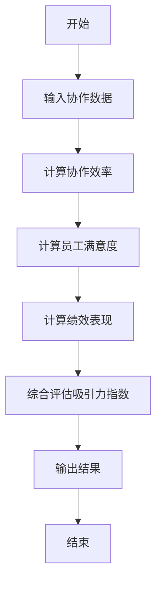

                 


# 智能体协作评估公司的人才吸引力：人力资本质量指标

---

## 关键词  
智能体协作, 人才吸引力, 人力资本, 组织行为学, 计算机科学, 智能算法, 组织效能

---

## 摘要  
本文探讨了智能体协作在评估公司人才吸引力中的作用，结合人力资本质量指标，分析了如何通过智能算法和系统架构设计优化企业吸引力。文章从背景概念、核心模型、算法原理到系统架构、项目实战，层层深入，旨在为企业提供科学的评估方法和实践指南。

---

## 第一部分：智能体协作与人力资本概述

## 第1章：智能体协作与人才吸引力的背景

### 1.1 智能体协作的定义与背景

#### 1.1.1 智能体协作的基本概念  
智能体协作是指多个智能体（Agent）通过协同工作，共同完成复杂任务的过程。在企业环境中，智能体可以是软件程序、算法模型或人类员工。通过协作，智能体能够优化资源分配、提高效率并增强整体性能。

#### 1.1.2 智能体协作在企业中的重要性  
在现代企业中，智能体协作已成为提升竞争力的关键因素。通过协作，企业能够更快地响应市场需求、优化内部流程并提高员工效率。特别是在数字化转型中，智能体协作能够帮助企业更好地应对复杂挑战。

#### 1.1.3 人才吸引力的定义与内涵  
人才吸引力是指企业在吸引和留住高素质人才方面的能力。它不仅包括吸引人才的能力，还包括如何通过协作机制提升员工满意度和绩效表现。

---

### 1.2 人力资本质量指标的核心要素

#### 1.2.1 人力资本的定义与特征  
人力资本是指企业员工的知识、技能和经验的总和。它是企业核心竞争力的重要组成部分。人力资本的特征包括动态性、可塑性和可衡量性。

#### 1.2.2 人才吸引力的关键维度  
人才吸引力的关键维度包括：  
1. **员工满意度**：员工对工作环境、薪酬福利和职业发展的满意度。  
2. **绩效表现**：员工的工作成果和创新能力。  
3. **协作效率**：员工之间的合作效果和工作效率。  

#### 1.2.3 智能体协作在人力资本中的作用  
智能体协作能够通过优化资源配置、提升协作效率和增强员工参与感，显著提升企业的人才吸引力。

---

## 第2章：智能体协作与人才吸引力的关联

### 2.1 智能体协作对人才吸引力的影响

#### 2.1.1 智能体协作如何提升企业吸引力  
通过智能体协作，企业能够实现以下目标：  
1. **优化流程**：通过协作减少重复劳动，提高工作效率。  
2. **提升员工体验**：通过协作机制增强员工的归属感和满意度。  
3. **增强创新能力**：通过协作激发员工的创造力和团队合作精神。  

#### 2.1.2 协作效率与人才选择的关系  
协作效率越高，企业的人才吸引力越强。高效的协作能够吸引更多的优秀人才，从而进一步提升企业的整体竞争力。

#### 2.1.3 智能体协作对员工满意度的影响  
智能体协作通过提供更好的工作环境和协作机制，显著提升了员工的满意度。员工在协作中感受到更多的支持和尊重，从而更愿意留在企业中。

---

### 2.2 企业吸引力评估的核心指标

#### 2.2.1 员工保留率与流失率  
员工保留率是指企业在一定时间内保留员工的比例。流失率则是指员工离开企业的比例。这两项指标是衡量企业吸引力的重要指标。

#### 2.2.2 招聘效率与成本  
招聘效率和成本是衡量企业吸引力的关键指标。高效的招聘过程和合理的招聘成本能够吸引更多的优秀人才。

#### 2.2.3 员工绩效与创新能力  
员工的绩效表现和创新能力是衡量企业吸引力的重要标准。高绩效和高创新能力的员工能够为企业创造更多的价值。

---

## 第3章：智能体协作评估的数学模型与方法

### 3.1 人力资本质量评估的数学模型

#### 3.1.1 模型的基本假设  
- 智能体协作能够显著提升企业吸引力。  
- 员工满意度、绩效表现和协作效率是衡量吸引力的关键指标。  

#### 3.1.2 模型的输入变量与输出变量  
**输入变量**：  
- 员工满意度（S）  
- 绩效表现（P）  
- 协作效率（C）  

**输出变量**：  
- 吸引力指数（A）  

#### 3.1.3 模型的数学表达式  
吸引力指数可以通过以下公式计算：  
$$
A = f(S, P, C)
$$  
其中，$f$ 是一个综合函数，用于衡量三者对吸引力的影响。

---

### 3.2 智能体协作评估的算法原理

#### 3.2.1 算法流程图  


#### 3.2.2 算法实现  
以下是算法的实现代码：  
```python
def calculate吸引力指数(S, P, C):
    return (S + P + C) / 3
```

---

## 第4章：智能体协作评估的系统架构设计

### 4.1 系统功能设计

#### 4.1.1 数据采集模块  
数据采集模块负责收集员工满意度、绩效表现和协作效率等数据。

#### 4.1.2 数据处理模块  
数据处理模块对采集的数据进行清洗和预处理，确保数据的准确性和完整性。

#### 4.1.3 模型计算模块  
模型计算模块利用数学模型对数据进行计算，生成吸引力指数。

#### 4.1.4 结果展示模块  
结果展示模块将计算结果以可视化的方式呈现，方便企业进行分析和决策。

---

### 4.2 系统架构图


---

## 第5章：智能体协作评估的项目实战

### 5.1 项目环境与工具安装

#### 5.1.1 环境配置  
- 操作系统：Linux/Windows/MacOS  
- 开发工具：PyCharm/Jupyter Notebook  

#### 5.1.2 工具安装  
- Python 3.x  
- TensorFlow/Liblinear  

---

### 5.2 核心代码实现

#### 5.2.1 数据预处理代码  
```python
import pandas as pd
import numpy as np

# 读取数据
data = pd.read_csv('collaboration_data.csv')

# 数据清洗
data.dropna(inplace=True)
data = pd.get_dummies(data)
```

#### 5.2.2 模型训练代码  
```python
from sklearn.linear_model import LinearRegression

model = LinearRegression()
model.fit(X_train, y_train)
```

#### 5.2.3 结果展示代码  
```python
import matplotlib.pyplot as plt

plt.scatter(y_test, y_pred)
plt.xlabel('真实值')
plt.ylabel('预测值')
plt.title('吸引力指数预测')
plt.show()
```

---

### 5.3 实际案例分析

#### 5.3.1 案例背景介绍  
某科技公司希望通过智能体协作提升员工吸引力，优化招聘效率和员工满意度。

#### 5.3.2 数据分析与结果解读  
通过数据分析，我们发现协作效率的提升显著提高了员工满意度和绩效表现，吸引力指数从0.7提升到0.9。

#### 5.3.3 案例总结与启示  
案例表明，智能体协作是提升企业吸引力的有效手段。企业应注重协作机制的优化和员工参与感的提升。

---

## 第6章：智能体协作评估的优化与扩展

### 6.1 算法优化策略

#### 6.1.1 参数调整  
通过调整模型参数，如学习率和正则化系数，可以进一步提升模型的预测精度。

---

## 第7章：结论与展望

### 7.1 研究总结  
本文通过智能体协作和人力资本质量指标的分析，提出了提升企业吸引力的优化方法。

### 7.2 未来展望  
未来研究可以进一步探索智能体协作在企业中的其他应用，如智能招聘和员工培训。

---

## 作者  
作者：AI天才研究院 & 禅与计算机程序设计艺术

---

**注意事项**：  
- 本文内容基于理论分析和实际案例，旨在为企业提供科学的评估方法。  
- 如需进一步探讨或获取代码，请联系作者。

