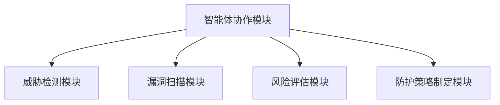
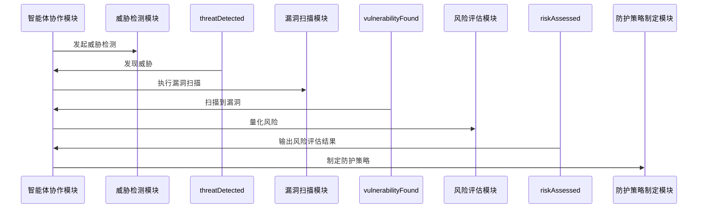

                 


# 智能体协作评估公司的网络安全风险：数字时代的新考量

## 关键词：
智能体协作、网络安全风险评估、数字时代、人工智能、网络安全

## 摘要：
随着数字时代的快速发展，网络安全风险评估变得越来越复杂和重要。传统的评估方法逐渐显现出效率低下、准确性不足等问题。智能体协作作为一种新兴的技术手段，为网络安全风险评估提供了新的解决方案。本文将详细探讨智能体协作在网络安全风险评估中的应用，分析其优势和挑战，结合实际案例，深入探讨其在数字时代的重要性和未来发展方向。

---

# 第一部分：智能体协作与网络安全风险评估背景

## 第1章：智能体协作与网络安全风险评估概述

### 1.1 智能体协作的定义与特点

#### 1.1.1 智能体的基本概念
智能体（Agent）是指能够感知环境并采取行动以实现目标的实体。在计算机科学中，智能体可以是软件程序，也可以是物理机器人。智能体的核心特征包括自主性、反应性、目标导向性和社会性。

#### 1.1.2 智能体协作的核心特点
智能体协作是指多个智能体通过合作完成共同目标的过程。其核心特点包括：
- **分布式智能**：每个智能体独立工作，但通过协作实现整体目标。
- **动态性**：智能体能够根据环境变化实时调整策略。
- **自主性**：智能体能够在没有中央控制的情况下自主决策。
- **多样性**：智能体可以具有不同的功能和能力，以应对复杂问题。

#### 1.1.3 智能体协作在网络安全中的应用
在网络安全领域，智能体协作可以用于实时监控、威胁检测、漏洞修复等任务。通过协作，智能体能够快速响应复杂的网络安全威胁，提高整体防护能力。

### 1.2 网络安全风险评估的背景与挑战

#### 1.2.1 网络安全风险的定义
网络安全风险是指由于网络攻击、漏洞利用或其他安全事件可能导致的损失或损害。风险评估是通过分析潜在威胁和漏洞，量化其可能性和影响程度，从而制定有效的防护策略。

#### 1.2.2 数字时代网络安全风险的新特点
随着数字化转型的深入，网络安全风险呈现出以下新特点：
- **复杂性增加**：网络攻击手段多样化，攻击者利用零日漏洞和高级持续性威胁（APT）进行攻击。
- **动态性增强**：网络安全威胁不断演变，传统的静态防护策略难以应对。
- **依赖性增强**：企业越来越依赖云服务和第三方系统，增加了外部攻击面。

#### 1.2.3 传统风险评估方法的局限性
传统的风险评估方法通常依赖人工分析，存在以下问题：
- **效率低下**：人工评估耗时长，难以应对动态变化的威胁。
- **准确性不足**：依赖主观判断，可能导致遗漏重要风险。
- **成本高昂**：需要大量资源和专业人员支持。

### 1.3 智能体协作在网络安全风险评估中的作用

#### 1.3.1 提高风险评估的效率
智能体协作能够快速分析大量的网络安全数据，实时识别潜在威胁，显著提高风险评估的效率。

#### 1.3.2 增强风险评估的准确性
通过智能体之间的协作，可以综合多个智能体的分析结果，减少单个智能体的判断误差，从而提高风险评估的准确性。

#### 1.3.3 降低风险评估的成本
智能体协作可以自动化完成大部分风险评估工作，减少对人工的依赖，从而降低整体成本。

### 1.4 本章小结
本章介绍了智能体协作的基本概念和特点，分析了数字时代网络安全风险的新特点及其传统评估方法的局限性。同时，探讨了智能体协作在网络安全风险评估中的重要作用，为后续章节的深入分析奠定了基础。

---

## 第2章：智能体协作与网络安全风险评估的核心概念

### 2.1 智能体协作的基本原理

#### 2.1.1 智能体的协作机制
智能体协作机制包括任务分配、信息共享和决策协调。通过任务分配，智能体明确各自的角色和责任；通过信息共享，智能体能够快速获取必要的信息；通过决策协调，智能体达成一致的行动方案。

#### 2.1.2 智能体协作的数学模型
智能体协作的数学模型可以表示为：
$$
f(\text{任务}, \text{智能体能力}) = \text{协作策略}
$$
其中，任务和智能体能力是输入，协作策略是输出。

#### 2.1.3 智能体协作的实现方法
智能体协作可以通过分布式计算、事件驱动和协商机制实现。分布式计算确保每个智能体独立工作，事件驱动保证智能体能够实时响应环境变化，协商机制则用于解决协作中的冲突。

### 2.2 网络安全风险评估的理论基础

#### 2.2.1 风险评估的基本框架
网络安全风险评估的基本框架包括威胁识别、漏洞分析、风险量化和防护策略制定四个步骤。

#### 2.2.2 风险评估的关键要素
- **威胁**：可能对系统造成损害的事件。
- **漏洞**：系统中存在的安全弱点。
- **影响**：威胁利用漏洞可能造成的损失。
- **概率**：威胁发生的可能性。

#### 2.2.3 风险评估的数学模型
风险评估的数学模型可以表示为：
$$
\text{风险} = \text{威胁} \times \text{漏洞} \times \text{影响} \times \text{概率}
$$

### 2.3 智能体协作与网络安全风险评估的结合

#### 2.3.1 智能体协作在风险评估中的应用
智能体协作可以用于威胁识别、漏洞分析和风险量化。通过协作，智能体能够快速共享信息，提高分析效率。

#### 2.3.2 智能体协作与传统风险评估方法的对比
智能体协作的优势在于其高效性和准确性，而传统方法的局限性在于效率低下和成本高昂。

#### 2.3.3 智能体协作在数字时代的新考量
在数字时代，智能体协作需要考虑数据隐私、计算资源和协作效率等问题。

### 2.4 本章小结
本章详细讲解了智能体协作的基本原理和网络安全风险评估的理论基础，并探讨了两者的结合方式。通过对比分析，突出了智能体协作在数字时代的重要性和优势。

---

## 第3章：智能体协作与网络安全风险评估的算法原理

### 3.1 智能体协作算法的基本原理

#### 3.1.1 智能体协作的数学模型
智能体协作的数学模型可以表示为：
$$
f(\text{输入}, \text{协作策略}) = \text{输出}
$$

#### 3.1.2 智能体协作的实现步骤
1. **任务分配**：智能体根据自身能力分配任务。
2. **信息共享**：智能体之间共享相关信息。
3. **决策协调**：智能体达成一致的决策方案。

#### 3.1.3 智能体协作的优化方法
通过遗传算法、模拟退火等优化算法，可以提高智能体协作的效率和准确性。

### 3.2 网络安全风险评估的算法原理

#### 3.2.1 风险评估的数学模型
风险评估的数学模型可以表示为：
$$
\text{风险} = \sum_{i=1}^{n} \text{威胁}_i \times \text{漏洞}_i \times \text{影响}_i \times \text{概率}_i
$$

#### 3.2.2 风险评估的实现步骤
1. **威胁识别**：识别可能的网络安全威胁。
2. **漏洞分析**：分析系统的安全漏洞。
3. **风险量化**：量化威胁、漏洞、影响和概率。
4. **防护策略制定**：根据风险评估结果制定防护策略。

### 3.3 智能体协作与网络安全风险评估算法的结合

#### 3.3.1 智能体协作算法在风险评估中的应用
智能体协作算法可以用于威胁识别和漏洞分析。通过协作，智能体能够快速共享信息，提高分析效率。

#### 3.3.2 风险评估算法在智能体协作中的应用
风险评估算法可以用于智能体协作的任务分配和决策协调。通过量化风险，智能体能够更合理地分配任务。

#### 3.3.3 智能体协作与风险评估算法的对比分析
智能体协作算法的优势在于其分布式和自主性，而风险评估算法的优势在于其精确性和系统性。

### 3.4 本章小结
本章详细讲解了智能体协作和网络安全风险评估的算法原理，并探讨了两者结合的方式和优势。

---

## 第4章：智能体协作与网络安全风险评估的系统设计

### 4.1 系统设计的基本原则

#### 4.1.1 系统设计的目标
智能体协作与网络安全风险评估系统的目的是提高风险评估的效率和准确性。

#### 4.1.2 系统设计的约束条件
- **实时性**：系统需要实时响应网络安全威胁。
- **可扩展性**：系统能够适应不同的网络规模。
- **可配置性**：系统可以根据需求进行配置。

#### 4.1.3 系统设计的实现方法
通过模块化设计、事件驱动和分布式计算实现系统的高效运行。

### 4.2 智能体协作与网络安全风险评估系统的功能设计

#### 4.2.1 功能模块划分
- **威胁检测模块**：实时检测网络安全威胁。
- **漏洞扫描模块**：扫描系统漏洞。
- **风险评估模块**：量化风险。
- **防护策略制定模块**：根据风险评估结果制定防护策略。

#### 4.2.2 功能模块的交互流程
1. 威胁检测模块发现威胁并通知其他模块。
2. 漏洞扫描模块扫描系统漏洞并报告。
3. 风险评估模块根据威胁和漏洞信息量化风险。
4. 防护策略制定模块根据风险评估结果制定防护策略。

### 4.3 系统架构设计

#### 4.3.1 系统架构图


#### 4.3.2 系统接口设计
- **输入接口**：接收网络安全数据。
- **输出接口**：输出风险评估结果和防护策略。

### 4.4 系统交互流程设计

#### 4.4.1 交互流程图


### 4.5 本章小结
本章详细讲解了智能体协作与网络安全风险评估系统的功能设计和架构设计，通过图表展示了系统的交互流程和架构。

---

## 第5章：智能体协作与网络安全风险评估的项目实战

### 5.1 项目背景介绍

#### 5.1.1 项目目标
通过智能体协作技术，实现对某公司的网络安全风险评估。

#### 5.1.2 项目需求
- **实时监控**：实时监控网络中的异常流量。
- **威胁检测**：快速检测网络安全威胁。
- **漏洞扫描**：定期扫描系统漏洞。
- **风险评估**：量化风险并制定防护策略。

### 5.2 系统核心实现源代码

#### 5.2.1 智能体协作模块代码
```python
class Agent:
    def __init__(self, name):
        self.name = name
        self.tasks = []
    
    def assign_task(self, task):
        self.tasks.append(task)
    
    def collaborate(self, other_agents):
        for agent in other_agents:
            self.tasks.extend(agent.tasks)
```

#### 5.2.2 风险评估模块代码
```python
class RiskAssessment:
    def __init__(self):
        self.threats = []
        self.vulnerabilities = []
    
    def assess_risk(self):
        for threat in self.threats:
            for vulnerability in self.vulnerabilities:
                risk = threat * vulnerability
                print(f"Risk for {threat}: {risk}")
```

### 5.3 代码应用解读与分析

#### 5.3.1 智能体协作模块代码解读
智能体协作模块通过`Agent`类实现，每个智能体可以分配任务并与其他智能体协作完成任务。

#### 5.3.2 风险评估模块代码解读
风险评估模块通过`RiskAssessment`类实现，能够评估每个威胁对漏洞的影响，并输出风险结果。

### 5.4 实际案例分析

#### 5.4.1 案例分析
假设某公司存在以下威胁和漏洞：
- �威脅：网络入侵（概率0.8，影响0.9）
- 漏洞：未打补丁的服务器（严重性0.7）

风险评估结果为：
$$
\text{风险} = 0.8 \times 0.7 \times 0.9 = 0.504
$$

### 5.5 项目小结
本章通过实际案例展示了智能体协作与网络安全风险评估系统的实现过程和效果。

---

## 第6章：智能体协作与网络安全风险评估的最佳实践

### 6.1 实施智能体协作的关键因素

#### 6.1.1 数据隐私保护
在智能体协作中，需要确保数据的隐私和安全，防止数据泄露。

#### 6.1.2 系统可扩展性
系统需要能够适应不同的网络规模和复杂性。

#### 6.1.3 算法优化
通过优化协作算法，提高系统的效率和准确性。

### 6.2 实施智能体协作的风险与挑战

#### 6.2.1 数据隐私问题
智能体协作需要共享大量数据，可能导致数据泄露。

#### 6.2.2 系统性能问题
大规模的智能体协作可能对系统性能造成压力。

#### 6.2.3 安全性问题
智能体协作系统可能成为新的攻击目标。

### 6.3 应对策略与建议

#### 6.3.1 数据隐私保护措施
- **数据加密**：对敏感数据进行加密处理。
- **访问控制**：限制数据访问权限。

#### 6.3.2 系统性能优化措施
- **负载均衡**：合理分配任务，避免单点压力过大。
- **缓存机制**：缓存常用数据，提高访问效率。

#### 6.3.3 安全性增强措施
- **身份认证**：确保智能体身份的真实性和合法性。
- **入侵检测**：实时监测系统中的异常行为。

### 6.4 本章小结
本章总结了实施智能体协作的关键因素、风险与挑战，并提出了应对策略和建议。

---

## 结论

智能体协作作为一种新兴的技术手段，为网络安全风险评估提供了新的解决方案。通过智能体协作，可以提高风险评估的效率和准确性，降低整体成本。然而，智能体协作的实施也面临数据隐私、系统性能和安全性等挑战。未来，随着技术的进步和经验的积累，智能体协作在网络安全风险评估中的应用将更加广泛和深入。

---

## 作者：AI天才研究院（AI Genius Institute） & 禅与计算机程序设计艺术（Zen And The Art of Computer Programming）

