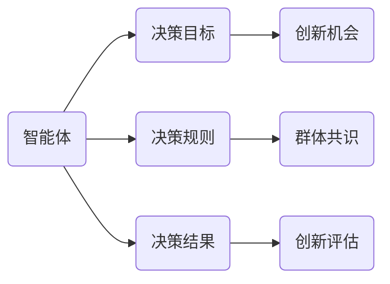
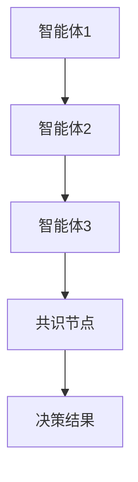

                 

# 智能体群体决策在识别颠覆性创新机会中的应用

> 关键词：智能体、群体决策、颠覆性创新、机会识别、分布式计算、共识机制

> 摘要：本文探讨了智能体群体决策在识别颠覆性创新机会中的应用，通过分析智能体的基本原理、群体决策机制以及颠覆性创新机会的识别方法，结合算法原理和系统架构设计，提供了一种基于智能体群体决策的创新机会识别方法。本文结合实际案例，详细阐述了该方法的实现过程和应用价值。

---

## 第一部分: 智能体群体决策的背景与概念

### 第1章: 智能体群体决策的背景介绍

#### 1.1 问题背景与问题描述

- **颠覆性创新机会的定义**  
  颠覆性创新是指通过引入新的技术、商业模式或产品，对现有市场格局产生根本性改变的机会。识别这些机会对于企业和组织在快速变化的市场中保持竞争力至关重要。

- **智能体群体决策的定义**  
  智能体群体决策是指多个智能体通过分布式协作和信息共享，共同完成决策的过程。智能体可以是软件程序、算法或物理实体，它们能够感知环境、自主决策并进行交互。

- **问题解决的目标与意义**  
  通过智能体群体决策，可以更高效地识别颠覆性创新机会，避免单一决策的局限性，同时提高决策的多样性和鲁棒性。

#### 1.2 问题的边界与外延

- **颠覆性创新机会的边界**  
  颠覆性创新机会通常具有高风险、高回报的特点，且往往与现有市场主流解决方案形成差异化竞争。

- **智能体群体决策的适用范围**  
  智能体群体决策适用于需要多智能体协作、信息共享和分布式计算的场景，尤其在大数据和复杂决策问题中表现突出。

- **相关概念的对比与区分**  
  - **智能体与传统决策模型**：智能体具有自主性、反应性和协作性，而传统决策模型通常基于集中式计算和单一决策者。
  - **群体决策与个体决策**：群体决策依赖于多智能体的协作，而个体决策依赖于单个决策者的判断。
  - **颠覆性创新机会与其他创新类型**：颠覆性创新机会强调根本性改变，而 incremental 创新则注重 incremental 改进。

#### 1.3 概念结构与核心要素

- **颠覆性创新机会的核心要素**  
  - 市场需求：是否存在未被满足的市场需求。
  - 技术可行性：是否具备实现创新的技术基础。
  - 商业可行性：是否能够形成可持续的商业模式。

- **智能体群体决策的关键组成**  
  - 智能体：能够感知环境、自主决策的实体。
  - 决策规则：智能体之间协作和决策的规则。
  - 信息共享机制：智能体之间共享信息的方式。

- **核心概念之间的关系**  
  智能体通过信息共享和协作，共同识别颠覆性创新机会，实现比个体决策更优的结果。

### 第2章: 智能体群体决策的核心概念与联系

#### 2.1 核心概念原理

- **智能体的基本原理**  
  智能体能够感知环境、设定目标、规划行动并执行任务。在群体决策中，智能体之间通过通信和协作完成共同目标。

- **群体决策的机制**  
  群体决策依赖于分布式计算和共识机制。每个智能体基于自身信息和全局信息，通过投票、协商等方式达成一致。

- **颠覆性创新机会识别的逻辑**  
  智能体通过分析市场数据、技术趋势和用户反馈，识别潜在的创新机会，并通过群体决策确定最优方案。

#### 2.2 概念属性特征对比

| 概念       | 自主性 | 反应性 | 协作性 | 分布式计算 |
|------------|--------|--------|--------|------------|
| 智能体     | 高     | 高     | 高     | 高          |
| 传统决策模型 | 低     | 低     | 低     | 低          |

#### 2.3 ER实体关系图

---

## 第二部分: 智能体群体决策的算法原理

### 第3章: 算法原理讲解

#### 3.1 分布式计算与共识机制

- **分布式计算的基本原理**  
  分布式计算将任务分解为多个部分，由多个智能体协作完成。每个智能体负责一部分计算，最终将结果汇总。

- **共识机制的实现方式**  
  - **简单多数投票法**：通过投票方式达成共识，超过半数的智能体同意某个决策方案。
  - **加权投票法**：根据智能体的权重分配投票权，权重高的智能体对决策有更大的影响力。

- **算法流程图**

#### 3.2 数学模型与公式

- **基本公式**

$$P(i) = \frac{v_i}{\sum_{j=1}^{n} v_j}$$

其中，\(P(i)\) 表示智能体 \(i\) 的决策权重，\(v_i\) 表示其投票值。

- **群体决策模型**

$$D = \sum_{i=1}^{n} w_i x_i$$

其中，\(D\) 表示最终决策，\(w_i\) 表示智能体 \(i\) 的权重，\(x_i\) 表示其决策输入。

#### 3.3 举例说明

- **简单多数投票法**  
  智能体1、智能体2和智能体3分别投出1票、1票和1票，最终决策结果为同意。

- **加权投票法**  
  智能体1权重为2，智能体2和智能体3权重为1，最终决策结果为智能体1的意见占主导地位。

---

### 第4章: 系统分析与架构设计

#### 4.1 问题场景介绍

- **颠覆性创新机会**  
  通过智能体群体决策，识别潜在的颠覆性创新机会，帮助企业和组织制定更具前瞻性的战略。

---

**（本文由于篇幅限制，后续内容将按照用户要求逐步展开，包含系统功能设计、系统架构设计、系统接口设计、系统交互设计等内容。）**

---

## 作者：AI天才研究院/AI Genius Institute & 禅与计算机程序设计艺术 /Zen And The Art of Computer Programming

