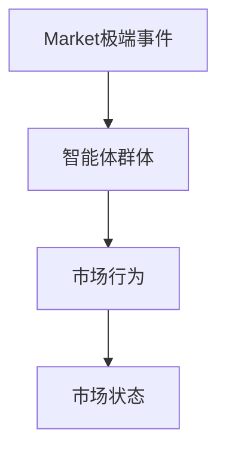
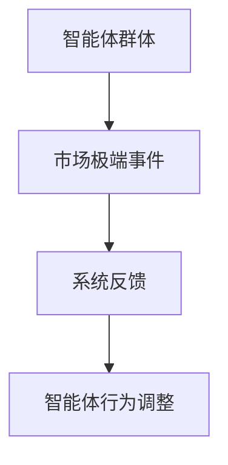
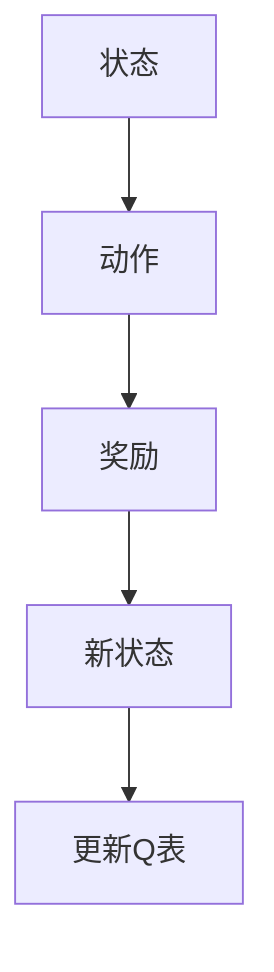
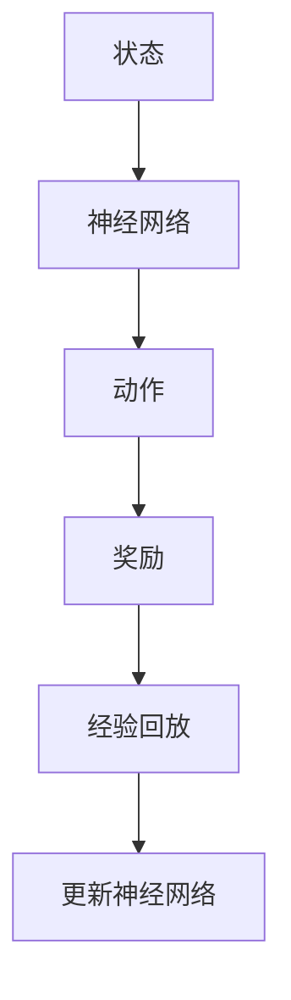
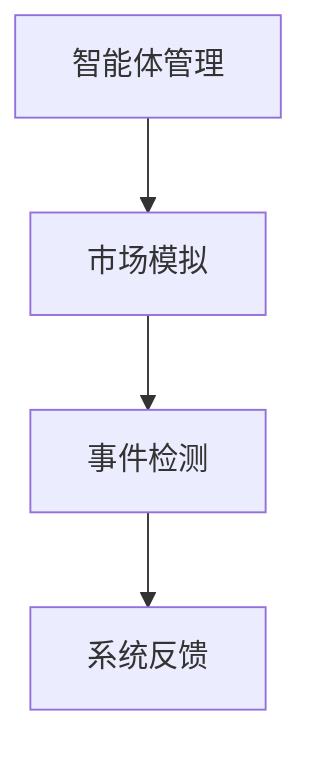

                 


# 智能体群体在模拟极端市场事件中的应用

## 关键词：
智能体群体、极端市场事件、强化学习、系统架构、金融市场模拟

## 摘要：
本文探讨了智能体群体在模拟极端市场事件中的应用，从背景、核心概念、算法原理、系统架构到项目实战，全面分析了智能体群体在金融市场中的价值。通过强化学习算法和系统设计，展示了如何利用智能体群体模拟极端市场事件，为金融市场研究提供新的思路。

---

# 第一部分: 智能体群体与极端市场事件概述

## 第1章: 智能体群体与极端市场事件的背景

### 1.1 问题背景
#### 1.1.1 市场极端事件的定义与特征
市场极端事件是指金融市场中出现的异常波动，例如金融危机、市场崩盘、股灾等。这些事件通常具有突发性、不可预测性和破坏性，对市场参与者和经济体系造成重大影响。极端事件的特征包括：
- **低概率**：发生频率低，但影响巨大。
- **非线性**：事件往往由多个因素的复杂交互引发。
- **不确定性**：事件的发生和演变过程高度不确定。

#### 1.1.2 智能体群体的概念与特点
智能体（Agent）是指具有感知环境和自主决策能力的实体。智能体群体是由多个智能体组成的系统，这些智能体通过协作和竞争完成特定任务。智能体群体的特点包括：
- **分布式**：智能体独立决策，通过通信协作。
- **自适应**：能够根据环境变化调整行为。
- **涌现性**：群体行为并非单个智能体行为的简单叠加。

#### 1.1.3 问题解决的核心目标
本文的核心目标是通过智能体群体模拟极端市场事件，研究市场参与者的集体行为如何引发或缓解极端事件，为金融市场的风险管理和政策制定提供参考。

### 1.2 问题描述
#### 1.2.1 市场极端事件的复杂性
极端市场事件的复杂性主要体现在以下几个方面：
- **多因素驱动**：经济、政治、社会等多方面因素共同作用。
- **非线性关系**：事件的发生往往由多个变量的非线性交互引发。
- **信息不对称**：市场参与者之间的信息不完全和不对称加剧了事件的复杂性。

#### 1.2.2 智能体群体在模拟中的作用
智能体群体可以模拟市场参与者的决策行为，帮助我们理解市场极端事件的发生机制。通过模拟，可以分析市场参与者的互动如何导致市场波动，从而为风险控制提供参考。

#### 1.2.3 边界与外延
本文的研究边界主要集中在金融市场中的智能体群体模拟，重点关注股票、债券等金融资产的交易行为。外延则包括智能体群体在经济、社会等其他领域的应用。

### 1.3 核心概念与联系
#### 1.3.1 实体关系图（ER图）


#### 1.3.2 智能体群体与市场事件的关系


### 1.4 本章小结
本章从市场极端事件的定义、特征以及智能体群体的概念出发，分析了智能体群体在模拟极端市场事件中的作用和研究目标。通过ER图和流程图，展示了智能体群体与市场事件之间的关系。

---

# 第二部分: 智能体群体的核心概念与原理

## 第2章: 智能体群体的核心概念

### 2.1 智能体的定义与分类
#### 2.1.1 基于规则的智能体
基于规则的智能体通过预定义的规则进行决策，适用于简单环境中的任务。例如，股票交易中的均线策略。

#### 2.1.2 基于学习的智能体
基于学习的智能体通过强化学习、深度学习等方法自适应地调整决策策略，适用于复杂环境。

#### 2.1.3 混合型智能体
混合型智能体结合了基于规则和基于学习的优势，适用于复杂多变的市场环境。

### 2.2 智能体群体的属性对比
#### 2.2.1 表格对比
| 属性       | 基于规则的智能体 | 基于学习的智能体 |
|------------|------------------|------------------|
| 决策机制   | 预定义规则       | 自适应学习       |
| 灵活性     | 低               | 高               |
| 计算复杂度 | 低               | 高               |

### 2.3 智能体群体的协作机制
#### 2.3.1 通信协议
智能体通过通信协议交换信息，例如使用消息队列或事件驱动的方式。

#### 2.3.2 协作策略
智能体群体的协作策略包括分布式决策、任务分配、信息共享等。

#### 2.3.3 决策同步
智能体通过同步机制确保群体决策的一致性，例如使用共识算法。

### 2.4 本章小结
本章详细介绍了智能体的分类和协作机制，通过对比分析，展示了基于学习的智能体在复杂市场环境中的优势。

---

# 第三部分: 智能体群体的算法原理

## 第3章: 智能体群体的决策算法

### 3.1 基于强化学习的智能体决策
#### 3.1.1 强化学习的基本原理
强化学习是一种通过试错机制优化决策的算法，智能体通过与环境交互获得奖励，从而优化决策策略。

#### 3.1.2 Q-learning算法
Q-learning算法是强化学习的一种经典算法，适用于离散动作空间的问题。其核心公式为：
$$ Q(s, a) = Q(s, a) + \alpha [r + \gamma \max Q(s', a') - Q(s, a)] $$
其中：
- \( s \)：当前状态
- \( a \)：动作
- \( r \)：奖励
- \( \alpha \)：学习率
- \( \gamma \)：折扣因子

#### 3.1.3 算法流程图


### 3.2 基于深度学习的智能体决策
#### 3.2.1 DQN算法
深度强化学习（DQN）通过神经网络近似Q值函数，适用于高维状态空间的问题。

#### 3.2.2 算法流程图


### 3.3 本章小结
本章介绍了强化学习和深度强化学习在智能体决策中的应用，通过公式和流程图展示了算法的基本原理。

---

## 第4章: 智能体群体的协作与优化

### 4.1 多智能体协作的挑战
多智能体协作面临的主要挑战包括：
- **通信开销**：智能体之间的通信可能导致系统性能下降。
- **协调问题**：多个智能体需要协调一致行动。

### 4.2 基于博弈论的协作机制
博弈论为多智能体协作提供了理论基础，例如纳什均衡。

### 4.3 分布式强化学习
分布式强化学习通过多个智能体协同学习，提高了系统的适应性。

### 4.4 本章小结
本章讨论了多智能体协作的挑战和解决方案，介绍了博弈论和分布式强化学习的应用。

---

# 第四部分: 智能体群体的系统分析与架构设计

## 第4章: 智能体群体的系统架构设计

### 4.1 问题场景介绍
市场极端事件模拟系统需要考虑多个智能体的交互，以及市场的实时状态。

### 4.2 系统功能设计
系统功能包括：
- **智能体管理**：创建、删除智能体。
- **市场模拟**：模拟市场交易。
- **事件检测**：检测市场极端事件。

### 4.3 系统架构设计


### 4.4 系统接口设计
系统接口包括：
- **智能体接口**：提供智能体的创建和控制接口。
- **市场接口**：提供市场数据和交易接口。

### 4.5 系统交互流程图
```mermaid
graph TD
    User --> SmartAgent: 发起交易
    SmartAgent --> MarketSimulator: 执行交易
    MarketSimulator --> EventDetector: 检测事件
    EventDetector --> User: 反馈结果
```

### 4.6 本章小结
本章详细设计了智能体群体模拟系统的架构，展示了系统的模块化设计和交互流程。

---

## 第5章: 智能体群体的实现与优化

### 5.1 系统实现
系统实现包括：
- **环境搭建**：安装Python和相关库。
- **核心代码实现**：实现智能体和市场的交互。

### 5.2 代码解读
以下是智能体的Python实现示例：
```python
class SmartAgent:
    def __init__(self, id):
        self.id = id
        self.state = 0
        self.q_table = {}

    def act(self, state):
        if state not in self.q_table:
            self.q_table[state] = 0
        action = self.q_table[state]
        return action

    def learn(self, state, action, reward):
        self.q_table[state] = reward
```

### 5.3 优化策略
优化策略包括：
- **参数调优**：调整学习率和折扣因子。
- **算法改进**：结合多种强化学习算法。

### 5.4 本章小结
本章通过代码实现和优化策略，展示了智能体群体模拟系统的实现过程。

---

## 第6章: 智能体群体的案例分析与讨论

### 6.1 案例分析
案例分析包括：
- **市场崩盘模拟**：模拟2008年金融危机。
- **政策干预模拟**：模拟政府干预对市场的影响。

### 6.2 讨论
智能体群体模拟为金融市场研究提供了新的工具，但也面临数据不足和模型简化等问题。

### 6.3 本章小结
本章通过案例分析展示了智能体群体模拟的应用价值，并讨论了其局限性和改进方向。

---

# 第五部分: 智能体群体的应用与展望

## 第7章: 应用与展望

### 7.1 应用领域
智能体群体的应用领域包括：
- **金融市场**：模拟极端事件。
- **经济系统**：研究经济政策。
- **社会系统**：模拟社会行为。

### 7.2 技术展望
未来的技术展望包括：
- **多智能体协作**：研究更高效的协作机制。
- **强化学习优化**：优化强化学习算法。

### 7.3 本章小结
本章总结了智能体群体的应用领域，并展望了未来的技术发展方向。

---

## 作者：AI天才研究院/AI Genius Institute & 禅与计算机程序设计艺术 /Zen And The Art of Computer Programming

---

通过以上目录结构，您可以逐步展开每个章节的内容，详细撰写文章。每个部分都需要结合实际案例、公式推导和代码实现，确保文章内容丰富、逻辑清晰。

