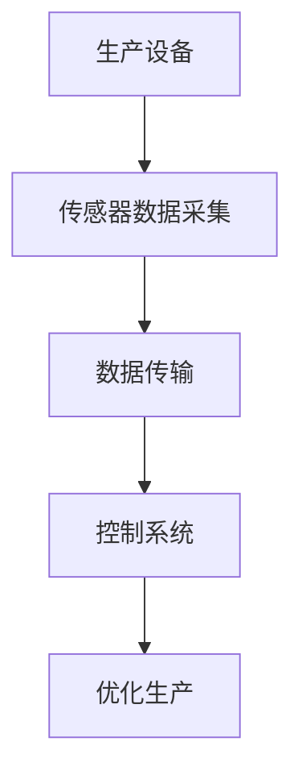
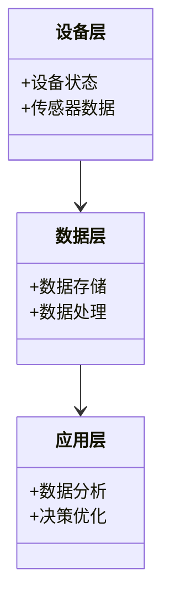
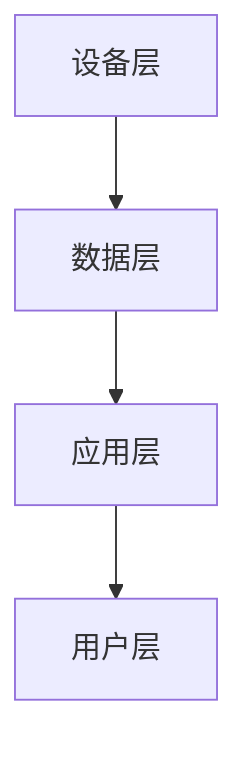

                 


# 智能制造趋势下的产业链投资分析

> **关键词**：智能制造，产业链，投资分析，工业互联网，大数据分析，人工智能

> **摘要**：随着全球制造业的数字化转型加速，智能制造已成为推动产业链升级的核心动力。本文从智能制造的定义、技术核心、产业链结构入手，结合实际案例，系统分析智能制造趋势下产业链的投资机会、风险及应对策略。通过深度解析工业互联网、大数据分析、人工智能等关键技术的商业价值，为投资者提供科学的投资决策依据。

---

## 第一部分：智能制造趋势下的产业链投资背景

### 第1章：智能制造与产业链概述

#### 1.1 智能制造的定义与内涵
智能制造是一种基于数字技术的制造模式，通过物联网、大数据、人工智能等技术实现生产过程的智能化、自动化和高效化。与传统制造相比，智能制造强调数据驱动的决策、实时反馈和系统协同。

#### 1.2 产业链的概念与结构
制造业产业链由上游（原材料、零部件）、中游（制造环节）、下游（产品销售与服务）构成。在智能制造时代，产业链的协同效率和数据共享能力成为竞争力的关键。

#### 1.3 智能制造趋势下的产业链变革
智能制造推动产业链从线性模式向网络化、生态化模式转变，数据成为新的生产要素，产业链上下游企业的协同创新成为主流趋势。

---

## 第二部分：智能制造产业链的核心概念与技术

### 第2章：工业互联网与大数据分析

#### 2.1 工业互联网的概念与应用
工业互联网是将制造业与信息技术深度融合的产物，通过连接设备、系统和数据，实现生产过程的全链条数字化。

**关键点：**
- 工业互联网的核心是数据的采集与传输（物联网技术）。
- 典型应用场景包括设备监控、预测性维护和生产优化。

#### 2.2 大数据分析在智能制造中的应用
大数据分析是智能制造的“大脑”，通过处理海量数据，为企业提供实时洞察。

**数学模型示例：**
- 数据预处理：$$\text{清洗数据} = \text{原始数据} \setminus \text{噪声数据}$$
- 数据分析：$$\text{预测产量} = \alpha \cdot \text{历史产量} + \beta \cdot \text{设备状态}$$

#### 2.3 工业大数据分析的数学模型
使用机器学习算法对工业数据进行建模，例如基于回归分析的设备故障预测。

**代码示例：**
```python
import pandas as pd
from sklearn.linear_model import LinearRegression

# 数据加载
data = pd.read_csv('manufacturing_data.csv')

# 特征与目标分离
X = data[['设备状态', '历史产量']]
y = data['预测产量']

# 模型训练
model = LinearRegression()
model.fit(X, y)

# 预测与评估
print(model.score(X, y))
```

### 第3章：人工智能与工业自动化

#### 3.1 人工智能在制造业中的应用
人工智能技术（如计算机视觉、自然语言处理）在制造业中的应用日益广泛。

**关键点：**
- 计算机视觉用于产品质量检测。
- 自然语言处理用于文档管理和知识提取。

#### 3.2 工业自动化的核心技术
工业自动化依赖于机器人技术、自动化控制系统和工业软件（如SCADA）。

**流程图示例：**


#### 3.3 人工智能算法的实现与优化
通过深度学习算法优化工业流程，例如使用神经网络进行缺陷检测。

**代码示例：**
```python
import tensorflow as tf
from tensorflow.keras import layers

# 构建神经网络模型
model = tf.keras.Sequential([
    layers.Conv2D(32, (3,3), activation='relu', input_shape=(64,64,3)),
    layers.MaxPooling2D(),
    layers.Flatten(),
    layers.Dense(64, activation='relu'),
    layers.Dense(1, activation='sigmoid')
])

# 模型训练
model.compile(optimizer='adam', loss='binary_crossentropy', metrics=['accuracy'])
model.fit(X_train, y_train, epochs=10, batch_size=32)
```

---

## 第三部分：智能制造产业链的投资分析方法论

### 第4章：制造业产业链的投资机会分析

#### 4.1 产业链投资机会的识别
- **上游**：关注高端材料和芯片制造。
- **中游**：投资工业互联网平台和智能制造解决方案提供商。
- **下游**：布局智能产品和服务。

#### 4.2 投资分析的关键指标
- 市场增长率（CAGR）
- 企业利润率（ROE）
- 市场竞争格局（CR4或CR5）

#### 4.3 投资风险与风险管理
- **市场风险**：行业政策变化。
- **技术风险**：技术迭代快。
- **运营风险**：供应链中断。

### 第5章：智能制造产业链的重点行业分析

#### 5.1 智能汽车产业链
- 关键技术：自动驾驶、车联网。
- 投资机会：电池制造、充电网络。

#### 5.2 工业机器人与自动化设备
- 技术核心：机器人控制算法。
- 投资机会：机器人本体制造、系统集成。

#### 5.3 大数据分析与工业软件
- 核心技术：数据挖掘与分析。
- 投资机会：工业数据分析平台、预测性维护服务。

### 第6章：智能制造产业链的系统架构设计

#### 6.1 问题场景介绍
构建一个智能制造系统的整体架构，包括数据采集、分析、决策和执行。

#### 6.2 系统功能设计
**领域模型（Mermaid类图）：**


#### 6.3 系统架构设计
**系统架构图（Mermaid）：**


---

## 第四部分：项目实战与总结

### 第7章：智能制造产业链投资实战分析

#### 7.1 环境安装与数据准备
- 安装Python、TensorFlow、Keras等工具。
- 数据来源：公开制造业数据集。

#### 7.2 核心实现与代码解读
```python
import pandas as pd
from sklearn.metrics import accuracy_score

# 数据加载
data = pd.read_csv('manufacturing_dataset.csv')

# 数据分割
X_train, X_test, y_train, y_test = train_test_split(data.drop('label', axis=1), data['label'], test_size=0.2)

# 模型训练
model = LogisticRegression()
model.fit(X_train, y_train)

# 模型评估
print(accuracy_score(model.predict(X_test), y_test))
```

#### 7.3 实际案例分析与小结
以某汽车制造企业为例，分析其智能制造转型带来的投资收益。

---

## 第五部分：总结与展望

### 第8章：总结与投资建议

#### 8.1 投资总结
智能制造产业链的投资机会主要集中在工业互联网、大数据分析和人工智能领域，尤其是上游技术和下游应用。

#### 8.2 未来展望
随着技术的成熟，智能制造将向更智能化、协同化的方向发展，投资者需关注技术创新和行业整合。

---

## 作者信息

作者：AI天才研究院/AI Genius Institute & 禅与计算机程序设计艺术 /Zen And The Art of Computer Programming

---

这篇文章系统地分析了智能制造产业链的投资机会、技术应用和行业趋势，为投资者提供了科学的投资决策依据。通过理论分析与实际案例结合，帮助读者更好地理解智能制造的商业价值。

