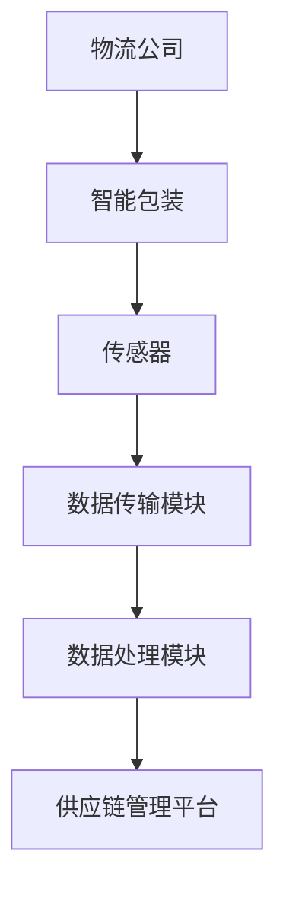
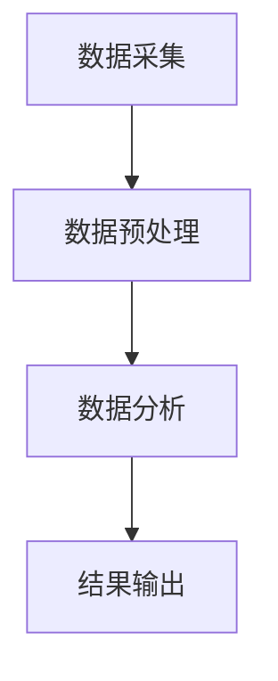
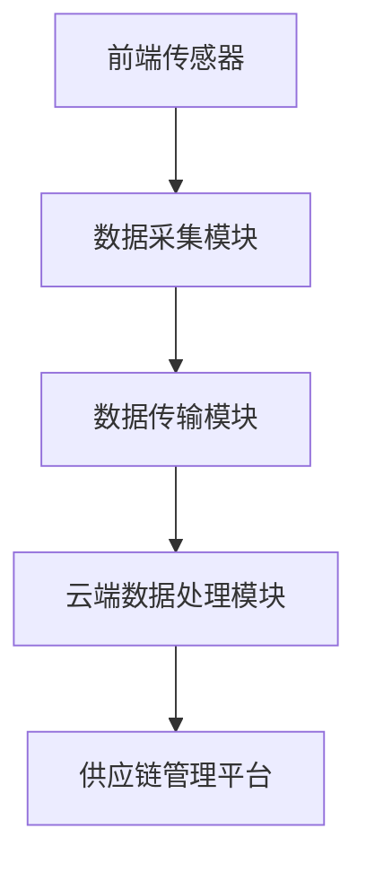
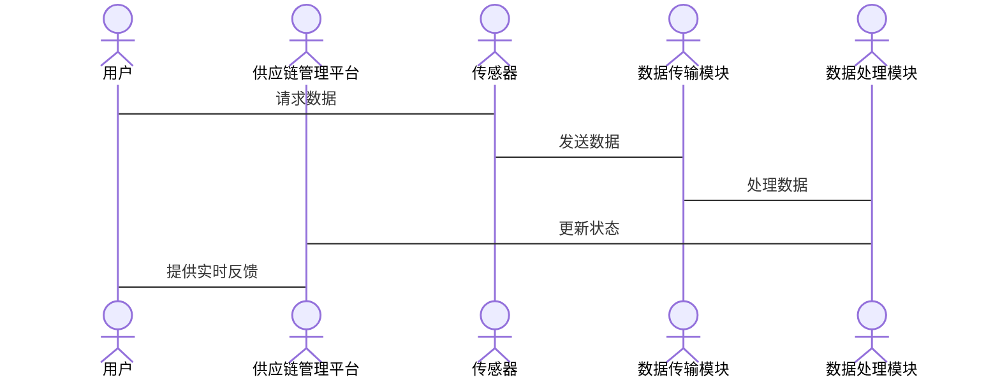

                 


# 智能包装技术在物流领域的应用与投资前景

---

## 关键词：
智能包装技术，物流行业，物联网，传感器，投资分析，供应链管理

---

## 摘要：
智能包装技术是一种结合了物联网、传感器和数据处理技术的创新包装解决方案，旨在优化物流流程、提升货物安全性和实现供应链的智能化管理。本文将从智能包装技术的基本概念、核心原理、系统架构设计、应用场景以及投资前景等多方面进行详细分析，探讨其在物流领域的广泛应用和未来发展趋势。通过结合实际案例和技术细节，本文旨在为读者提供一个全面的视角，帮助其理解智能包装技术的潜力和价值。

---

## 第一部分：智能包装技术概述

### 第1章：智能包装技术的基本概念

#### 1.1 智能包装的定义与分类
- 智能包装是指集成多种传感器、通信模块和数据处理技术的包装解决方案，能够实时监测和反馈货物状态（如温度、湿度、位置等）。
- 分类：
  - **主动型智能包装**：具备主动调节环境条件的能力（如温控包装）。
  - **被动型智能包装**：仅具备监测和反馈功能。
  - **智能显示型包装**：通过颜色变化等方式直观显示货物状态。

#### 1.2 智能包装与传统包装的区别
| 特性 | 传统包装 | 智能包装 |
|------|----------|----------|
| 功能 | 单一防护 | 多功能集成 |
| 技术 | 无智能感知 | 集成传感器、物联网技术 |
| 应用 | 基础物流防护 | 智能物流、供应链优化 |

#### 1.3 智能包装在物流中的应用背景
- 物流行业痛点：
  - 货物损坏率高。
  - 温度、湿度等环境因素难以实时监控。
  - 供应链透明度低，难以实现高效管理。
- 智能包装的解决方案：
  - 实时监测货物状态，降低损失。
  - 提升供应链透明度，优化物流流程。
  - 通过数据反馈实现精准管理。

---

### 第2章：智能包装技术的核心概念与联系

#### 2.1 智能包装技术的原理
- **传感器技术**：用于采集货物状态数据（如温度、湿度、压力等）。
- **无线通信技术**：通过蓝牙、Wi-Fi、NB-IoT等实现数据传输。
- **数据处理技术**：对采集到的数据进行分析和存储，提供决策支持。

#### 2.2 智能包装技术的实体关系图
```mermaid
er
actor: 物流公司
actor: 客户
actor: 供应链管理平台
class: 智能包装
class: 传感器
class: 数据传输模块
class: 数据处理模块
```

#### 2.3 智能包装技术的流程图


---

### 第3章：智能包装技术的算法原理

#### 3.1 数据采集与处理算法
- **数据采集流程**：
  1. 传感器采集货物状态数据。
  2. 数据传输模块将数据发送至云端。
  3. 数据处理模块对数据进行清洗、分析和存储。
- **数据预处理方法**：
  - 数据去噪：去除无效数据点。
  - 数据归一化：统一数据格式。
- **数据分析算法**：
  - 时间序列分析：预测货物状态变化趋势。
  - 异常检测：识别货物状态异常情况。

#### 3.2 智能包装技术的数学模型
- **数据采集模型**：
  $$ y = f(x) $$
  其中，$x$ 表示传感器输入，$y$ 表示处理后的数据。
- **数据处理模型**：
  $$ y = \sum_{i=1}^{n} a_i x_i $$
  其中，$a_i$ 是权重系数，$x_i$ 是输入特征。
- **数据预测模型**：
  $$ y = \beta_0 + \beta_1 x + \epsilon $$
  其中，$\beta_0$ 是截距，$\beta_1$ 是回归系数，$\epsilon$ 是误差项。

#### 3.3 算法流程图


---

### 第4章：智能包装技术的系统架构设计

#### 4.1 系统功能设计
- **数据采集功能**：传感器实时采集货物状态数据。
- **数据传输功能**：通过无线模块将数据传输至云端。
- **数据处理功能**：对数据进行分析和存储。
- **系统管理功能**：监控系统运行状态，进行故障诊断。

#### 4.2 系统架构图


#### 4.3 系统接口设计
- **传感器接口**：与温湿度传感器、加速度传感器等硬件设备对接。
- **云端接口**：与第三方物流管理平台进行数据交互。
- **用户接口**：提供Web或移动端界面，供用户查看货物状态。

#### 4.4 系统交互流程图


---

### 第5章：智能包装技术在物流中的应用实例

#### 5.1 项目实战：智能包装系统开发
- **环境安装**：
  ```bash
  pip install sensorlib
  pip install transmission-kit
  pip install data-processing
  ```
- **核心代码实现**：
  ```python
  import sensorlib
  import transmission-kit

  class SmartPackage:
      def __init__(self):
          self.sensor = sensorlib.Sensor()
          self.transmitter = transmission-kit.Transmitter()

      def collect_data(self):
          return self.sensor.read_data()

      def send_data(self, data):
          self.transmitter.send(data)

  package = SmartPackage()
  data = package.collect_data()
  package.send_data(data)
  ```
- **案例分析**：
  某食品公司采用智能包装技术，实时监测运输过程中的温度和湿度，成功降低了食品变质率，节省了30%的物流成本。

---

## 第六部分：智能包装技术的投资分析与前景展望

### 第6章：智能包装技术的投资分析

#### 6.1 投资机会
- **技术成熟度**：智能包装技术已进入商业化阶段，市场需求旺盛。
- **市场空间**：预计到2030年，全球智能包装市场规模将超过100亿美元。
- **主要驱动力**：
  - 物流行业对高效管理的需求。
  - 消费者对商品质量的关注度提升。
  - 政府对绿色物流和智能化供应链的政策支持。

#### 6.2 投资风险与应对策略
- **技术风险**：技术更新迭代快，需持续投入研发。
- **市场风险**：市场竞争加剧，需关注成本控制和差异化竞争。
- **应对策略**：
  - 加强技术研发，提升产品竞争力。
  - 拓展多元化应用场景，降低市场依赖度。
  - 与合作伙伴建立战略联盟，形成协同效应。

---

## 第七部分：总结与展望

### 第7章：总结与展望

#### 7.1 本章小结
智能包装技术作为物联网技术的重要应用之一，正在深刻改变物流行业的运作方式。通过实时监测和数据反馈，智能包装技术能够显著提升货物安全性、优化供应链效率，并降低物流成本。

#### 7.2 未来展望
- **技术融合**：智能包装技术将进一步与人工智能、区块链等技术融合，实现更高效的物流管理。
- **市场规模扩大**：随着技术成熟和成本下降，智能包装技术将被更多企业采用。
- **行业应用拓展**：从食品、医药等重点领域扩展至更多行业，如电子产品、奢侈品等。

---

## 作者信息

作者：AI天才研究院/AI Genius Institute & 禅与计算机程序设计艺术 /Zen And The Art of Computer Programming

---

**注**：由于篇幅限制，上述内容为文章的部分章节，完整文章将包含更多细节和技术深度。

