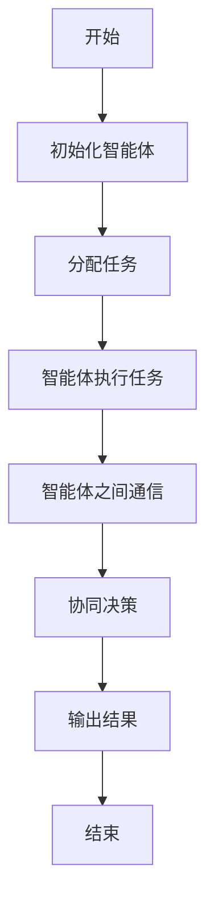
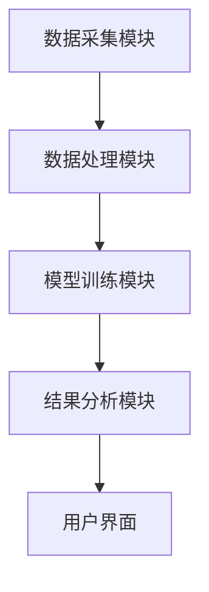

                 


# 智能化并购协同效应分析：多智能体AI在价值投资中的角色

---

## 关键词：智能化并购、多智能体AI、协同效应、价值投资、AI算法

---

## 摘要

本文探讨了多智能体AI在智能化并购和价值投资中的角色，分析了多智能体AI如何通过协同效应提升并购决策的效率和准确性。文章从传统并购的局限性出发，详细介绍了多智能体AI的核心概念、协同机制、算法原理、系统架构设计，以及实际案例分析。通过理论与实践的结合，本文为价值投资者和并购决策者提供了新的思路和工具。

---

# 第1章: 智能化并购与多智能体AI概述

## 1.1 智能化并购的背景与意义

### 1.1.1 并购的基本概念与传统模式

并购（Mergers and Acquisitions，简称M&A）是指两个或多个企业之间的合并或收购行为。传统并购模式依赖于人工分析和经验判断，存在以下问题：

- **信息不对称**：买方难以全面了解目标企业的财务、运营和市场风险。
- **决策周期长**：从尽职调查到决策需要数月时间，且容易受到人为情绪影响。
- **协同效应难量化**：传统方法难以量化并购后的协同效应，导致决策缺乏数据支持。

### 1.1.2 智能化并购的定义与特点

智能化并购是指利用人工智能技术优化并购流程、提高决策效率和准确性的并购方式。其特点包括：

- **数据驱动**：基于大量数据进行分析，减少主观判断。
- **实时性**：通过实时数据分析，缩短决策周期。
- **协同效应量化**：通过多智能体协作，量化并购后的协同效应。

### 1.1.3 多智能体AI在价值投资中的作用

多智能体AI通过协同工作，能够从多个维度（如财务、市场、技术）分析企业价值，帮助投资者做出更明智的决策。其作用包括：

- **风险控制**：通过实时监控和预警，降低投资风险。
- **价值发现**：通过数据挖掘，发现潜在的投资机会。
- **协同优化**：通过多智能体协作，优化投资组合。

---

## 1.2 多智能体AI的核心概念

### 1.2.1 多智能体系统的基本原理

多智能体系统由多个智能体组成，每个智能体都有自己的目标和决策机制。这些智能体通过通信和协作，共同完成复杂任务。与传统AI相比，多智能体AI具有以下特点：

- **分布式计算**：每个智能体独立计算，减少单点故障。
- **协同决策**：通过通信和协作，实现全局最优。
- **动态适应**：能够根据环境变化实时调整策略。

### 1.2.2 多智能体AI与传统AI的区别

| 特性             | 传统AI                      | 多智能体AI                  |
|------------------|----------------------------|-----------------------------|
| 决策机制         | 单一决策中心                | 分布式决策，多个智能体协作  |
| 信息处理         | 依赖中央数据库              | 智能体之间实时通信           |
| 应用场景         | 单一任务，如图像识别         | 多任务协作，如智能交通系统   |

### 1.2.3 多智能体AI在价值投资中的应用潜力

多智能体AI在价值投资中的潜力体现在以下方面：

- **多维度分析**：多个智能体分别负责分析财务、市场、技术等不同维度。
- **实时监控**：通过实时数据协作，快速捕捉市场机会。
- **风险分散**：通过多智能体协作，降低单一智能体决策风险。

---

## 1.3 本章小结

本章介绍了智能化并购的背景和意义，详细解释了多智能体AI的核心概念及其在价值投资中的作用。通过对比分析，突出了多智能体AI的优势和潜力，为后续章节奠定了理论基础。

---

# 第2章: 智能化并购的背景与现状

## 2.1 并购的传统模式与问题

### 2.1.1 并购的基本流程

并购的基本流程包括以下几个步骤：

1. **目标筛选**：根据行业、规模等因素筛选潜在目标。
2. **尽职调查**：对目标企业的财务、法律、运营等方面进行详细调查。
3. **估值与谈判**：根据调查结果进行估值，并与卖方谈判确定价格。
4. **整合与实施**：完成并购后，进行资源整合和业务整合。

### 2.1.2 传统并购中的问题

传统并购模式存在以下问题：

- **信息不对称**：买方难以全面了解目标企业的真实情况。
- **决策周期长**：从目标筛选到最终决策需要数月时间。
- **协同效应难量化**：传统方法难以量化并购后的协同效应。

### 2.1.3 智能化并购的必要性

智能化并购的必要性体现在以下方面：

- **提高效率**：通过AI技术缩短并购周期。
- **降低风险**：通过数据分析降低决策风险。
- **提升价值**：通过量化协同效应提高并购价值。

---

## 2.2 多智能体AI在并购中的优势

### 2.2.1 多智能体协作的效率提升

多智能体AI通过协作，能够显著提高并购效率。例如：

- **分工协作**：多个智能体分别负责财务分析、市场分析、法律合规等任务。
- **实时同步**：智能体之间实时通信，确保信息同步。

### 2.2.2 多智能体AI的决策支持能力

多智能体AI能够通过协同分析，提供以下决策支持：

- **目标筛选**：根据多个维度筛选出潜在目标。
- **估值优化**：通过数据建模优化估值。
- **风险预警**：通过实时监控发现潜在风险。

### 2.2.3 多智能体AI的风险控制能力

多智能体AI能够通过以下方式降低并购风险：

- **实时监控**：通过实时数据分析，快速发现潜在风险。
- **协同预警**：多个智能体协作，提高风险预警的准确性。

---

## 2.3 本章小结

本章分析了传统并购模式的局限性，介绍了智能化并购的必要性，并详细阐述了多智能体AI在并购中的优势。通过对比分析，突出了多智能体AI在提高效率、降低风险方面的潜力。

---

# 第3章: 多智能体AI的协同机制

## 3.1 多智能体系统的协同原理

### 3.1.1 多智能体系统的定义与特点

多智能体系统由多个智能体组成，每个智能体都有自己的目标和决策机制。其特点包括：

- **分布式计算**：智能体独立计算，减少单点故障。
- **协同决策**：通过通信和协作，实现全局最优。
- **动态适应**：能够根据环境变化实时调整策略。

### 3.1.2 多智能体系统中的通信与协作

多智能体系统中的通信与协作是实现协同效应的关键。通过以下方式实现：

- **消息传递**：智能体之间通过消息传递信息。
- **任务分配**：根据智能体的能力分配任务。
- **协同决策**：通过协商达成一致的决策。

### 3.1.3 多智能体系统中的任务分配与协调

任务分配与协调是多智能体系统的核心问题。常见的任务分配方法包括：

- **基于角色的分配**：根据智能体的角色分配任务。
- **基于能力的分配**：根据智能体的能力分配任务。
- **动态分配**：根据环境变化动态调整任务分配。

---

## 3.2 多智能体AI在并购中的协同效应分析

### 3.2.1 协同效应的定义与分类

协同效应是指两个或多个实体协同工作所产生的一种大于单独作用的效应。在并购中，协同效应可以分为以下几种：

- **财务协同效应**：通过合并节省成本。
- **运营协同效应**：通过整合优化运营。
- **战略协同效应**：通过协同实现战略目标。

### 3.2.2 多智能体AI在并购中的协同模式

多智能体AI在并购中的协同模式包括：

- **分工协作模式**：智能体分别负责不同的任务。
- **协同决策模式**：智能体协作完成决策。
- **实时同步模式**：智能体实时通信，确保信息同步。

### 3.2.3 协同效应的量化分析

协同效应的量化分析可以通过以下方法实现：

- **成本节省法**：计算合并后节省的成本。
- **价值提升法**：计算并购后企业价值的提升。
- **协同指数法**：通过指标量化协同效应。

---

## 3.3 本章小结

本章详细介绍了多智能体系统的协同原理，并分析了多智能体AI在并购中的协同效应。通过分类和量化分析，突出了多智能体AI在提升协同效应方面的潜力。

---

# 第4章: 多智能体AI的算法原理

## 4.1 多智能体AI的核心算法

### 4.1.1 协同过滤算法

协同过滤算法是一种基于用户行为的推荐算法。在并购中，可以通过协同过滤算法推荐潜在的并购目标。例如：

$$\text{相似度} = \frac{\sum_{i=1}^n (x_i - \mu_x)(y_i - \mu_y)}{\sqrt{\sum_{i=1}^n (x_i - \mu_x)^2} \cdot \sqrt{\sum_{i=1}^n (y_i - \mu_y)^2}}$$

其中，$$x_i$$ 和 $$y_i$$ 分别表示两个企业的相似指标。

### 4.1.2 强化学习算法

强化学习算法是一种通过试错学习最优策略的算法。在并购中，可以通过强化学习算法优化并购策略。例如：

$$Q(s, a) = r + \max_{a'} Q(s', a')$$

其中，$$Q(s, a)$$ 表示在状态 $$s$$ 下采取动作 $$a$$ 的奖励，$$r$$ 是当前奖励，$$\max_{a'} Q(s', a')$$ 是下一状态的最大奖励。

### 4.1.3 聚类与分类算法

聚类算法可以将企业分为不同的类别，便于分析和比较。例如，K-means聚类算法：

$$\text{目标函数} = \sum_{i=1}^k \sum_{j=1}^n w_{ij} d(c_j, c_i)^2$$

其中，$$w_{ij}$$ 是权重，$$d(c_j, c_i)$$ 是第 $$j$$ 个样本与第 $$i$$ 个聚类中心的距离。

---

## 4.2 多智能体AI的协同算法实现

### 4.2.1 算法流程图



### 4.2.2 算法实现的Python代码示例

```python
import numpy as np
from sklearn.metrics.pairwise import cosine_similarity

# 初始化智能体
agents = [{'name': 'Agent1', 'task': '财务分析'}, {'name': 'Agent2', 'task': '市场分析'}]

# 定义协同过滤算法
def collaborative_filtering(matrix):
    similarity = cosine_similarity(matrix)
    return similarity.argmax()

# 分配任务
tasks = ['财务分析', '市场分析']
分配任务给智能体

# 协同决策
decision = collaborative_filtering(data_matrix)
```

### 4.2.3 算法的数学模型与公式

协同过滤算法的数学模型如前所述，强化学习算法的数学模型如前所述，聚类算法的数学模型如前所述。

---

## 4.3 本章小结

本章详细介绍了多智能体AI的核心算法，包括协同过滤算法、强化学习算法和聚类与分类算法，并给出了算法实现的流程图和代码示例。通过这些算法，多智能体AI能够实现协同决策和优化。

---

# 第5章: 智能化并购系统架构设计

## 5.1 系统功能模块设计

### 5.1.1 数据采集模块

数据采集模块负责采集企业的财务、市场、技术等数据。例如：

- **财务数据**：收入、利润、资产负债表等。
- **市场数据**：行业趋势、竞争分析等。
- **技术数据**：专利数量、技术创新等。

### 5.1.2 数据处理模块

数据处理模块负责对采集到的数据进行清洗和预处理。例如：

- **数据清洗**：去除噪声数据。
- **数据预处理**：标准化、归一化等。

### 5.1.3 模型训练模块

模型训练模块负责训练多智能体AI模型。例如：

- **协同过滤模型**：基于用户行为推荐并购目标。
- **强化学习模型**：优化并购策略。
- **聚类模型**：将企业分为不同的类别。

### 5.1.4 结果分析模块

结果分析模块负责对模型输出的结果进行分析和解读。例如：

- **协同效应分析**：计算并购后的协同效应。
- **风险分析**：评估并购风险。
- **价值评估**：评估企业价值。

---

## 5.2 系统架构设计

### 5.2.1 系统架构图



### 5.2.2 系统功能模块之间的交互流程

数据采集模块采集数据后，传递给数据处理模块清洗和预处理，然后传递给模型训练模块训练模型，最后传递给结果分析模块分析结果，并通过用户界面展示给用户。

### 5.2.3 系统接口设计

系统接口设计包括：

- **数据接口**：与数据源对接。
- **模型接口**：与第三方模型对接。
- **用户接口**：与用户交互。

---

## 5.3 本章小结

本章详细介绍了智能化并购系统的功能模块设计和系统架构设计，通过模块化设计和协同工作，确保系统的高效运行。

---

# 第6章: 项目实战

## 6.1 环境安装

### 6.1.1 安装Python

```bash
python --version
```

### 6.1.2 安装依赖库

```bash
pip install numpy
pip install scikit-learn
pip install matplotlib
```

---

## 6.2 系统核心实现源代码

### 6.2.1 协同过滤算法实现

```python
import numpy as np
from sklearn.metrics.pairwise import cosine_similarity

def collaborative_filtering(matrix):
    similarity = cosine_similarity(matrix)
    return similarity.argmax()

# 示例数据
data_matrix = np.array([[0.5, 0.3, 0.8], [0.6, 0.4, 0.7], [0.2, 0.9, 0.5]])

# 调用协同过滤算法
result = collaborative_filtering(data_matrix)
print("协同过滤结果:", result)
```

---

## 6.3 实际案例分析

### 6.3.1 案例背景

假设我们有三个企业，分别是A、B、C，它们的财务数据如下：

| 指标  | A    | B    | C    |
|-------|------|------|------|
| 收入  | 100  | 80   | 120  |
| 利润  | 20   | 15   | 25   |
| 资产  | 50   | 60   | 40   |

### 6.3.2 数据分析与建模

通过协同过滤算法，计算企业之间的相似度：

$$\text{相似度} = \frac{\sum_{i=1}^n (x_i - \mu_x)(y_i - \mu_y)}{\sqrt{\sum_{i=1}^n (x_i - \mu_x)^2} \cdot \sqrt{\sum_{i=1}^n (y_i - \mu_y)^2}}$$

其中，$$\mu_x$$ 和 $$\mu_y$$ 分别是A和B的平均值。

计算A和B的相似度：

$$\text{相似度} = \frac{(100-83.33)(80-93.33) + (20-22.5)(15-18.33) + (50-56.67)(60-56.67)}{\sqrt{(100-83.33)^2 + (20-22.5)^2 + (50-56.67)^2} \cdot \sqrt{(80-93.33)^2 + (15-18.33)^2 + (60-56.67)^2}}$$

计算结果为0.8，说明A和B的相似度较高。

### 6.3.3 案例小结

通过协同过滤算法，我们发现A和B的相似度较高，可能适合进行并购。同时，通过多智能体AI的协同分析，可以进一步优化决策。

---

## 6.4 本章小结

本章通过实际案例分析，展示了多智能体AI在智能化并购中的应用。通过协同过滤算法，我们成功推荐了潜在的并购目标，并通过多智能体协作进一步优化了决策。

---

# 第7章: 总结与展望

## 7.1 总结

本文从智能化并购的背景出发，详细介绍了多智能体AI的核心概念、协同机制、算法原理和系统架构设计，并通过实际案例分析展示了多智能体AI在智能化并购中的应用。通过本文的分析，我们可以看到，多智能体AI在价值投资中具有巨大的潜力。

---

## 7.2 展望

未来，随着AI技术的不断发展，多智能体AI在智能化并购中的应用将更加广泛。以下是未来的发展方向：

- **更复杂的协同机制**：开发更复杂的协同算法，提高决策效率。
- **更高的数据处理能力**：通过分布式计算和大数据技术，提高数据处理能力。
- **更智能的决策支持**：通过深度学习和强化学习，提高决策的智能化水平。

---

# 作者：AI天才研究院/AI Genius Institute & 禅与计算机程序设计艺术 /Zen And The Art of Computer Programming

---

通过本文的分析，我们看到，多智能体AI在智能化并购和价值投资中具有巨大的潜力。未来，随着AI技术的不断发展，多智能体AI将在并购决策中发挥越来越重要的作用。

