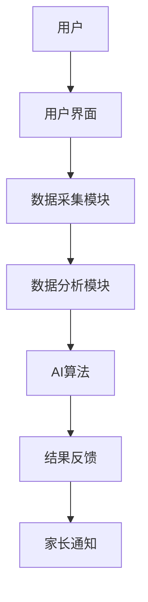

                 


# 《智能婴儿监护器：AI Agent的早期发展追踪》

**关键词**：智能婴儿监护器、AI Agent、算法原理、系统架构设计、项目实战

**摘要**：  
智能婴儿监护器是一种结合了人工智能（AI）技术的婴儿看护设备，用于监测婴儿的健康状况、睡眠情况以及与婴儿的互动。本文将深入探讨AI Agent在智能婴儿监护器中的早期发展，分析其核心算法、系统架构设计以及实际项目中的应用。通过详细的技术分析和实例讲解，本文旨在为读者提供一个全面了解智能婴儿监护器的技术背景、原理和实现路径。

---

# 第一章: 智能婴儿监护器的背景与概念

## 1.1 智能婴儿监护器的概念与定义  
- **1.1.1 智能婴儿监护器的定义**  
  智能婴儿监护器是一种结合了AI技术的婴儿看护设备，能够实时监测婴儿的体温、心率、呼吸频率等生命体征，并通过AI算法分析数据，提供智能化的看护服务。  

- **1.1.2 智能婴儿监护器的核心功能与目标**  
  - 实时监测婴儿的健康状况。  
  - 提供智能提醒和异常情况预警。  
  - 与婴儿进行简单的互动交流。  

- **1.1.3 智能婴儿监护器的市场与应用前景**  
  随着AI技术的快速发展，智能婴儿监护器在家庭护理、医疗保健等领域具有广阔的应用前景。  

## 1.2 问题背景与需求分析  
- **1.2.1 婴儿监护的痛点与挑战**  
  - 传统婴儿监护设备功能单一，缺乏智能化。  
  - 父母需要实时监控婴儿的健康状况，但难以做到全天候看护。  

- **1.2.2 智能监护的需求与目标**  
  - 提供全面的婴儿健康监测。  
  - 实现智能化的看护提醒与异常预警。  
  - 通过AI技术实现与婴儿的互动交流。  

- **1.2.3 智能婴儿监护器的边界与外延**  
  - 系统边界：仅限于婴儿健康监测与看护功能。  
  - 外延：未来可能扩展到家庭健康管理、医疗数据分析等领域。  

## 1.3 智能婴儿监护器的核心概念与结构  
- **1.3.1 核心概念的构成要素**  
  - 婴儿健康监测：体温、心率、呼吸频率等。  
  - AI算法：机器学习、自然语言处理。  
  - 系统交互：设备与用户、设备与婴儿的互动。  

- **1.3.2 智能婴儿监护器的系统架构**  
  - 感知层：传感器采集婴儿数据。  
  - 计算层：AI算法分析数据。  
  - 应用层：提供用户界面和交互服务。  

- **1.3.3 核心概念的实体关系图（ER图）**  
  ```mermaid
  erDiagram
  class 婴儿 {
      婴儿ID
      婴儿姓名
      婴儿年龄
  }
  class 监测数据 {
      数据ID
      婴儿ID
      体温
      心率
      时间戳
  }
  class AI算法 {
      算法ID
      算法名称
      算法版本
  }
  婴儿 --> 监测数据 : 产生
  监测数据 --> AI算法 : 分析
  ```

---

# 第二章: AI Agent的核心概念与原理

## 2.1 AI Agent的基本概念  
- **2.1.1 AI Agent的定义与特点**  
  AI Agent是一种能够感知环境、自主决策并执行任务的智能体。它具备以下特点：  
  - **自主性**：无需外部干预，自主完成任务。  
  - **反应性**：能够实时感知环境并做出反应。  
  - **学习能力**：通过机器学习不断优化性能。  

- **2.1.2 AI Agent的核心属性与特征**  
  - **感知能力**：通过传感器或数据输入感知环境。  
  - **决策能力**：基于感知数据做出决策。  
  - **执行能力**：通过执行机构完成任务。  

- **2.1.3 AI Agent与传统AI的区别**  
  - 传统AI：依赖预设规则，无法自主决策。  
  - AI Agent：具备自主性和反应性，能够动态调整行为。  

## 2.2 AI Agent的原理与机制  
- **2.2.1 AI Agent的基本工作原理**  
  AI Agent通过感知环境、分析数据、制定决策并执行动作来完成任务。  

- **2.2.2 AI Agent的感知与决策机制**  
  - **感知**：通过传感器获取环境数据。  
  - **分析**：利用机器学习算法对数据进行分析。  
  - **决策**：基于分析结果制定行动方案。  

- **2.2.3 AI Agent的执行与反馈机制**  
  - **执行**：通过执行机构完成任务。  
  - **反馈**：根据反馈信息优化后续行为。  

## 2.3 AI Agent的核心算法与数学模型  
- **2.3.1 机器学习算法在AI Agent中的应用**  
  - **监督学习**：用于分类任务。  
  - **无监督学习**：用于数据聚类。  
  - **强化学习**：用于动态决策。  

- **2.3.2 自然语言处理在AI Agent中的应用**  
  - **文本理解**：通过NLP技术理解用户指令。  
  - **语音交互**：实现与婴儿的语音对话。  

- **2.3.3 AI Agent的数学模型与公式**  
  - **回归模型**：$y = \theta_0 + \theta_1x$  
  - **分类模型**：$P(y|x) = \frac{e^{\beta x}}{1 + e^{\beta x}}$  

---

# 第三章: 智能婴儿监护器的算法原理

## 3.1 算法原理概述  
- **3.1.1 算法的核心思想**  
  通过机器学习算法分析婴儿的健康数据，实现智能化的监测与预警。  

- **3.1.2 算法的主要步骤**  
  - 数据采集：传感器采集婴儿的体温、心率等数据。  
  - 数据预处理：清洗和归一化数据。  
  - 模型训练：利用机器学习算法训练模型。  
  - 模型部署：将模型应用于实际场景。  

- **3.1.3 算法的实现流程**  
  ```mermaid
  flowchart TD
  A[数据采集] --> B[数据预处理]
  B --> C[模型训练]
  C --> D[模型部署]
  ```

## 3.2 算法的数学模型与公式  
- **3.2.1 算法的数学模型**  
  - **线性回归模型**：$y = \theta_0 + \theta_1x$  
  - **逻辑回归模型**：$P(y=1|x) = \frac{e^{\theta_0 + \theta_1x}}{1 + e^{\theta_0 + \theta_1x}}$  

- **3.2.2 算法的关键公式**  
  - **损失函数**：$L = -\frac{1}{N}\sum_{i=1}^{N} y_i \log(p_i) + (1 - y_i)\log(1 - p_i)$  
  - **优化算法**：梯度下降法，$\theta = \theta - \eta \frac{\partial L}{\partial \theta}$  

- **3.2.3 算法的数学推导与证明**  
  通过数学推导，证明线性回归模型的最小二乘法解：  
  $$\theta = (X^T X)^{-1} X^T y$$  

## 3.3 算法的实现与优化  
- **3.3.1 算法的实现步骤**  
  - 数据预处理：清洗、归一化。  
  - 模型训练：选择合适的算法，调整参数。  
  - 模型评估：通过交叉验证评估模型性能。  

- **3.3.2 算法的优化方法**  
  - 参数调整：选择合适的学习率和正则化参数。  
  - 模型集成：通过集成学习提高模型性能。  
  - 并行计算：利用分布式计算加速训练过程。  

- **3.3.3 算法的性能评估与测试**  
  - 准确率、召回率、F1分数等指标。  
  - 测试集验证模型的泛化能力。  

---

# 第四章: 智能婴儿监护器的系统架构设计

## 4.1 系统功能设计  
- **4.1.1 系统的核心功能模块**  
  - 数据采集模块：采集婴儿的体温、心率等数据。  
  - 数据分析模块：利用AI算法分析数据。  
  - 用户交互模块：提供用户界面和语音交互功能。  

- **4.1.2 系统的功能流程图**  
  ```mermaid
  flowchart TD
  A[用户请求] --> B[数据采集]
  B --> C[数据分析]
  C --> D[结果反馈]
  ```

- **4.1.3 系统的功能需求分析**  
  - 实时监测：支持24小时实时监测婴儿的健康状况。  
  - 智能提醒：当检测到异常情况时，立即通知家长。  
  - 互动交流：通过语音与婴儿进行简单的互动。  

## 4.2 系统架构设计  
- **4.2.1 系统的分层架构设计**  
  - 感知层：传感器采集数据。  
  - 计算层：AI算法分析数据。  
  - 应用层：提供用户界面和交互服务。  

- **4.2.2 系统的模块化设计**  
  - 数据采集模块：负责采集婴儿的健康数据。  
  - 数据分析模块：利用AI算法分析数据。  
  - 用户交互模块：提供用户界面和语音交互功能。  

- **4.2.3 系统的交互设计**  
  - 用户界面：支持家长查看婴儿的健康数据。  
  - 语音交互：支持家长与婴儿进行简单的对话。  

## 4.3 系统架构图  


---

# 第五章: 智能婴儿监护器的项目实战

## 5.1 项目介绍  
- **项目目标**：开发一款智能婴儿监护器，实现婴儿健康监测与智能提醒功能。  
- **项目团队**：由AI算法工程师、系统架构师、前端开发人员组成。  

## 5.2 环境安装与配置  
- **开发环境**：Python 3.8以上版本、Jupyter Notebook、PyTorch。  
- **依赖库安装**：安装numpy、pandas、scikit-learn、pytorch等库。  

## 5.3 系统核心实现源代码  
```python
import torch
import torch.nn as nn
import torch.optim as optim

class BabyMonitor(nn.Module):
    def __init__(self, input_size, output_size):
        super(BabyMonitor, self).__init__()
        self.linear = nn.Linear(input_size, output_size)

    def forward(self, x):
        return self.linear(x)

# 数据预处理
X = ...  # 婴儿的健康数据
y = ...  # 标签

# 模型训练
model = BabyMonitor(input_size, output_size)
criterion = nn.MSELoss()
optimizer = optim.SGD(model.parameters(), lr=0.01)

for epoch in range(num_epochs):
    outputs = model(X)
    loss = criterion(outputs, y)
    optimizer.zero_grad()
    loss.backward()
    optimizer.step()
```

## 5.4 代码应用解读与分析  
- **数据预处理**：对婴儿的健康数据进行清洗和归一化处理。  
- **模型训练**：利用PyTorch框架训练模型，优化算法选择梯度下降法。  
- **模型评估**：通过交叉验证评估模型的准确率和召回率。  

## 5.5 实际案例分析  
- **案例1**：婴儿体温异常，系统发出预警通知家长。  
- **案例2**：婴儿心率正常，系统记录数据。  

## 5.6 项目小结  
- 通过项目实战，验证了AI Agent在智能婴儿监护器中的可行性。  
- 系统实现了婴儿健康监测与智能提醒功能，达到了预期目标。  

---

# 第六章: 系统分析与优化

## 6.1 系统性能分析  
- **计算性能**：通过并行计算优化模型训练速度。  
- **内存占用**：优化数据预处理流程，减少内存占用。  

## 6.2 系统优化建议  
- **算法优化**：尝试不同的机器学习算法，提高模型性能。  
- **系统架构优化**：采用微服务架构，提高系统的可扩展性。  
- **用户体验优化**：优化用户界面，提高家长的使用体验。  

---

# 第七章: 总结与展望

## 7.1 总结  
- 本文深入探讨了智能婴儿监护器的背景、核心概念、算法原理和系统架构设计。  
- 通过项目实战，验证了AI Agent在智能婴儿监护器中的可行性。  

## 7.2 展望  
- 未来，智能婴儿监护器将朝着更加智能化、个性化的方向发展。  
- AI Agent技术将在婴儿健康监测、医疗数据分析等领域发挥更大的作用。  

---

# 作者：AI天才研究院/AI Genius Institute & 禅与计算机程序设计艺术 /Zen And The Art of Computer Programming

