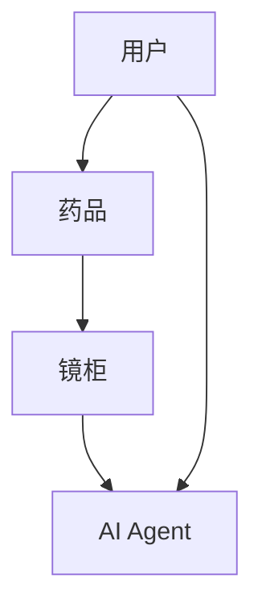
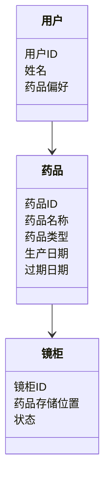
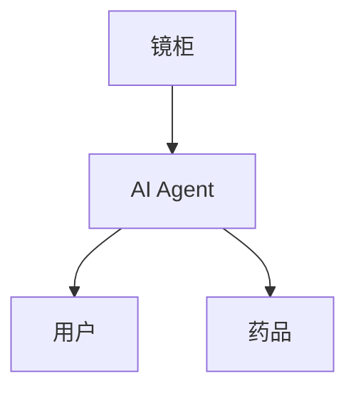
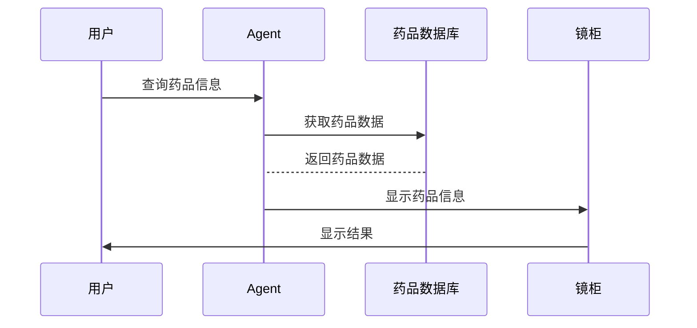

                 


# 智能浴室镜柜：AI Agent的药品管理

---

## 关键词：智能浴室镜柜，AI Agent，药品管理，智能家居，物联网，自然语言处理

---

## 摘要：

本文探讨了智能浴室镜柜中AI代理在药品管理中的应用。通过背景分析、核心概念解析、算法原理、系统架构设计、项目实战及最佳实践，系统性地介绍了如何利用AI技术提升药品管理的智能化水平。文章详细阐述了自然语言处理、意图识别、知识图谱构建等算法，并通过实际案例展示了AI代理在智能镜柜中的具体实现。

---

## 第一部分: 背景介绍

### 第1章: 问题背景与需求分析

#### 1.1 智能浴室镜柜的背景

随着智能家居的普及，浴室镜柜的功能已从简单的储物扩展到智能化管理。智能浴室镜柜不仅能提供镜面显示，还能通过物联网技术连接到家庭网络，实现药品管理、健康监测等多种功能。药品管理作为日常生活的重要环节，其智能化需求日益增长。

#### 1.2 问题描述

传统药品管理方式存在诸多痛点：药品存放混乱、过期提醒不及时、管理效率低下等。这些问题不仅影响生活品质，还可能对健康造成威胁。智能浴室镜柜结合AI代理，能够通过语音交互、智能提醒等方式，显著提升药品管理的便捷性和安全性。

#### 1.3 解决方案与目标

AI代理在智能浴室镜柜中的应用，旨在实现药品的智能化管理。通过自然语言处理技术，AI代理能够理解用户的指令，实时更新药品信息，并提供精准的用药建议。系统的目标是提高药品管理效率，减少人为错误，确保用户用药安全。

#### 1.4 系统边界与外延

智能浴室镜柜系统的核心边界包括镜柜硬件、AI代理软件、药品数据库。系统外延则涉及智能家居生态、用户移动端应用等。系统通过物联网接口与家庭网络连接，能够与智能音箱、手机APP等设备协同工作。

#### 1.5 核心要素与组成

智能浴室镜柜系统由硬件层、AI代理层、数据库层组成。硬件层负责数据采集和交互，AI代理层处理用户指令并驱动硬件动作，数据库层存储药品信息和用户数据。

---

## 第2章: 核心概念与联系

### 2.1 AI Agent的定义与原理

AI Agent是一种智能主体，能够感知环境并自主决策。在智能浴室镜柜中，AI Agent通过自然语言处理技术，识别用户的意图，并驱动镜柜硬件执行相应的操作。

### 2.2 智能镜柜的系统架构

智能镜柜的系统架构采用分层设计，包括数据采集层、AI代理层、用户交互层。各层之间通过标准化接口进行通信，确保系统的模块化和可扩展性。

### 2.3 药品管理的流程分析

药品管理流程包括药品录入、存储、提醒、补充等环节。AI Agent通过知识图谱构建技术，实现药品信息的智能化管理，确保用户用药安全。

### 2.4 核心概念对比表

| 对比项 | AI Agent | 传统软件 |
|--------|-----------|-----------|
| 智能性 | 自主决策 | 预定义规则 |
| 学习能力 | 支持 | 不支持 |
| 交互方式 | 自然语言 | 固定指令 |

### 2.5 ER实体关系图



---

## 第3章: 算法原理与实现

### 3.1 自然语言处理（NLP）算法

自然语言处理是AI Agent实现人机交互的核心技术。通过分词、句法分析和语义理解，AI Agent能够准确识别用户的意图。

#### 3.1.1 NLP算法的核心原理

自然语言处理涉及多个步骤，包括文本预处理、特征提取和模型训练。常用算法包括TF-IDF、Word2Vec等。

#### 3.1.2 常用NLP算法介绍

- **分词算法**：将连续的文本分割成单词或短语。
- **句法分析**：分析句子的语法结构，识别主谓宾关系。
- **语义理解**：通过上下文理解文本的含义。

#### 3.1.3 NLP在药品管理中的应用

AI Agent通过自然语言处理技术，能够理解用户的用药需求，并提供个性化的用药建议。

### 3.2 意图识别算法

意图识别是通过分析用户输入的文本或语音，确定用户的意图。常用算法包括基于规则的识别和基于机器学习的识别。

#### 3.2.1 意图识别的基本概念

意图识别旨在将用户输入映射到预定义的意图类别上。例如，用户说“我要买感冒药”，意图识别算法将识别出“购买药品”的意图。

#### 3.2.2 基于机器学习的意图识别

通过训练分类模型，算法能够从用户的输入中提取特征，并预测意图类别。

#### 3.2.3 意图识别在智能镜柜中的应用

AI Agent通过意图识别，能够准确理解用户的药品管理需求，并执行相应的操作。

### 3.3 知识图谱构建算法

知识图谱是结构化的知识表示形式，能够帮助AI Agent更好地理解和推理药品信息。

#### 3.3.1 知识图谱的基本概念

知识图谱由节点和边组成，节点表示实体，边表示实体之间的关系。

#### 3.3.2 知识图谱构建算法

知识图谱的构建包括数据抽取、实体识别和关系抽取等步骤。常用算法包括RDF和OWL。

#### 3.3.3 知识图谱在药品管理中的应用

AI Agent通过知识图谱，能够快速查询药品信息，并提供用药建议。

---

## 第4章: 系统分析与架构设计

### 4.1 问题场景介绍

智能浴室镜柜的药品管理场景包括药品存储、过期提醒、用药建议等。AI Agent需要能够实时感知用户的需求，并驱动镜柜硬件执行相应的操作。

### 4.2 项目介绍

本项目旨在开发一款智能浴室镜柜，集成AI代理，实现药品的智能化管理。

### 4.3 系统功能设计

系统功能包括药品录入、存储、提醒、补充等模块。每个模块都有特定的功能需求和实现方式。

#### 4.3.1 领域模型



### 4.4 系统架构设计

系统架构采用分层设计，包括硬件层、AI代理层、用户交互层。各层之间通过标准化接口进行通信。

#### 4.4.1 系统架构图



### 4.5 系统接口设计

系统接口包括用户输入接口、AI代理接口、镜柜控制接口等。每个接口都有特定的功能和数据格式。

### 4.6 系统交互设计

系统交互流程包括用户发起请求、AI Agent处理请求、镜柜执行操作等步骤。通过Mermaid序列图展示交互流程。

#### 4.6.1 交互流程



---

## 第5章: 项目实战

### 5.1 环境安装

开发环境包括Python、TensorFlow、Keras等工具。需要安装相应的库，并配置开发环境。

### 5.2 核心代码实现

核心代码包括自然语言处理模块、意图识别模块、知识图谱构建模块等。通过Python代码实现各模块的功能。

#### 5.2.1 自然语言处理代码

```python
import tensorflow as tf
from tensorflow.keras import layers

model = tf.keras.Sequential()
model.add(layers.Embedding(input_dim=10000, output_dim=16))
model.add(layers.GlobalAveragePooling1D())
model.add(layers.Dense(1, activation='sigmoid'))
model.compile(optimizer='adam', loss='binary_crossentropy', metrics=['accuracy'])
```

#### 5.2.2 意图识别代码

```python
from sklearn.feature_extraction.text import TfidfVectorizer
from sklearn.naive_bayes import MultinomialNB

vectorizer = TfidfVectorizer()
X_train = vectorizer.fit_transform(train_texts)
model = MultinomialNB().fit(X_train, train_labels)
```

### 5.3 案例分析

通过实际案例分析，展示AI Agent在智能浴室镜柜中的具体应用，如药品提醒、用药建议等。

### 5.4 项目小结

总结项目开发的经验和教训，提出改进建议。

---

## 第6章: 最佳实践

### 6.1 Tips

- 定期更新药品数据库，确保信息的准确性。
- 提供多种交互方式，如语音和触摸操作，提升用户体验。

### 6.2 总结

本文详细介绍了智能浴室镜柜中AI代理的药品管理系统的开发与应用。通过系统性的分析和实践，展示了AI技术在智能家居中的巨大潜力。

### 6.3 注意事项

- 确保系统的安全性，防止数据泄露。
- 定期维护系统，确保硬件和软件的正常运行。

### 6.4 拓展阅读

推荐相关领域的书籍和论文，供读者深入学习。

---

## 作者：

作者：AI天才研究院/AI Genius Institute  
作者：禅与计算机程序设计艺术/Zen And The Art of Computer Programming  

---

通过本文，读者可以全面了解智能浴室镜柜中AI代理的药品管理系统的开发与应用，掌握相关的技术原理和实现方法。

